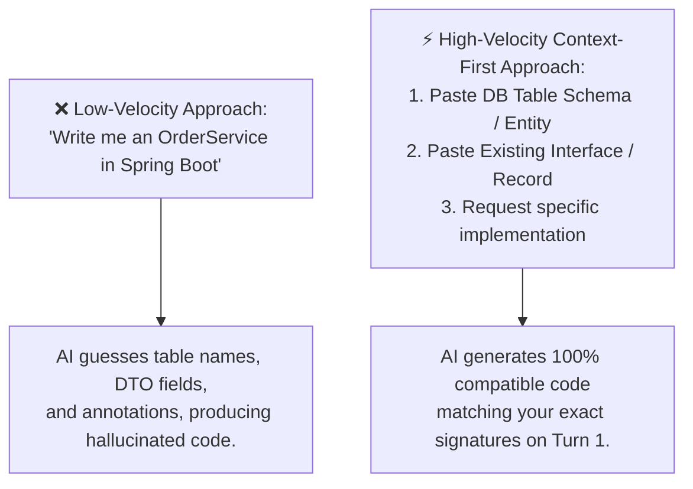

# The AI Velocity Mental Model & High-Speed Prompting

To unlock 5x to 10x engineering velocity with Artificial Intelligence, you must fundamentally change your relationship with the editor. If you treat AI as a search engine or generic chatbot, you will receive generic, buggy answers. If you treat AI as an **infinite-speed junior engineer who requires precise architectural direction**, you will build production-grade software at unprecedented speed.

---

## 1. Where Developer Hours Are Actually Lost

Studies of software engineering workflows reveal a striking reality about where a developer's working day is spent:

```
┌─────────────────────────────────────────────────────────────┐
│             WHERE DEVELOPER TIME IS ACTUALLY SPENT          │
├─────────────────────────────────────────────────────────────┤
│  [██████████] 40% Reading, Tracing & Understanding Code    │
│  [███████   ] 25% Writing Tests, Mocks & Test Fixtures      │
│  [█████     ] 20% Debugging Cryptic Errors & Race Conditions│
│  [███       ] 10% Writing Repetitive Boilerplate & DTOs     │
│  [█         ]  5% Core Creative Algorithmic Architecture   │
└─────────────────────────────────────────────────────────────┘
```

Notice that **less than 15% of your time is spent physically typing new features**. The bottleneck in software development is not typing speed—it is **cognitive friction**:
1. Remembering syntax, library signatures, and boilerplate annotations.
2. Formulating comprehensive test permutations and boundary edge cases.
3. Deciphering multi-layered error stack traces and log dumps.
4. Parsing unfamiliar code written by past engineers.

AI eliminates this cognitive friction when prompted with precision.

---

## 2. The Core Shift: Moving from Typist to Architect & Reviewer

```
┌─────────────────────────────────────────────────────────────────────────┐
│               TRADITIONAL VS. AI-ACCELERATED MENTAL MODEL               │
├─────────────────────────────────────────────────────────────────────────┤
│  THE OLD MODEL (The Solitary Typist):                                   │
│  Developer reads ticket ➔ Manually writes 8 boilerplate files           │
│  ➔ Forgets JPA relationship syntax ➔ Searches StackOverflow             │
│  ➔ Manually writes 15 unit tests ➔ Spends 2 hours debugging typo.       │
│                                                                         │
│  THE ACCELERATED MODEL (The Architect & Reviewer):                      │
│  Developer designs contract & schema ➔ Feeds constraints to AI          │
│  ➔ AI scaffolds complete vertical slice in 10 seconds                   │
│  ➔ Developer reviews code, verifies security & edge cases               │
│  ➔ AI generates boundary tests ➔ Feature completed in 20 minutes.       │
└─────────────────────────────────────────────────────────────────────────┘
```

> [!IMPORTANT]
> **The Golden Rule of AI Acceleration**:
> *You are the software architect and code reviewer. The AI is the typist and synthesizer.*
> Never commit AI-generated code that you cannot explain line-by-line in an architectural review.

---

## 3. The 3 High-Velocity Prompting Patterns

Vague prompts generate vague code. Use these three battle-tested frameworks to get production-ready code on the very first generation:

### Pattern 1: The RTCC Framework (Role, Task, Context, Constraints)
The gold standard for software engineering prompts.

| Component | Purpose | Example |
| :--- | :--- | :--- |
| **Role** | Sets the expertise and domain boundaries | *"Act as a Senior Java Backend Engineer specializing in Spring Boot 3.2 and PostgreSQL."* |
| **Task** | The specific action you want accomplished | *"Write an idempotency interceptor for incoming payments."* |
| **Context** | The environment, schemas, or existing classes | *"We use Spring Security 6 with stateless JWTs. Database is PostgreSQL with Flyway."* |
| **Constraints** | Strict guardrails, coding standards & libraries | *"Use Java 21 Records, Jakarta Validation, no Lombok, return RFC 7807 ProblemDetail on failure."* |

#### Copy-Paste RTCC Template:
```text
Role: Senior Java Backend Architect.
Task: Create a Spring Boot service to process order refunds.
Context:
- Existing Entity: Order(id: Long, status: OrderStatus, amount: BigDecimal, stripeChargeId: String)
- Repository: OrderRepository extends JpaRepository<Order, Long>
Constraints:
- Java 21 & Spring Boot 3.x standards.
- Use immutable Records for all DTOs.
- Enforce @Transactional(rollbackFor = Exception.class).
- Check that order is in 'PAID' status before refunding; throw custom InvalidOrderStateException otherwise.
- Include full Mockito unit test covering success and failure branches.
```

---

### Pattern 2: The "Context-First" Pattern
Never ask AI to write an implementation before you give it the interfaces and schemas.



#### Example Context-First Prompt:
```text
Given this PostgreSQL schema:
CREATE TABLE users (
    id BIGSERIAL PRIMARY KEY,
    email VARCHAR(255) NOT NULL UNIQUE,
    tier VARCHAR(50) NOT NULL,
    created_at TIMESTAMP WITH TIME ZONE DEFAULT CURRENT_TIMESTAMP
);

And this existing Java record:
public record UserResponse(Long id, String email, String tier) {}

Write the Spring Data JPA repository and service method to fetch all users by tier with Pageable pagination.
```

---

### Pattern 3: The "One-Shot Exemplar" Pattern
If you want the AI to follow your project's specific style guide (e.g. your custom API response wrapper or test naming convention), give it **one exemplar**:

```text
Follow the exact style, error handling, and test pattern of this existing controller:

[PASTE ONE EXISTING CONTROLLER HERE]

Now write the equivalent controller for the 'InventoryItem' resource.
```

---

## 4. Velocity Traps: What Slows Developers Down

### Trap 1: The Infinite Back-and-Forth Argument
When AI produces buggy code, developers often type: *"That didn't work. Fix it."*
This creates a poisoned context window where the AI alternates between two bad solutions.

> [!TIP]
> **The Clean Slate Rule**:
> If the AI fails twice on the same problem:
> 1. Clear the chat or open a new conversation.
> 2. Add the missing constraint that caused the failure.
> 3. Provide the compiler error or stack trace explicitly.

### Trap 2: Hallucinated Libraries & Methods
AI models can invent non-existent method names or outdated library imports (e.g. importing `javax.persistence.*` instead of `jakarta.persistence.*` in Spring Boot 3).
- **Defense**: Explicitly declare dependencies: *"Use Jakarta Persistence (`jakarta.*`) and Spring Boot 3.2. Do not use legacy `javax` imports."*

### Trap 3: The Security & Secret Leakage Trap
> [!CAUTION]
> **Never paste into public LLM prompts**:
> - Production database passwords or connection URLs.
> - JWT signing keys, private RSA keys, or Stripe API secret tokens.
> - Real customer names, emails, or PII (Personally Identifiable Information).
> 
> *Always sanitize inputs*: replace sensitive credentials with placeholders like `db-secret-placeholder` and `test-user@example.com`.

---

## 5. Self-Check & Quick Review

1. **Q**: What is the single biggest cause of poor AI code generation?
   - *A*: Lack of context and constraints. Asking for code without providing existing schemas, types, and library versions forces the AI to guess.
2. **Q**: How does the RTCC framework eliminate multi-turn prompt debugging?
   - *A*: By specifying Role, Task, Context, and Constraints up front, the AI receives all architectural requirements in one prompt, delivering working code on Turn 1.
3. **Q**: What should you do when an AI enters an infinite cycle of failing to fix a bug?
   - *A*: Reset the conversation. Context accumulates errors; starting fresh with the exact stack trace and specific constraints yields faster, cleaner results.
4. **Q**: What package naming difference commonly trips up AI in modern Spring Boot 3 projects?
   - *A*: Spring Boot 3 migrated from Java EE (`javax.*`) to Jakarta EE (`jakarta.*`). Always instruct the AI to use `jakarta.persistence.*` and `jakarta.validation.*`.

---

## 🧭 Continue Learning

| ◀️ Track Hub | 🧭 Current Track | Next Topic ▶️ |
| :--- | :---: | ---: |
| [**Curriculum Home**](../README.md)<br><sub>*Repository Index*</sub> | [**AI for Developers Index**](README.md)<br><sub>*Master Visual Roadmap*</sub> | [**Page 2: Accelerating Backend & APIs**](02-accelerating-backend-and-api-development.md)<br><sub>*0-to-1 REST APIs, Flyway & DTO Scaffolding*</sub> |
