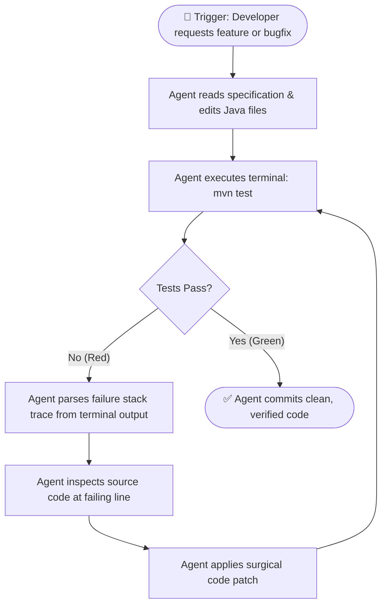

# Autonomous Coding Agents & Model Context Protocol (MCP)

The first generation of AI developer tooling was passive: developers typed code and tools offered inline autocompletions. The current frontier of software engineering is **agentic**: software systems that plan multi-step workflows, interact directly with tools and terminals, observe execution output, and autonomously correct their own errors.

To harness modern agentic workflows, you must understand the **ReAct Agent Loop**, the **Model Context Protocol (MCP)**, and how to configure **autonomous self-correcting development cycles**.

---

## 1. The Autonomous Agent Architecture: The ReAct Loop

Unlike simple autocomplete models that produce text in a single inference pass, an autonomous coding agent operates in an interactive feedback loop known as **ReAct (Reasoning + Acting)**:

```mermaid
sequenceDiagram
    autonumber
    participant User as 👤 Developer
    participant Agent as 🧠 Autonomous Agent
    participant Env as 💻 IDE / Terminal / Git
    participant Test as 🧪 Test Suite (JUnit 5)

    User->>Agent: "Fix the NullPointerException in OrderService and verify"
    loop ReAct Loop (Reasoning ➔ Action ➔ Observation)
        Agent->>Agent: Thought: "I need to inspect the failing test and line 42 of OrderService.java"
        Agent->>Env: Action: view_file(OrderService.java#L40-L50)
        Env-->>Agent: Observation: "customer.getAddress().getZipCode() is called without null check"
        Agent->>Agent: Thought: "Customer address can be null. I should use Optional or null-safe navigation."
        Agent->>Env: Action: replace_file_content(OrderService.java)
        Env-->>Agent: Observation: "File modified successfully"
        Agent->>Env: Action: run_command("mvn test -Dtest=OrderServiceTest")
        Env->>Test: Execute tests
        Test-->>Agent: Observation: "BUILD SUCCESS (4 tests passed)"
    end
    Agent-->>User: "Fixed NPE with null-safe check on getAddress(); verified with green unit tests."
```

```
┌─────────────────────────────────────────────────────────────────────────┐
│                 TRADITIONAL SCRIPTING VS. AUTONOMOUS AGENTS             │
├─────────────────────────────────────────────────────────────────────────┤
│                                                                         │
│  DETERMINISTIC SCRIPTS (Brittle):                                       │
│  • Executes hardcoded commands step-by-step.                            │
│  • Any unexpected error, missing file, or compile failure crashes script│
│                                                                         │
│  AUTONOMOUS CODING AGENTS (Adaptive & Goal-Directed):                   │
│  • Evaluates tool outputs dynamically against an objective.             │
│  • If a compiler error occurs, reads error ➔ searches file ➔ edits code │
│  • Repeats until the verification criterion (e.g. green tests) is met!  │
│                                                                         │
└─────────────────────────────────────────────────────────────────────────┘
```

---

## 2. Model Context Protocol (MCP): The Universal Bridge

Historically, connecting an AI model to an external system (such as PostgreSQL, Jira, or GitHub) required writing bespoke API glue code or proprietary plugins for each LLM provider.

The **Model Context Protocol (MCP)** is an open standard that enables AI models and IDEs to securely connect to external tools and data sources through a standardized protocol.

```
┌─────────────────────────────────────────────────────────────┐
│             MODEL CONTEXT PROTOCOL (MCP) TOPOLOGY           │
├─────────────────────────────────────────────────────────────┤
│                                                             │
│                    [ AGENT HOST / IDE ]                     │
│                (Claude Desktop, Cursor, IDE)                │
│                              │                              │
│                              ▼                              │
│                      [ MCP CLIENT ]                         │
│                              │                              │
│        ┌─────────────────────┼─────────────────────┐        │
│        ▼                     ▼                     ▼        │
│  [ MCP SERVER ]        [ MCP SERVER ]        [ MCP SERVER ] │
│   PostgreSQL DB           Git & GitHub          Filesystem  │
│        │                     │                     │        │
│        ▼                     ▼                     ▼        │
│  Query Tables,          Inspect Diffs,       Read/Edit Code,│
│  Fetch Schemas          Create PRs           Run Tests      │
│                                                             │
└─────────────────────────────────────────────────────────────┘
```

### The Three Core Primitives of MCP:
1. **Tools**: Executable functions that the model can invoke (e.g., `execute_sql_query`, `git_checkout_branch`, `run_linter`).
2. **Resources**: Passive contextual data provided to the model (e.g., database schema DDL, server log streams, API documentation).
3. **Prompts**: Pre-engineered workflow templates exposed by the server to guide the agent through domain-specific tasks.

---

## 3. Autonomous Self-Correction: The "TDD Fixer" Loop

The highest-leverage agentic workflow is the **Autonomous Self-Correction Loop**. Instead of you running tests, copying compiler errors, pasting them into a chat, and pasting code back, you delegate the entire diagnostic loop to the agent.



### Prompt to Launch an Autonomous Self-Correction Loop:
```text
Act as an Autonomous Software Engineering Agent.
Goal: Migrate the deprecated 'WebSecurityConfigurerAdapter' in our security module to Spring Boot 3.2 'SecurityFilterChain'.

Instructions:
1. Search and view the security configuration class in src/main/java.
2. Refactor the class to return a @Bean SecurityFilterChain using authorizeHttpRequests() lambda DSL.
3. Run the automated test suite using: mvn test -Dtest=SecurityIntegrationTest
4. If tests fail, read the exact compiler or runtime error from the terminal output, locate the failing line, apply the fix, and rerun the test suite.
5. Do NOT report completion to me until 'mvn test' executes with BUILD SUCCESS.
```

---

## 4. Multi-Agent Orchestration & Subagent Delegation

In complex tasks, a single agent can suffer from context clutter if it tries to do everything in one conversation. Advanced agentic systems use **Subagent Delegation**:

```
┌─────────────────────────────────────────────────────────────┐
│                 MULTI-AGENT DELEGATION ARCHITECTURE         │
├─────────────────────────────────────────────────────────────┤
│                                                             │
│                    [ PRIMARY COORDINATOR ]                  │
│                     (Maintains task plan,                   │
│                      orchestrates workflow)                 │
│                                │                            │
│           ┌────────────────────┴────────────────────┐       │
│           ▼                                         ▼       │
│   [ RESEARCH SUBAGENT ]                    [ TESTING SUBAGENT ]
│   • Scans 200 files                        • Spawns Testcontainers │
│   • Extracts schema & DTOs                 • Runs unit & load tests │
│   • Returns concise 1-page                 • Returns pass/fail log  │
│     summary to coordinator                   to coordinator         │
│                                                             │
└─────────────────────────────────────────────────────────────┘
```

> [!TIP]
> **Subagent Efficiency Rule**:
> Delegate high-noise tasks (reading hundreds of log files, running lengthy test suites, web searches) to disposable subagents. This preserves the primary coordinator's context window for clean, high-precision architectural decision making.

---

## 5. Self-Check & Quick Review

1. **Q**: What distinguishes an autonomous agent from an inline autocomplete tool?
   - *A*: Autocomplete predicts the next few tokens based on surrounding text. An autonomous agent possesses goal-direction, tools (terminal, filesystem, git), a feedback loop (ReAct), and the ability to observe outcomes and self-correct errors until an objective is met.
2. **Q**: What problem does the Model Context Protocol (MCP) solve?
   - *A*: MCP standardizes how AI applications connect to external tools and data sources (databases, repositories, filesystems), eliminating proprietary, vendor-locked plugin integrations.
3. **Q**: How does the autonomous self-correction loop eliminate developer toil?
   - *A*: The agent runs the compiler/test commands directly, reads the failure diagnostics from the terminal, applies the necessary code patch, and re-executes tests automatically without human copy-pasting.

---

## 🧭 Continue Learning

| ◀️ Previous Topic | 🧭 Track Hub | Next Topic ▶️ |
| :--- | :---: | ---: |
| [**Page 7: System Design & DSA Velocity**](07-speeding-up-system-design-and-dsa-prep.md)<br><sub>*Architecture Blueprints & Socratic DSA*</sub> | [**AI for Developers Index**](README.md)<br><sub>*Master Visual Roadmap*</sub> | [**Page 9: Building AI Apps with Spring AI**](09-building-ai-powered-java-apps-spring-ai.md)<br><sub>*ChatClient, Records & RAG with pgvector*</sub> |
