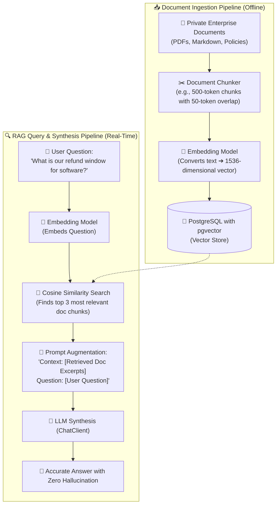

# Building AI-Powered Java Applications with Spring AI & RAG

Using AI developer tools to write code faster is only the first step. Today's software engineering market increasingly demands that backend engineers know how to **architect and build AI-powered features directly into Java enterprise backends**.

The **Spring AI** framework provides portable, production-grade abstractions for integrating Large Language Models (LLMs), structured JSON deserialization into Java 21 records, function calling, and **Retrieval-Augmented Generation (RAG)** using vector databases like **`pgvector`**.

---

## 1. Spring AI Architecture & Supported Providers

Historically, integrating an LLM into Java required writing bespoke HTTP clients and brittle JSON parsing logic. Spring AI abstracts LLM providers behind unified interfaces, allowing you to swap between cloud models and local offline models with zero code changes:

```
┌─────────────────────────────────────────────────────────────┐
│                 SPRING AI PORTABLE ABSTRACTION              │
├─────────────────────────────────────────────────────────────┤
│                                                             │
│                    [ Spring Boot Application ]              │
│                                │                            │
│                                ▼                            │
│                    [ ChatClient / Prompt ]                  │
│                                │                            │
│         ┌──────────────────────┼──────────────────────┐     │
│         ▼                      ▼                      ▼     │
│  [ OpenAI GPT-4o ]     [ Anthropic Claude ]    [ Local Ollama ]
│  spring-ai-openai      spring-ai-anthropic     spring-ai-ollama
│                                                             │
└─────────────────────────────────────────────────────────────┘
```

### Dependency Configuration (`pom.xml`):
```xml
<dependencyManagement>
    <dependencies>
        <dependency>
            <groupId>org.springframework.ai</groupId>
            <artifactId>spring-ai-bom</artifactId>
            <version>1.0.0-M1</version>
            <type>pom</type>
            <scope>import</scope>
        </dependency>
    </dependencies>
</dependencyManagement>

<dependencies>
    <!-- OpenAI Starter (or swap with spring-ai-ollama-spring-boot-starter) -->
    <dependency>
        <groupId>org.springframework.ai</groupId>
        <artifactId>spring-ai-openai-spring-boot-starter</artifactId>
    </dependency>
    <!-- Vector Store: PostgreSQL pgvector -->
    <dependency>
        <groupId>org.springframework.ai</groupId>
        <artifactId>spring-ai-pgvector-store-spring-boot-starter</artifactId>
    </dependency>
</dependencies>
```

---

## 2. Fluent `ChatClient` API & Prompt Templates

Spring AI introduces the fluent **`ChatClient`** builder, providing an intuitive, chainable API for interacting with models:

```java
@Service
public class CustomerSupportAiService {

    private final ChatClient chatClient;

    public CustomerSupportAiService(ChatClient.Builder chatClientBuilder) {
        this.chatClient = chatClientBuilder
                .defaultSystem("You are an empathetic, concise support assistant for TechCorp. " +
                               "Always maintain a professional tone and adhere to company policies.")
                .build();
    }

    public String generateSupportResponse(String userQuery, String userTier) {
        return chatClient.prompt()
                .user(u -> u.text("User Tier: {tier}\nQuestion: {query}")
                            .param("tier", userTier)
                            .param("query", userQuery))
                .call()
                .content();
    }
}
```

---

## 3. Guaranteed Structured Output into Java 21 Records

In enterprise backends, you cannot accept unstructured free-text paragraphs from an LLM; your database and frontend require **strongly-typed JSON**.

Spring AI's `entity(Class<T>)` method guarantees that the model's output is automatically validated and deserialized into an immutable **Java 21 Record**:

```java
// 1. Define the desired structured output as an immutable Java 21 record
public record SentimentAnalysisResult(
    String sentiment, // 'POSITIVE', 'NEUTRAL', 'NEGATIVE'
    double confidenceScore,
    List<String> keyTopics,
    boolean requiresHumanEscalation
) {}

@Service
public class FeedbackTriageService {

    private final ChatClient chatClient;

    public FeedbackTriageService(ChatClient.Builder builder) {
        this.chatClient = builder.build();
    }

    public SentimentAnalysisResult analyzeFeedback(String customerFeedback) {
        // Spring AI automatically generates schema instructions behind the scenes!
        return chatClient.prompt()
                .user("Analyze this customer feedback:\n" + customerFeedback)
                .call()
                .entity(SentimentAnalysisResult.class); // Deserializes directly into Record!
    }
}
```

---

## 4. Function Calling (Tool Use in Java Backends)

LLMs cannot access your private SQL database or trigger payment transactions on their own. **Function Calling** allows the model to intelligently decide when to invoke a Java method in your application to answer a user's request.

```java
// 1. Define the function input record
public record OrderStatusRequest(String orderId) {}

// 2. Define the tool as a Spring @Bean returning a standard Java Function
@Configuration
public class AiToolsConfiguration {

    @Bean
    @Description("Fetch the real-time shipping status and delivery date for an order ID")
    public Function<OrderStatusRequest, String> fetchOrderStatus(OrderService orderService) {
        return request -> orderService.findStatusByOrderId(request.orderId());
    }
}

// 3. Register the tool during ChatClient execution
public String chatWithOrderContext(String userMessage) {
    return chatClient.prompt()
            .user(userMessage)
            .functions("fetchOrderStatus") // The LLM calls this Java bean if relevant!
            .call()
            .content();
}
```

---

## 5. Enterprise RAG (Retrieval-Augmented Generation) with `pgvector`

LLMs only know the data they were trained on; they have no knowledge of your private internal documentation, product catalogs, or user manuals.

**RAG** bridges this gap: when a user asks a question, your backend queries a vector database for relevant documentation chunks, injects those chunks into the LLM prompt as context, and generates an accurate, hallucination-free answer.



```
┌─────────────────────────────────────────────────────────────────────────┐
│                 SEMANTIC VECTOR SEARCH SPACE MENTAL MODEL               │
├─────────────────────────────────────────────────────────────────────────┤
│                                                                         │
│   Vector embeddings place semantically similar phrases close together   │
│   in high-dimensional space (e.g. 1536 dimensions):                     │
│                                                                         │
│          [ "Refund policy" ] ───(0.94 cosine similarity)───┐            │
│                                                            ▼            │
│   [ "How do I get my money back?" ] ◄─────────────────► [ Vector Space] │
│                                                            ▲            │
│          [ "Return window: 30 days" ] ──(0.91 similarity)──┘            │
│                                                                         │
└─────────────────────────────────────────────────────────────────────────┘
```

### Writing a RAG Query Service in Spring AI:
```java
@Service
public class EnterpriseKnowledgeService {

    private final ChatClient chatClient;
    private final VectorStore vectorStore;

    public EnterpriseKnowledgeService(ChatClient.Builder builder, VectorStore vectorStore) {
        this.chatClient = builder.build();
        this.vectorStore = vectorStore;
    }

    public String answerFromDocs(String userQuestion) {
        // 1. Search vector store for top 3 similar documents
        List<Document> similarDocs = vectorStore.similaritySearch(
                SearchRequest.query(userQuestion).withTopK(3));

        // 2. Extract content from retrieved document chunks
        String context = similarDocs.stream()
                .map(Document::getContent)
                .collect(Collectors.joining("\n\n"));

        // 3. Inject context into prompt and call model
        return chatClient.prompt()
                .system("Answer the question using strictly the provided context. If not in context, say 'I don't know'.")
                .user(u -> u.text("Context:\n{context}\n\nQuestion:\n{question}")
                            .param("context", context)
                            .param("question", userQuestion))
                .call()
                .content();
    }
}
```

---

## 6. Self-Check & Quick Review

1. **Q**: What is the primary advantage of using Spring AI over writing custom HTTP clients to call OpenAI/Anthropic APIs?
   - *A*: Spring AI provides portable, provider-agnostic abstractions (`ChatClient`, `VectorStore`, `EmbeddingModel`), structured output mapping into Java Records, and built-in integration with Spring's ecosystem (`@Configuration`, `@Service`).
2. **Q**: How does Spring AI guarantee that LLM output deserializes cleanly into a Java 21 Record?
   - *A*: The `entity(Class<T>)` method automatically injects a JSON schema specification into the prompt and configures the provider's JSON mode / response format, parsing the output directly into the target record.
3. **Q**: What is the role of `pgvector` in a RAG pipeline?
   - *A*: `pgvector` is an extension that adds vector data types and indexed similarity search (e.g. cosine distance, HNSW indexes) directly to standard PostgreSQL, eliminating the need to deploy a separate standalone vector database.

---

## 🧭 Continue Learning

| ◀️ Previous Topic | 🧭 Track Hub | Next Topic ▶️ |
| :--- | :---: | ---: |
| [**Page 8: Autonomous Coding Agents & MCP**](08-autonomous-coding-agents-and-mcp.md)<br><sub>*ReAct Loops & Tool Protocol*</sub> | [**AI for Developers Index**](README.md)<br><sub>*Master Visual Roadmap*</sub> | [**Page 10: 30+ Developer Prompt Cheatsheet**](10-developer-prompt-engineering-cheatsheet.md)<br><sub>*Tactical Copy-Paste Prompt Matrix*</sub> |
