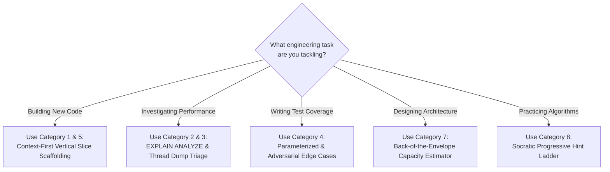

# The Developer's 30+ Copy-Paste Prompt Engineering Cheatsheet

Having a library of precise, battle-tested prompt templates is the difference between struggling with AI for 20 minutes and getting production-ready, verified code in 10 seconds.

This cheatsheet provides **30+ ready-to-use, production-hardened developer prompts** organized into an actionable taxonomy for daily software engineering.

---

## 1. The Developer's Daily Prompt Matrix

```
┌─────────────────────────────────────────────────────────────────────────┐
│                      THE DEVELOPER'S PROMPT TAXONOMY                    │
├─────────────────────────────────────────────────────────────────────────┤
│                                                                         │
│  [01. Scaffolding]    ──> Vertical Slices, OpenAPI ➔ Java 21, DTOs      │
│  [02. Database/SQL]   ──> EXPLAIN ANALYZE, Index Tuning, N+1 Fixes      │
│  [03. Concurrency]    ──> Thread Dumps, Deadlocks, Race Conditions      │
│  [04. Testing]        ──> JUnit 5 Parameterized, Testcontainers, Mocks  │
│  [05. Synthesizers]   ──> Regex Generator, Cron Expressions, Mappers    │
│  [06. Git & DevOps]   ──> Interactive Rebase, Dockerfiles, K8s YAML     │
│  [07. System Design]  ──> Capacity Estimations, Trade-Off Matrices      │
│  [08. Socratic DSA]   ──> Progressive Hints (L1-L4), Edge Cases         │
│                                                                         │
└─────────────────────────────────────────────────────────────────────────┘
```



---

## 2. Category 1: 0-to-1 Architecture & Scaffolding

### Prompt 1.1: Complete Spring Boot Vertical Slice Generator
```text
Act as a Principal Java Backend Architect.
Task: Scaffold a complete production-grade vertical slice for [FEATURE NAME, e.g., 'User Order Cancellation'].
Requirements:
- Database: PostgreSQL with Flyway migration (V1__init.sql).
- Entity: JPA entity using jakarta.persistence.* with optimistic locking (@Version).
- DTOs: Java 21 Records with Jakarta validation (@NotBlank, @NotNull, @Positive).
- Repository: Spring Data JPA with custom derived query.
- Service: Business logic with @Transactional(rollbackFor = Exception.class).
- Controller: @RestController with RFC 7807 ProblemDetail error handling.
Constraints: No Lombok. Use constructor injection. Follow Java 21 LTS best practices.
```

### Prompt 1.2: OpenAPI Specification ➔ Java 21 DTO Records
```text
Convert this OpenAPI 3.0 schema into immutable Java 21 Records:
[PASTE OPENAPI YAML/JSON SCHEMA]
Requirements:
- Include Jakarta Validation annotations (@Size, @Pattern, @Email, @Min).
- Include Jackson annotations (@JsonProperty, @JsonFormat for Instant/LocalDate).
- Preserve all docstrings as Javadoc comments.
```

### Prompt 1.3: Zero-Downtime Database Alteration Script
```text
We need to add a new NOT NULL column 'status_code' with default 'ACTIVE' to a PostgreSQL table with 15,000,000 rows.
Task: Provide the zero-downtime Flyway migration steps:
1. Add column as NULLABLE.
2. Backfill existing rows in batches to avoid locking the table.
3. Add the NOT NULL constraint and default value.
4. Add index concurrently (CREATE INDEX CONCURRENTLY).
```

---

## 3. Category 2: SQL & Database Performance Tuning

### Prompt 2.1: `EXPLAIN ANALYZE` Query Optimizer
```text
Act as a PostgreSQL Performance Tuning Expert.
Here is an EXPLAIN (ANALYZE, BUFFERS) execution plan for a slow query:
[PASTE EXPLAIN ANALYZE OUTPUT]
Here is the SQL query:
[PASTE SQL QUERY]
Task:
1. Identify the bottleneck (e.g. Seq Scan, high buffer reads, Hash Join spill to disk).
2. Recommend the exact B-Tree or Composite Index (with column order rationale).
3. Provide an optimized SQL rewrite if the planner is misestimating cardinality.
```

### Prompt 2.2: Hibernate N+1 Query Eliminator
```text
Here are the Hibernate SQL queries logged during a single HTTP GET request:
[PASTE HIBERNATE SQL LOG SHOWING 1 + N SELECT STATEMENTS]
Here is the Spring Data JPA Repository and Entity mapping:
[PASTE REPOSITORY & ENTITY]
Task:
1. Identify the uninitialized lazy relationship causing the N+1 queries.
2. Provide the optimized query using @EntityGraph or JOIN FETCH.
3. Show how to verify the fix with a unit test asserting single SQL execution.
```

---

## 4. Category 3: Concurrency, Deadlocks & Thread Dumps

### Prompt 3.1: Thread Dump Deadlock Detector
```text
Act as a Java Concurrency Expert. Analyze this raw JVM thread dump:
[PASTE THREAD DUMP / JSTACK OUTPUT]
Task:
1. Is there a Java-level deadlock present?
2. Which threads are BLOCKED and waiting on which object monitors (0x...)?
3. Show the resource acquisition order cycle and provide the Java code fix.
```

### Prompt 3.2: Converting `synchronized` to `ReentrantLock` (Java 21 Pinning Fix)
```text
Refactor this Java class from legacy synchronized methods to java.util.concurrent.locks.ReentrantLock to prevent carrier thread pinning on Java 21 Virtual Threads:
[PASTE SYNCHRONIZED CLASS]
Constraints:
- Always use try { lock.lock(); ... } finally { lock.unlock(); } blocks.
- Ensure lock acquisition occurs immediately before the try block.
- Preserve all wait/notify semantics using Condition (await/signalAll).
```

---

## 5. Category 4: Testing & Mockito Edge Cases

### Prompt 4.1: JUnit 5 Parameterized Test Generator
```text
Generate a comprehensive JUnit 5 @ParameterizedTest for this validation method:
[PASTE METHOD]
Requirements:
- Use @ValueSource, @CsvSource, or @MethodSource.
- Include at least 8 distinct test cases: valid inputs, nulls, empty strings, boundary extremes, and malicious inputs.
- Use AssertJ fluent assertions (assertThat).
```

### Prompt 4.2: Testcontainers PostgreSQL Bootstrap Test
```text
Generate a production-grade @DataJpaTest using Testcontainers and PostgreSQL 16:
- Use @Testcontainers and @Container static PostgreSQLContainer.
- Configure dynamic datasource properties using @DynamicPropertySource.
- Test this specific custom repository query: [PASTE REPOSITORY METHOD].
- Verify that transactional rollbacks isolate state between consecutive tests.
```

---

## 6. Category 5: Regex, Cron & Data Transformation

### Prompt 5.1: High-Precision Regex Synthesizer with Tests
```text
Write a robust Regular Expression for: [DESCRIBE PATTERN, e.g. 'International E.164 Phone Numbers with optional extension'].
Requirements:
1. Provide the exact Regex pattern string for Java (with escaped backslashes).
2. Explain what each capturing group does.
3. Provide a JUnit 5 test with 5 valid matches and 5 invalid non-matching strings.
```

### Prompt 5.2: Spring `@Scheduled` Cron Expression Generator
```text
Generate a standard 6-field Spring Boot cron expression for: [DESCRIBE SCHEDULE, e.g. 'Every weekday at 2:15 AM UTC'].
Task:
1. Provide the exact cron string (second, minute, hour, day-of-month, month, day-of-week).
2. Show the Spring Boot annotation: @Scheduled(cron = "...", zone = "UTC").
3. List the next 5 execution timestamps to verify correctness.
```

---

## 7. Category 6: Git & DevOps Productivity

### Prompt 6.1: 3-Way Git Merge Conflict Resolver
```text
Act as a Git Specialist. Help me resolve this 3-way merge conflict:
<<<<<<< HEAD (Current Branch: feature/payments)
[PASTE HEAD CODE]
=======
[PASTE INCOMING BRANCH CODE: main]
>>>>>>> main
Task:
1. Explain the intent of both changes.
2. Provide the merged code combining both features without regression.
3. State the git commands to mark resolved and continue rebase.
```

### Prompt 6.2: Multi-Stage Production Dockerfile for Spring Boot 3
```text
Generate an optimized, secure multi-stage Dockerfile for a Spring Boot 3.2 application using Eclipse Temurin Java 21:
- Stage 1: Build JAR using Maven wrapper with dependency caching.
- Stage 2: Extract layers (dependencies, spring-boot-loader, application) using JarLauncher.
- Security: Run as a non-root user (spring:spring).
- JVM Flags: Set -XX:+UseG1GC and -XX:MaxRAMPercentage=75.0.
```

---

## 8. Category 7: System Design & Capacity Math

### Prompt 7.1: Back-of-the-Envelope Capacity Math Engine
```text
Act as a Principal Infrastructure Architect.
Perform capacity math for [SYSTEM NAME, e.g., 'E-Commerce Flash Sale Platform']:
Assumptions:
- 10 million registered users; 100,000 peak concurrent users.
- Peak write traffic: 25,000 checkout orders per second.
- Average order payload size: 2 KB.
Calculate:
1. Average and Peak Write QPS.
2. Network Ingress Bandwidth in Mbps and Gbps.
3. Daily storage growth and 3-year capacity required (including 3x replication).
4. Redis memory cache sizing to keep hot inventory for the top 5,000 products.
```

### Prompt 7.2: Architectural Decision Record (ADR) Generator
```text
Generate a formal Architectural Decision Record (ADR) in MADR format for this decision:
Context: [e.g. Migrating from REST polling to Apache Kafka for real-time order tracking]
Chosen Option: [e.g. Apache Kafka with Spring Cloud Stream]
Alternative Considered: [e.g. RabbitMQ, AWS SQS, Polling]
Include: Status, Context, Decision Drivers, Considered Options, Pros/Cons Matrix, and Consequences.
```

---

## 9. Category 8: Socratic DSA Progressive Hints

### Prompt 8.1: Progressive Hint Ladder (Levels 1 to 4)
```text
Act as a Big Tech Interviewer. I am solving [LEETCODE PROBLEM NAME & NUMBER].
Here is my current thought process: [PASTE CURRENT THOUGHTS].
RULES:
- Do NOT provide code or reveal the full solution!
- Give me ONLY Level 1: What core algorithmic pattern or invariant applies here?
- If I ask for Level 2 later: Give me the high-level data structure.
- If I ask for Level 3 later: Give me pseudocode steps.
- Level 4: Only show full code if I explicitly ask for surrender.
Give me Level 1 now.
```

### Prompt 8.2: Adversarial Edge-Case Generator for Algorithms
```text
Here is my solution for [ALGORITHM NAME]:
[PASTE ALGORITHM CODE]
Task:
Find 5 adversarial test cases that will cause this solution to fail (Time Limit Exceeded, Memory Limit Exceeded, Wrong Answer, or Integer Overflow).
For each test case, state the exact input and expected output.
```

---

## 10. Self-Check & Quick Review

1. **Q**: Why are structured prompt templates superior to ad-hoc chat questions?
   - *A*: Structured templates inject all necessary architectural constraints (immutability, validation, framework versions, error formats) on Turn 1, eliminating iterative corrections and hallucinated code.
2. **Q**: How does the `EXPLAIN ANALYZE` prompt accelerate database troubleshooting?
   - *A*: It translates thousands of numbers in raw planner trees into specific actionable fixes: identifying sequential scans, suggesting composite indexes with exact column ordering, and highlighting cost estimation mismatches.
3. **Q**: What is the core benefit of the Socratic Progressive Hint prompt for interview prep?
   - *A*: It prevents "passive learning" by giving graduated hints, forcing the developer's brain to form the algorithmic connections required to solve unseen problems during real interviews.

---

## 🧭 Continue Learning

| ◀️ Previous Topic | 🧭 Track Hub | 🚀 Next Track |
| :--- | :---: | ---: |
| [**Page 9: Building AI Apps with Spring AI**](09-building-ai-powered-java-apps-spring-ai.md)<br><sub>*ChatClient, Records & RAG with pgvector*</sub> | [**AI for Developers Index**](README.md)<br><sub>*Master Visual Roadmap*</sub> | [**System Design Fundamentals**](../system-design/system-design-fundamentals/README.md)<br><sub>*High-Level Architecture & Scalability*</sub> |
