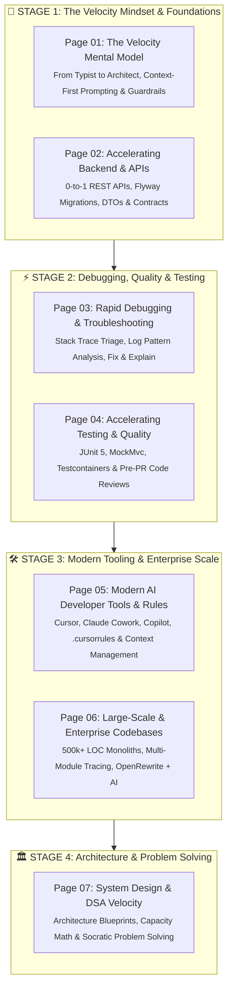

# AI for Software & Backend Developers: Accelerating Engineering Velocity

Welcome to **AI for Developers**, a comprehensive guide to transforming Artificial Intelligence into a **10x engineering force multiplier**.

In modern software engineering, AI is not a replacement for fundamental engineering knowledge—it is a **power tool**. Developers who know how to direct, constrain, and collaborate with AI write features faster, eliminate boilerplate, diagnose cryptic bugs in seconds, and architect scalable systems with confidence.

---

## 🗺️ Master Visual Learning Roadmap



---

## 📖 Table of Contents (Page by Page)

| Page | Title & Link | What You Master |
| :---: | :--- | :--- |
| **01** | [**The Velocity Mental Model**](01-ai-developer-mental-model-and-velocity.md) | Moving from typist to software architect; RTCC formula; context-first prompting; security guardrails & hallucination defenses |
| **02** | [**Accelerating Backend & APIs**](02-accelerating-backend-and-api-development.md) | 0-to-1 vertical slice scaffolding (Entity ➔ DTO ➔ Service ➔ Controller); Flyway SQL generation; OpenAPI specs & mock data |
| **03** | [**Rapid Debugging & Troubleshooting**](03-rapid-debugging-and-troubleshooting.md) | Triaging 50-line cryptic stack traces (`LazyInitializationException`, circular dependencies); log pattern analysis; "Fix & Explain" |
| **04** | [**Accelerating Testing & Code Quality**](04-accelerating-testing-and-code-quality.md) | Generating JUnit 5 + Mockito suites; `@WebMvcTest` & Testcontainers; edge-case brainstorming; pre-PR security & N+1 reviews |
| **05** | [**Modern AI Developer Tools & Rules**](05-mastering-ai-developer-tools-and-rules.md) | GitHub Copilot vs Cursor vs **Claude Cowork & Projects**; context window engineering; custom `.cursorrules` and `CLAUDE.md` |
| **06** | [**Large-Scale & Enterprise Codebases**](06-ai-for-large-scale-and-enterprise-codebases.md) | Navigating 500,000+ LOC; rapid onboarding to legacy monoliths; multi-module call tracing; OpenRewrite + AI enterprise migrations |
| **07** | [**System Design & DSA Velocity**](07-speeding-up-system-design-and-dsa-prep.md) | Instant capacity math (QPS/storage); architecture blueprints; technology trade-off matrices; Socratic DSA progressive hints |

---

## 🎯 The Core Philosophy: "Architect & Reviewer"

```
┌─────────────────────────────────────────────────────────────┐
│                 THE AI VELOCITY PARADIGM                    │
├─────────────────────────────────────────────────────────────┤
│                                                             │
│   TRADITIONAL DEVELOPER WORKFLOW (Manual & Slow)            │
│   [Idea] ──> [Manual Boilerplate] ──> [Syntax Lookups]      │
│          ──> [Write Tests Manually] ──> [Debug by Hand]     │
│   Time Spent Typing: 40% | Time Spent Thinking: 60%         │
│                                                             │
│   AI-ACCELERATED DEVELOPER WORKFLOW (High-Leverage)         │
│   [Specification] ──> [AI Scaffolding]                      │
│                   ──> [Architectural Review & Verification]  │
│                   ──> [AI Edge-Case & Test Generation]      │
│   Time Spent Typing: 5%  | Time Spent Thinking: 95%         │
│                                                             │
└─────────────────────────────────────────────────────────────┘
```

When you use AI effectively:
1. **You provide the constraints**: Architecture, security rules, domain boundaries, and data models.
2. **AI provides the execution speed**: Boilerplate generation, syntax synthesis, test permutations, and regex/SQL queries.
3. **You verify correctness**: Reviewing the generated code against production requirements, runtime tests, and edge cases.

---

## 🧭 Course Navigation

| 🏁 Track Start | 🚀 Start Learning | 📑 Related Track |
| :--- | :---: | ---: |
| [**Curriculum Home**](../README.md)<br><sub>*Repository Index*</sub> | [**Begin Module 1 ▶️**](01-ai-developer-mental-model-and-velocity.md)<br><sub>*The Velocity Mental Model & Prompting*</sub> | [**Java Backend Index**](../dsa-java/java-backend/README.md)<br><sub>*Enterprise Spring Boot & Cloud*</sub> |
