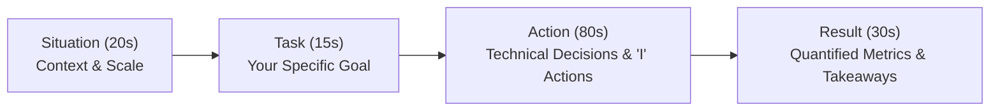

# 01. The STAR Method & High-Impact Storytelling

[← Back to Leadership Hub](./README.md) | [Track Hub](./README.md) | [Next: Amazon Leadership Principles Mastery →](./02-amazon-leadership-principles-engineering-mastery.md)

---

## 🏛️ 1. Theoretical Foundations: The Technical STAR Framework

In senior engineering interviews, rambling or unstructured answers are the #1 reason candidates fail behavioral rounds. Interviewers take notes under specific competency rubrics.
The **STAR Method** provides a structured narrative architecture that communicates technical competence, personal ownership, and business impact within a **2 to 3-minute delivery window**.

```
╭───────────────────────────────────────────────────────────────────────────────────────────╮
│                              THE TECHNICAL STAR TIME ALLOCATION                           │
├───────────────┬────────────┬───────────────────────────────────┬──────────────────────────┤
│ Stage         │ Time Budget│ Core Objective                    │ Key Invariant            │
├───────────────┼────────────┼───────────────────────────────────┼──────────────────────────┤
│ Situation (S) │ 20 seconds │ Context, scale, and constraints   │ Concrete business stakes │
│ Task (T)      │ 15 seconds │ Your specific role & mandate      │ Avoid team ambiguity     │
│ Action (A)    │ 80 seconds │ Deep technical decisions & trade-offs│ The "I" vs "We" balance│
│ Result (R)    │ 30 seconds │ Quantified engineering & business impact│ Numbers & metrics   │
╰───────────────┴────────────┴───────────────────────────────────┴──────────────────────────╯
```



---

## ⚖️ 2. The Golden Rule: "I" vs. "We" Balance

One of the most frequent behavioral round rejections is: *"The candidate used 'we' the entire time; I could not determine what they personally built versus what the team did."*

```
╭───────────────────────────────────────────────────────────────────────────────────────────╮
│                                 THE "I" VS. "WE" PROTOCOL                                 │
├─────────────────────────────────────────────────┬─────────────────────────────────────────┤
│ ❌ Weak: Ambiguous "We"                         │ ✅ Strong: Distinct Ownership "I"       │
├─────────────────────────────────────────────────┼─────────────────────────────────────────┤
│ "We decided to migrate our database to DynamoDB."│ "While the team was considering MongoDB,│
│                                                 │  I ran a proof-of-concept on DynamoDB   │
│                                                 │  and demonstrated a 40% cost reduction."│
├─────────────────────────────────────────────────┼─────────────────────────────────────────┤
│ "We investigated the production latency spike." │ "I pulled the JVM thread dumps, traced   │
│                                                 │  the database connection pool lock, and  │
│                                                 │  isolated an unindexed foreign key query."│
╰─────────────────────────────────────────────────┴─────────────────────────────────────────╯
```
- **Rule of Thumb**: Use **"We"** only when setting the team context in the *Situation* ($10\%$). Use **"I"** exclusively in the *Task* and *Action* ($90\%$) to describe your analysis, code, decisions, and architectural proposals.

---

## 📊 3. The Metric Quantification Formula

Every *Result* in a technical interview must be backed by quantifiable metrics. If you cannot measure it, the interviewer assumes the impact was negligible.

$$\text{Impact Metric} = \Delta \text{ Performance} + \Delta \text{ Financial / Resource Cost} + \Delta \text{ Reliability}$$

```
╭───────────────────────────────────────────────────────────────────────────────────────────╮
│                             QUANTIFIABLE ENGINEERING METRICS CHEATSHEET                   │
├────────────────────┬───────────────────────────────────┬──────────────────────────────────┤
│ Dimension          │ Example Metric Formulation        │ Typical Business Impact          │
├────────────────────┼───────────────────────────────────┼──────────────────────────────────┤
│ Latency (p99)      │ "Reduced p99 from 450ms to 38ms"  │ Prevented checkout cart drops    │
│ Throughput (QPS)   │ "Scaled ingestion from 5k to 60k" │ Supported Black Friday traffic   │
│ Cloud Infrastructure Cost│ "Reduced AWS bill by $35k/month" │ 40% EC2/RDS footprint savings    │
│ System Availability│ "Improved uptime from 99.8% to 99.99%"│ Saved 14 hours downtime/year │
│ Engineering Velocity│ "Cut build/test pipeline from 45m to 8m"│ Doubled daily deployment count│
╰────────────────────┴───────────────────────────────────┴──────────────────────────────────╯
```

---

## 🗺️ 4. The 12-Story Master Inventory Grid

Rather than memorizing 50 answers, prepare **12 modular stories** from your professional career. Each story can be adapted dynamically to answer multiple interview questions:

```
╭───────────────────────────────────────────────────────────────────────────────────────────╮
│                               THE 12-STORY MASTER INVENTORY                               │
├────┬─────────────────────────────┬───────────────────────────────────────────────────────┤
│ #  │ Core Story Archetype        │ Targets Behavioral Questions                          │
├────┼─────────────────────────────┼───────────────────────────────────────────────────────┤
│ 01 │ Major Production Sev-1 Crisis│ "Tell me about a time you failed" / "System breakdown"│
│ 02 │ Bitter Technical Disagreement│ "Conflict with Senior/Staff Engineer" / "Pushback"    │
│ 03 │ Impossible Deadline Crunch  │ "High stakes delivery" / "Scope trade-offs"          │
│ 04 │ Ambiguous Uncharted Project │ "Undefined requirements" / "0 to 1 architecture"     │
│ 05 │ Complex Performance Debugging│ "Dive Deep" / "Toughest technical bug"               │
│ 06 │ High-Risk Architectural Refactor│ "Paying down technical debt" / "Long-term vision"  │
│ 07 │ Mentoring Underperforming Peer│ "Leadership without authority" / "Team enablement"   │
│ 08 │ Customer Advocacy Against PM │ "Customer Obsession" / "Pushing back on product"      │
│ 09 │ Calculated Unpopular Decision│ "Have Backbone; Disagree & Commit" / "Data over gut"  │
│ 10 │ Cross-Team Dependency Block │ "Overcoming organizational silos" / "Delivery"        │
│ 11 │ Premature Optimization Error│ "Hindsight learning" / "Self-reflection"              │
│ 12 │ Proudest Engineering Triumph│ "Greatest technical achievement" / "Ownership"       │
╰────┴─────────────────────────────┴───────────────────────────────────────────────────────╯
```

---

## 📝 5. Full Annotated Production STAR Example

**Interviewer Prompt**: *"Tell me about a time you diagnosed and resolved a complex production issue under high pressure."*

### Situation (25s)
> *"During our annual Black Friday flash sale at [Company], our core checkout service suffered a severe latency spike. The p99 response time degraded from 120ms to over 8 seconds, and customers were experiencing checkout timeouts, resulting in an estimated revenue loss of $15,000 per minute."*

### Task (15s)
> *"As the tech lead on call, my mandate was two-fold: first, immediately stabilize the system to stop customer drop-offs; second, identify the root cause without taking down our database cluster."*

### Action (85s)
> *"While the incident commander proposed restarting the API pods, **I advised against it** because a cold restart would trigger a thundering herd against our database connection pools. 
> Instead, **I took three immediate actions**:
> 1. **Triage & Thread Profiling**: I pulled thread dumps from the bottlenecked instances and observed that 80% of application threads were BLOCKED waiting on HikariCP database connection leases.
> 2. **Database Lock Isolation**: I inspected PostgreSQL active queries and discovered an unindexed `coupon_redemptions` table scan. Under normal load, this query took 2ms, but under 20x concurrency, concurrent table locks were serializing connections and exhausting the pool.
> 3. **Mitigation**: Rather than running a blocking index migration during peak sale traffic, I deployed a feature flag in Redis to bypass non-critical coupon validation temporarily, immediately relieving database load. Within 90 seconds, connection wait times dropped to 0ms.
> 4. **Permanent Fix**: That evening, I added a concurrent partial B-tree index (`CREATE INDEX CONCURRENTLY`) and configured query timeouts in our Spring Data repository to prevent rogue queries from ever locking connection pools again."*

### Result (25s)
> *"Checkout latency returned to 45ms within 3 minutes of applying the mitigation. We recovered full payment processing, saving an estimated $250,000 in at-risk sales. Furthermore, I authored a blameless post-mortem and instituted mandatory connection pool timeouts across all 18 backend microservices, preventing this failure mode from ever recurring."*

---

<div align="center">

| [← Back to Leadership Hub](./README.md) | [Track Hub: Behavioral & Leadership](./README.md) | [Next: Amazon Leadership Principles Mastery →](./02-amazon-leadership-principles-engineering-mastery.md) |
| :--- | :---: | ---: |

</div>
