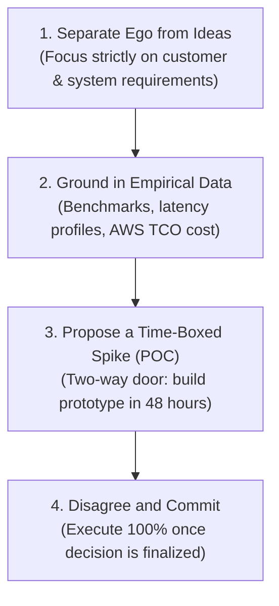

# 03. Conflict Resolution & Technical Disagreements

[← Back to Leadership Principles](./02-amazon-leadership-principles-engineering-mastery.md) | [Track Hub](./README.md) | [Next: Blameless Post-Mortems & Sev-1 Incidents →](./04-blameless-post-mortems-and-sev-1-incident-response.md)

---

## 🏛️ 1. Theoretical Foundations: The Anatomy of Technical Conflict

In software engineering, technical disagreements are inevitable and healthy. High-performing engineering teams embrace **constructive dissent** to expose architectural flaws, security vulnerabilities, and single points of failure before code reaches production.

However, conflicts become destructive when:
- Debates degrade into personal ego battles or authority pulls ("I am a Staff Engineer, so we do it my way").
- Code reviews get bogged down in **bikeshedding** (spending 2 hours debating variable naming while ignoring unindexed database queries).
- Teams become gridlocked, delaying product launches.

```
                      ╭────────────────────────────────────────╮
                      │      THE 4 SOURCES OF CODE CONFLICT    │
                      ╰───────────────────┬────────────────────╯
                                          │
                         ┌────────────────┼────────────────┐
                         ▼                ▼                ▼
                 ARCHITECTURE         DEADLINES         PR REVIEWS
                 Tech stack selection Scope creep vs debtNitpicks vs Blockers
                         │                │                │
                         └────────────────┼────────────────┘
                                          ▼
                                   CROSS-TEAM SILOS
                               API contracts & SLAs
```

---

## ⚡ 2. The 4-Step Technical Arbitration Protocol

When you disagree with a Senior/Staff Engineer or Product Manager, follow this structured 4-step framework:



### Step 1: Separate the Ego from the Idea
- Frame proposals around the problem, not personal opinions:
  - ❌ *"Your design using MongoDB is completely wrong for this."*
  - ✅ *"I am concerned about MongoDB here because our payment transactions require multi-document ACID rollback guarantees. How should we handle partial failure during payment processing?"*

### Step 2: Ground Arguments in Empirical Data
Subjective opinions cause circular arguments. Empirical data creates instant alignment:
- **Load Test Benchmarks**: *"I ran a Gatling load test at 10,000 QPS: the relational schema sustained 2ms p99, while the document store degraded to 85ms due to unindexed nested joins."*
- **Total Cost of Ownership (TCO)**: *"Managing an unmanaged Kafka cluster requires 2 dedicated on-call engineers and $12k/month in EC2, whereas AWS SQS costs $450/month for our volume."*

### Step 3: Propose a Time-Boxed Proof of Concept (Spike)
If team consensus is split 50/50 on an architecture choice, propose a **24-hour time-boxed prototype (spike)**:
- Both parties agree in advance on the evaluation metrics (e.g., memory footprint, throughput, developer ergonomics).
- The winning design is chosen objectively based on prototype telemetry.

### Step 4: Disagree and Commit
Once the tech lead or engineering manager renders a final architectural ruling:
- Even if your proposal was rejected, you **wholly commit** to the chosen path.
- You actively build safeguards, write tests, and support deployment.
- You **never** say *"I told you so"* if the chosen approach encounters issues. You jump in and solve the problem.

---

## 🔍 3. Code Review Conflict Protocol: Nits vs. Blockers

Code reviews are a prime source of interpersonal friction. Top-tier engineering teams maintain explicit review conventions:

```
╭───────────────────────────────────────────────────────────────────────────────────────────╮
│                              CODE REVIEW TAXONOMY INVARIANTS                              │
├────────────────────┬───────────────────────────────┬──────────────────────────────────────┤
│ Label              │ Meaning                       │ Action Required by Author            │
├────────────────────┼───────────────────────────────┼──────────────────────────────────────┤
│ [BLOCKER]          │ Correctness bug, security flaw,│ Mandatory fix before PR can be merged│
│                    │ memory leak, N+1 query        │                                      │
├────────────────────┼───────────────────────────────┼──────────────────────────────────────┤
│ [QUESTION]         │ Clarification on architectural│ Author explains rationale; no code   │
│                    │ rationale                     │ change necessarily required          │
├────────────────────┼───────────────────────────────┼──────────────────────────────────────┤
│ [NIT]              │ Minor stylistic preference or │ Optional: Author may fix or ignore;  │
│                    │ naming suggestion             │ will NOT block merge                 │
╰────────────────────┴───────────────────────────────┴──────────────────────────────────────╯
```

---

## 📝 4. Real-World STAR Narrative: Disagreeing with a Staff Engineer

**Interviewer Prompt**: *"Tell me about a time you had a technical disagreement with a senior colleague and how you resolved it."*

### Situation
> *"At [Previous Company], we were redesigning our order notification pipeline to handle 100,000 notifications per minute. Our Staff Architect proposed introducing a self-hosted Apache Kafka cluster. However, our team consisted of only 4 engineers, none of whom had operational experience managing ZooKeeper, broker rebalancing, or disk partition failovers."*

### Task
> *"I felt strongly that self-hosting Kafka was an over-engineered solution that would introduce massive operational burden and on-call burnout. My task was to push back respectfully with data and propose a lighter alternative without creating team friction."*

### Action
> *"I took a three-pronged approach:
> 1. **Data Gathering**: I analyzed our traffic patterns and documented that our workload was strictly fanout pub/sub with zero requirements for event replay, log compaction, or partitioned consumer offset seeking.
> 2. **TCO Analysis**: I prepared a cost and operations comparison showing that AWS SQS + SNS fully satisfied our 100k QPS requirements with 99.99% managed availability, zero infrastructure maintenance, and 80% lower cloud cost ($600/mo vs $3,500/mo for EC2 Kafka brokers).
> 3. **Collaborative Review**: I scheduled a 1-on-1 with the Staff Architect. Rather than saying 'Kafka is bad,' I walked him through our on-call rotation capacity and the operational overhead. He agreed that while Kafka was technically superior for replayable streaming, SQS was the pragmatic choice for our immediate scale."*

### Result
> *"We implemented the SQS/SNS pipeline and launched 3 weeks ahead of schedule. The system handled our peak holiday traffic with zero dropped messages and zero on-call pages, saving over $35,000 in annual infrastructure costs. The Staff Architect later commended my initiative in our quarterly review for protecting the team's operational health."*

---

<div align="center">

| [← Back to Leadership Principles](./02-amazon-leadership-principles-engineering-mastery.md) | [Track Hub: Behavioral & Leadership](./README.md) | [Next: Blameless Post-Mortems & Sev-1 Incidents →](./04-blameless-post-mortems-and-sev-1-incident-response.md) |
| :--- | :---: | ---: |

</div>
