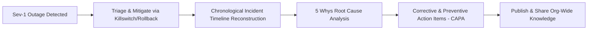

# 04. Blameless Post-Mortems & Sev-1 Incident Response

[← Back to Conflict Resolution](./03-conflict-resolution-and-technical-disagreements.md) | [Track Hub](./README.md) | [Next: Reverse Interviewing: 25 High-Leverage Questions →](./05-reverse-interviewing-25-questions-to-ask-the-interviewer.md)

---

## 🏛️ 1. Theoretical Foundations: The Blameless Culture

In enterprise systems engineering, outages are inevitable. Software runs on complex distributed topologies with flaky networks, noisy neighbors, and unforeseen concurrency races.
The industry gold standard (pioneered by Google SRE and Etsy) is the **Blameless Post-Mortem**:

```
╭───────────────────────────────────────────────────────────────────────────────────────────╮
│                               THE BLAMELESS POST-MORTEM AXIOMS                            │
├───────────────────────────────────────────────────────────────────────────────────────────┤
│ 1. Engineers act in good faith based on the best information available at the time.       │
│ 2. Blaming individuals creates fear, incentivizes hiding mistakes, and degrades safety.   │
│ 3. True root causes are SYSTEMIC: missing guardrails, unmonitored metrics, or bad tests. │
│ 4. Every outage is treated as an organizational investment that must yield permanent IP.  │
╰───────────────────────────────────────────────────────────────────────────────────────────╯
```



---

## ⚡ 2. The 5 Whys Root Cause Analysis (RCA)

The **5 Whys** is an iterative interrogative technique used to explore the cause-and-effect relationships underlying a particular problem. The primary goal is to determine the systemic root cause of a defect by repeating the question *"Why?"* five times.

```
Outage: Payment Processing Service went down for 42 minutes.

Why 1? Why did payments fail?
└─ The payment service exhausted its database connection pool (HikariCP).

Why 2? Why did the connection pool run out of connections?
└─ Queries to the fraud-detection endpoint were taking 15 seconds instead of 10ms.

Why 3? Why were fraud-detection queries taking 15 seconds?
└─ An unindexed table join on 'user_ip_addresses' forced a full sequential table scan.

Why 4? Why was the table unindexed in production?
└─ The migration script was executed in staging on 100 rows (where seq scan took 0.1ms),
   but was never tested against 10M production rows.

Why 5? (SYSTEMIC ROOT CAUSE): Why did the migration bypass production performance checks?
└─ Our CI/CD pipeline lacked an automated 'EXPLAIN ANALYZE' linting check to block
   unindexed table scans prior to production deployment.
```

---

## 📋 3. Standard Production Post-Mortem Template

```markdown
# Incident Post-Mortem: Sev-1 Payment Service Degradation
**Date**: 2026-09-24  
**Authors**: [Your Name], SRE Team  
**Incident Commander**: [Name]  
**Severity**: Sev-1 (Customer-Facing Revenue Outage)  
**Total Downtime**: 38 minutes  
**Customer Impact**: ~4,200 failed checkouts, ~$68,000 at-risk gross revenue  

---

### 1. Executive Summary
On September 24 at 14:15 UTC, our core Checkout & Payment service experienced a severe
latency degradation (p99 increased from 45ms to 18,000ms), resulting in HTTP 504 Gateway
Timeouts. The root cause was connection pool exhaustion in HikariCP caused by an
unindexed database query introduced in release v2.14.0. Traffic was restored at 14:53 UTC
by rolling back to release v2.13.9.

---

### 2. Chronological Incident Timeline (All times UTC)
- **14:10** - Deployment v2.14.0 successfully rolled out to 100% of canary pods.
- **14:15** - PagerDuty triggers Sev-1: Checkout API 504 error rate exceeded 5% threshold.
- **14:18** - Incident Commander establishes triage bridge and initiates war room.
- **14:23** - Database CPU reaches 100%; Active connections maxed at 200/200.
- **14:32** - Tech Lead identifies slow query on 'coupon_redemptions' via pg_stat_activity.
- **14:40** - Incident Commander authorizes immediate rollback to v2.13.9.
- **14:48** - Rollback deployment completes; database connection pool recovers.
- **14:53** - Error rates drop to 0.01%; Latency stabilizes at 42ms. Incident closed.

---

### 3. Root Cause Analysis (RCA)
Release v2.14.0 introduced a feature validating customer promo codes against historical
orders. The underlying query performed an unindexed sequential scan across 15M rows.
Under peak load, concurrent transactions held database connections open, causing all
application threads to block on connection acquisition.

---

### 4. What Went Well vs. What Went Poorly
**What Went Well:**
- Automated PagerDuty alerts triggered within 5 minutes of threshold breach.
- Rollback mechanism executed cleanly via ArgoCD within 8 minutes of authorization.
- Zero customer payment data was corrupted or lost.

**What Went Poorly:**
- Canary deployment lacked automated synthetic traffic to catch slow queries prior to full rollout.
- The database connection pool had no maximum query timeout configured, allowing rogue queries to block indefinitely.

---

### 5. Corrective & Preventive Actions (CAPA)
| Action Item | Type | Owner | Deadline | Status |
| :--- | :---: | :--- | :---: | :---: |
| Add concurrent B-Tree index on 'coupon_redemptions' | Fix | Data Eng | Tomorrow | DONE |
| Configure 3-second statement_timeout in HikariCP | Prevention | Backend | 3 Days | IN PROGRESS |
| Implement automated query plan check in CI pipeline | Detection | DevOps | 2 Weeks | OPEN |
| Add automated canary rollback based on p99 latency | Mitigation | SRE | 3 Weeks | OPEN |
```

---

## 🎯 4. Interview Delivery Blueprint

When an interviewer asks: *"Tell me about your biggest production failure or mistake"*:
1. **Own it completely**: State your role and the outage clearly without passing blame to junior devs or infrastructure.
2. **Highlight the Blameless Mindset**: Emphasize how you focused on immediate customer mitigation first (killswitch / rollback) rather than finger-pointing.
3. **Showcase the Lasting Prevention**: Conclude by describing the permanent guardrails (linter, alerts, circuit breakers) you implemented to ensure the failure mode could never happen again.

---

<div align="center">

| [← Back to Conflict Resolution](./03-conflict-resolution-and-technical-disagreements.md) | [Track Hub: Behavioral & Leadership](./README.md) | [Next: Reverse Interviewing: 25 High-Leverage Questions →](./05-reverse-interviewing-25-questions-to-ask-the-interviewer.md) |
| :--- | :---: | ---: |

</div>
