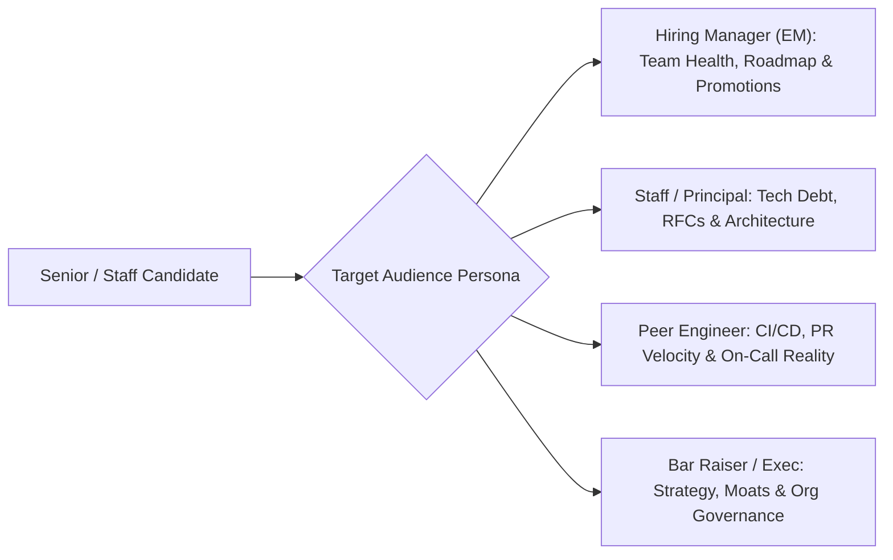

# 05. Reverse Interviewing: 25 High-Leverage Questions

[← Back to Blameless Post-Mortems](./04-blameless-post-mortems-and-sev-1-incident-response.md) | [Track Hub](./README.md) | [System Design Hub →](../system-design/README.md)

---

## 🏛️ 1. Theoretical Foundations: The Power Dynamic Shift

At the conclusion of every technical and behavioral interview, the interviewer asks:
> *"We have about 5 to 7 minutes left. Do you have any questions for me?"*

Amateur candidates say:
> *"No, I think you covered everything!"* or ask generic, low-effort questions like *"What's your favorite thing about working here?"*

Elite engineering candidates treat this phase as **Cultural Due Diligence & Technical Reverse-Engineering**:
1. **Signaling Factor**: High-leverage questions signal seniority, strategic thinking, and self-worth. You demonstrate that you are evaluating their engineering standards as strictly as they are evaluating yours.
2. **De-risking Your Career**: Joining an engineering organization with toxic on-call rotations, unaccountable product management, or technical debt paralysis destroys engineering careers. Reverse interviewing extracts unvarnished reality before signing an offer.

```
╭───────────────────────────────────────────────────────────────────────────────────────────╮
│                             THE REVERSE INTERVIEWING AXIOM                                │
├───────────────────────────────────────────────────────────────────────────────────────────┤
│ The questions you ask tell the interviewer more about your seniority, architectural      │
│ maturity, and cultural standards than the answers you gave to their questions.           │
╰───────────────────────────────────────────────────────────────────────────────────────────╯
```



---

## 🎯 2. The 25 High-Leverage Question Catalog

### A. Targeting the Hiring Manager (Engineering Manager / Director)

| # | Question | What You Are Actually Probing |
| :-: | :--- | :--- |
| **Q1** | *"What percentage of your team's engineering capacity is explicitly reserved for technical debt, infrastructure reliability, and architectural refactoring vs. product feature delivery?"* | Probes whether the team is a feature factory sprinting toward burnout or an engineering-first culture that respects operational excellence (Target: 20-30%). |
| **Q2** | *"When was the last time an engineer on this team received a promotion to SDE-2 or Senior? What concrete impact drove that decision?"* | Probes whether the promotion ladder is transparent, meritocratic, and actively championed, or arbitrary and gatekept. |
| **Q3** | *"Can you describe a recent high-priority business deadline where the team realized the scope could not be completed safely? How did you renegotiate with Product?"* | Tests manager spine and whether the manager acts as a protective shield or a downward pressure conduit. |
| **Q4** | *"What does team attrition look like over the last 18 months, and what is the single most common reason engineers choose to transfer or leave?"* | Tests managerial honesty and reveals toxic team dynamics, bad compensation, or dead-end projects. |
| **Q5** | *"What is the single most critical deliverable this team must ship in the next 6 months to be considered successful by VP leadership?"* | Uncovers high-stakes business context and whether your day-to-day tickets will have executive visibility. |
| **Q6** | *"How do you handle underperformance versus burnout? Can you give an anonymized example of how you coached an engineer through a difficult quarter?"* | Evaluates empathy, mentorship maturity, and psychological safety. |

---

### B. Targeting Principal & Staff Engineers (System Architects)

| # | Question | What You Are Actually Probing |
| :-: | :--- | :--- |
| **Q7** | *"What is your RFC (Request for Comments) and architectural review process? How does the team reach consensus when two senior engineers have conflicting architectural proposals?"* | Probes technical democracy vs. benevolent dictatorship vs. bikeshedding paralysis. |
| **Q8** | *"What is the single most brittle architectural component or legacy service currently running in production that everyone is afraid to touch?"* | Uncovers true production pain points and assesses whether leadership is willing to invest in deep rewrites. |
| **Q9** | *"How do you balance consistency across shared microservices vs. autonomous team velocity? Do you enforce a standardized tech stack or encourage polyglot development?"* | Probes architectural governance, library fragmentation, and organizational complexity. |
| **Q10** | *"How does the organization prevent architectural drift and ensure that documentation, ADRs (Architectural Decision Records), and observability stay current with production reality?"* | Evaluates engineering rigor and knowledge-sharing infrastructure. |
| **Q11** | *"If you had unconditional executive approval and 3 months with a team of 4 engineers to rebuild or re-architect any piece of your system, what would you dismantle first?"* | Elicits passionate architectural reflection and exposes the true bottleneck of the technical organization. |
| **Q12** | *"What is your philosophy on build vs. buy? When was the last time the team replaced an in-house tool with an open-source or managed SaaS solution?"* | Probes "Not Invented Here" (NIH) syndrome vs. pragmatic engineering leverage. |

---

### C. Targeting Peer Software Engineers (Day-to-Day Teammates)

| # | Question | What You Are Actually Probing |
| :-: | :--- | :--- |
| **Q13** | *"Walk me through your typical on-call rotation. How many pages or alerts go off outside business hours during an average week?"* | **The #1 life quality question**. Reveals whether the pager is quiet (< 2 alerts/week) or an unmitigated nightmare (> 10 alerts/night). |
| **Q14** | *"From the moment you merge a pull request to `main`, how long does it take to reach production, and how many manual approvals or canary stages are required?"* | Tests CI/CD pipeline health and continuous deployment maturity (Ideal: automated < 30 minutes; Warning: manual gatekeeper board taking 2 weeks). |
| **Q15** | *"What is the average pull request review turnaround time on the team? If a PR sits unreviewed for 48 hours, what is the cultural expectation?"* | Measures team collaboration velocity and whether PR reviews are prioritized or treated as afterthoughts. |
| **Q16** | *"How frequently do integration tests fail or flake in your CI pipeline, and how does the team respond to flakiness?"* | Reveals developer productivity pain; flaky CI test suites destroy morale and slow delivery. |
| **Q17** | *"When a Sev-1 outage occurs at 2:00 AM on a Friday, what does the incident channel feel like? Is it calm and disciplined, or is there panic and finger-pointing?"* | Tests real-world blameless post-mortem culture and operational discipline under pressure. |
| **Q18** | *"What is the local development setup experience like? How many commands and how long does it take for a new engineer to spin up the service stack locally with test data?"* | Uncovers developer tooling investment and onboarding friction (Docker compose / tilt vs. 3 weeks of manual env configuration). |

---

### D. Targeting Cross-Functional Interviewers (Product Managers, Designers, Data Scientists)

| # | Question | What You Are Actually Probing |
| :-: | :--- | :--- |
| **Q19** | *"How early are software engineers brought into the product discovery and problem-definition phase?"* | Differentiates between empowered product engineering teams vs. feature-factory code monkeys who only receive Jira tickets. |
| **Q20** | *"Can you give an example of an engineering-led discovery that fundamentally altered your product roadmap or strategy?"* | Tests whether Product respects technical insights or treats engineering as subordinate execution contractors. |
| **Q21** | *"When trade-offs must be made between polished UI/UX, feature completeness, and p99 latency guarantees, how do Product and Engineering resolve the friction?"* | Probes collaborative alignment and customer-centric prioritization. |

---

### E. Targeting the Bar Raiser / VP / Executive

| # | Question | What You Are Actually Probing |
| :-: | :--- | :--- |
| **Q22** | *"What is the biggest existential threat or technical moat challenge this organization faces over the next 24 to 36 months?"* | Signals strategic macro-level awareness and tests executive clarity. |
| **Q23** | *"How has the recent macroeconomic environment or organizational shift impacted engineering morale and project prioritization across your org?"* | Probes stability, layoffs, re-org velocity, and executive transparency. |
| **Q24** | *"What differentiates the engineers who truly excel and reach Staff/Principal levels at this company from those who plateau at Senior?"* | Directly extracts the company's unwritten evaluation rubric for senior career growth. |
| **Q25** | *"Based on our conversation today, is there any area in my technical background, architectural approach, or domain experience where you have reservations that I could address right now?"* | **The Ultimate Closer**: Demonstrates supreme confidence, invites immediate feedback, and gives you one final chance to neutralize objections before the debrief. |

---

## 🚩 3. Cultural Red Flags vs. Green Flags Matrix

```
╭───────────────────────────────────────────────────────────────────────────────────────────╮
│                             DUE DILIGENCE EVALUATION MATRIX                               │
├─────────────────────────┬─────────────────────────────────┬───────────────────────────────┤
│ Dimension               │ 🚩 RED FLAG SIGNAL              │ ❇️ GREEN FLAG SIGNAL          │
├─────────────────────────┼─────────────────────────────────┼───────────────────────────────┤
│ On-Call Health          │ "We have a dedicated support    │ "Pager rarely sounds at night;│
│                         │ team, but you carry the pager   │ engineers have auto-rollback  │
│                         │ 24/7 and get paged frequently." │ and on-call comp days."       │
├─────────────────────────┼─────────────────────────────────┼───────────────────────────────┤
│ Technical Debt          │ "We plan to address tech debt   │ "We dedicate 20% of sprint    │
│                         │ after Q4 launch finishes."      │ capacity to refactors and tech│
│                         │ (Translation: Never).           │ debt reduction every sprint." │
├─────────────────────────┼─────────────────────────────────┼───────────────────────────────┤
│ Release Velocity        │ "We deploy bi-weekly on Tuesday │ "We deploy to production 15+  │
│                         │ night during maintenance windows│ times a day via automated     │
│                         │ with a change-approval board."  │ canaries and automated rollback│
├─────────────────────────┼─────────────────────────────────┼───────────────────────────────┤
│ Incident Response       │ "We find out who caused the bug │ "We hold blameless post-      │
│                         │ and make them write a fix."     │ mortems and focus on systemic │
│                         │                                 │ automated safeguards."        │
├─────────────────────────┼─────────────────────────────────┼───────────────────────────────┤
│ Autonomy & Ownership    │ "Management assigns the user    │ "Engineers co-own problem     │
│                         │ stories and tickets every Mon." │ definitions and write RFCs."  │
╰─────────────────────────┴─────────────────────────────────┴───────────────────────────────╯
```

---

## 🚀 4. How to Structure Your 5 Minutes

When given the floor, deploy the **Rule of Three**:
1. **The Context Anchor**: State *why* you are asking: *"Throughout my career at scale, I've observed that on-call health directly mirrors architectural hygiene. Could you share what your rotation looks like?"*
2. **The Strategic Pivot**: Ask an architectural question tailored to their seniority: *"I noticed your service processes 50k QPS across multi-region Cassandra. How does your RFC process handle data migration risks?"*
3. **The Executive Closer**: Always finish with **Q25**: *"Based on everything we discussed today, is there any aspect of my background or architecture design where you feel I haven't fully demonstrated the bar for this role?"*

---

<div align="center">

| [← Back to Blameless Post-Mortems](./04-blameless-post-mortems-and-sev-1-incident-response.md) | [Track Hub: Behavioral & Leadership](./README.md) | [System Design Hub →](../system-design/README.md) |
| :--- | :---: | ---: |

</div>
