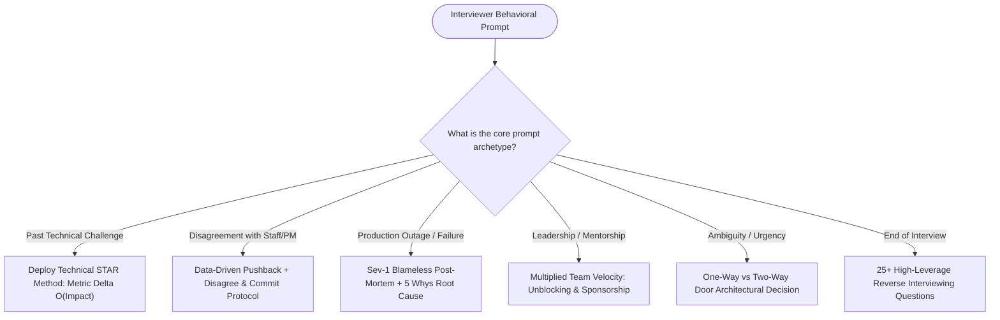

# 🎯 Behavioral & Engineering Leadership Track ("The Bar Raiser")

[Java Track Home](../dsa-java/README.md) | [System Design Hub](../system-design/README.md) | [Next: The STAR Method & Impact Storytelling →](./01-the-star-method-and-high-impact-storytelling.md)

---

## 🧭 Executive Overview: The Bar-Raiser Philosophy

In technical hiring loops at Tier-1 companies (Amazon, Google, Meta, Apple, Netflix, Stripe), coding and system design only determine whether a candidate is **technically capable**. 
The **Behavioral & Engineering Leadership** rounds determine whether a candidate is **hired, leveled (SDE-2 vs. Senior vs. Staff), or rejected**.

At senior levels (L5 / L6+), **30% to 50%** of the interview evaluation is allocated to leadership:
- Can you navigate severe technical ambiguity without product requirements?
- How do you respond when your multi-region architecture suffers a Sev-1 production outage?
- How do you resolve bitter architectural disputes with Principal Engineers or Product Managers?
- Do you elevate the engineers around you, or are you a siloed individual contributor?

```
                      ╭────────────────────────────────────────╮
                      │     THE 4-PILLAR LEADERSHIP MATRIX     │
                      ╰───────────────────┬────────────────────╯
                                          │
                         ┌────────────────┼────────────────┐
                         ▼                ▼                ▼
                 TECHNICAL CRAFT      OWNERSHIP       COLLABORATION
                 Trade-offs & RCA    End-to-End      Disagree & Commit
                         │                │                │
                         └────────────────┼────────────────┘
                                          ▼
                               RESILIENCE & INTEGRITY
                               Blameless post-mortems
```

---

## 🏛️ 1. The 4 Universal Evaluation Pillars

```
╭───────────────────────────────────────────────────────────────────────────────────────────╮
│                              THE FAANG HIRING BAR EVALUATION RUBRIC                       │
├────────────────────┬───────────────────────────────────┬──────────────────────────────────┤
│ Pillar             │ Core Competency                   │ Positive Signals                 │
├────────────────────┼───────────────────────────────────┼──────────────────────────────────┤
│ 1. Technical Craft │ Architectural Judgment & Defense  │ Root Cause Analysis (5 Whys),    │
│                    │                                   │ pragmatic trade-offs, metrics    │
│ 2. Deep Ownership  │ Extreme Accountability            │ One-way vs two-way door decisions│
│                    │                                   │ fixes issues outside own team    │
│ 3. Influence       │ Cross-Functional Leadership       │ Disagree and commit with data,   │
│                    │                                   │ unblocks stalled roadmaps        │
│ 4. Resilience      │ Psychological Safety & Learning   │ Blameless post-mortem ownership, │
│                    │                                   │ turns production failures into IP│
╰────────────────────┴───────────────────────────────────┴──────────────────────────────────╯
```

---

## 🧭 2. The Behavioral Navigation Engine



---

## 🗺️ 3. Master Curriculum Roadmap

| Module | Core Competency | Key Frameworks & Models | Real-World Scenario Focus |
| :--- | :--- | :--- | :--- |
| **[01. The STAR Method & Impact Storytelling](./01-the-star-method-and-high-impact-storytelling.md)** | Narrative Architecture | The Technical STAR framework, "I" vs "We" ownership, Metric quantification formulas | Latency drop, cloud cost savings, 10x scale launch |
| **[02. Amazon Leadership Principles Mastery](./02-amazon-leadership-principles-engineering-mastery.md)** | Core Principles | All 16 Amazon LPs translated into engineering decisions: Customer Obsession, Ownership, Dive Deep | Legacy service refactoring, silent corruption fix |
| **[03. Conflict Resolution & Technical Disagreements](./03-conflict-resolution-and-technical-disagreements.md)** | Constructive Dissent | Architecture disputes (Postgres vs Mongo, gRPC vs REST), PM scope creep, Peer friction | Disagree and Commit, data-backed technical arbitration |
| **[04. Blameless Post-Mortems & Sev-1 Incidents](./04-blameless-post-mortems-and-sev-1-incident-response.md)** | Crisis Leadership | Incident Commander protocol, 5 Whys RCA, Corrective/Preventative Actions (CAPA) | Cascading thread starvation, cache stampede outage |
| **[05. Reverse Interviewing: 25 High-Leverage Questions](./05-reverse-interviewing-25-questions-to-ask-the-interviewer.md)** | Cultural Due Diligence | Questions for Hiring Managers, Staff Engineers, and Peers | On-call health, deployment velocity, tech debt burden |

---

<div align="center">

| [← Back to Java Track Home](../dsa-java/README.md) | [Track Hub: Behavioral & Leadership](./README.md) | [Next: The STAR Method & Impact Storytelling →](./01-the-star-method-and-high-impact-storytelling.md) |
| :--- | :---: | ---: |

</div>
