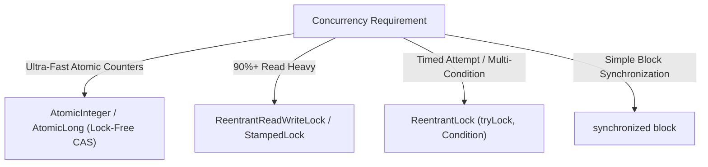

# 03. GoF Design Patterns & Java Concurrency Reference

[← Back to System Design Numbers](./02-system-design-numbers-and-capacity-math.md) | [Cheatsheets Hub](./README.md) | [Next: 200+ High-Yield Flashcards →](./04-200-high-yield-interview-flashcards.md)

---

## 1. The 23 GoF Design Patterns Quick-Trigger Matrix

### Creational Patterns (Object Instantiation)
| Pattern | 1-Sentence Intent | Real-World Backend Analogy | Java Implementation Trigger |
| :--- | :--- | :--- | :--- |
| **Singleton** | Ensures exactly one instance with a global access point. | Thread pools, Database connection manager (`HikariDataSource`). | `enum Singleton` or Double-Checked Locking with `volatile`. |
| **Factory Method** | Defines an interface for object creation; subclasses decide which class to instantiate. | Notification Dispatcher (Email, SMS, Push). | `NotificationFactory.create(type)`. |
| **Abstract Factory** | Creates families of related or dependent objects without specifying concrete classes. | Multi-Cloud Storage (AWS S3 vs GCP GCS vs Azure Blob). | `CloudStorageFactory.createUploader()`. |
| **Builder** | Separates complex object construction from its representation. | HTTP Request / Complex SQL query builder / Domain DTOs. | Fluent chain: `User.builder().name("...").build()`. |
| **Prototype** | Clones existing objects rather than instantiating new ones from scratch. | Chess board initial configurations / Deep graph copies. | `implements Cloneable` or Copy Constructor. |

---

### Structural Patterns (Object Composition & Class Hierarchy)
| Pattern | 1-Sentence Intent | Real-World Backend Analogy | Java Implementation Trigger |
| :--- | :--- | :--- | :--- |
| **Adapter** | Converts the interface of a class into another interface clients expect. | Legacy payment gateway adapter (Stripe vs PayPal). | Wrapper class implementing target interface. |
| **Bridge** | Decouples an abstraction from its implementation so both can vary independently. | Remote Control operating diverse Device engines (TV, Radio). | Pass implementation interface into abstraction constructor. |
| **Composite** | Treats individual objects and compositions of objects uniformly (Tree structure). | File System (File vs Folder containing Files). | Component interface with `operation()` implemented by leaf and composite. |
| **Decorator** | Attaches additional responsibilities to an object dynamically without subclassing. | Java I/O Streams (`new BufferedReader(new FileReader())`). | Wrap core class; delegate and augment behavior. |
| **Facade** | Provides a simplified, unified interface to a complex subsystem. | `OrderFulfillmentFacade` (Cart + Payment + Shipping + Stock). | Single entry service orchestrating multiple sub-services. |
| **Flyweight** | Shares fine-grained object state to support large numbers of objects efficiently. | Word processor character glyphs / Video game particle engines. | Cache immutable intrinsic state in a factory map. |
| **Proxy** | Provides a surrogate or placeholder to control access to another object. | Spring `@Transactional` proxy / Virtual lazy-loading proxy. | Dynamic Proxy (`java.lang.reflect.Proxy`) or CGLIB. |

---

### Behavioral Patterns (Communication & Responsibility Assignment)
| Pattern | 1-Sentence Intent | Real-World Backend Analogy | Java Implementation Trigger |
| :--- | :--- | :--- | :--- |
| **Chain of Responsibility** | Passes a request along a chain of handlers until one handles it. | Servlet Filters (`SecurityFilter -> AuthFilter -> LoggingFilter`). | `nextHandler.handle(request)`. |
| **Command** | Encapsulates a request as an object, enabling undo/redo and queued execution. | Database transactions (`BEGIN / COMMIT / ROLLBACK`), Job queues. | `interface Command { void execute(); void undo(); }`. |
| **Iterator** | Accesses elements of an aggregate object sequentially without exposing underlying format. | Database cursor pagination / Java `java.util.Iterator`. | `hasNext()` and `next()`. |
| **Mediator** | Defines an object that encapsulates how a set of objects interact, preventing tight coupling. | Air Traffic Controller / Chat Room coordinating users. | Participants talk strictly to `Mediator`, not each other. |
| **Memento** | Captures and externalizes an object's internal state so it can be restored later. | Text editor Undo buffer / Transaction savepoints. | Immutable snapshot class stored in a history stack. |
| **Observer** | Defines a 1-to-N dependency; state change notifies all dependents automatically. | Kafka Event Listener / Stock Market ticker updates. | Subject maintains `List<Observer>` and loops `notify()`. |
| **State** | Allows an object to alter its behavior when its internal state changes. | Vending machine / Order status (`CREATED -> PAID -> SHIPPED`). | Context delegates execution to current `State` object. |
| **Strategy** | Defines a family of interchangeable algorithms selected at runtime. | Payment processing (UPI vs Credit Card) / Dynamic fee calculation. | Inject strategy interface into context. |
| **Template Method** | Defines the skeleton of an algorithm in a method, deferring steps to subclasses. | Data Ingestion pipeline (`read() -> parse() -> save()`). | Base class with `final execute()` calling abstract hooks. |
| **Visitor** | Represents an operation to be performed on elements of an object structure without modifying classes. | Document AST compiler / Tax calculation across product types. | `element.accept(Visitor v)` with double-dispatch. |

---

## 2. Java Concurrency & Lock Selection Matrix

| Mechanism | CPU Overhead | Deadlock Prevention | Reentrancy | Fair Queuing Option |
| :--- | :---: | :---: | :---: | :---: |
| **`synchronized`** | Low (Biased $\to$ Thin $\to$ Heavyweight) | No (`wait()` / `notify()` only) | Yes | No (barging) |
| **`ReentrantLock`** | Low-Medium | Yes (`tryLock(timeout, unit)`) | Yes | Yes (`new ReentrantLock(true)`) |
| **`ReentrantReadWriteLock`** | Medium (Lock upgrade not supported) | Yes (`tryLock`) | Yes | Yes |
| **`StampedLock`** | Low (Optimistic reads without locks) | No (Not reentrant!) | **No** | No |
| **`Atomic CAS`** | Minimal (Hardware CPU instruction) | Immunity (Zero locks) | N/A | N/A |

---

## 3. The `volatile` Keyword & Java Memory Model (JMM)

- **What `volatile` DOES:**
  1. **Memory Visibility:** Flushes CPU core cache lines directly to main memory; reads are guaranteed to see the latest write across threads.
  2. **Prevents Instruction Reordering:** Emits a hardware memory barrier (`mfence`) preventing the compiler and CPU from reordering instructions.
- **What `volatile` DOES NOT DO:**
  - `volatile` **does NOT provide atomicity!**
  - An operation like `count++` consists of 3 distinct steps: `read -> increment -> write`. Two threads running `volatile count++` will suffer race condition lost updates. Use `AtomicInteger` or locks for compound mutations!

---

## 4. Modern Java Concurrency Primitives

- **`CountDownLatch(N)`:** Threads block via `await()` until $N$ other threads execute `countDown()`. One-time use; cannot be reset.
- **`CyclicBarrier(N)`:** $N$ threads wait for each other at a common barrier point. Resets automatically for cyclic multi-phase algorithms.
- **`Semaphore(permits)`:** Restricts concurrent access to a resource pool (e.g. rate-limiting database connections to 20).
- **Virtual Threads (Java 21 / Project Loom):** Lightweight, user-mode threads scheduled by the JVM onto carrier platform threads. Eliminates the need for reactive code (WebFlux) by making blocking I/O virtually cost-free ($1\text{ Million}$ virtual threads consume only megabytes of RAM).

---

| [← Back to System Design Numbers](./02-system-design-numbers-and-capacity-math.md) | [Track Hub: Cheatsheets](./README.md) | [Next: 200+ High-Yield Flashcards →](./04-200-high-yield-interview-flashcards.md) |
| :--- | :---: | ---: |

