# ☕ Java 21 LLD Machine Coding Playground & Concurrency Test Suite

A production-grade, compilable modern Java (Java 21) playground containing runnable implementations of 7 core Low-Level Design (LLD) systems and comprehensive multi-threaded JUnit 5 test suites.

---

## 🏗️ Architecture & Component Catalog

```mermaid
graph TD
    subgraph "code-samples/src/main/java/com/prep/lld/"
        C["cache/"] --> CE["ConcurrentCache.java"]
        C --> EP["EvictionPolicy.java (LRU, LFU, FIFO)"]

        R["ratelimiter/"] --> RL["RateLimiter.java"]
        R --> TB["TokenBucketRateLimiter.java"]
        R --> SW["SlidingWindowCounterRateLimiter.java"]

        S["scheduler/"] --> DTS["DistributedTaskScheduler.java"]
        S --> SJ["ScheduledJob.java"]

        PL["parkinglot/"] --> PLS["ParkingLotSystem.java"]
        PL --> PS["ParkingSpot.java (ReentrantLock)"]
        PL --> SAS["NearestSpotAllocationStrategy.java"]

        SWI["splitwise/"] --> EM["ExpenseManager.java"]
        SWI --> DS["DebtSimplifier.java (Min-Cash-Flow)"]

        KV["kvstore/"] --> TKS["TransactionalKeyStore.java"]
        KV --> TF["TransactionFrame.java (Nested ACID)"]

        EL["elevator/"] --> EC["ElevatorController.java"]
        EL --> ECA["ElevatorCar.java (LOOK/SCAN)"]
    end

    subgraph "code-samples/src/test/java/com/prep/lld/"
        TC["cache/ConcurrentCacheTest.java"]
        TR["ratelimiter/RateLimiterTest.java"]
        TS2["scheduler/TaskSchedulerTest.java"]
        TPL["parkinglot/ParkingLotTest.java"]
        TSW["splitwise/SplitwiseTest.java"]
        TKV["kvstore/TransactionalKeyStoreTest.java"]
        TEL["elevator/ElevatorControllerTest.java"]
    end

    TC -.-> C
    TR -.-> R
    TS2 -.-> S
    TPL -.-> PL
    TSW -.-> SWI
    TKV -.-> KV
    TEL -.-> EL
```



| System Module | Package | Key Design Patterns | Concurrency & Algorithmic Primitives | Test Suite |
| :--- | :--- | :--- | :--- | :--- |
| **Concurrent Cache** | `com.prep.lld.cache` | Strategy, Observer, Factory | `ReentrantReadWriteLock`, O(1) Doubly Linked List, Frequency Buckets, Background Scheduled Purge | `ConcurrentCacheTest` |
| **Rate Limiter Library** | `com.prep.lld.ratelimiter` | Strategy, Factory | Per-client `synchronized` monitors, Nanosecond `System.nanoTime()` CAS refill, Sliding Window Counter | `RateLimiterTest` |
| **Distributed Task Scheduler** | `com.prep.lld.scheduler` | Strategy, State, Observer | `java.util.concurrent.DelayQueue`, Thread Pool Workers, Exponential Backoff Jitter, Atomic Status CAS | `TaskSchedulerTest` |
| **Multi-Floor Parking Lot** | `com.prep.lld.parkinglot` | Strategy, Factory, Object Pool | Per-spot `ReentrantLock` atomic reservation, Nearest-fit multi-floor allocation, Dynamic hourly billing | `ParkingLotTest` |
| **Splitwise & Debt Simplifier** | `com.prep.lld.splitwise` | Strategy, Command | Min-Cash-Flow Greedy Graph algorithm using Max-Heaps, Cycle elimination (O(N) settlements), Zero-Sum invariant | `SplitwiseTest` |
| **Transactional Key-Value Store** | `com.prep.lld.kvstore` | Memento, Stack, Snapshot Isolation | Nested transaction frames (`Deque<TransactionFrame>`), Active/passive TTL expiration, ReadWriteLock isolation | `TransactionalKeyStoreTest` |
| **Elevator Controller System** | `com.prep.lld.elevator` | State, Strategy, Dispatcher | LOOK / SCAN disk-scheduling sweep algorithm, Dual `TreeSet` stops, Multi-car proximity scoring heuristic | `ElevatorControllerTest` |

---

## ⚡ How to Build & Run Tests

### Prerequisites
- **JDK 21** or later (`java -version` >= 21)
- **Apache Maven 3.9+** (`mvn -version`)

### Execution Commands

```bash
# Navigate to the code-samples directory
cd code-samples

# Run all 36 JUnit 5 concurrency and functional tests
mvn test

# Run a specific test suite
mvn test -Dtest=ConcurrentCacheTest
mvn test -Dtest=RateLimiterTest
mvn test -Dtest=TaskSchedulerTest
mvn test -Dtest=ParkingLotTest
mvn test -Dtest=SplitwiseTest
mvn test -Dtest=TransactionalKeyStoreTest
mvn test -Dtest=ElevatorControllerTest

# Package compiled JAR
mvn clean package
```

### IDE Setup
- **IntelliJ IDEA**: Open the `code-samples/` folder or root workspace, right-click `pom.xml` -> **Add as Maven Project**.
- **VS Code**: Install the *Extension Pack for Java*; the project will be detected automatically.

---

## 🔗 Links & Navigation

- 📐 [LLD & Machine Coding Master Hub](../system-design/lld-machine-coding/README.md)
- 🏛️ [System Design Track Hub](../system-design/README.md)
- 🏠 [Repository Root Hub](../README.md)
