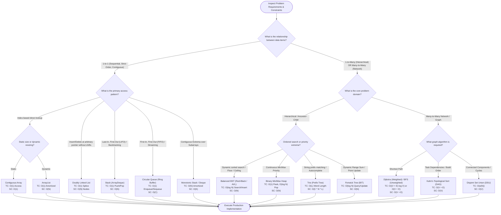

# Linear vs. Non-Linear Data Structures & Algorithms: The Master Architectural Guide

At the core of computer science lies a fundamental design decision: **how should data be arranged in memory to solve a specific problem?**

Data structures are broadly divided into two great domains: **Linear Data Structures** and **Non-Linear Data Structures**. This guide establishes the theoretical foundations, memory models, hardware cache line dynamics, algorithmic trade-offs, and an **exhaustive scenario-by-scenario mapping matrix** with formal Time (TC) and Space (SC) complexities.

---

## 🏛️ 1. Theoretical Foundations: Structural Taxonomies

```text
╭─────────────────────────────────────────────────────────────────────────────────────────────╮
│                         LINEAR VS. NON-LINEAR STRUCTURAL TOPOLOGY                           │
├─────────────────────────────────────────────────────────────────────────────────────────────┤
│                                                                                             │
│  LINEAR TOPOLOGY (1-to-1 Relationship)                                                      │
│  Every element has at most one predecessor and one successor.                               │
│                                                                                             │
│  [Element 0] ───> [Element 1] ───> [Element 2] ───> [Element 3] ───> [Element 4]            │
│       ▲                                                                    ▲                │
│       │ (Predecessor = None)                                               │ (Successor =   │
│       └─ Head                                                        Tail ─┘      None)     │
│                                                                                             │
│  Traversal: Deterministic 1D path. In a single linear scan, all elements are visited.      │
│                                                                                             │
│ ─────────────────────────────────────────────────────────────────────────────────────────── │
│                                                                                             │
│  NON-LINEAR TOPOLOGY (Hierarchical: 1-to-Many  |  Network: Many-to-Many)                   │
│                                                                                             │
│       Hierarchical (Tree / BST / Heap)                  Network / Mesh (Graph)              │
│                    [Root]                                     (Node A)                      │
│                    /    \                                     /      \                      │
│              [Child 1]  [Child 2]                        (Node B) ── (Node C)               │
│               /     \        \                             \            /                   │
│          [Leaf A] [Leaf B]  [Leaf C]                         \        /                     │
│                                                               (Node D)                      │
│                                                                                             │
│  Traversal: Multi-branching. Cannot be traversed sequentially without state-tracking        │
│             data structures (e.g. Call Stack for DFS, FIFO Queue for BFS).                  │
╰─────────────────────────────────────────────────────────────────────────────────────────────╯
```

### The Formal Axioms:
1. **Linear Axiom (Strict Ordering)**:
   A data structure is *linear* if its elements form a total order: there exists a bijection $f: S \to \{0, 1, \dots, N-1\}$ such that element $e_i$ is visited strictly at step $i$. No element has more than one incoming edge or more than one outgoing edge in its traversal graph.
2. **Non-Linear Axiom (Branching & Multi-Connectivity)**:
   A data structure is *non-linear* if at least one node can connect to $K$ other nodes where $K \ge 2$ (branching factor $> 1$), or where cycles and cross-links permit multiple distinct paths between two vertices.

---

## 💻 2. Hardware & Micro-Architectural Reality: Memory Hierarchy

Why does algorithmic choice dictate real-world latency? A theoretical $O(N)$ algorithm can run **$20\times$ to $50\times$ slower** than another $O(N)$ algorithm due to CPU cache dynamics:

```text
╭─────────────────────────────────────────────────────────────────────────────────────────────╮
│                               HARDWARE CACHE LINE ACCESS COMPARISON                         │
├─────────────────────────────────────────────────────────────────────────────────────────────┤
│                                                                                             │
│ 1. Linear Contiguous Memory (Primitive Array / ArrayDeque):                                 │
│    Memory: [ idx 0 ][ idx 1 ][ idx 2 ][ idx 3 ][ idx 4 ][ idx 5 ][ idx 6 ][ idx 7 ]         │
│            └───────────────────── 64-Byte Cache Line ─────────────────────┘                 │
│    Hardware Result: CPU Prefetcher loads 16 consecutive 4-byte integers in 1 cycle.         │
│                     L1 Cache Hit Rate > 98%. Zero CPU pipeline stall cycles.                │
│                                                                                             │
│ 2. Non-Linear & Node-Based Memory (LinkedList / Trees / Graphs):                            │
│    Heap:  [Node A] ──ptr──> [Node B (Heap Page 4)] ──ptr──> [Node C (Heap Page 12)]         │
│           (0x10A0)          (0x84F0)                         (0x21B0)                       │
│    Hardware Result: Pointer chasing across disparate memory pages.                          │
│                     Each node dereference triggers an L1/L2/L3 cache miss (~100ns stall).   │
│                     High Translation Lookaside Buffer (TLB) thrashing.                      │
╰─────────────────────────────────────────────────────────────────────────────────────────────╯
```

### Key Hardware Takeaways:
- **Spatial Locality**: Linear arrays maximize 64-byte cache line density. Traversing an array streams memory linearly, allowing the CPU hardware prefetcher to anticipate reads before instructions execute.
- **Pointer Chasing Tax**: Tree nodes and linked lists scatter objects across the JVM heap. Each step requires reading a 64-bit reference address, causing pipeline bubbles.
- **Memory Amplification (Compressed OOPs)**: In Java, every heap object carries a 12-byte object header plus padding. A tree node holding an `int` with two child references consumes **32 bytes** of memory for 4 bytes of data ($800\%$ memory amplification).

---

## 🗺️ 3. Complete Data Structure Taxonomy

| Category | Data Structure | Physical Memory Layout | Relationship | Primary Access Mode | Key Java Collections |
| :--- | :--- | :--- | :--- | :--- | :--- |
| **Linear** | **Static Array** | Contiguous flat block | 1-to-1 | Direct index: $O(1)$ | `int[]`, `T[]` |
| **Linear** | **Dynamic Array** | Contiguous with $1.5\times / 2\times$ resizing | 1-to-1 | Direct index: $O(1)$ | `java.util.ArrayList` |
| **Linear** | **Singly Linked List** | Scattered heap nodes (`val`, `next`) | 1-to-1 forward | Sequential: $O(N)$ | Custom `ListNode` |
| **Linear** | **Doubly Linked List** | Scattered heap nodes (`prev`, `val`, `next`) | 1-to-1 bidirectional | Bidirectional sequential | `java.util.LinkedList` |
| **Linear** | **Stack** | LIFO restriction (Array or Node) | 1-to-1 restricted | Top only: $O(1)$ | `java.util.ArrayDeque` |
| **Linear** | **Queue / Circular Queue** | FIFO restriction (Ring Buffer or Node) | 1-to-1 restricted | Front/Rear only: $O(1)$ | `java.util.ArrayDeque` |
| **Linear** | **Deque (Double-Ended Queue)**| Both ends open (Circular Array) | 1-to-1 restricted | Front & Rear: $O(1)$ | `java.util.ArrayDeque` |
| **Non-Linear**| **Binary Tree** | Hierarchical nodes (`left`, `right`) | 1-to-2 | Branching traversal | Custom `TreeNode` |
| **Non-Linear**| **Binary Search Tree (BST)**| Ordered binary tree ($L < \text{Root} < R$)| 1-to-2 ordered | Key search: $O(\log N)$ | Custom `BSTNode` |
| **Non-Linear**| **Self-Balancing BST** | Balanced tree (AVL / Red-Black) | 1-to-2 guaranteed | Guaranteed: $O(\log N)$ | `java.util.TreeMap`, `TreeSet` |
| **Non-Linear**| **Binary Heap** | Complete binary tree in flat array | 1-to-2 implicit | Extremum peek: $O(1)$ | `java.util.PriorityQueue` |
| **Non-Linear**| **Trie (Prefix Tree)** | $N$-ary tree mapped by alphabet | 1-to-$\Sigma$ | String prefix: $O(L)$ | Custom `TrieNode` |
| **Non-Linear**| **Segment Tree** | Binary tree of intervals | 1-to-2 range | Range query: $O(\log N)$| Primitive array representation |
| **Non-Linear**| **Fenwick Tree (BIT)** | Implicit tree via bitwise LSB | 1-to-2 implicit | Prefix sum: $O(\log N)$ | Primitive array representation |
| **Non-Linear**| **Graph (Adjacency List)** | Vertices with arbitrary edge lists | Many-to-Many | Neighbor exploration | `Map<V, List<Edge>>` |
| **Non-Linear**| **Disjoint Set Union (DSU)**| Upward parent pointer tree | Many-to-1 | Set equivalence: $O(\alpha(N))$| Primitive `parent[]` array |

---

## ⚡ 4. Exhaustive Scenario-to-Algorithm Mapping Matrix

The table below provides the definitive engineering decision matrix. For every common computing problem, it identifies whether a Linear or Non-Linear structure is required, the governing algorithm, and its formal **Time and Space Complexities**:

| Computing Scenario / Problem Archetype | Optimal Structure | Structure Domain | Governing Algorithm / Technique | Time Complexity (Best / Avg / Worst) | Auxiliary Space Complexity (SC) | Why This Selection Dominates Alternatives |
| :--- | :--- | :--- | :--- | :--- | :--- | :--- |
| **Random Index Access** | Contiguous Primitive Array | Linear | Direct Address Calculation: `base + i * size` | $O(1) / O(1) / O(1)$ | $O(1)$ | Direct pointer arithmetic; zero cache misses. |
| **Dynamic Resizing with Fast Appends** | Dynamic Array (`ArrayList`) | Linear | Geometric Expansion ($1.5\times$) + `System.arraycopy` | $O(1) / O(1) / O(N)$ worst | $O(N)$ capacity | Amortized $O(1)$ appends with contiguous memory speed. |
| **Frequent Insert / Delete at Arbitrary Pointers**| Doubly Linked List | Linear | In-Place Pointer Rewiring (`prev.next = next`) | $O(1) / O(1) / O(1)$ | $O(1)$ | Zero element-shifting penalty compared to arrays. |
| **LIFO Execution / Call Stack Simulation** | Stack (`ArrayDeque`) | Linear | LIFO Push / Pop | $O(1) / O(1) / O(1)$ | $O(N)$ stack depth | Mirrors JVM execution frames; constant-time push/pop. |
| **FIFO Task Scheduling / Message Buffering** | Bounded Circular Queue | Linear | Modulo Ring Buffer / Bitwise AND (`head & mask`) | $O(1) / O(1) / O(1)$ | $O(C)$ bounded | Zero array shifting on dequeue; single-cycle bitwise wrap. |
| **Contiguous Extrema / Histogram Areas** | Monotonic Stack | Linear | Boundary Elimination State Machine | $O(N) / O(N) / O(N)$ amortized | $O(N)$ indices | Eliminates redundant comparisons by maintaining monotonic order. |
| **Sliding Window Running Maximum / Minimum** | Monotonic Deque | Linear | Dual-Ended Eviction (Front expired, Back smaller)| $O(N) / O(N) / O(N)$ amortized | $O(K)$ window | $O(1)$ amortized extrema retrieval over sliding intervals. |
| **Hierarchical Data (DOM, File Systems, AST)** | $N$-ary Tree | Non-Linear | Depth-First Search (DFS) / Breadth-First Search (BFS)| $O(N) / O(N) / O(N)$ | $O(H)$ height (DFS) / $O(W)$ width (BFS) | Directly mirrors parent-child nested ownership. |
| **Dynamic Sorted Search, Insert & Deletion** | Balanced BST (Red-Black / AVL) | Non-Linear | In-Order Traversal & Tree Rotations | $O(\log N) / O(\log N) / O(\log N)$ | $O(N)$ heap nodes | Guarantees $O(\log N)$ bounds unlike sorted arrays ($O(N)$ insert). |
| **Continuous Priority Retrieval (Top-$K$)** | Binary Min/Max Heap | Non-Linear | Sift-Down / Sift-Up Heapify | Peek: $O(1)$<br>Pop/Push: $O(\log N)$ | $O(N)$ array | Compact array storage without explicit pointer nodes. |
| **Prefix Search, Autocomplete & Spell Checking**| Trie (Prefix Tree) | Non-Linear | Character Trie Path Traversal | $O(L) / O(L) / O(L)$ ($L$ = key length) | $O(\Sigma \cdot N \cdot L)$ | Independent of total dataset size $N$; depends only on key length $L$. |
| **Dynamic Range Sum with Point Updates** | Fenwick Tree (Binary Indexed Tree) | Non-Linear | Binary Lifting via LSB (`i & (-i)`) | Query: $O(\log N)$<br>Update: $O(\log N)$ | $O(N)$ contiguous | Extremely compact flat array; zero node allocations. |
| **Dynamic Range Minimum Query with Range Updates** | Segment Tree with Lazy Propagation | Non-Linear | Recursive Interval Bisection | Query: $O(\log N)$<br>Update: $O(\log N)$ | $O(4N)$ array | Supports arbitrary associative range operations with lazy tags. |
| **Shortest Path in Non-Negative Weighted Network**| Graph (Adjacency List) | Non-Linear | Dijkstra's Algorithm with Min-Heap | $O((V + E) \log V)$ | $O(V + E)$ | Greedily settles shortest distances; optimal for non-negative weights. |
| **Shortest Path in Unweighted Network** | Graph (Adjacency List) | Non-Linear | Breadth-First Search (BFS) | $O(V + E)$ | $O(V)$ queue | Explores nodes level-by-level; guaranteed optimal in unweighted graphs. |
| **Dependency Resolution / Compilation Order** | Directed Acyclic Graph (DAG) | Non-Linear | Kahn's Algorithm (Topological Sort via In-Degrees) | $O(V + E)$ | $O(V)$ in-degree array | Detects cycles and resolves linear execution order. |
| **Dynamic Network Connectivity / Cycle Detection**| Disjoint Set Union (DSU) | Non-Linear | Union by Rank & Path Compression | $O(\alpha(N)) \approx O(1)$ amortized | $O(V)$ parent array | Near-instantaneous set union and representative lookup. |
| **Minimum Spanning Tree (MST)** | Graph (Edge List) | Non-Linear | Kruskal's Algorithm with DSU | $O(E \log E)$ | $O(V + E)$ | Greedy edge selection with instantaneous cycle checks via DSU. |

---

## 🧭 5. Global Procedural Decision Flowchart

Use this procedural flowchart to evaluate problem requirements and navigate immediately to the optimal data structure and algorithm:



---

## ⚡ 6. The Algorithmic Breaking Points: When Linear Fails

Understanding when a linear data structure **breaks down** is the hallmark of a senior software engineer.

### Breaking Point 1: The Search Bottleneck ($O(N) \to O(\log N)$)
- **Linear Reality**: In an unsorted array or linked list, searching for an arbitrary key requires checking every element sequentially: $O(N)$ time. Even if sorted, a linked list cannot support binary search because pointer dereferencing prevents $O(1)$ random midpoint access.
- **The Non-Linear Transition**: Introducing a **Binary Search Tree (BST)** or **Skip List** adds hierarchical branching. By comparing with the root and eliminating half the remaining tree at each step, search time drops exponentially from $O(N)$ to **$O(\log N)$**.

### Breaking Point 2: Priority Retrieval ($O(N) \to O(1)$)
- **Linear Reality**: Finding the maximum or minimum in an unsorted array takes $O(N)$. Keeping the array sorted makes finding the extremum $O(1)$, but inserting a new element requires shifting elements, costing $O(N)$.
- **The Non-Linear Transition**: A **Binary Heap** enforces only a partial order (Heap Property: `parent <= children`). It guarantees the minimum element is always at the root ($O(1)$ peek) while insertions and deletions rebalance in **$O(\log N)$** time.

### Breaking Point 3: Prefix Matching ($O(N \cdot L) \to O(L)$)
- **Linear Reality**: Checking whether an array of $N$ strings contains a word with prefix $P$ requires scanning every string: $O(N \cdot L)$ time.
- **The Non-Linear Transition**: A **Trie (Prefix Tree)** shares common prefixes across branches. Looking up a prefix takes time proportional **only to the length of the prefix ($O(L)$)**, completely independent of how many millions of words are stored ($N$).

### Breaking Point 4: Network Modeling & Cycles
- **Linear Reality**: Linear structures can only express predecessor and successor. They cannot model mutual dependencies, alternate routes, or cycles without losing structural integrity.
- **The Non-Linear Transition**: **Graphs** allow arbitrary edge topologies, enabling shortest-path routing (Dijkstra), minimum spanning trees (Kruskal), and flow networks.

---

## 🚀 7. Recommended Curriculum Progression

1. **Master the Complete Linear Universe**:
   - [Arrays: Contiguous Memory & Cache Lines](./arrays/README.md)
   - [Linked Lists: Dynamic Chaining & Composite Structures](./linked-lists/README.md)
   - [Advanced Problems on Arrays & Linked Lists](./advanced-problems-arrays-and-linked-lists/README.md)
   - 👉 **[Stacks, Queues & Deques Mastery](./stacks-and-queues/README.md)** *(Next Linear Step)*
2. **Transition to the Non-Linear Universe**:
   - Binary Trees, BSTs & Morris Traversal
   - Binary Heaps & Priority Queues
   - Graphs, DSU & Network Routing

---

<table width="100%">
  <tr>
    <td width="33%" align="left">
      <a href="./advanced-problems-arrays-and-linked-lists/README.md">
        <strong>← Previous Track</strong><br>
        Advanced Problems on Arrays & Linked Lists
      </a>
    </td>
    <td width="33%" align="center">
      <a href="../README.md">
        <strong>Home</strong><br>
        Java DSA Master Track
      </a>
    </td>
    <td width="33%" align="right">
      <a href="./stacks-and-queues/README.md">
        <strong>Next Track →</strong><br>
        Stacks, Queues & Deques
      </a>
    </td>
  </tr>
</table>
