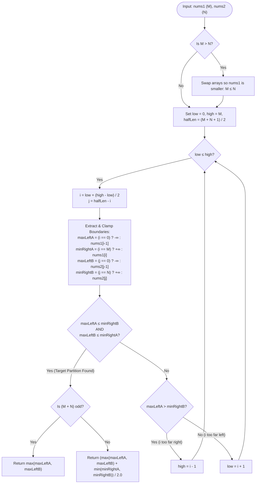
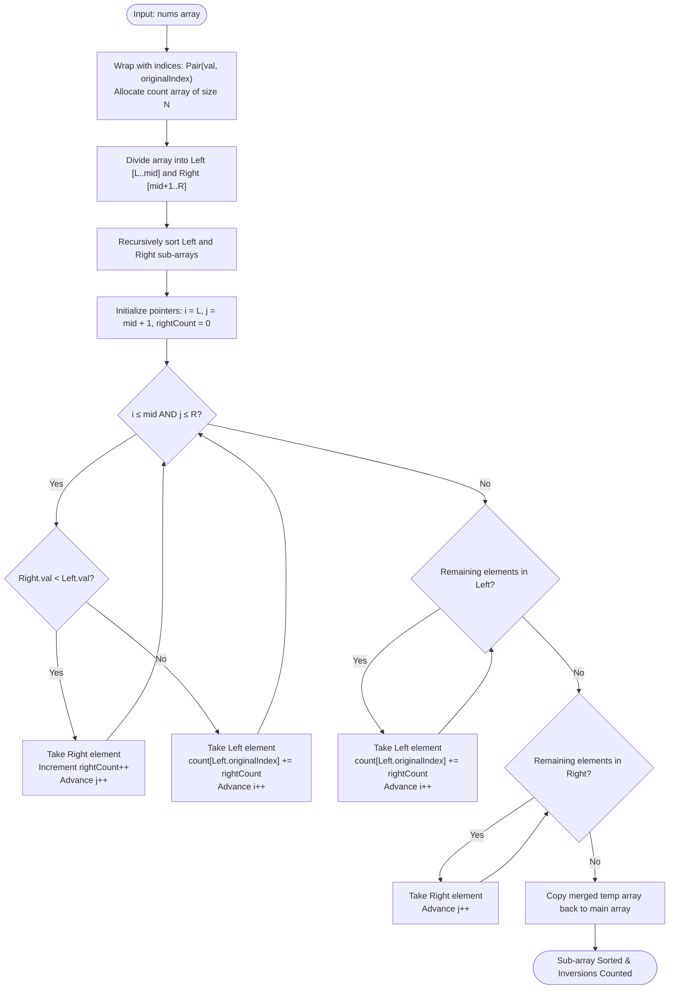

# Module 01: Advanced Array Search, Dual Partitioning & Inversion Dynamics

Mastering hard array problems requires moving beyond single-pointer scans and simple binary search. At the highest level of algorithmic complexity, you must manipulate **dual partition spaces** across multiple collections and exploit **divide-and-conquer inversion invariants** to break $O(N^2)$ barriers down to $O(N \log N)$ or $O(\log(\min(M, N)))$.

---

## Problem 1: Median of Two Sorted Arrays

### 1. Problem Statement & Operational Constraints

Given two sorted integer arrays `nums1` of size $M$ and `nums2` of size $N$, return the **median** of the two sorted arrays. The overall run-time complexity must be strictly **$O(\log(M + N))$** or better ($O(\log(\min(M, N)))$).

- **Constraints**:
  - $M, N \in [0, 1000]$ (with $M + N \ge 1$).
  - $\text{nums1}[i], \text{nums2}[j] \in [-10^6, 10^6]$.
  - Both arrays are already sorted in non-decreasing order.

---

### 2. The Thought Process (How an Expert Approaches It from Scratch)

#### Clues in the Problem Text
- *"Two sorted arrays"* $\implies$ We have ordering guarantees for free.
- *"Overall run time complexity should be $O(\log(M+N))$"* $\implies$ Any algorithm that iterates linearly across all elements ($O(M+N)$) is immediately disqualified. Logarithmic time over sorted data is the universal cryptographic signature of **Binary Search**.
- But binary search on what? We have **two** arrays, not one!

#### The Brute-Force Bottleneck
1. **Naive Merge**: Merge `nums1` and `nums2` into a single array of size $M + N$ using two pointers, then return the middle element. 
   - **Cost**: $O(M + N)$ time, $O(M + N)$ auxiliary space.
2. **Two-Pointer Counter**: Maintain pointers in both arrays, advancing the smaller element until reaching index $\lfloor(M+N)/2\rfloor$.
   - **Cost**: $O(M + N)$ time, $O(1)$ space.
3. **The Exact Redundancy**: Why are we inspecting the first $\frac{M+N}{2}$ elements one by one? We do not care about the sorted order of the elements *inside* the left half. We only care about finding the **dividing line (cut)** between the left half and the right half of the combined universe!

#### The "Aha!" Insight: Binary Search on Partition Space
Instead of searching for a *value*, we search for a **cut position** $i$ in `nums1`. Once we choose a cut $i$ in `nums1`, the corresponding cut $j$ in `nums2` is **mathematically predetermined** to ensure that the total number of elements in the combined left half equals the total number of elements in the combined right half!

```text
╭─────────────────────────────────────────────────────────────────────────────────────────────╮
│                         THE DUAL PARTITION SPACE CONCEPT                                    │
├─────────────────────────────────────────────────────────────────────────────────────────────┤
│ Array A:   A[0], A[1], ..., A[i-1]   │   A[i], A[i+1], ..., A[M-1]                          │
│                                      │                                                      │
│ Array B:   B[0], B[1], ..., B[j-1]   │   B[j], B[j+1], ..., B[N-1]                          │
│            └─────────┬───────────┘   │   └────────────┬──────────┘                          │
│                   Left Half          │             Right Half                               │
│              (Total Elements = K)    │        (Total Elements = K)                          │
╰─────────────────────────────────────────────────────────────────────────────────────────────╯
```

---

### 3. Deep Mathematical & Invariant Proof

#### Invariant 1: Size Parity Invariant
Let $L$ be the combined left partition and $R$ be the combined right partition:
$$L = \{A[0 \dots i-1]\} \cup \{B[0 \dots j-1]\}, \quad R = \{A[i \dots M-1]\} \cup \{B[j \dots N-1]\}$$

For $L$ and $R$ to represent the median split of the combined $(M + N)$ elements:
1. When $M + N$ is **even**: $|L| = |R| = \frac{M + N}{2}$.
2. When $M + N$ is **odd**: We define the median to reside in the left partition, so $|L| = |R| + 1 = \lfloor\frac{M + N + 1}{2}\rfloor$.

Using integer division, both cases are unified by:
$$i + j = \left\lfloor\frac{M + N + 1}{2}\right\rfloor \implies j = \left\lfloor\frac{M + N + 1}{2}\right\rfloor - i$$

#### Invariant 2: Sorted Boundary Containment
For the split to be valid, every element in $L$ must be $\le$ every element in $R$:
$$\max(L) \le \min(R)$$

Since $A$ and $B$ are individually sorted:
- $A[i-1] \le A[i]$ is guaranteed.
- $B[j-1] \le B[j]$ is guaranteed.

Therefore, we only need to enforce the **two cross-boundary conditions**:
$$A[i-1] \le B[j] \quad \land \quad B[j-1] \le A[i]$$

Let:
$$\text{maxLeftA} = A[i-1], \quad \text{minRightA} = A[i]$$
$$\text{maxLeftB} = B[j-1], \quad \text{minRightB} = B[j]$$

- **Condition 1 (Optimal Cut Found)**: $\text{maxLeftA} \le \text{minRightB}$ and $\text{maxLeftB} \le \text{minRightA}$.
  - If $M + N$ is odd: $\text{Median} = \max(\text{maxLeftA}, \text{maxLeftB})$.
  - If $M + N$ is even: $\text{Median} = \frac{\max(\text{maxLeftA}, \text{maxLeftB}) + \min(\text{minRightA}, \text{minRightB})}{2.0}$.
- **Condition 2 (Cut $i$ in $A$ is too far right)**: $\text{maxLeftA} > \text{minRightB}$.
  - $A[i-1]$ is too large to belong in the left half. We must shrink $i$ by moving binary search left: $\text{high} = i - 1$.
- **Condition 3 (Cut $i$ in $A$ is too far left)**: $\text{maxLeftB} > \text{minRightA}$.
  - $B[j-1]$ is too large, meaning $j$ is too far right, which implies $i$ is too far left. We must increase $i$ by moving binary search right: $\text{low} = i + 1$.

#### Invariant 3: Why Binary Search MUST be on the Smaller Array ($M \le N$)
1. **Index Out-of-Bounds Prevention**: 
   If $M > N$, then choosing $i = 0$ yields $j = \lfloor(M + N + 1)/2\rfloor$, which can strictly exceed $N$, causing an `IndexOutOfBoundsException`. When $M \le N$, $0 \le i \le M \implies 0 \le j \le N$ is mathematically guaranteed.
2. **Optimal Logarithmic Complexity**: 
   Binary searching the smaller array guarantees the search space is bounded by $[0, M]$, achieving **$O(\log(\min(M, N)))$** time.

#### Boundary Clamping with Virtual Infinities
What happens when a partition takes 0 elements from an array ($i = 0$ or $j = 0$), or takes all elements ($i = M$ or $j = N$)?
- If $i = 0 \implies \text{maxLeftA} = -\infty$.
- If $i = M \implies \text{minRightA} = +\infty$.
- If $j = 0 \implies \text{maxLeftB} = -\infty$.
- If $j = N \implies \text{minRightB} = +\infty$.

---

### 4. Procedural Mermaid Flowchart ("How to Proceed")



---

### 5. Visual State Transition Diagram

Consider $A = [1, 3, 8, 9, 15]$ ($M=5$) and $B = [7, 11, 18, 19, 21, 25]$ ($N=6$).
Total elements = 11 (Odd). $\text{halfLen} = \lfloor(5 + 6 + 1)/2\rfloor = 6$.

```text
Iter 1: low = 0, high = 5 -> i = 2, j = 6 - 2 = 4
  Array A: [ 1,  3 ]  │  [ 8,  9, 15 ]      maxLeftA = 3,  minRightA = 8
  Array B: [ 7, 11, 18, 19 ] │ [ 21, 25 ]   maxLeftB = 19, minRightB = 21
  Check: maxLeftB (19) > minRightA (8) -> i is too small! Must shift right.
  New search range: low = 3, high = 5.

Iter 2: low = 3, high = 5 -> i = 4, j = 6 - 4 = 2
  Array A: [ 1,  3,  8,  9 ] │ [ 15 ]       maxLeftA = 9,  minRightA = 15
  Array B: [ 7, 11 ]         │ [ 18, 19, 21, 25 ] maxLeftB = 11, minRightB = 18
  Check:
    maxLeftA (9)  <= minRightB (18)  [TRUE]
    maxLeftB (11) <= minRightA (15)  [TRUE]
  PERFECT SPLIT FOUND!
  Combined Left:  {1, 3, 7, 8, 9, 11} (Size 6)
  Combined Right: {15, 18, 19, 21, 25} (Size 5)
  Median (Odd) = max(maxLeftA, maxLeftB) = max(9, 11) = 11.0.
```

---

### 6. Production Implementation (Java 17/21)

```java
package com.dataship.advanced.arrays;

public final class MedianOfTwoSortedArrays {

    private MedianOfTwoSortedArrays() {}

    /**
     * Finds the median of two sorted arrays in O(log(min(M, N))) time and O(1) space.
     *
     * @param nums1 first sorted array
     * @param nums2 second sorted array
     * @return the combined median as a double
     * @throws IllegalArgumentException if both arrays are empty
     */
    public static double findMedianSortedArrays(int[] nums1, int[] nums2) {
        if (nums1 == null || nums2 == null) {
            throw new IllegalArgumentException("Input arrays must not be null.");
        }

        // Enforce nums1 is the smaller array: M <= N
        if (nums1.length > nums2.length) {
            return findMedianSortedArrays(nums2, nums1);
        }

        int m = nums1.length;
        int n = nums2.length;

        if (m + n == 0) {
            throw new IllegalArgumentException("Both input arrays are empty.");
        }

        int low = 0;
        int high = m;
        int halfLen = (m + n + 1) / 2;

        while (low <= high) {
            int cut1 = low + (high - low) / 2;
            int cut2 = halfLen - cut1;

            // Clamping boundary values using integer extrema
            int maxLeft1 = (cut1 == 0) ? Integer.MIN_VALUE : nums1[cut1 - 1];
            int minRight1 = (cut1 == m) ? Integer.MAX_VALUE : nums1[cut1];

            int maxLeft2 = (cut2 == 0) ? Integer.MIN_VALUE : nums2[cut2 - 1];
            int minRight2 = (cut2 == n) ? Integer.MAX_VALUE : nums2[cut2];

            if (maxLeft1 <= minRight2 && maxLeft2 <= minRight1) {
                // Valid partition found
                if (((m + n) & 1) == 1) {
                    // Total length is odd: median is max of left elements
                    return Math.max(maxLeft1, maxLeft2);
                } else {
                    // Total length is even: average of maximum left and minimum right
                    long leftMax = Math.max(maxLeft1, maxLeft2);
                    long rightMin = Math.min(minRight1, minRight2);
                    return (leftMax + rightMin) / 2.0;
                }
            } else if (maxLeft1 > minRight2) {
                // cut1 is too far right; move left
                high = cut1 - 1;
            } else {
                // cut1 is too far left; move right
                low = cut1 + 1;
            }
        }

        throw new IllegalStateException("Input arrays violate sorted invariant.");
    }
}
```

---

### 7. Exhaustive Dry-Run Trace Table & Interview Follow-Up Defense

#### Dry-Run Execution Table (Even Case: `nums1 = [1, 2]`, `nums2 = [3, 4]`)
- $M = 2, N = 2$, Total = 4 (Even). $\text{halfLen} = (2 + 2 + 1) / 2 = 2$.

| Step | `low` | `high` | `cut1` | `cut2` | `maxLeft1` | `minRight1` | `maxLeft2` | `minRight2` | Condition Check | Action |
| :--- | :--- | :--- | :--- | :--- | :--- | :--- | :--- | :--- | :--- | :--- |
| **1** | 0 | 2 | 1 | 1 | `nums1[0]=1` | `nums1[1]=2` | `nums2[0]=3` | `nums2[1]=4` | $1 \le 4$ [T], $3 \le 2$ [F] | `maxLeft2 > minRight1` $\implies \text{low} = 1 + 1 = 2$ |
| **2** | 2 | 2 | 2 | 0 | `nums1[1]=2` | $+\infty$ | $-\infty$ | `nums2[0]=3` | $2 \le 3$ [T], $-\infty \le +\infty$ [T] | **Valid!** Left: $\{1, 2\}$, Right: $\{3, 4\}$ |

- **Result**: $\frac{\max(2, -\infty) + \min(+\infty, 3)}{2.0} = \frac{2 + 3}{2.0} = 2.5$.

#### Complexity Analysis
- **Time Complexity**: $O(\log(\min(M, N)))$. At each step, the search range $[0, M]$ is halved. If $M=0$, runs in $O(1)$ time.
- **Space Complexity**: $O(1)$ strictly auxiliary. No dynamic heap allocations.

#### Interviewer Stress Questions & Defenses
> **Interviewer**: *"How do you generalize this algorithm to find the $K$-th smallest element in two sorted arrays?"*
> **Defense**: "Instead of fixing $\text{halfLen} = \lfloor(M + N + 1)/2\rfloor$, we set our target partition size to $K$. In each step, we compare $A[K/2 - 1]$ with $B[K/2 - 1]$. The smaller of the two elements can never be part of the top $K$ smallest elements, allowing us to safely discard $\lfloor K/2 \rfloor$ elements from that array and recurse with $K \leftarrow K - \lfloor K/2 \rfloor$. This achieves $O(\log K)$ time complexity."

> **Interviewer**: *"What if the arrays are stored across two distributed database servers, and network latency per round-trip is 10ms?"*
> **Defense**: "A sequential two-pointer scan would require up to $\frac{M+N}{2}$ round trips ($\approx 10$ seconds for $N=1000$). Dual partition binary search executes at most $\approx \lceil\log_2 1000\rceil = 10$ round trips, terminating in under 100ms total network latency."

---

## Problem 2: Count of Smaller Numbers After Self

### 1. Problem Statement & Operational Constraints

Given an integer array `nums`, return an integer array `counts` where `counts[i]` is the number of smaller elements to the right of `nums[i]` in the original array.

- **Constraints**:
  - $N \in [1, 10^5]$.
  - $\text{nums}[i] \in [-10^4, 10^4]$.
  - The runtime must be substantially faster than $O(N^2)$ to prevent timeouts on $N = 10^5$.

---

### 2. The Thought Process (How an Expert Approaches It from Scratch)

#### Clues in the Problem Text
- *"To the right of `nums[i]`"* $\implies$ The order of indices matters. This is an **inversion problem**: pairs $(i, j)$ such that $i < j$ and $\text{nums}[i] > \text{nums}[j]$.
- $N = 10^5 \implies N^2 = 10^{10}$ operations, which takes $> 10$ seconds in Java. We must achieve **$O(N \log N)$**.

#### The Brute-Force Bottleneck
- Scanning every element to the right of $i$ recalculates comparisons from scratch without leveraging prior sorting work.
- Sorting the whole array outright destroys original index positions!

#### The "Aha!" Insight: Merge Sort Inversion Tracking
Merge Sort recursively splits the array into a left half and a right half, sorts each, and then merges them:
1. Every element in the left half originally appeared **before** every element in the right half in the original array!
2. When merging two sorted halves: if we place an element from the **right half** into the merged array before an element from the **left half**, that right element is strictly smaller than the left element, and it originated to the right of the left element!
3. By tracking original indices alongside values (`Pair(val, originalIndex)`), we can accumulate the number of smaller right elements directly into an answer array during the merge pass.

---

### 3. Deep Mathematical & Inversion Invariant Proof

Let sub-array $A$ span indices $[L \dots \text{mid}]$ and sub-array $B$ span $[\text{mid}+1 \dots R]$. Both $A$ and $B$ are sorted in ascending order.

```text
╭─────────────────────────────────────────────────────────────────────────────────────────────╮
│                         MERGE SORT INVERSION ACCUMULATION                                   │
├─────────────────────────────────────────────────────────────────────────────────────────────┤
│ Left Sub-array A:   [ (5, idx=0), (8, idx=2) ]       (Originally before B)                  │
│ Right Sub-array B:  [ (2, idx=1), (6, idx=3) ]       (Originally after A)                   │
│                                                                                             │
│ Pointer i in A, Pointer j in B. Maintain: int rightCount = 0;                               │
│                                                                                             │
│ Step 1: B[j].val (2) < A[i].val (5)                                                         │
│         -> Place 2.                                                                         │
│         -> Increment rightCount = 1 (1 element from right is smaller than current A[i]).     │
│                                                                                             │
│ Step 2: A[i].val (5) <= B[j].val (6)                                                        │
│         -> Place 5.                                                                         │
│         -> Crucial Invariant: B is sorted! If 2 was smaller than 5, and 6 is larger,        │
│            exactly `rightCount` elements from the right half were smaller than 5!           │
│         -> counts[A[i].originalIndex] += rightCount (counts[0] += 1).                       │
╰─────────────────────────────────────────────────────────────────────────────────────────────╯
```

#### The Invariant Formulation:
During merge:
$$\forall i \in [L \dots \text{mid}], \quad \text{count}[A[i].\text{idx}] \mathrel{+}= |\{j \in [\text{mid}+1 \dots R] \mid B[j].\text{val} < A[i].\text{val}\}|$$

Because $B$ is sorted, whenever $B[j].\text{val} < A[i].\text{val}$, $B[j]$ is smaller than $A[i]$ AND smaller than all remaining elements $A[i \dots \text{mid}]$. By keeping a running count of right elements processed so far, we update $A[i]$ in $O(1)$ amortized time as it is placed!

---

### 4. Procedural Mermaid Flowchart ("How to Proceed")



---

### 5. Production Implementation (Java 17/21)

```java
package com.dataship.advanced.arrays;

import java.util.ArrayList;
import java.util.List;

public final class CountSmallerAfterSelf {

    private CountSmallerAfterSelf() {}

    private static class Element {
        final int val;
        final int originalIndex;

        Element(int val, int originalIndex) {
            this.val = val;
            this.originalIndex = originalIndex;
        }
    }

    /**
     * Counts the number of smaller elements to the right of each element in O(N log N) time.
     *
     * @param nums input integer array
     * @return list of counts matching original indices
     */
    public static List<Integer> countSmaller(int[] nums) {
        if (nums == null || nums.length == 0) {
            return List.of();
        }

        int n = nums.length;
        int[] counts = new int[n];
        Element[] elements = new Element[n];
        Element[] temp = new Element[n];

        for (int i = 0; i < n; i++) {
            elements[i] = new Element(nums[i], i);
        }

        mergeSortAndCount(elements, 0, n - 1, temp, counts);

        List<Integer> result = new ArrayList<>(n);
        for (int c : counts) {
            result.add(c);
        }
        return result;
    }

    private static void mergeSortAndCount(Element[] arr, int left, int right, 
                                          Element[] temp, int[] counts) {
        if (left >= right) {
            return;
        }

        int mid = left + (right - left) / 2;
        mergeSortAndCount(arr, left, mid, temp, counts);
        mergeSortAndCount(arr, mid + 1, right, temp, counts);

        merge(arr, left, mid, right, temp, counts);
    }

    private static void merge(Element[] arr, int left, int mid, int right, 
                              Element[] temp, int[] counts) {
        int i = left;
        int j = mid + 1;
        int k = left;
        int rightCount = 0;

        while (i <= mid && j <= right) {
            if (arr[j].val < arr[i].val) {
                // Right element is strictly smaller: will count towards all subsequent left elements
                temp[k++] = arr[j++];
                rightCount++;
            } else {
                // Left element is placed: accumulate all smaller right elements placed before it
                counts[arr[i].originalIndex] += rightCount;
                temp[k++] = arr[i++];
            }
        }

        // Drain remaining left elements
        while (i <= mid) {
            counts[arr[i].originalIndex] += rightCount;
            temp[k++] = arr[i++];
        }

        // Drain remaining right elements
        while (j <= right) {
            temp[k++] = arr[j++];
        }

        // Copy back sorted segment
        System.arraycopy(temp, left, arr, left, right - left + 1);
    }
}
```

---

### 6. Comparative Algorithmic Matrix

| Implementation Paradigm | Time Complexity | Auxiliary Space | Strengths | Trade-offs & Bottlenecks |
| :--- | :--- | :--- | :--- | :--- |
| **Merge Sort Inversion** | $O(N \log N)$ | $O(N)$ | Optimal asymptotic bounds; cache-friendly sequential memory passes | Requires auxiliary pair structures or parallel index arrays |
| **Fenwick Tree (BIT)** | $O(N \log U)$ | $O(U)$ | Straightforward prefix sum queries; online streaming compatible | Requires coordinate compression if values are negative or sparse |
| **Segment Tree** | $O(N \log U)$ | $O(U)$ | Supports complex dynamic range updates | Higher pointer memory overhead and branch predictor misses |

---

### 7. Interviewer Stress Questions & Defenses
> **Interviewer**: *"What if the array values range from $-10^9$ to $10^9$? Can we still use a Binary Indexed Tree (Fenwick Tree)?"*
> **Defense**: "Yes, but direct indexing would exceed memory limits ($O(10^9)$ space). We apply **Coordinate Compression**: sort the unique values in the array, map each value to its rank in $[1 \dots K]$ (where $K \le N$), and query the BIT of size $K$. This yields $O(N \log N)$ time and $O(N)$ space."

---

<table width="100%">
  <tr>
    <td width="33%" align="left">
      <a href="./README.md">
        <strong>← Previous Module</strong><br>
        Master Hub & Decision Tree
      </a>
    </td>
    <td width="33%" align="center">
      <a href="../README.md">
        <strong>Home</strong><br>
        Java DSA Master Track
      </a>
    </td>
    <td width="33%" align="right">
      <a href="./02-monotonic-stack-and-geometric-arrays.md">
        <strong>Next Module →</strong><br>
        02. Monotonic Stacks & Geometric Arrays
      </a>
    </td>
  </tr>
</table>
