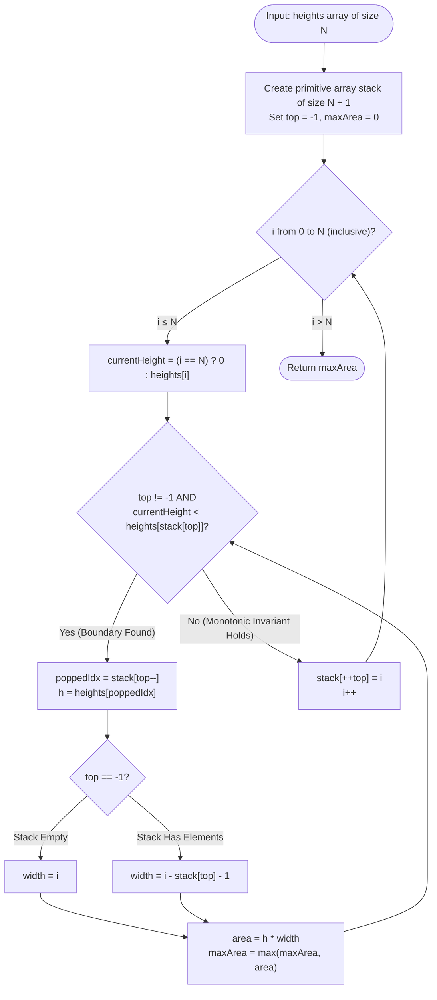
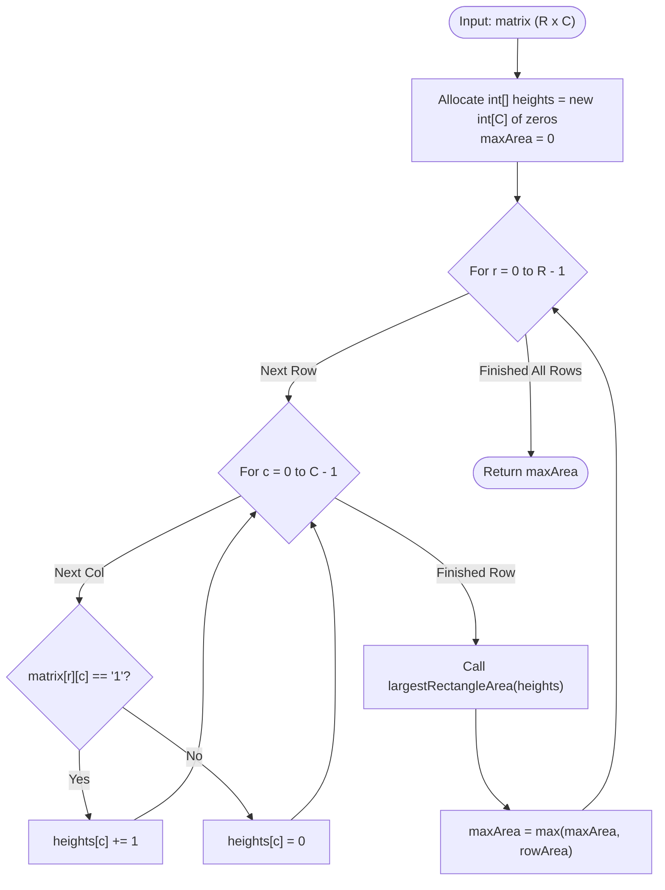

# Module 02: Monotonic Stacks, Geometric Arrays & 2D Reductions

Monotonic stacks are among the most elegant and powerful paradigms in array algorithmics. They transform problems with $O(N^2)$ brute-force comparisons into strictly **linear $O(N)$ amortized** solutions by maintaining ordered invariants over index sequences. This module dissects the mathematical mechanics of monotonic boundary discovery and its reduction to multi-dimensional geometric arrays.

---

## Problem 1: Largest Rectangle in Histogram

### 1. Problem Statement & Operational Constraints

Given an array of integers `heights` representing the histogram's bar height where the width of each bar is $1$, find the area of the largest rectangle in the histogram.

- **Constraints**:
  - $N \in [1, 10^5]$.
  - $\text{heights}[i] \in [0, 10^4]$.
  - Time limit requires an $O(N)$ solution.

---

### 2. The Thought Process (How an Expert Approaches It from Scratch)

#### Clues in the Problem Text
- *"Largest rectangle"* $\implies$ For any bar $i$ to define the height of a rectangle, the rectangle must span continuously to the left and to the right until hitting a bar strictly shorter than $i$.
- $N = 10^5 \implies O(N^2)$ approaches ($10^{10}$ operations) will fail with Time Limit Exceeded (TLE).

#### The Brute-Force Bottleneck
1. **Naive Range Search**: For every pair of indices $(i, j)$, find the minimum height between $i$ and $j$, and compute $\text{area} = \min(\text{heights}[i \dots j]) \times (j - i + 1)$. Cost: $O(N^3)$ or $O(N^2)$.
2. **Expansion from Each Bar**: For every bar $i$, scan left until finding index $L$ such that $\text{heights}[L] < \text{heights}[i]$. Scan right until finding index $R$ such that $\text{heights}[R] < \text{heights}[i]$. The maximum rectangle using bar $i$ as the limiting height is:
   $$\text{Area}(i) = \text{heights}[i] \times (R - L - 1)$$
   - **The Bottleneck**: On ascending arrays (e.g. $[1, 2, 3, 4, \dots, N]$), scanning right for every bar redundantly traverses the remainder of the array, degrading to $O(N^2)$.

#### The "Aha!" Insight: Deferring Evaluation via Monotonic Order
Why re-scan? If we process bars in increasing order of height, we cannot know their right boundary yet. But the moment we encounter a bar that is **shorter** than the preceding bar, the preceding bar's right boundary has **just been definitively established**!

```text
╭─────────────────────────────────────────────────────────────────────────────────────────────╮
│                         THE MONOTONIC BOUNDARY DISCOVERY                                    │
├─────────────────────────────────────────────────────────────────────────────────────────────┤
│ Bars in Stack: [2, 4, 6]  (Increasing heights)                                              │
│                                                                                             │
│ Incoming bar: Height 3 at index i = 3                                                       │
│                                                                                             │
│ 1. Height 3 is SHORTER than bar at top of stack (Height 6 at index 2).                      │
│ 2. Therefore, bar 6 CANNOT extend rightwards past index 2!                                  │
│    -> Right Boundary of bar 6 is index 3.                                                   │
│ 3. What is the Left Boundary of bar 6?                                                      │
│    -> The bar right beneath it on the stack (Height 4 at index 1)!                          │
│    -> Why? Because the stack is strictly increasing, so everything between index 1 and      │
│       index 2 was taller than bar 4 and bar 6!                                              │
│ 4. Pop bar 6, calculate its maximal area: 6 * (3 - 1 - 1) = 6 * 1 = 6.                      │
╰─────────────────────────────────────────────────────────────────────────────────────────────╯
```

---

### 3. Deep Mathematical & Boundary Proof

#### Monotonic Stack Invariant
Let $S$ be a stack storing array indices. At all times:
$$\forall k \in [0, |S|-2], \quad \text{heights}[S[k]] \le \text{heights}[S[k+1]]$$

#### Invariant Proof of Boundaries
When processing index $i$, if $\text{heights}[i] < \text{heights}[S.\text{top}]$:
1. **Right Boundary ($R$)**: The incoming index $i$ is the **first bar to the right** of $S.\text{top}$ with $\text{heights}[i] < \text{heights}[S.\text{top}]$. Thus, the rectangle for $S.\text{top}$ cannot extend to or past $i$. The rightmost included bar is $i - 1$.
2. **Left Boundary ($L$)**: Pop $p = S.\text{pop}()$. The new top of the stack, $S.\text{top}$, was the **last bar placed before $p$ that was shorter than or equal to $p$**. Due to the monotonic invariant, every bar between $S.\text{top}$ and $p$ was already popped because it was taller than $p$. Thus, the leftmost included bar is $S.\text{top} + 1$.
3. **Width Derivation**:
   $$\text{Width} = (\text{Rightmost Included}) - (\text{Leftmost Included}) + 1 = (i - 1) - (S.\text{top} + 1) + 1 = i - S.\text{top} - 1$$
   - **Special Case (Stack is Empty)**: If the stack becomes empty after popping $p$, it implies no bar to the left of $p$ was shorter than $\text{heights}[p]$. The rectangle spans all the way from index $0$ to index $i - 1$:
     $$\text{Width} = i$$

#### Proof of $O(N)$ Amortized Time Complexity
- Each index $i \in [0, N-1]$ is pushed onto the stack **exactly once**.
- Each index is popped from the stack **at most once**.
- Pushing and popping take $O(1)$ constant time.
- Total operations across the entire array: at most $2N \implies \mathbf{O(N)}$ amortized time.

#### The Sentinel Flush Trick
To avoid writing duplicate popping logic after the loop ends, we append a **virtual sentinel bar of height 0 at index $N$**. Because every valid bar has height $\ge 0$, height $0$ is guaranteed to be strictly less than or equal to any remaining bar in the stack, triggering an automatic flush of all elements.

---

### 4. Procedural Mermaid State Machine ("How to Proceed")



---

### 5. Visual State Transition Diagram

Consider `heights = [2, 1, 5, 6, 2, 3]`. Sentinel bar 0 added at index 6.

```text
i = 0, h = 2: Stack empty -> Push 0. Stack: [0 (h=2)]
i = 1, h = 1: 1 < 2 -> POP 0 (h=2). Stack empty -> Width = 1. Area = 2 * 1 = 2.
              Push 1. Stack: [1 (h=1)]
i = 2, h = 5: 5 > 1 -> Push 2. Stack: [1 (h=1), 2 (h=5)]
i = 3, h = 6: 6 > 5 -> Push 3. Stack: [1 (h=1), 2 (h=5), 3 (h=6)]
i = 4, h = 2: 2 < 6 -> POP 3 (h=6).
              New top = 2. Width = 4 - 2 - 1 = 1. Area = 6 * 1 = 6.
              2 < 5 -> POP 2 (h=5).
              New top = 1. Width = 4 - 1 - 1 = 2. Area = 5 * 2 = 10.
              2 > 1 -> Push 4. Stack: [1 (h=1), 4 (h=2)]
i = 5, h = 3: 3 > 2 -> Push 5. Stack: [1 (h=1), 4 (h=2), 5 (h=3)]
i = 6, h = 0: (Sentinel)
              0 < 3 -> POP 5 (h=3). Top = 4. Width = 6 - 4 - 1 = 1. Area = 3 * 1 = 3.
              0 < 2 -> POP 4 (h=2). Top = 1. Width = 6 - 1 - 1 = 4. Area = 2 * 4 = 8.
              0 < 1 -> POP 1 (h=1). Empty! Width = 6. Area = 1 * 6 = 6.
Max Area = 10.
```

---

### 6. Production Implementation (Java 17/21)

> [!TIP]
> **Micro-Architectural Optimization**: Instead of allocating `java.util.ArrayDeque<Integer>` (which boxes `int` into `Integer` heap objects, thrashing the garbage collector), we allocate a single primitive `int[] stack`. This maximizes L1 cache line residency.

```java
package com.dataship.advanced.arrays;

public final class LargestRectangleInHistogram {

    private LargestRectangleInHistogram() {}

    /**
     * Calculates the largest rectangular area in a histogram in strictly O(N) time and space.
     *
     * @param heights non-negative bar heights
     * @return maximum rectangle area
     */
    public static int largestRectangleArea(int[] heights) {
        if (heights == null || heights.length == 0) {
            return 0;
        }

        int n = heights.length;
        // Primitive stack allocated once: zero boxing, optimal cache line utilization
        int[] stack = new int[n + 1];
        int top = -1;
        int maxArea = 0;

        // Iterate up to n to process the virtual height-0 sentinel
        for (int i = 0; i <= n; i++) {
            int currentHeight = (i == n) ? 0 : heights[i];

            while (top != -1 && currentHeight < heights[stack[top]]) {
                int poppedIndex = stack[top--];
                int h = heights[poppedIndex];

                // If stack is empty, popped bar was the shortest encountered so far
                int width = (top == -1) ? i : (i - stack[top] - 1);
                int area = h * width;

                if (area > maxArea) {
                    maxArea = area;
                }
            }

            stack[++top] = i;
        }

        return maxArea;
    }
}
```

---

### 7. Dry-Run Trace Table & Interview Follow-Up Defense

#### Dry-Run Execution Table for `heights = [2, 1, 5, 6, 2, 3]`

| `i` | `currentHeight` | Action | Popped Bar | `h` | Top of Stack | `width` | Computed `area` | `maxArea` | Stack State |
| :--- | :--- | :--- | :--- | :--- | :--- | :--- | :--- | :--- | :--- |
| **0** | 2 | Push 0 | — | — | — | — | — | 0 | `[0]` |
| **1** | 1 | Pop 0, Push 1 | 0 | 2 | Empty | 1 | $2 \times 1 = 2$ | 2 | `[1]` |
| **2** | 5 | Push 2 | — | — | — | — | — | 2 | `[1, 2]` |
| **3** | 6 | Push 3 | — | — | — | — | — | 2 | `[1, 2, 3]` |
| **4** | 2 | Pop 3 | 3 | 6 | 2 | $4 - 2 - 1 = 1$ | $6 \times 1 = 6$ | 6 | `[1, 2]` |
| **4** | 2 | Pop 2, Push 4 | 2 | 5 | 1 | $4 - 1 - 1 = 2$ | $5 \times 2 = 10$ | **10** | `[1, 4]` |
| **5** | 3 | Push 5 | — | — | — | — | — | 10 | `[1, 4, 5]` |
| **6** | 0 | Sentinel Pop 5 | 5 | 3 | 4 | $6 - 4 - 1 = 1$ | $3 \times 1 = 3$ | 10 | `[1, 4]` |
| **6** | 0 | Sentinel Pop 4 | 4 | 2 | 1 | $6 - 1 - 1 = 4$ | $2 \times 4 = 8$ | 10 | `[1]` |
| **6** | 0 | Sentinel Pop 1 | 1 | 1 | Empty | 6 | $1 \times 6 = 6$ | 10 | `[]` |

---

## Problem 2: Maximal Rectangle in 2D Binary Matrix

### 1. Problem Statement & Operational Constraints

Given a `rows x cols` binary `matrix` filled with `'0'`s and `'1'`s, find the largest rectangle containing only `'1'`s and return its area.

- **Constraints**:
  - $\text{rows}, \text{cols} \in [1, 200]$.
  - $\text{matrix}[r][c] \in \{'0', '1'\}$.

---

### 2. The Thought Process: Dynamic 2D-to-1D Reduction

#### The Brute-Force Bottleneck
A brute-force rectangle check enumerates all submatrices:
- Choose top-left $(r_1, c_1)$ and bottom-right $(r_2, c_2) \implies O(R^2 C^2)$ submatrices.
- Verifying whether all elements are `'1'` takes $O(R \cdot C) \implies$ Total Time: $O(R^3 C^3) \approx (200)^6 \approx 6.4 \times 10^{13}$ operations (impossible).

#### The "Aha!" Insight: Dynamic Histogram Projection
Observe each row $r$ as the **ground level (base)** of a histogram!
- For any column $c$, how high does the continuous pillar of `'1'`s reach upwards from row $r$?
- If $\text{matrix}[r][c] == '1'$, the height is $H[r-1][c] + 1$.
- If $\text{matrix}[r][c] == '0'$, the pillar is broken: height resets immediately to $0$!

```text
╭─────────────────────────────────────────────────────────────────────────────────────────────╮
│                         2D MATRIX TO HISTOGRAM PROJECTION                                   │
├─────────────────────────────────────────────────────────────────────────────────────────────┤
│ Matrix:                                 Histogram Heights per Row:                          │
│ Row 0: [ 1, 0, 1, 0, 0 ]                Row 0 Heights: [ 1, 0, 1, 0, 0 ] -> Max Area = 1    │
│ Row 1: [ 1, 0, 1, 1, 1 ]                Row 1 Heights: [ 2, 0, 2, 1, 1 ] -> Max Area = 3    │
│ Row 2: [ 1, 1, 1, 1, 1 ]                Row 2 Heights: [ 3, 1, 3, 2, 2 ] -> Max Area = 6    │
│ Row 3: [ 1, 0, 0, 1, 0 ]                Row 3 Heights: [ 4, 0, 0, 3, 0 ] -> Max Area = 4    │
╰─────────────────────────────────────────────────────────────────────────────────────────────╯
```

By projecting each row as a histogram, we reduce the 2D problem to executing **$R$ runs of Problem 1 (Largest Rectangle in Histogram)**, each taking $O(C)$ time!

---

### 3. Procedural Mermaid Workflow ("How to Proceed")



---

### 4. Production Implementation (Java 17/21)

```java
package com.dataship.advanced.arrays;

public final class MaximalRectangle {

    private MaximalRectangle() {}

    /**
     * Finds the largest rectangle containing only '1's in O(R * C) time and O(C) space.
     *
     * @param matrix 2D binary character array
     * @return maximum rectangle area
     */
    public static int maximalRectangle(char[][] matrix) {
        if (matrix == null || matrix.length == 0 || matrix[0].length == 0) {
            return 0;
        }

        int rows = matrix.length;
        int cols = matrix[0].length;
        int[] heights = new int[cols];
        int maxArea = 0;

        for (int r = 0; r < rows; r++) {
            // Update histogram column heights for current row
            for (int c = 0; c < cols; c++) {
                if (matrix[r][c] == '1') {
                    heights[c]++;
                } else {
                    heights[c] = 0; // Continuous pillar is broken
                }
            }

            // Run O(C) monotonic stack algorithm on the current histogram layer
            int layerArea = LargestRectangleInHistogram.largestRectangleArea(heights);
            if (layerArea > maxArea) {
                maxArea = layerArea;
            }
        }

        return maxArea;
    }
}
```

---

### 5. Interviewer Stress Questions & Defenses
> **Interviewer**: *"Can we solve Maximal Rectangle in $O(R \cdot C)$ time WITHOUT calling the histogram subroutine at each row?"*
> **Defense**: "Yes, using **Direct Dynamic Programming with 3 Arrays**: maintain `left[c]`, `right[c]`, and `height[c]`. For each cell `(r, c)`, `left[c]` records the leftmost column index of continuous 1s bounding the current height, and `right[c]` records the rightmost column index. Updating these arrays left-to-right and right-to-left takes $O(C)$ time per row, computing the area as $(right[c] - left[c]) \times height[c]$. Both algorithms achieve identical $O(R \cdot C)$ time and $O(C)$ space."

---

<table width="100%">
  <tr>
    <td width="33%" align="left">
      <a href="./01-advanced-array-search-and-partitioning.md">
        <strong>← Previous Module</strong><br>
        01. Dual Partition Search & Inversions
      </a>
    </td>
    <td width="33%" align="center">
      <a href="../README.md">
        <strong>Home</strong><br>
        Java DSA Master Track
      </a>
    </td>
    <td width="33%" align="right">
      <a href="./03-advanced-sliding-window-and-frequency-math.md">
        <strong>Next Module →</strong><br>
        03. Advanced Sliding Window & Frequency Math
      </a>
    </td>
  </tr>
</table>
