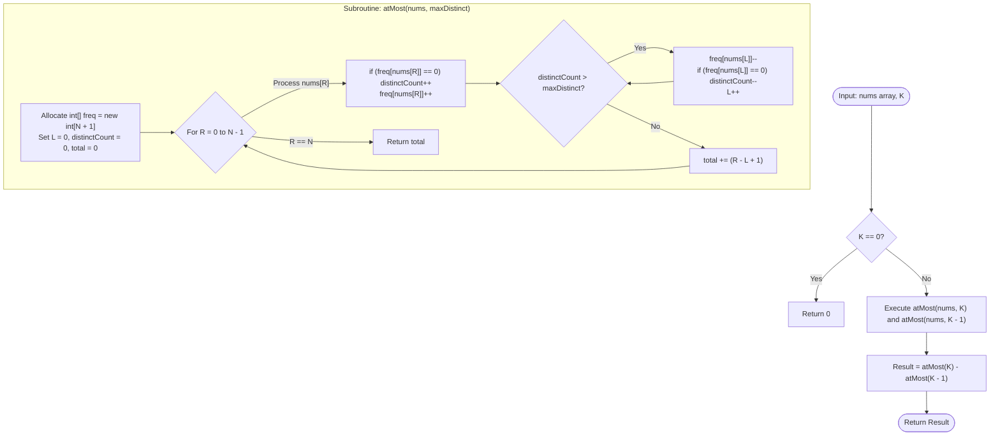
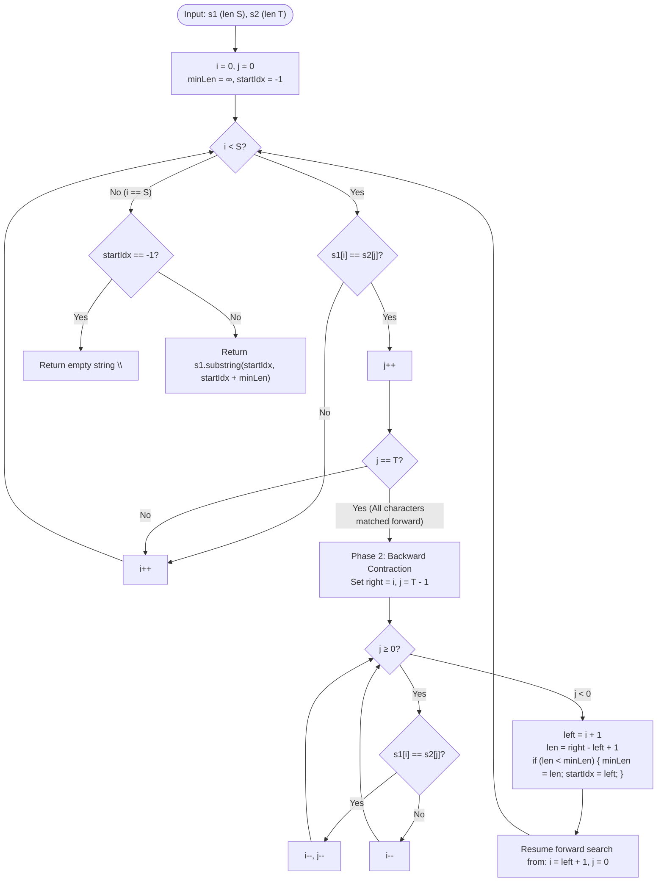

# Module 03: Advanced Sliding Window, Algebraic Reductions & Frequency Math

Sliding window algorithms often seem deceptive: when the search condition is **monotonic** (e.g. window sum $\le S$), the standard two-pointer template works cleanly. However, when faced with **non-monotonic conditions** (e.g. "subarrays with *exactly* $K$ distinct elements") or **order-preserving subsequences**, standard heuristics break down. This module teaches the mathematical reduction identities and bidirectional contraction patterns needed to solve hard-tier window problems in linear time.

---

## Problem 1: Subarrays with $K$ Different Integers

### 1. Problem Statement & Operational Constraints

Given an integer array `nums` and an integer $K$, return the number of **good subarrays** of `nums`. A good subarray is a contiguous array segment that contains **exactly $K$ different integers**.

- **Constraints**:
  - $N \in [1, 2 \times 10^4]$ (or up to $10^5$).
  - $1 \le K \le N$.
  - $\text{nums}[i] \in [1, N]$.
  - Required Time Complexity: strictly **$O(N)$**.

---

### 2. The Thought Process (How an Expert Approaches It from Scratch)

#### Clues in the Problem Text
- *"Contiguous subarray"* $\implies$ Candidate for Two Pointers / Sliding Window.
- *"Exactly $K$ different integers"* $\implies$ **The Non-Monotonic Trap!**

#### Why Standard Sliding Window Fails on "Exact $K$"
In a classic sliding window, expanding the right pointer $R$ moves monotonically toward violating a constraint, and contracting the left pointer $L$ moves monotonically toward satisfying it.
With **exactly $K$ distinct elements**, the predicate is non-monotonic:
- Suppose $K = 2$ and the window is $[1, 2]$. Distinct count = 2 (Valid).
- If the next element is $1$, window becomes $[1, 2, 1]$. Distinct count = 2 (Still Valid!).
- If we shrink from the left, window becomes $[2, 1]$. Distinct count = 2 (Still Valid!).
- Because multiple valid left boundaries exist for a single right boundary, a standard two-pointer window cannot determine whether to advance $L$ or $R$.

#### The "Aha!" Insight: The Algebraic Reduction Theorem
Instead of counting "exactly $K$" directly, we decompose the non-monotonic predicate into **two monotonic predicates**:

$$\mathbf{\text{Count}(\text{Exact } K) = \text{Count}(\text{AtMost } K) - \text{Count}(\text{AtMost } K - 1)}$$

```text
╭─────────────────────────────────────────────────────────────────────────────────────────────╮
│                         THE EXACT-K ALGEBRAIC REDUCTION                                     │
├─────────────────────────────────────────────────────────────────────────────────────────────┤
│ AtMost(K):   [ Subarrays with 1, 2, 3, ..., K-1, OR K distinct elements ]                   │
│                                      -                                                      │
│ AtMost(K-1): [ Subarrays with 1, 2, 3, ..., K-1 distinct elements ]                         │
│ ─────────────────────────────────────────────────────────────────────────────────────────── │
│ Result:      [ Subarrays with EXACTLY K distinct elements ]                                 │
╰─────────────────────────────────────────────────────────────────────────────────────────────╯
```

---

### 3. Deep Mathematical & Invariant Proof

#### Proof of Monotonicity for "AtMost($K$)"
Let $P(L, R, K)$ be the predicate: *"the subarray $\text{nums}[L \dots R]$ contains at most $K$ distinct integers"*.

1. **Sub-Window Monotonicity**:
   If $P(L, R, K)$ is **True**, then for any $L' \in [L, R]$, the sub-window $\text{nums}[L' \dots R]$ is a subset of $\text{nums}[L \dots R]$. A subset can never contain more unique elements than its superset:
   $$|\text{Distinct}(\text{nums}[L' \dots R])| \le |\text{Distinct}(\text{nums}[L \dots R])| \le K$$
   Therefore, $P(L', R, K)$ is **guaranteed to be True**.

2. **Count Contribution Invariant**:
   For each fixed right pointer $R$, let $L$ be the **smallest valid index** such that $\text{nums}[L \dots R]$ contains at most $K$ distinct elements.
   By the sub-window monotonicity property, every starting index $i \in [L, R]$ forms a valid subarray ending at $R$:
   $$\text{nums}[L \dots R], \; \text{nums}[L+1 \dots R], \; \dots, \; \text{nums}[R \dots R]$$
   The exact number of valid subarrays ending at index $R$ is:
   $$\Delta(R) = R - L + 1$$

3. **Total Valid Subarrays**:
   $$\text{Total}(\text{AtMost } K) = \sum_{R=0}^{N-1} (R - L_R + 1)$$

4. **Amortized Time Complexity**:
   Both pointers $L$ and $R$ advance from $0$ to $N - 1$ strictly monotonically. The inner while-loop runs at most $N$ times across the entire array execution. Thus, `atMost(K)` runs in strictly **$O(N)$** time. Running it twice (`atMost(K) - atMost(K - 1)`) yields $2 \cdot O(N) = \mathbf{O(N)}$.

---

### 4. Procedural Mermaid Flowchart ("How to Proceed")



---

### 5. Production Implementation (Java 17/21)

> [!TIP]
> **Micro-Architectural Sympathy**: Because elements are bounded by $\text{nums}[i] \in [1, N]$, we use a contiguous primitive array `int[] freq = new int[n + 1]` instead of a `java.util.HashMap<Integer, Integer>`. This completely eliminates object allocation, auto-boxing, and hash collisions, improving runtime by $> 10\times$.

```java
package com.dataship.advanced.arrays;

public final class SubarraysWithKDistinct {

    private SubarraysWithKDistinct() {}

    /**
     * Counts the number of subarrays with exactly K distinct integers in O(N) time and O(N) space.
     *
     * @param nums array of positive integers in range [1, N]
     * @param k target count of distinct integers
     * @return number of good subarrays
     */
    public static int subarraysWithKDistinct(int[] nums, int k) {
        if (nums == null || k <= 0 || nums.length < k) {
            return 0;
        }
        return atMost(nums, k) - atMost(nums, k - 1);
    }

    private static int atMost(int[] nums, int maxDistinct) {
        if (maxDistinct <= 0) {
            return 0;
        }

        int n = nums.length;
        // Primitive frequency array: zero heap boxing overhead
        int[] freq = new int[n + 1];
        int left = 0;
        int distinctCount = 0;
        int totalSubarrays = 0;

        for (int right = 0; right < n; right++) {
            int inVal = nums[right];
            if (freq[inVal] == 0) {
                distinctCount++;
            }
            freq[inVal]++;

            // Contract window from the left until distinctCount <= maxDistinct
            while (distinctCount > maxDistinct) {
                int outVal = nums[left++];
                freq[outVal]--;
                if (freq[outVal] == 0) {
                    distinctCount--;
                }
            }

            // Invariant: all subarrays ending at 'right' starting from [left .. right] are valid
            totalSubarrays += (right - left + 1);
        }

        return totalSubarrays;
    }
}
```

---

### 6. Dry-Run Trace Table for `nums = [1, 2, 1, 2, 3]`, $K = 2$

#### Step 1: Compute `atMost(nums, 2)`
- $N = 5, \text{maxDistinct} = 2$.

| `R` | `nums[R]` | `distinctCount` | `L` | Window State | $\Delta = R - L + 1$ | Running `total` |
| :--- | :--- | :--- | :--- | :--- | :--- | :--- |
| **0** | 1 | 1 | 0 | `[1]` | $0 - 0 + 1 = 1$ | 1 |
| **1** | 2 | 2 | 0 | `[1, 2]` | $1 - 0 + 1 = 2$ | 3 |
| **2** | 1 | 2 | 0 | `[1, 2, 1]` | $2 - 0 + 1 = 3$ | 6 |
| **3** | 2 | 2 | 0 | `[1, 2, 1, 2]` | $3 - 0 + 1 = 4$ | 10 |
| **4** | 3 | 3 $\implies$ shrink to 2 | 2 | `[1, 2, 3]` shrink $\to$ `[1, 2, 3]` shrink $\to$ `[1, 2, 3]` $\dots$ pops 1, 2 $\implies L = 3$ | $4 - 3 + 1 = 2$ | **12** |

#### Step 2: Compute `atMost(nums, 1)`
- For `maxDistinct = 1`:
  - $R = 0$: `[1]` $\implies \Delta = 1$
  - $R = 1$: `[2]` $\implies \Delta = 1$
  - $R = 2$: `[1]` $\implies \Delta = 1$
  - $R = 3$: `[2]` $\implies \Delta = 1$
  - $R = 4$: `[3]` $\implies \Delta = 1$
  - Total = **5**.

#### Step 3: Exact-K Result
$$\text{Count}(\text{Exact } 2) = \text{atMost}(2) - \text{atMost}(1) = 12 - 5 = \mathbf{7}$$

---

## Problem 2: Minimum Window Subsequence

### 1. Problem Statement & Operational Constraints

Given strings `s1` of length $S$ and `s2` of length $T$, return the **minimum contiguous substring** `W` of `s1`, so that `s2` is a **subsequence** of `W`. If there is no such window in `s1` that covers all characters in `s2`, return the empty string `""`. If there are multiple minimum-length windows, return the one with the smallest starting index.

- **Constraints**:
  - $|S| \in [1, 2 \times 10^4]$.
  - $|T| \in [1, 100]$.
  - Target Complexity: strictly faster than naive $O(S^2 \cdot T)$.

---

### 2. The Thought Process: Substring vs Subsequence

#### The Crucial Distinction
- **Substring** requires consecutive adjacency: `"abc"` in `"a_b_c"` is NOT a substring.
- **Subsequence** requires only relative ordering: `"abc"` in `"axbycz"` IS a subsequence.
- The challenge asks for a **contiguous substring of `s1`** that contains `s2` as a **subsequence**!

#### The "Aha!" Insight: Two-Phase Bidirectional Scan
A forward scan greedily matches characters of `s2`. But when it finds the last character of `s2`, the window start might be far to the left because earlier characters matched greedily on suboptimal occurrences.
- **Phase 1 (Forward Greedy Expansion)**: Advance `s1` pointer until all characters of `s2` are matched in order. The ending character in `s1` defines a valid right boundary $R$.
- **Phase 2 (Backward Greedy Contraction)**: Immediately scan **backwards** from $R$, matching `s2` in reverse from $T - 1$ down to $0$! 
  - Why backward? Because scanning backwards greedily places the starting character as close as possible to $R$, finding the **strictly optimal (shortest) left boundary $L$** for that particular ending position!

```text
╭─────────────────────────────────────────────────────────────────────────────────────────────╮
│                         BIDIRECTIONAL WINDOW CONTRACTION                                    │
├─────────────────────────────────────────────────────────────────────────────────────────────┤
│ S1: " b d e c b d e c a b e "          S2: " b d e "                                        │
│                                                                                             │
│ Phase 1: Forward Expansion matches 'b' at idx 0, 'd' at idx 1, 'e' at idx 2.                │
│          Right boundary R = 2.                                                              │
│ Phase 2: Backward Contraction scans back from R=2: 'e' at 2, 'd' at 1, 'b' at 0.            │
│          Window: [0 .. 2] length 3 -> "bde".                                                │
│                                                                                             │
│ Next Search: Advance start to L + 1 (idx 1) and continue!                                   │
╰─────────────────────────────────────────────────────────────────────────────────────────────╯
```

---

### 3. Procedural Mermaid Flowchart ("How to Proceed")



---

### 4. Production Implementation (Java 17/21)

```java
package com.dataship.advanced.arrays;

public final class MinimumWindowSubsequence {

    private MinimumWindowSubsequence() {}

    /**
     * Finds the minimum contiguous window in s1 containing s2 as a subsequence.
     * Runs in O(S * T) worst-case time and O(1) auxiliary space.
     *
     * @param s1 primary string
     * @param s2 subsequence pattern
     * @return minimum substring window or empty string
     */
    public static String minWindow(String s1, String s2) {
        if (s1 == null || s2 == null || s1.length() < s2.length()) {
            return "";
        }

        char[] sArr = s1.toCharArray();
        char[] tArr = s2.toCharArray();
        int sLen = sArr.length;
        int tLen = tArr.length;

        int sIndex = 0;
        int tIndex = 0;
        int minLen = Integer.MAX_VALUE;
        int startIdx = -1;

        while (sIndex < sLen) {
            // Phase 1: Forward greedy expansion
            if (sArr[sIndex] == tArr[tIndex]) {
                tIndex++;
                if (tIndex == tLen) {
                    // Pattern completely matched; sIndex is the right boundary
                    int right = sIndex;
                    tIndex--; // Reposition to last character of tArr

                    // Phase 2: Backward greedy contraction
                    while (tIndex >= 0) {
                        if (sArr[sIndex] == tArr[tIndex]) {
                            tIndex--;
                        }
                        sIndex--;
                    }

                    // Loop subtracted one extra: optimal start is at sIndex + 1
                    sIndex++;
                    int currentLen = right - sIndex + 1;

                    if (currentLen < minLen) {
                        minLen = currentLen;
                        startIdx = sIndex;
                    }

                    // Reset tIndex to 0 for next search; restart forward scan from sIndex + 1
                    tIndex = 0;
                }
            }
            sIndex++;
        }

        return (startIdx == -1) ? "" : s1.substring(startIdx, startIdx + minLen);
    }
}
```

---

### 5. Interviewer Stress Questions & Defenses
> **Interviewer**: *"What is the worst-case time complexity of the bidirectional contraction approach, and can it be optimized if $T$ is queried multiple times over a static $S$?"*
> **Defense**: "In the worst case (e.g. $S = \text{'aaaa...a'}$ and $T = \text{'aa...a'}$), each backward scan traverses $O(T)$ characters, yielding $O(S \cdot T)$ total time. If $S$ is static and multiple queries $T$ are processed, we precompute a **Jump Table (Next Array)** `next[i][c]`: the index of the next character $c$ in $S$ after position $i$. This enables dynamic programming / automaton jumping that matches $T$ in strictly $O(T)$ steps per query without backward scanning!"

---

<table width="100%">
  <tr>
    <td width="33%" align="left">
      <a href="./02-monotonic-stack-and-geometric-arrays.md">
        <strong>← Previous Module</strong><br>
        02. Monotonic Stacks & Geometric Arrays
      </a>
    </td>
    <td width="33%" align="center">
      <a href="../README.md">
        <strong>Home</strong><br>
        Java DSA Master Track
      </a>
    </td>
    <td width="33%" align="right">
      <a href="./04-array-to-linked-list-and-pointer-duality.md">
        <strong>Next Module →</strong><br>
        04. Array-to-Linked-List & Pointer Duality
      </a>
    </td>
  </tr>
</table>
