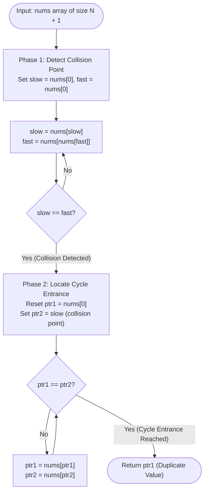
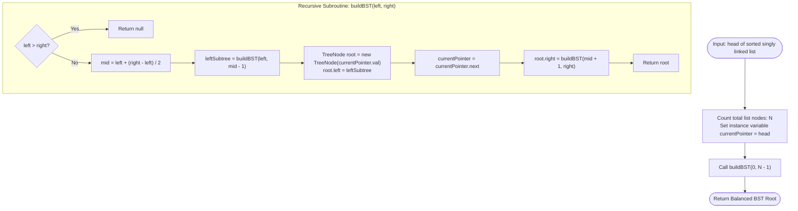

# Module 04: Array-to-Linked-List Duality & Pointer Graphs

Data structures are often taught as isolated silos: arrays are flat, indexable contiguous blocks; linked lists are scattered node graphs connected by references. However, the most profound algorithmic breakthroughs occur at the intersection of these two paradigms: **treating arrays as discrete functional graphs** and **synthesizing pointer structures via synchronized array-like strides**. This module explores this deep duality.

---

## Problem 1: Find the Duplicate Number

### 1. Problem Statement & Operational Constraints

Given an array of integers `nums` containing $N + 1$ integers where each integer is in the range $[1, N]$ inclusive. There is **only one repeated number** in `nums`, return this repeated number.

- **Non-Negotiable Constraints**:
  - You must solve the problem **without modifying the array** (the array is strictly read-only).
  - You must use only **constant $O(1)$ auxiliary space**.
  - The runtime complexity must be less than $O(N^2)$ (strictly **$O(N)$**).

---

### 2. The Thought Process (How an Expert Approaches It from Scratch)

#### Evaluating Disqualified Approaches Against Constraints
1. **Hash Set / Boolean Array**: Checking duplicates takes $O(N)$ time, but consumes $O(N)$ auxiliary space $\implies$ **Violates $O(1)$ space**.
2. **In-Place Sorting (`Arrays.sort`)**: Takes $O(N \log N)$ time, but mutates array elements $\implies$ **Violates read-only constraint**.
3. **In-Place Sign Negation (`nums[abs(x)] = -nums[abs(x)]`)**: Takes $O(N)$ time and $O(1)$ space, but mutates array memory $\implies$ **Violates read-only constraint**.
4. **Binary Search on Value Range $[1 \dots N]$**: Counts numbers $\le \text{mid}$. Takes $O(N \log N)$ time and $O(1)$ space $\implies$ Meets constraints, but is slower than $O(N)$.

#### The "Aha!" Insight: Array as a Functional Directed Graph
Observe the constraints carefully:
- Array length is $N + 1$, with indices $0, 1, 2, \dots, N$.
- Every element value is in range $[1, N]$.
- This means every value in `nums` is a **valid index** within the array!

We can construct a directed graph where an edge exists from index $i$ to index $\text{nums}[i]$:
$$i \longrightarrow \text{nums}[i]$$

```text
╭─────────────────────────────────────────────────────────────────────────────────────────────╮
│                         THE ARRAY-AS-GRAPH FUNCTIONAL MAPPING                               │
├─────────────────────────────────────────────────────────────────────────────────────────────┤
│ Index (Node):  0     1     2     3     4                                                    │
│ Value (Next):  1     3     4     2     2                                                    │
│                                                                                             │
│ Directed Graph:                                                                             │
│   Node 0 ──> Node 1 ──> Node 3 ──> Node 2 <── Node 4                                        │
│                                     │    ▲                                                  │
│                                     └──┬─┘                                                  │
│                                      Cycle!                                                 │
╰─────────────────────────────────────────────────────────────────────────────────────────────╯
```

1. **Why is index 0 never inside a cycle?** 
   Because all values are in $[1, N]$. No element in the array can ever hold the value `0`. Therefore, **node 0 has an in-degree of 0**! It serves as an immutable entry point (the head of the linked list).
2. **Why must there be a cycle?** 
   By Dirichlet's Pigeonhole Principle, $N+1$ elements mapped to values in $[1, N]$ means at least one value $D$ appears $\ge 2$ times.
3. **What is the cycle entrance?**
   If value $D$ appears multiple times, multiple distinct nodes point directly to node $D$! An **in-degree $\ge 2$** in a functional directed graph defines the **entrance to a cycle**.
4. **The Duality**:
   Finding the duplicate number in the array is mathematically identical to finding the **entry node of a cycle in a singly linked list** using Floyd's Tortoise and Hare algorithm!

---

### 3. Deep Mathematical Proof of Floyd's Cycle Entry Point

Let the path from the starting index `0` to the cycle entrance have length $F$.
Let the perimeter (number of nodes) of the cycle be $C$.
Let Slow and Fast pointers start at index `0`. When they collide inside the cycle, let their distance from the cycle entrance be $a$.

```text
╭─────────────────────────────────────────────────────────────────────────────────────────────╮
│                         FLOYD'S ALGEBRAIC CYCLE PROOF                                       │
├─────────────────────────────────────────────────────────────────────────────────────────────┤
│ Node 0 ─── (Length F) ───> [Cycle Entrance] ─── (Length a) ───> [Collision Point]           │
│                                  ▲                                    │                     │
│                                  └────────── (Length C - a) ──────────┘                     │
╰─────────────────────────────────────────────────────────────────────────────────────────────╯
```

1. **Distance Traversed**:
   - Slow moves 1 step at a time:
     $$d_{\text{slow}} = F + a$$
   - Fast moves 2 steps at a time: Fast has completed $n$ loops ($n \ge 1$) inside the cycle before colliding:
     $$d_{\text{fast}} = F + nC + a$$

2. **Speed Relationship**:
   Since Fast moves exactly twice as fast as Slow:
   $$2 \cdot d_{\text{slow}} = d_{\text{fast}}$$
   $$2(F + a) = F + nC + a$$
   $$2F + 2a = F + nC + a$$
   $$F + a = nC$$
   $$\mathbf{F = nC - a = (n - 1)C + (C - a)}$$

3. **The Invariant Deduction**:
   - $F$ is the distance from the start node `0` to the cycle entrance.
   - $(C - a)$ is the distance from the collision point to the cycle entrance!
   - The equation $F = (n - 1)C + (C - a)$ proves that **the distance from the start node to the cycle entrance is identically equal to the distance from the collision point to the cycle entrance** (modulo full cycle loops)!

4. **Convergence Guarantee**:
   If we reset one pointer back to index `0` while leaving the other pointer at the collision point, and advance **both pointers at the identical speed of 1 step per iteration**, they will traverse $F$ steps and collide **precisely at the cycle entrance node**! The value of this node is the duplicate number.

---

### 4. Procedural Mermaid State Machine ("How to Proceed")



---

### 5. Production Implementation (Java 17/21)

```java
package com.dataship.advanced.pointers;

public final class FindDuplicateNumber {

    private FindDuplicateNumber() {}

    /**
     * Finds the duplicate number in an array using Floyd's cycle detection on array indirection.
     * Guaranteed O(N) time complexity and strictly O(1) auxiliary space without mutating the array.
     *
     * @param nums array of size N + 1 with integers in range [1, N]
     * @return the duplicate integer
     */
    public static int findDuplicate(int[] nums) {
        if (nums == null || nums.length <= 1) {
            throw new IllegalArgumentException("Input array must contain at least two elements.");
        }

        // Phase 1: Finding the collision point inside the cycle
        int slow = nums[0];
        int fast = nums[0];

        do {
            slow = nums[slow];           // 1 step
            fast = nums[nums[fast]];     // 2 steps
        } while (slow != fast);

        // Phase 2: Finding the entrance to the cycle
        int ptr1 = nums[0];
        int ptr2 = slow;

        while (ptr1 != ptr2) {
            ptr1 = nums[ptr1];           // 1 step
            ptr2 = nums[ptr2];           // 1 step
        }

        return ptr1; // Cycle entrance is the duplicate value
    }
}
```

---

### 6. Dry-Run Trace Table for `nums = [1, 3, 4, 2, 2]`
- Indices: `0, 1, 2, 3, 4`. Values: `1, 3, 4, 2, 2`.

#### Phase 1: Detecting Intersection
| Iteration | `slow` Index | `slow` Value (`nums[slow]`) | `fast` Index | `fast` Value (`nums[nums[fast]]`) | Collision? |
| :--- | :--- | :--- | :--- | :--- | :--- |
| **0 (Init)** | — | 1 | — | 1 | — |
| **1** | 1 | `nums[1] = 3` | 1 | `nums[nums[1]] = nums[3] = 2` | No ($3 \ne 2$) |
| **2** | 3 | `nums[3] = 2` | 2 | `nums[nums[2]] = nums[4] = 2` | **Yes ($2 == 2$)** |

#### Phase 2: Locating Cycle Entrance
| Iteration | `ptr1` Index | `ptr1` Value | `ptr2` Index | `ptr2` Value | Match? |
| :--- | :--- | :--- | :--- | :--- | :--- |
| **Init** | — | `nums[0] = 1` | — | 2 (collision point) | No ($1 \ne 2$) |
| **1** | 1 | `nums[1] = 3` | 2 | `nums[2] = 4` | No ($3 \ne 4$) |
| **2** | 3 | `nums[3] = 2` | 4 | `nums[4] = 2` | **Yes ($2 == 2$)** |

- **Result**: Cycle entrance found at value **2**.

---

## Problem 2: Convert Sorted Linked List to Balanced BST

### 1. Problem Statement & Operational Constraints

Given the `head` of a singly linked list where elements are sorted in ascending order, convert it to a **height-balanced binary search tree (BST)**.

- **Constraints**:
  - Number of nodes $\in [0, 2 \times 10^4]$.
  - Node values are sorted in non-decreasing order.
  - Required Time Complexity: strictly **$O(N)$** (avoiding $O(N \log N)$ repeated midpoint scans).

---

### 2. The Thought Process: Bottom-Up In-Order Synthesis

#### The Bottleneck of Top-Down Divide & Conquer
1. To find the root of the BST, we must find the midpoint of the linked list using Fast & Slow pointers, taking $O(N/2)$ steps.
2. We recursively do this for the left sub-list of size $N/2$ and the right sub-list of size $N/2$.
3. Recurrence: $T(N) = 2T(N/2) + O(N) \implies \mathbf{O(N \log N)}$ total time.
4. **The Inefficiency**: We repeatedly walk over the linked list nodes to find midpoints.

#### The "Aha!" Insight: Synchronized In-Order Simulation
What is the fundamental property of a Binary Search Tree?
- An **In-Order Traversal** (`Left -> Root -> Right`) of a BST visits values in **strictly sorted ascending order**.
- The singly linked list is **already sorted in ascending order**!
- If we construct the BST bottom-up following an in-order sequence, the order in which tree nodes require their values is **identical to the sequential order of nodes in the linked list**!

```text
╭─────────────────────────────────────────────────────────────────────────────────────────────╮
│                         SYNCHRONIZED IN-ORDER TREE SYNTHESIS                                │
├─────────────────────────────────────────────────────────────────────────────────────────────┤
│ 1. Count total elements in linked list: N = 7 (Range [0 .. 6]).                             │
│                                                                                             │
│ 2. Left Subtree spans range [0 .. 2] (Size = 3).                                            │
│    -> Recursively build left subtree first.                                                 │
│    -> When left subtree finishes, head pointer has advanced exactly 3 times!                │
│                                                                                             │
│ 3. Root Node is at index 3:                                                                 │
│    -> Value is CURRENT head.val!                                                            │
│    -> Advance head = head.next!                                                             │
│                                                                                             │
│ 4. Right Subtree spans range [4 .. 6] (Size = 3).                                           │
│    -> Recursively build right subtree using remaining nodes.                                │
│                                                                                             │
│ Total Time: Exactly O(N). Each linked list node is accessed exactly once!                   │
╰─────────────────────────────────────────────────────────────────────────────────────────────╯
```

---

### 3. Procedural Mermaid Flowchart ("How to Proceed")



---

### 4. Production Implementation (Java 17/21)

```java
package com.dataship.advanced.pointers;

public final class SortedListToBST {

    public static class ListNode {
        public int val;
        public ListNode next;
        public ListNode(int val) { this.val = val; }
    }

    public static class TreeNode {
        public int val;
        public TreeNode left;
        public TreeNode right;
        public TreeNode(int val) { this.val = val; }
    }

    private ListNode currentPointer;

    /**
     * Converts a sorted singly linked list into a balanced BST in strictly O(N) time.
     *
     * @param head head of sorted singly linked list
     * @return root of balanced BST
     */
    public TreeNode sortedListToBST(ListNode head) {
        if (head == null) {
            return null;
        }

        // Step 1: Count total nodes in O(N)
        int size = countNodes(head);

        // Step 2: Initialize pointer tracker
        this.currentPointer = head;

        // Step 3: Bottom-up in-order synthesis
        return buildTree(0, size - 1);
    }

    private TreeNode buildTree(int left, int right) {
        if (left > right) {
            return null;
        }

        int mid = left + (right - left) / 2;

        // Step 3a: Recursively construct left subtree
        TreeNode leftChild = buildTree(left, mid - 1);

        // Step 3b: Allocate root node with current list node value
        TreeNode root = new TreeNode(this.currentPointer.val);
        root.left = leftChild;

        // Step 3c: Advance list pointer sequentially
        this.currentPointer = this.currentPointer.next;

        // Step 3d: Recursively construct right subtree
        root.right = buildTree(mid + 1, right);

        return root;
    }

    private int countNodes(ListNode head) {
        int count = 0;
        ListNode curr = head;
        while (curr != null) {
            count++;
            curr = curr.next;
        }
        return count;
    }
}
```

---

### 5. Complexity & Architectural Trade-off Analysis

| Method | Time Complexity | Auxiliary Space | Bottleneck & Trade-offs |
| :--- | :--- | :--- | :--- |
| **Top-Down Midpoint Search** | $O(N \log N)$ | $O(\log N)$ stack | Repeated two-pointer traversals over list nodes |
| **Array Conversion First** | $O(N)$ | $O(N)$ heap | Allocates dynamic array copy; increases GC memory pressure |
| **Synchronized In-Order (Above)** | **$O(N)$** | **$O(\log N)$** stack | **Optimal**: Zero heap allocation; visits each node exactly once |

---

### 6. Interviewer Stress Questions & Defenses
> **Interviewer**: *"In `SortedListToBST`, why can we not pass the linked list `head` as a normal method argument instead of using an instance variable?"*
> **Defense**: "Because Java is strictly **pass-by-value**. When `buildTree(left, mid - 1)` advances the `head` reference internally, that modification is not reflected in the caller's stack frame unless returned or tracked in a mutable holder (like an instance field or a single-element array `ListNode[1]`). Using an instance variable synchronizes the pointer across the entire recursion tree."

---

<table width="100%">
  <tr>
    <td width="33%" align="left">
      <a href="./03-advanced-sliding-window-and-frequency-math.md">
        <strong>← Previous Module</strong><br>
        03. Advanced Sliding Window & Frequency
      </a>
    </td>
    <td width="33%" align="center">
      <a href="../README.md">
        <strong>Home</strong><br>
        Java DSA Master Track
      </a>
    </td>
    <td width="33%" align="right">
      <a href="./05-advanced-composite-pointer-structures.md">
        <strong>Next Module →</strong><br>
        05. Advanced Composite Pointer Structures
      </a>
    </td>
  </tr>
</table>
