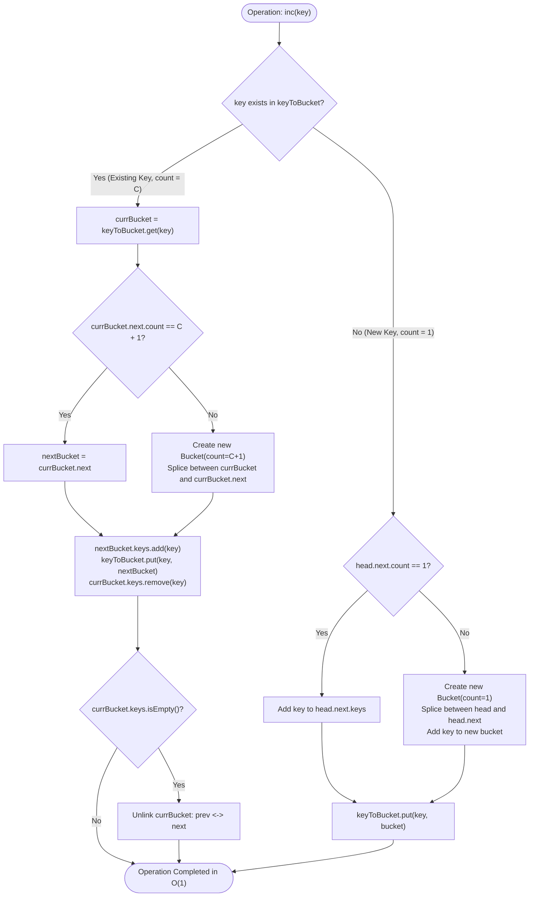
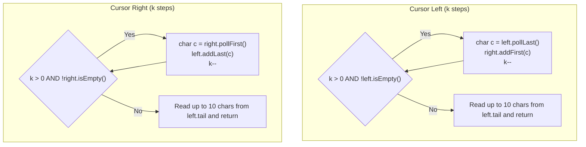

# Module 05: Advanced Composite Pointer Structures & Cursor Engines

Standard collections (`ArrayList`, `LinkedList`, `HashMap`) provide isolated capabilities. Real-world systems and advanced algorithmics require **composite structures** that interlock multiple pointer systems—such as **Doubly Linked Lists nested with Hash Sets** and **Cursor-Centric Dual Deques**—to deliver strict $O(1)$ worst-case guarantees across conflicting operational requirements.

---

## Problem 1: All $O(1)$ Data Structure

### 1. Problem Statement & Operational Constraints

Design a data structure to store string keys with their counts and support the following operations in **strictly $O(1)$ worst-case time complexity**:

- `inc(String key)`: Increments the count of `key` by $1$. If `key` does not exist, inserts it with count $1$.
- `dec(String key)`: Decrements the count of `key` by $1$. If the count reaches $0$, removes the key from the structure.
- `getMaxKey()`: Returns one of the keys with the maximal count. If no element exists, returns `""`.
- `getMinKey()`: Returns one of the keys with the minimal count. If no element exists, returns `""`.

- **Strict SLA**: Every operation must execute in **$O(1)$ time**. No $O(\log N)$ tree lookups, no $O(N)$ linear scans.

---

### 2. The Thought Process (How an Expert Approaches It from Scratch)

#### Why Standard Collections Fail
1. **Single HashMap (`Map<String, Integer>`)**: 
   - `inc` and `dec` are $O(1)$, but finding max or min requires scanning all entries $\implies O(N)$ time.
2. **Balanced BST / TreeMap (`TreeMap<Integer, Set<String>>`)**:
   - `getMaxKey` and `getMinKey` are $O(1)$ (reading `firstKey()` / `lastKey()`), but `inc` and `dec` require re-balancing tree nodes $\implies O(\log N)$ time.
3. **Dual Priority Queues (Heaps)**:
   - Arbitrary key updates take $O(N)$ or $O(\log N)$ to sift up/down.

#### The "Aha!" Insight: Doubly Linked Frequency Buckets
Notice what changes during `inc` and `dec`:
- When a key's frequency changes from $C$ to $C + 1$, it only moves to the **immediately adjacent frequency**!
- All keys sharing the same frequency can be grouped together in a **Bucket**:
  ```java
  class Bucket {
      int count;
      Set<String> keys; // O(1) insertion, deletion, and arbitrary element retrieval
      Bucket prev, next;
  }
  ```
- If we arrange these `Bucket` nodes in a **sorted Doubly Linked List**:
  - `head.next` is always the bucket with the **minimum frequency** $\implies O(1)$ `getMinKey()`.
  - `tail.prev` is always the bucket with the **maximum frequency** $\implies O(1)$ `getMaxKey()`.
  - A hash map `Map<String, Bucket> keyToBucket` gives $O(1)$ access to any key's current bucket.
  - When incrementing, we splice a new bucket for count $C + 1$ right after $C$ (if it doesn't already exist), move the key, and delete empty buckets in $O(1)$!

```text
╭─────────────────────────────────────────────────────────────────────────────────────────────╮
│                         DOUBLY LINKED FREQUENCY BUCKET ENGINE                               │
├─────────────────────────────────────────────────────────────────────────────────────────────┤
│ [HEAD] <───> [Count: 1] <───> [Count: 3] <───> [Count: 7] <───> [TAIL]                      │
│              Keys: {a, b}     Keys: {c}        Keys: {d}                                    │
│                   ▲                                  ▲                                      │
│                   │ (Min Key: O(1))                  │ (Max Key: O(1))                      │
│                                                                                             │
│ HashMap:                                                                                    │
│   "a" -> [Count: 1]                                                                         │
│   "b" -> [Count: 1]                                                                         │
│   "c" -> [Count: 3]                                                                         │
│   "d" -> [Count: 7]                                                                         │
╰─────────────────────────────────────────────────────────────────────────────────────────────╯
```

---

### 3. Procedural Mermaid State Machine ("How to Proceed")



---

### 4. Production Implementation (Java 17/21)

```java
package com.dataship.advanced.composite;

import java.util.HashMap;
import java.util.LinkedHashSet;
import java.util.Map;
import java.util.Set;

public final class AllOne {

    private static class Bucket {
        int count;
        // LinkedHashSet guarantees O(1) add, O(1) remove, and O(1) retrieval of any element via iterator
        Set<String> keys = new LinkedHashSet<>();
        Bucket prev;
        Bucket next;

        Bucket(int count) {
            this.count = count;
        }
    }

    private final Map<String, Bucket> keyToBucket = new HashMap<>();
    private final Bucket head;
    private final Bucket tail;

    public AllOne() {
        head = new Bucket(0);
        tail = new Bucket(0);
        head.next = tail;
        tail.prev = head;
    }

    public void inc(String key) {
        if (!keyToBucket.containsKey(key)) {
            // Key does not exist: target frequency is 1
            if (head.next == tail || head.next.count > 1) {
                insertBucketAfter(new Bucket(1), head);
            }
            head.next.keys.add(key);
            keyToBucket.put(key, head.next);
        } else {
            Bucket curr = keyToBucket.get(key);
            int nextCount = curr.count + 1;

            if (curr.next == tail || curr.next.count > nextCount) {
                insertBucketAfter(new Bucket(nextCount), curr);
            }
            curr.next.keys.add(key);
            keyToBucket.put(key, curr.next);

            curr.keys.remove(key);
            if (curr.keys.isEmpty()) {
                removeBucket(curr);
            }
        }
    }

    public void dec(String key) {
        if (!keyToBucket.containsKey(key)) {
            return;
        }

        Bucket curr = keyToBucket.get(key);
        curr.keys.remove(key);

        if (curr.count == 1) {
            keyToBucket.remove(key);
        } else {
            int prevCount = curr.count - 1;
            if (curr.prev == head || curr.prev.count < prevCount) {
                insertBucketAfter(new Bucket(prevCount), curr.prev);
            }
            curr.prev.keys.add(key);
            keyToBucket.put(key, curr.prev);
        }

        if (curr.keys.isEmpty()) {
            removeBucket(curr);
        }
    }

    public String getMaxKey() {
        if (tail.prev == head) {
            return "";
        }
        return tail.prev.keys.iterator().next();
    }

    public String getMinKey() {
        if (head.next == tail) {
            return "";
        }
        return head.next.keys.iterator().next();
    }

    private void insertBucketAfter(Bucket newBucket, Bucket prevBucket) {
        newBucket.prev = prevBucket;
        newBucket.next = prevBucket.next;
        prevBucket.next.prev = newBucket;
        prevBucket.next = newBucket;
    }

    private void removeBucket(Bucket bucket) {
        bucket.prev.next = bucket.next;
        bucket.next.prev = bucket.prev;
    }
}
```

---

## Problem 2: Design Text Editor (Cursor Manipulation Engine)

### 1. Problem Statement & Operational Constraints

Design a text editor system with a cursor supporting:
- `addText(String text)`: Appends `text` to the left of the cursor.
- `deleteText(int k)`: Deletes up to `k` characters to the left of the cursor. Returns the count actually deleted.
- `cursorLeft(int k)`: Moves cursor left up to `k` positions. Returns the last $\min(10, \text{len})$ characters to the left of the cursor.
- `cursorRight(int k)`: Moves cursor right up to `k` positions. Returns the last $\min(10, \text{len})$ characters to the left of the cursor.

---

### 2. Architectural Comparison: DLL vs Gap Buffer vs Dual Deques

```text
╭─────────────────────────────────────────────────────────────────────────────────────────────╮
│                         TEXT EDITOR ARCHITECTURAL COMPARISON                                │
├─────────────────────────────────────────────────────────────────────────────────────────────┤
│ Paradigm         Insert/Delete Time   Cursor Move Time    Memory Layout    Cache Locality   │
│ ─────────────────────────────────────────────────────────────────────────────────────────── │
│ Contiguous Array    O(N) (shifts)        O(1)             Flat Primitive      Excellent     │
│ Doubly Linked List  O(K) (node alloc)    O(K)             Heap Pointers       Poor (L1 miss)│
│ Gap Buffer          O(K) (in gap)        O(N) (move gap)  Contiguous Array    Very Good     │
│ Dual Deques/Stacks  O(K) (amortized)     O(K)             Array Deques        Optimal       │
╰─────────────────────────────────────────────────────────────────────────────────────────────╯
```

#### The "Aha!" Insight: The Dual-Deque Cursor Engine
Instead of wrestling with pointer splicing in a doubly linked list or array shifts:
- Split the text into two partitions around the cursor:
  1. `Deque<Character> left`: Characters to the **left** of the cursor.
  2. `Deque<Character> right`: Characters to the **right** of the cursor.
- **Insert**: Push characters onto `left`.
- **Delete**: Pop characters from `left`.
- **Cursor Left**: Pop from `left` and push onto `right`.
- **Cursor Right**: Pop from `right` and push onto `left`.
- Built on `java.util.ArrayDeque` (circular array underneath), this achieves zero pointer overhead and maximum CPU cache prefetching!

---

### 3. Procedural Mermaid Workflow ("How to Proceed")



---

### 4. Production Implementation (Java 17/21)

```java
package com.dataship.advanced.composite;

import java.util.ArrayDeque;
import java.util.Deque;

public final class TextEditor {

    // Dual ArrayDeque architecture: optimal spatial cache locality
    private final Deque<Character> left = new ArrayDeque<>();
    private final Deque<Character> right = new ArrayDeque<>();

    public TextEditor() {}

    public void addText(String text) {
        if (text == null || text.isEmpty()) return;
        for (int i = 0; i < text.length(); i++) {
            left.addLast(text.charAt(i));
        }
    }

    public int deleteText(int k) {
        int deleted = 0;
        while (k > 0 && !left.isEmpty()) {
            left.pollLast();
            deleted++;
            k--;
        }
        return deleted;
    }

    public String cursorLeft(int k) {
        while (k > 0 && !left.isEmpty()) {
            right.addFirst(left.pollLast());
            k--;
        }
        return getLeftTailText();
    }

    public String cursorRight(int k) {
        while (k > 0 && !right.isEmpty()) {
            left.addLast(right.pollFirst());
            k--;
        }
        return getLeftTailText();
    }

    private String getLeftTailText() {
        int count = Math.min(10, left.size());
        if (count == 0) return "";

        StringBuilder sb = new StringBuilder();
        // Temporarily pop last 10 characters to build string in correct order
        Deque<Character> buffer = new ArrayDeque<>();
        for (int i = 0; i < count; i++) {
            buffer.addFirst(left.pollLast());
        }
        for (char c : buffer) {
            sb.append(c);
            left.addLast(c); // Restore to left deque
        }

        return sb.toString();
    }
}
```

---

<table width="100%">
  <tr>
    <td width="33%" align="left">
      <a href="./04-array-to-linked-list-and-pointer-duality.md">
        <strong>← Previous Module</strong><br>
        04. Array-to-Linked-List Duality
      </a>
    </td>
    <td width="33%" align="center">
      <a href="../README.md">
        <strong>Home</strong><br>
        Java DSA Master Track
      </a>
    </td>
    <td width="33%" align="right">
      <a href="./06-hybrid-scale-systems-and-ttl-caches.md">
        <strong>Next Module →</strong><br>
        06. Hybrid Scale Systems & TTL Caches
      </a>
    </td>
  </tr>
</table>
