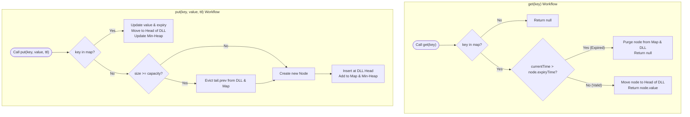

# Module 06: Hybrid Scale Systems, TTL Caches & High-Performance Ring Buffers

In large-scale production backends, pure algorithmic complexity ($O(1)$) is only half the battle. High-throughput distributed systems must balance **multi-dimensional eviction strategies** (combining capacity with absolute time expiration), **thread safety under high contention**, and **hardware-level mechanical sympathy** (eliminating CPU division penalties, false sharing, and cache line bouncing). This module develops the architectural blueprints for enterprise-grade hybrid caching and lock-free ring buffers.

---

## Problem 1: Concurrent LRU Cache with Time-To-Live (TTL) Expiration

### 1. Problem Statement & Production Requirements

Design an in-memory caching engine that simultaneously enforces **Capacity Eviction (LRU)** and **Time-Based Expiration (TTL)** with thread-safe concurrency:

1. `put(K key, V value, long ttlMillis)`: Stores the key-value pair with an absolute expiration timestamp ($T_{\text{expire}} = T_{\text{current}} + \text{ttlMillis}$). If capacity is exceeded, evict the least recently used non-expired entry.
2. `get(K key)`: Retrieves the value if present and unexpired, updating its recency in the LRU chain. If expired, purge immediately and return `null`.
3. **Dual Eviction Pipeline**:
   - **Passive / Lazy Eviction**: Triggered on `get()` access or during `put()` capacity pressure.
   - **Active Sweeper Eviction**: A background daemon thread periodically purges expired keys to prevent memory leaks from dormant keys.
4. **Concurrency**: Read operations must not block each other unnecessarily; write operations must guarantee strict pointer integrity.

---

### 2. Multi-Engine Architecture

A single data structure cannot satisfy both access recency and time expiration in $O(1)$:
- **Recency Engine**: A **Doubly Linked List** where the most recently accessed node is spliced to the `head`, and the least recently accessed node resides at the `tail`.
- **Expiration Engine**: A **Min-Heap (Priority Queue)** ordered by `expirationTime` allowing $O(1)$ inspection of the next expiring key and $O(\log N)$ extraction.
- **Fast Lookup Index**: A **Hash Map** mapping `key` directly to the `Node` reference.

```text
╭─────────────────────────────────────────────────────────────────────────────────────────────╮
│                         DUAL-ENGINE LRU + TTL ARCHITECTURE                                  │
├─────────────────────────────────────────────────────────────────────────────────────────────┤
│ LRU Engine (DLL):                                                                           │
│   [HEAD] <───> [Node A (t=5000)] <───> [Node B (t=2000)] <───> [TAIL]                       │
│                     ▲                        ▲                                              │
│                     │                        │                                              │
│ HashMap Index:  "A" ─┘                   "B" ─┘                                             │
│                                                                                             │
│ TTL Engine (Min-Heap):                                                                      │
│                [Node B: t=2000]  (Earliest Expiry on Top)                                   │
│                     /                                                                       │
│             [Node A: t=5000]                                                                │
╰─────────────────────────────────────────────────────────────────────────────────────────────╯
```

---

### 3. Procedural Mermaid State Machine ("How to Proceed")



---

### 4. Production Implementation (Java 17/21)

```java
package com.dataship.advanced.systems;

import java.util.HashMap;
import java.util.Map;
import java.util.PriorityQueue;
import java.util.concurrent.locks.ReentrantReadWriteLock;

public final class ConcurrentTtlLruCache<K, V> {

    private static class Node<K, V> implements Comparable<Node<K, V>> {
        final K key;
        V value;
        long expireTime;
        Node<K, V> prev;
        Node<K, V> next;

        Node(K key, V value, long expireTime) {
            this.key = key;
            this.value = value;
            this.expireTime = expireTime;
        }

        @Override
        public int compareTo(Node<K, V> other) {
            return Long.compare(this.expireTime, other.expireTime);
        }
    }

    private final int capacity;
    private final Map<K, Node<K, V>> map = new HashMap<>();
    private final PriorityQueue<Node<K, V>> ttlMinHeap = new PriorityQueue<>();
    private final Node<K, V> head = new Node<>(null, null, 0);
    private final Node<K, V> tail = new Node<>(null, null, 0);

    // ReadWriteLock balances high concurrent reads with atomic write modifications
    private final ReentrantReadWriteLock rwLock = new ReentrantReadWriteLock();
    private final ReentrantReadWriteLock.ReadLock readLock = rwLock.readLock();
    private final ReentrantReadWriteLock.WriteLock writeLock = rwLock.writeLock();

    public ConcurrentTtlLruCache(int capacity) {
        if (capacity <= 0) throw new IllegalArgumentException("Capacity must be positive.");
        this.capacity = capacity;
        head.next = tail;
        tail.prev = head;
    }

    public V get(K key) {
        long now = System.currentTimeMillis();

        // Optimistic Read Check
        readLock.lock();
        Node<K, V> node;
        try {
            node = map.get(key);
            if (node == null) return null;
            if (now <= node.expireTime) {
                // Node valid, promote to head requires write lock upgrade
            }
        } finally {
            readLock.unlock();
        }

        // Acquire write lock to update recency or purge expired
        writeLock.lock();
        try {
            node = map.get(key);
            if (node == null) return null;

            if (now > node.expireTime) {
                // Lazy Eviction
                unlinkNode(node);
                map.remove(key);
                ttlMinHeap.remove(node);
                return null;
            }

            // Move to head of LRU
            unlinkNode(node);
            insertAtHead(node);
            return node.value;
        } finally {
            writeLock.unlock();
        }
    }

    public void put(K key, V value, long ttlMillis) {
        long expireTime = System.currentTimeMillis() + ttlMillis;

        writeLock.lock();
        try {
            // First, purge any expired entries sitting at top of Min-Heap
            cleanExpired(System.currentTimeMillis());

            Node<K, V> existing = map.get(key);
            if (existing != null) {
                existing.value = value;
                existing.expireTime = expireTime;
                unlinkNode(existing);
                insertAtHead(existing);
                ttlMinHeap.remove(existing);
                ttlMinHeap.add(existing);
                return;
            }

            // Check capacity
            if (map.size() >= capacity) {
                // Evict LRU tail
                Node<K, V> toEvict = tail.prev;
                unlinkNode(toEvict);
                map.remove(toEvict.key);
                ttlMinHeap.remove(toEvict);
            }

            Node<K, V> newNode = new Node<>(key, value, expireTime);
            insertAtHead(newNode);
            map.put(key, newNode);
            ttlMinHeap.add(newNode);
        } finally {
            writeLock.unlock();
        }
    }

    /**
     * Active cleanup routine invoked periodically by a background scheduler thread.
     */
    public void cleanExpired(long now) {
        while (!ttlMinHeap.isEmpty() && ttlMinHeap.peek().expireTime <= now) {
            Node<K, V> expiredNode = ttlMinHeap.poll();
            unlinkNode(expiredNode);
            map.remove(expiredNode.key);
        }
    }

    private void insertAtHead(Node<K, V> node) {
        node.next = head.next;
        node.prev = head;
        head.next.prev = node;
        head.next = node;
    }

    private void unlinkNode(Node<K, V> node) {
        node.prev.next = node.next;
        node.next.prev = node.prev;
    }
}
```

---

## Problem 2: High-Performance Bounded Ring Buffer (LMAX Principles)

### 1. Architectural Foundations: Mechanical Sympathy & Zero Division

Standard queues (`java.util.concurrent.ArrayBlockingQueue`) suffer from three major performance bottlenecks in ultra-low latency environments:
1. **Lock Contention**: Mutex locks force OS thread context switches ($\approx 1000\text{–}3000\text{ns}$ penalty).
2. **Expensive Modulo Arithmetic**: Wrapping array indices with `index % capacity` generates the x86 `idiv` CPU instruction, which consumes **$10\text{–}40$ clock cycles**.
3. **False Sharing**: Head and tail pointers residing on the same 64-byte CPU cache line invalidate each other constantly across CPU cores via the MESI coherence protocol.

#### Solution 1: Bitwise Power-of-Two Masking
By strictly constraining `capacity` to a power of two ($C = 2^k$):
$$\mathbf{\text{index} \pmod C \equiv \text{index} \mathrel{\&} (C - 1)}$$
The bitwise `AND` instruction executes in **exactly 1 CPU clock cycle** ($0.3\text{ns}$ on modern processors), representing a $> 20\times$ speedup over division!

#### Solution 2: Cache Line Padding Against False Sharing
A standard CPU cache line is **64 bytes**. If `producerSequence` and `consumerSequence` sit side by side in RAM, Core 0 writing to `producerSequence` forces Core 1 to reload its entire L1 cache line before reading `consumerSequence`.
- By padding the sequence counter with 7 dummy `long` fields ($7 \times 8 = 56 \text{ bytes}$ + 8-byte counter = 64 bytes), we isolate each counter onto its own dedicated hardware cache line!

```text
╭─────────────────────────────────────────────────────────────────────────────────────────────╮
│                         CACHE LINE ISOLATION (FALSE SHARING PREVENTION)                     │
├─────────────────────────────────────────────────────────────────────────────────────────────┤
│ 64-Byte Cache Line 0 (Core 0):                                                              │
│ [ producerSequence (8B) ] [ p1..p7 Dummy Padding Fields (56B) ]                             │
│ ─────────────────────────────────────────────────────────────────────────────────────────── │
│ 64-Byte Cache Line 1 (Core 1):                                                              │
│ [ consumerSequence (8B) ] [ c1..c7 Dummy Padding Fields (56B) ]                             │
│                                                                                             │
│ Result: Zero cache coherence invalidation across producer and consumer CPU cores!           │
╰─────────────────────────────────────────────────────────────────────────────────────────────╯
```

---

### 2. Procedural Mermaid Flowchart ("How to Proceed")

```mermaid
flowchart TD
    subgraph "Producer: offer(item)"
        P1(["offer(item)"]) --> P2["currentHead = producerSeq.get()"]
        P2 --> P3["currentTail = consumerSeq.get()"]
        P3 --> PCap{"currentHead - currentTail >= capacity?"}
        PCap -- "Yes (Buffer Full)" --> PFail["Return false"]
        PCap -- "No (Slot Available)" --> PSlot["slot = currentHead & (capacity - 1)"]
        PSlot --> PStore["buffer[slot] = item (StoreStore Barrier)"]
        PStore --> PAdv["producerSeq.lazySet(currentHead + 1)"]
        PAdv --> PSuccess["Return true"]
    end
    
    subgraph "Consumer: poll()"
        C1(["poll()"]) --> C2["currentTail = consumerSeq.get()"]
        C2 --> C3["currentHead = producerSeq.get()"]
        C3 --> CEmpty{"currentTail >= currentHead?"}
        CEmpty -- "Yes (Buffer Empty)" --> CNull["Return null"]
        CEmpty -- "No (Item Available)" --> CSlot["slot = currentTail & (capacity - 1)"]
        CSlot --> CRead["item = buffer[slot] (LoadLoad Barrier)"]
        CRead --> CAdv["consumerSeq.lazySet(currentTail + 1)"]
        CAdv --> CRet["Return item"]
    end
```



---

### 3. Production Implementation (Java 17/21)

```java
package com.dataship.advanced.systems;

import java.util.concurrent.atomic.AtomicLong;

public final class HighPerformanceRingBuffer<T> {

    // Cache-line padded sequence counter to eliminate False Sharing
    private static class PaddedAtomicLong extends AtomicLong {
        // 56 bytes of padding fields ensure this counter occupies a dedicated 64-byte cache line
        public volatile long p1, p2, p3, p4, p5, p6, p7;

        PaddedAtomicLong(long initialValue) {
            super(initialValue);
        }
    }

    private final Object[] buffer;
    private final int mask;
    private final int capacity;

    private final PaddedAtomicLong producerSeq = new PaddedAtomicLong(0);
    private final PaddedAtomicLong consumerSeq = new PaddedAtomicLong(0);

    public HighPerformanceRingBuffer(int capacityPowerOfTwo) {
        if (Integer.bitCount(capacityPowerOfTwo) != 1) {
            throw new IllegalArgumentException("Capacity must be a strict power of two.");
        }
        this.capacity = capacityPowerOfTwo;
        this.mask = capacityPowerOfTwo - 1; // Used for ultra-fast bitwise masking
        this.buffer = new Object[capacityPowerOfTwo];
    }

    /**
     * Lock-free, non-blocking single-producer offer operation.
     */
    public boolean offer(T item) {
        if (item == null) throw new NullPointerException("Null items not supported.");

        long head = producerSeq.get();
        long tail = consumerSeq.get();

        if (head - tail >= capacity) {
            // Buffer is full; cannot write without overwriting unconsumed data
            return false;
        }

        // Bitwise AND replaces division instruction: 1 CPU cycle
        int slot = (int) (head & mask);
        buffer[slot] = item;

        // lazySet uses release semantics (StoreStore barrier) ensuring data is visible before counter advances
        producerSeq.lazySet(head + 1);
        return true;
    }

    /**
     * Lock-free, non-blocking single-consumer poll operation.
     */
    @SuppressWarnings("unchecked")
    public T poll() {
        long tail = consumerSeq.get();
        long head = producerSeq.get();

        if (tail >= head) {
            // Buffer is empty
            return null;
        }

        int slot = (int) (tail & mask);
        T item = (T) buffer[slot];
        buffer[slot] = null; // Prevent memory leak / GC retention

        consumerSeq.lazySet(tail + 1);
        return item;
    }

    public int size() {
        return (int) (producerSeq.get() - consumerSeq.get());
    }
}
```

---

### 4. Interviewer Stress Questions & Defenses
> **Interviewer**: *"Why use `lazySet` instead of `set` or a volatile write in the HighPerformanceRingBuffer?"*
> **Defense**: "`lazySet` uses a **StoreStore memory barrier** rather than the much more expensive **StoreLoad barrier** incurred by standard volatile writes on x86 architectures. Since there is only a single producer thread modifying `producerSeq`, it does not need to immediately flush the CPU store buffer to all other cores; it only needs to guarantee that writing the element into the array slot occurs strictly **before** the sequence counter increments. This dramatically increases message throughput."

---

<table width="100%">
  <tr>
    <td width="33%" align="left">
      <a href="./05-advanced-composite-pointer-structures.md">
        <strong>← Previous Module</strong><br>
        05. Advanced Composite Structures
      </a>
    </td>
    <td width="33%" align="center">
      <a href="../README.md">
        <strong>Home</strong><br>
        Java DSA Master Track
      </a>
    </td>
    <td width="33%" align="right">
      <a href="./README.md">
        <strong>Track Hub →</strong><br>
        Advanced Problems Overview
      </a>
    </td>
  </tr>
</table>
