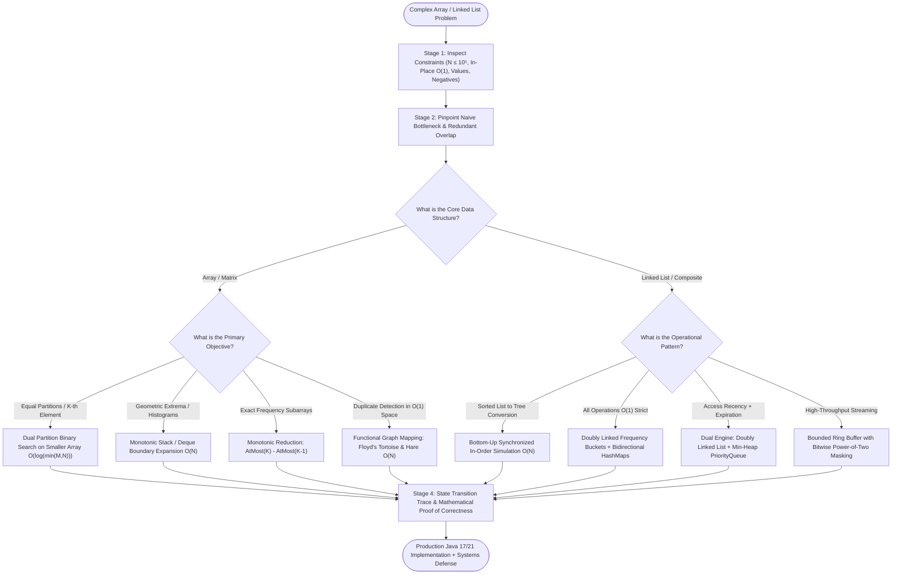

# Advanced Problems on Arrays & Linked Lists: Deep Deduction, Mathematical Invariants, and Systems Engineering

Welcome to the **Advanced Problems Track on Arrays and Linked Lists**. This curriculum bridges algorithmic mastery with low-level computer science theory and production software engineering systems. 

Rather than memorizing isolated problem tricks, this track teaches you **how to deduce solutions from first principles**: spotting structural invariants, mathematically proving bounds, modeling state transitions, and understanding the physical hardware realities (CPU cache hierarchies, memory barriers, object headers, and GC overhead) that govern real-world execution.

---

## 🧭 The Meta-Problem Solving Engine: A 6-Stage Cognitive Framework

When presented with a complex, hard-tier array or linked list problem, top software engineers do not jump immediately to code. They systematically execute this 6-stage mental deduction pipeline:

```text
╭─────────────────────────────────────────────────────────────────────────────────────────────╮
│                         THE 6-STAGE COGNITIVE DEDUCTION PIPELINE                            │
├─────────────────────────────────────────────────────────────────────────────────────────────┤
│ 1. Constraint & Boundary Inspection:                                                        │
│    • Extract N, M, element ranges, value domains (negatives? duplicates? strictly positive?).│
│    • Identify strict physical bounds: In-place O(1) auxiliary space? Read-only arrays?     │
│                                                                                             │
│ 2. The Naive Brute-Force & Bottleneck Localization:                                         │
│    • Formulate the simplest correct solution (often O(N²), O(N³), or O(N!)).                │
│    • Ask: "What exact computation is being redundantly recalculated across iterations?"     │
│                                                                                             │
│ 3. Structural & Mathematical Invariant Discovery:                                           │
│    • Is there a monotonic property (e.g. expanding right strictly increases distinct count)?│
│    • Can non-monotonic conditions be reduced algebraically: Exact(K) = AtMost(K) - AtMost(K-1)?│
│    • Does the array define a discrete functional graph: i -> A[i]?                          │
│                                                                                             │
│ 4. Procedural Workflow Blueprinting (How to Proceed):                                       │
│    • Map the algorithm as a deterministic state machine or flowchart before coding.         │
│    • Pinpoint boundary conditions, pointer advances, and sentinel nodes.                    │
│                                                                                             │
│ 5. Hardware Sympathy & Micro-Architectural Alignment:                                       │
│    • Are we jumping randomly across heap nodes (cache thrashing) or streaming sequentially? │
│    • Can we replace expensive division instructions (idiv) with bitwise AND masking?       │
│                                                                                             │
│ 6. Implementation, Invariant Proof, & Interview Follow-Up Defense:                          │
│    • Write clean, edge-guarded Java 17/21 code.                                             │
│    • Defend the solution against interviewer stress tests: concurrency, scale, and streams. │
╰─────────────────────────────────────────────────────────────────────────────────────────────╯
```

---

## 🗺️ Global Procedural Decision Flowchart

Use this procedural roadmap to diagnose and route any advanced array or linked list challenge to its optimal algorithmic family:



---

## ⚡ Mathematical Invariants & Algorithmic Principles Reference

| Algorithmic Paradigm | Governing Mathematical Invariant / Identity | Time Complexity | Auxiliary Space | Key Use Case |
| :--- | :--- | :--- | :--- | :--- |
| **Dual Partition Search** | $\max(A[\text{cut}_A-1], B[\text{cut}_B-1]) \le \min(A[\text{cut}_A], B[\text{cut}_B])$ | $O(\log(\min(M, N)))$ | $O(1)$ | Median of 2 Sorted Arrays, $K$-th Element |
| **Inversion Counting** | Right array advance $B[j] < A[i] \implies \text{inversions} += (\text{mid} - i + 1)$ | $O(N \log N)$ | $O(N)$ | Count Smaller After Self, Reverse Pairs |
| **Monotonic Stack** | Pop when $H[i] < H[\text{top}] \implies \text{width} = i - \text{newTop} - 1$ | $O(N)$ amortized | $O(N)$ | Largest Histogram, Maximal 2D Rectangle |
| **Algebraic Exact-K** | $\text{Exact}(K) = \text{AtMost}(K) - \text{AtMost}(K - 1)$ | $O(N)$ | $O(K)$ | Subarrays with $K$ Distinct Integers |
| **Array-as-Graph Duality** | Value range $[1 \dots N]$ on size $N+1 \implies \text{in-degree} \ge 2 \implies \text{Cycle}$ | $O(N)$ | $O(1)$ | Find the Duplicate Number |
| **Synchronized Tree Simulation** | In-order tree visit sequence $\equiv$ ascending linked list order | $O(N)$ | $O(\log N)$ stack | Convert Sorted List to Balanced BST |
| **Frequency Bucket DLL** | Nodes maintain contiguous frequency clusters $\dots \leftrightarrow C-1 \leftrightarrow C \leftrightarrow C+1 \dots$ | $O(1)$ strict | $O(U)$ | All $O(1)$ Data Structure, LFU Cache |
| **Disruptor Bitwise Masking** | $\text{capacity} = 2^k \implies (\text{index} \pmod{\text{capacity}}) \equiv (\text{index} \mathrel{\&} (\text{capacity} - 1))$ | $O(1)$ (1 CPU cycle) | $O(C)$ contiguous | High-Performance Ring Buffer |

---

## 💻 Micro-Architectural Reality: Why Memory Layout Dominates Big-O

In production systems, algorithms with identical asymptotic time complexity ($O(N)$) can differ in real-world wall-clock latency by **$10\times$ to $50\times$**. Understanding memory hierarchy and hardware interaction is essential for senior engineering depth:

```text
╭─────────────────────────────────────────────────────────────────────────────────────────────╮
│                               HARDWARE & MEMORY HIERARCHY                                   │
├─────────────────────────────────────────────────────────────────────────────────────────────┤
│ Level         Access Latency       Capacity         Data Transfer Unit     Cache Miss Cost  │
│ ─────────────────────────────────────────────────────────────────────────────────────────── │
│ L1 Data Cache  ~ 0.5 - 1.0 ns       32 - 64 KB       64-Byte Cache Line     Reference Base   │
│ L2 Cache       ~ 3.0 - 5.0 ns       256 - 512 KB     64-Byte Cache Line     ~ 4x L1 penalty  │
│ L3 Cache       ~ 10 - 20 ns         8 - 64 MB        64-Byte Cache Line     ~ 20x L1 penalty │
│ Main Memory    ~ 60 - 100 ns        16 - 128 GB      64-Byte Cache Line     ~ 100x L1 penalty│
╰─────────────────────────────────────────────────────────────────────────────────────────────╯
```

### Key Hardware Considerations for Arrays vs Linked Lists:
1. **Cache Locality & Spatial Prefetching**: 
   - A contiguous array of primitives (`int[]`) loads 16 consecutive 4-byte integers per 64-byte L1 cache line. The CPU hardware prefetcher detects linear stride and streams memory ahead of instruction execution with virtually zero stall cycles.
   - A standard pointer-based `LinkedList<Integer>` stores nodes randomly across the JVM heap. Traversing each node requires dereferencing an 8-byte reference, causing an L1/L2/L3 cache miss and stalling CPU execution for up to 100ns per hop.
2. **Object Overhead & Compressed OOPs**:
   - Each Java heap object carries a 12-byte header (8-byte Mark Word + 4-byte Klass Word with Compressed OOPs) plus 4 bytes of padding. A simple `Node` holding one `int` consumes **24 bytes of memory**—a $600\%$ memory amplification over a 4-byte primitive.
3. **False Sharing Across CPU Cores**:
   - In concurrent ring buffers and queues, if the `head` and `tail` sequence counters reside on the same 64-byte cache line, modifying `tail` on Core 0 will invalidate the entire cache line on Core 1 (via MESI cache coherence protocol), devastating throughput. We solve this using **Cache Line Padding** (e.g. `@Contended` or explicit dummy fields).

---

## 📚 Track Curriculum

| Module | Core Topics & Algorithmic Archetypes | Problems Solved | Architectural & Mathematical Highlights |
| :--- | :--- | :--- | :--- |
| **[01. Dual Partition Search & Inversion Counting](./01-advanced-array-search-and-partitioning.md)** | Binary Search on Dual Partition Space, Divide & Conquer Inversion Tracking | • Median of Two Sorted Arrays<br>• Count of Smaller Numbers After Self | • Formal partition invariant $i+j = \lfloor(M+N+1)/2\rfloor$<br>• Asymmetric boundary clamping<br>• Merge Sort vs Fenwick Tree comparison |
| **[02. Monotonic Stacks & Geometric Arrays](./02-monotonic-stack-and-geometric-arrays.md)** | Monotonic Stack Boundary Guarantees, Dynamic 2D Histogram Layer Reductions | • Largest Rectangle in Histogram<br>• Maximal Rectangle in 2D Binary Matrix | • Monotonic boundary expansion theorem<br>• Zero-allocation primitive array stack<br>• Dynamic layer height accumulation |
| **[03. Advanced Sliding Window & Frequency Math](./03-advanced-sliding-window-and-frequency-math.md)** | Non-Monotonic to Monotonic Reductions, Bidirectional Dynamic Window Contraction | • Subarrays with $K$ Different Integers<br>• Minimum Window Subsequence | • Theorem: $\text{Exact}(K) = \text{AtMost}(K) - \text{AtMost}(K-1)$<br>• Forward-expansion & backward-contraction<br>• Array frequency tables vs GC boxing |
| **[04. Array-to-Linked-List Duality & Pointer Graphs](./04-array-to-linked-list-and-pointer-duality.md)** | Array Indirection Functional Graphs, Synchronized In-Order Tree Synthesis | • Find the Duplicate Number<br>• Convert Sorted Linked List to Balanced BST | • Dirichlet's Pigeonhole cycle reduction<br>• Algebraic proof of Floyd's cycle entry<br>• $O(N)$ bottom-up in-order recursion |
| **[05. Advanced Composite Pointer Structures](./05-advanced-composite-pointer-structures.md)** | Doubly Linked Frequency Clusters, Cursor-Based Text Editing Engines | • All $O(1)$ Data Structure<br>• Design Text Editor | • Frequency bucket splicing & pruning<br>• Doubly Linked List vs Gap Buffer vs Two Deques<br>• Amortized vs worst-case $O(1)$ SLAs |
| **[06. Hybrid Systems, TTL Caches & Ring Buffers](./06-hybrid-scale-systems-and-ttl-caches.md)** | Multi-Dimensional Eviction Engines, Micro-Architectural Ring Buffers | • LRU Cache with Time-To-Live (TTL)<br>• High-Performance Bounded Ring Buffer | • Composite DLL + Min-Heap dual engine<br>• Active sweeper vs lazy expiration<br>• Bitwise power-of-two index masking (`& (C - 1)`)<br>• Cache line padding & false sharing mitigation |

---

## 🚀 Recommended Progression

1. **Prerequisites**: Ensure you are grounded in the core fundamentals:
   - [Arrays: Memory Models, Cache Lines & Core Algorithms](../arrays/README.md)
   - [Linked Lists: Pointer Choreography & Composite Systems](../linked-lists/README.md)
2. **Execution Strategy**:
   - Read the **Thought Process & Bottleneck** first. Pause and mentally derive the invariant before looking at the procedural Mermaid flowchart.
   - Trace through the **Curved ASCII State Machine** and **Dry-Run Trace Table** manually with pen and paper.
   - Study the **Interviewer Stress Questions** to prepare for follow-up scenarios (scale, concurrency, dynamic streams).

---

<table width="100%">
  <tr>
    <td width="33%" align="left">
      <a href="../linked-lists/07-advanced-systems-concurrency-and-cache-friendly-lists.md">
        <strong>← Previous Track</strong><br>
        Linked Lists: Advanced Systems & Concurrency
      </a>
    </td>
    <td width="33%" align="center">
      <a href="../README.md">
        <strong>Home</strong><br>
        Java DSA Master Track
      </a>
    </td>
    <td width="33%" align="right">
      <a href="./01-advanced-array-search-and-partitioning.md">
        <strong>Next Module →</strong><br>
        01. Dual Partition Search & Inversion Counting
      </a>
    </td>
  </tr>
</table>
