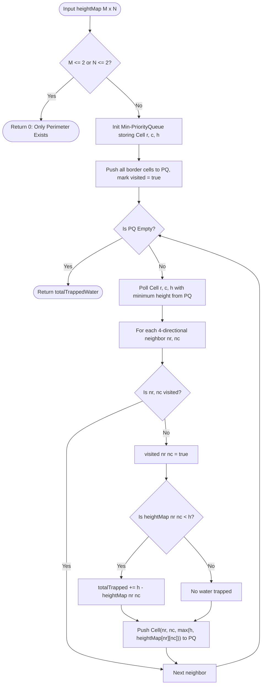

# 01. Trapping Rain Water II: 3D Priority Queue Boundary Contraction

[← Back to Advanced Hub](./README.md) | [Track Hub](./README.md) | [Next: Word Ladder II →](./02-word-ladder-ii-bidirectional-bfs-and-dag-backtracking.md)

---

## 1. Problem Statement & Constraints

Given an $m \times n$ integer matrix `heightMap` representing the height of each unit cell in a 2D elevation map, return the **volume of water it can trap after raining**.

```
Example 1:
Input: heightMap = [
  [1,4,3,1,3,2],
  [3,2,1,3,2,4],
  [2,3,3,2,3,1]
]
Output: 4
Explanation: After the rain, water is trapped in the interior cells:
- Cell (1, 1) has height 2, water level rises to 3 -> traps 1 unit.
- Cell (1, 2) has height 1, water level rises to 3 -> traps 2 units.
- Cell (1, 4) has height 2, water level rises to 3 -> traps 1 unit.
Total trapped water = 1 + 2 + 1 = 4.

Example 2:
Input: heightMap = [
  [3,3,3,3,3],
  [3,2,2,2,3],
  [3,2,1,2,3],
  [3,2,2,2,3],
  [3,3,3,3,3]
]
Output: 10
```

#### Constraints:
- $m == \text{heightMap.length}$.
- $n == \text{heightMap}[i]\text{.length}$.
- $1 \le m, n \le 200$.
- $0 \le \text{heightMap}[i][j] \le 2 \times 10^4$.

---

## 2. Thought Process & Intuition

```
  Why 1D Two-Pointer Trapping Water Fails in 3D:
  In 1D Trapping Rain Water, water is bounded simply by the maximum left and right bars:
  water[i] = max(0, min(maxLeft, maxRight) - height[i]).
  In 3D, water can spill in ANY of the 4 orthogonal directions (North, South, East, West)!
  Water is contained not by two bars, but by a 2D ENCLOSING CONTAINER WALL!
                         ↓
  The Inward Watershed Invariant:
  Water spills out from the LOWEST point of the enclosing perimeter!
  Any interior cell connected to the outside world will have its water level bounded
  by the MAXIMUM elevation along the LOWEST path connecting it to the exterior boundary!
                         ↓
  "Aha!" Insight: Min-Heap Boundary Contraction (Dijkstra-Like BFS)
  1. All perimeter cells (row 0, row m-1, col 0, col n-1) CANNOT trap any water because
     water immediately spills off the grid edges!
  2. Put ALL perimeter cells into a Min-PriorityQueue, keyed by their height.
  3. Greedily poll the LOWEST boundary cell (r, c) with height h:
     • Inspect its 4 unvisited neighbors (nr, nc):
       - If heightMap[nr][nc] < h: Water is trapped!
         trappedWater += h - heightMap[nr][nc]!
       - The effective boundary height for (nr, nc) is max(h, heightMap[nr][nc])!
       - Push (nr, nc) with its effective height into the Min-Heap!
  4. Continue shrinking the boundary inward until all cells have been visited!
```

---

## 3. Mathematical Proof of the Lowest Spill Boundary Invariant

Let $G = (V, E)$ be the grid graph where edges connect adjacent cells.
Let $\mathcal{B} \subset V$ be the set of perimeter cells.
For any interior cell $u$, any water escaping to the exterior must follow some path $P = (u = v_0, v_1, \dots, v_k \in \mathcal{B})$.

The maximum water level $W(u)$ cell $u$ can sustain without overflowing along path $P$ is:
$$W_P(u) = \max_{v \in P} \text{height}(v)$$

Because water seeks the path of least resistance (lowest spill point), the actual water level at $u$ is governed by the minimum bottleneck path to the boundary:
$$W(u) = \min_{P: u \rightsquigarrow \mathcal{B}} \max_{v \in P} \text{height}(v)$$

This is the exact mathematical formulation of the **Minimax Path Problem**, which is solved optimally by Dijkstra's algorithm using a Min-PriorityQueue. By relaxing from the boundary inward, each cell's bottleneck height is finalized upon being polled from the Min-Heap $\blacksquare$.

---

## 4. Procedural Blueprint (How to Proceed)



---

## 5. Visual State Transition: Shrinking the 3D Perimeter

```
Grid:
╭───┬───┬───┬───┬───╮
│ 3 │ 3 │ 3 │ 3 │ 3 │   <-- Initial Boundary in Min-Heap
├───┼───┼───┼───┼───┤
│ 3 │ 2 │ 1 │ 2 │ 3 │   <-- Interior Cells
├───┼───┼───┼───┼───┤
│ 3 │ 3 │ 3 │ 3 │ 3 │   <-- Initial Boundary in Min-Heap
╰───┴───┴───┴───┴───╯

All perimeter cells have height 3.
Min-Heap polls (0, 0) with height 3.
Inspects neighbor (1, 1) with height 2:
heightMap[1][1] (2) < boundary (3) -> Traps 3 - 2 = 1 unit of water!
Effective height of (1, 1) becomes max(3, 2) = 3!
Push (1, 1, 3) into Min-Heap!

Next, Min-Heap polls (1, 1, 3):
Inspects neighbor (1, 2) with height 1:
heightMap[1][2] (1) < boundary (3) -> Traps 3 - 1 = 2 units of water!
Effective height of (1, 2) becomes max(3, 1) = 3!
Push (1, 2, 3) into Min-Heap!

Water boundary contracts inward smoothly like a shrinking lasso!
```

---

## 6. Production Java 17/21 Implementation

```java
import java.util.PriorityQueue;

public final class TrappingRainWaterII {

    private record Cell(int r, int c, int height) implements Comparable<Cell> {
        @Override
        public int compareTo(Cell other) {
            return Integer.compare(this.height, other.height);
        }
    }

    private static final int[][] DIRS = {{-1, 0}, {1, 0}, {0, -1}, {0, 1}};

    /**
     * Calculates 3D trapped rainwater volume using Min-Heap boundary contraction.
     *
     * Time Complexity:  O(M * N * log(M * N)) — each cell entered and polled once from PQ.
     * Space Complexity: O(M * N) for the visited matrix and PriorityQueue.
     */
    public int trapRainWater(int[][] heightMap) {
        if (heightMap == null || heightMap.length <= 2 || heightMap[0].length <= 2) {
            return 0; // A 2D grid with <= 2 rows or cols has only perimeter cells
        }

        int m = heightMap.length;
        int n = heightMap[0].length;
        boolean[][] visited = new boolean[m][n];
        PriorityQueue<Cell> pq = new PriorityQueue<>();

        // Step 1: Add all perimeter cells to the Min-Heap
        for (int r = 0; r < m; r++) {
            pq.offer(new Cell(r, 0, heightMap[r][0]));
            pq.offer(new Cell(r, n - 1, heightMap[r][n - 1]));
            visited[r][0] = true;
            visited[r][n - 1] = true;
        }

        for (int c = 1; c < n - 1; c++) {
            pq.offer(new Cell(0, c, heightMap[0][c]));
            pq.offer(new Cell(m - 1, c, heightMap[m - 1][c]));
            visited[0][c] = true;
            visited[m - 1][c] = true;
        }

        int totalWater = 0;

        // Step 2: Contract the boundary inward from lowest elevation
        while (!pq.isEmpty()) {
            Cell curr = pq.poll();
            int r = curr.r();
            int c = curr.c();
            int h = curr.height();

            for (int[] dir : DIRS) {
                int nr = r + dir[0];
                int nc = c + dir[1];

                if (nr >= 0 && nr < m && nc >= 0 && nc < n && !visited[nr][nc]) {
                    visited[nr][nc] = true;

                    // If neighbor is lower than current boundary, it traps water
                    if (heightMap[nr][nc] < h) {
                        totalWater += h - heightMap[nr][nc];
                    }

                    // Push neighbor with updated effective boundary height
                    pq.offer(new Cell(nr, nc, Math.max(heightMap[nr][nc], h)));
                }
            }
        }

        return totalWater;
    }
}
```

---

## 7. Step-by-Step Dry-Run Table & Interviewer Stress Defenses

```
Input: 3x6 heightMap
[1,4,3,1,3,2]
[3,2,1,3,2,4]
[2,3,3,2,3,1]
```

| Step | Polled Cell `(r, c, h)` | Neighbor Inspected `(nr, nc)` | Neighbor Height | Water Trapped | New Effective Height Pushed |
| :---: | :---: | :---: | :---: | :---: | :---: |
| **1** | `(0, 0, 1)` | `(1, 0)` | 3 (already visited) | 0 | — |
| **2** | `(2, 5, 1)` | `(1, 5)` | 4 (already visited) | 0 | — |
| **3** | `(0, 3, 1)` | `(1, 3)` | 3 | 0 | `(1, 3, 3)` |
| **...** | ... | `(1, 1)` | 2 | $3 - 2 = 1$ | `(1, 1, 3)` |
| **...** | ... | `(1, 2)` | 1 | $3 - 1 = 2$ | `(1, 2, 3)` |
| **...** | ... | `(1, 4)` | 2 | $3 - 2 = 1$ | `(1, 4, 3)` |

- **Interviewer Defense — Why must we push `Math.max(heightMap[nr][nc], h)` instead of `heightMap[nr][nc]`?**
  If an interior cell is lower than the surrounding wall, water fills it up to height $h$. The trapped water column now acts as a physical wall of height $h$ for any cells deeper in the interior! Pushing `heightMap[nr][nc]` would falsely allow deeper cells to leak through this flooded cell.

---

<div align="center">

| [← Back to Advanced Hub](./README.md) | [Track Hub: Advanced Problems](./README.md) | [Next: Word Ladder II →](./02-word-ladder-ii-bidirectional-bfs-and-dag-backtracking.md) |
| :--- | :---: | ---: |

</div>
