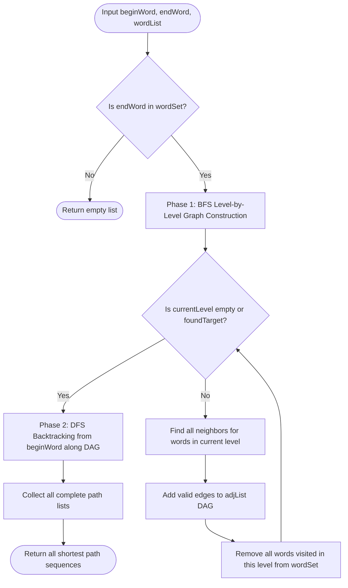

# 02. Word Ladder II: Bidirectional BFS & DAG Backtracking

[← Back to Trapping Rain Water II](./01-trapping-rain-water-ii-3d-boundary-contraction.md) | [Track Hub](./README.md) | [Next: Russian Doll Envelopes →](./03-russian-doll-envelopes-2d-sorting-and-patience-sort-lis.md)

---

## 1. Problem Statement & Constraints

A transformation sequence from word `beginWord` to word `endWord` using a dictionary `wordList` is a sequence of words `beginWord -> s1 -> s2 -> ... -> sk` such that:
- Every adjacent pair of words differs by exactly one letter.
- Every `si` for $1 \le i \le k$ is in `wordList`. (Note that `beginWord` does not need to be in `wordList`).
- $sk == endWord$.

Given two words, `beginWord` and `endWord`, and a dictionary `wordList`, return **all the shortest transformation sequences** from `beginWord` to `endWord`, or an empty list if no such sequence exists. Each sequence should be returned as a list of words `[beginWord, s1, s2, ..., sk]`.

```
Example 1:
Input: beginWord = "hit", endWord = "cog", wordList = ["hot","dot","dog","lot","log","cog"]
Output: [
  ["hit","hot","dot","dog","cog"],
  ["hit","hot","lot","log","cog"]
]

Example 2:
Input: beginWord = "hit", endWord = "cog", wordList = ["hot","dot","dog","lot","log"]
Output: []
Explanation: The endWord "cog" is not in wordList, so there is no valid transformation sequence.
```

#### Constraints:
- $1 \le \text{beginWord.length} \le 5$.
- $\text{endWord.length} == \text{beginWord.length}$.
- $1 \le \text{wordList.length} \le 500$.
- `beginWord`, `endWord`, and `wordList[i]` consist of lowercase English letters.
- `beginWord != endWord`.
- All words in `wordList` are unique.

---

## 2. Thought Process & Intuition

```
  Naive Approach: BFS Storing Full Paths in Queue
  Queue<List<String>> queue = new ArrayDeque<>();
  Enqueue [ "hit" ].
  For each step, duplicate entire list and append neighbor: [ "hit", "hot" ].
  Why this causes Memory Limit Exceeded (MLE) & Time Limit Exceeded (TLE):
  If 100 paths share the prefix ["hit", "hot", "dot"], the entire prefix is cloned
  100 times in memory! At depth 10, path explosion consumes hundreds of megabytes of RAM!
                         ↓
  The Dual-Phase Search Invariant:
  Phase 1 (Distance & DAG Building via BFS):
  Run BFS strictly on individual words (NOT paths!).
  Record a Predecessor DAG: Map<String, List<String>> adjList where adjList.get(u)
  contains all valid neighbors v that lie on a SHORTEST path toward the target!
  
  Phase 2 (Path Reconstruction via DFS Backtracking):
  Run DFS starting from beginWord following ONLY edges in our Predecessor DAG!
  Zero wasted dead ends! Every branch traversed is guaranteed to reach endWord!
                         ↓
  Crucial Level-Synchronization Edge Case:
  Two different words at level L (e.g., "dot" and "lot") can both transition to the SAME
  word at level L + 1 ("dog")!
  If we remove "dog" from wordSet immediately upon discovery by "dot", "lot" will MISS "dog"!
  Defense: DO NOT remove words from wordSet during level expansion!
           Remove all words discovered in the level ONLY AFTER the level completes!
```

---

## 3. Mathematical Proof of Predecessor DAG Correctness

Let $d(u)$ be the shortest path distance from `beginWord` to $u$.
An edge $(u, v)$ belongs to a shortest path from `beginWord` to `endWord` if and only if:

$$d(v) = d(u) + 1$$

In our BFS, if word $v$ is discovered from word $u$:
1. If $v$ is encountered for the first time at level $L+1$, then $d(v) = L + 1$. We add $u \to v$ to our DAG.
2. If $v$ is encountered again from another parent $u'$ at the **same level** $L$, then $d(v) = d(u') + 1$ still holds! We must also add $u' \to v$ to our DAG.
3. If $v$ was visited at an earlier level $\le L$, then $d(v) \le L < d(u) + 1$. Adding $u \to v$ would create a sub-optimal or cyclic path, so it is strictly rejected.

By deferring set deletion until the entire level finishes, all valid parent edges for shortest paths are captured, and the resulting graph is a strictly acyclic **Directed Acyclic Graph (DAG)** $\blacksquare$.

---

## 4. Procedural Blueprint (How to Proceed)



---

## 5. Visual State Transition: DAG Construction & Delayed Deletion

```
Level 0:        [ "hit" ]
                    │
Level 1:        [ "hot" ]
                /       \
Level 2:   [ "dot" ]  [ "lot" ]  <-- Both at Level 2
               \       /
Level 3:        [ "dog" ]         <-- Converges at Level 3!

Delayed Deletion Invariant:
When "dot" reaches "dog", "dog" is marked for level 3.
Because "dog" is NOT deleted immediately, "lot" also discovers "dog" during Level 2!
DAG records BOTH edges:
dot -> [ dog ]
lot -> [ dog ]

DFS Backtracking traces both branches smoothly:
Path 1: hit -> hot -> dot -> dog -> cog
Path 2: hit -> hot -> lot -> dog -> cog
```

---

## 6. Production Java 17/21 Implementation

```java
import java.util.*;

public final class WordLadderII {

    /**
     * Extracts all shortest transformation sequences using BFS DAG construction + DFS backtracking.
     *
     * Time Complexity:  O(N * L^2 + P * L) where N = wordList size, L = word length, P = total shortest paths.
     * Space Complexity: O(N * L) for DAG adjacency list, distance map, and word sets.
     */
    public List<List<String>> findLadders(String beginWord, String endWord, List<String> wordList) {
        Set<String> wordSet = new HashSet<>(wordList);
        List<List<String>> results = new ArrayList<>();

        if (!wordSet.contains(endWord)) {
            return results;
        }

        // DAG adjacency list: parent -> list of valid next-level children
        Map<String, List<String>> adjList = new HashMap<>();
        Map<String, Integer> distance = new HashMap<>();

        // Phase 1: BFS to find shortest distances and construct the DAG
        bfsBuildDag(beginWord, endWord, wordSet, adjList, distance);

        // Phase 2: DFS Backtracking to reconstruct all shortest paths
        if (distance.containsKey(endWord)) {
            List<String> currentPath = new ArrayList<>();
            currentPath.add(beginWord);
            dfsReconstructPaths(beginWord, endWord, adjList, distance, currentPath, results);
        }

        return results;
    }

    private void bfsBuildDag(String beginWord, String endWord, Set<String> wordSet,
                             Map<String, List<String>> adjList, Map<String, Integer> distance) {
        Queue<String> queue = new ArrayDeque<>();
        queue.offer(beginWord);
        distance.put(beginWord, 0);

        boolean foundTarget = false;

        while (!queue.isEmpty() && !foundTarget) {
            int levelSize = queue.size();
            Set<String> visitedThisLevel = new HashSet<>();

            for (int i = 0; i < levelSize; i++) {
                String curr = queue.poll();
                int currDist = distance.get(curr);
                char[] chars = curr.toCharArray();

                for (int j = 0; j < chars.length; j++) {
                    char originalChar = chars[j];

                    for (char c = 'a'; c <= 'z'; c++) {
                        if (c == originalChar) continue;

                        chars[j] = c;
                        String nextWord = String.valueOf(chars);

                        if (wordSet.contains(nextWord)) {
                            // First time discovering nextWord
                            if (!distance.containsKey(nextWord)) {
                                distance.put(nextWord, currDist + 1);
                                queue.offer(nextWord);
                                visitedThisLevel.add(nextWord);
                                adjList.computeIfAbsent(curr, k -> new ArrayList<>()).add(nextWord);
                            } 
                            // Encountered nextWord at the SAME level from another parent
                            else if (distance.get(nextWord) == currDist + 1) {
                                adjList.computeIfAbsent(curr, k -> new ArrayList<>()).add(nextWord);
                            }

                            if (nextWord.equals(endWord)) {
                                foundTarget = true;
                            }
                        }
                    }
                    chars[j] = originalChar;
                }
            }

            // Deferred removal: remove words discovered in this level so they aren't visited at deeper levels
            wordSet.removeAll(visitedThisLevel);
        }
    }

    private void dfsReconstructPaths(String currWord, String endWord,
                                     Map<String, List<String>> adjList, Map<String, Integer> distance,
                                     List<String> currentPath, List<List<String>> results) {
        if (currWord.equals(endWord)) {
            results.add(new ArrayList<>(currentPath));
            return;
        }

        List<String> neighbors = adjList.get(currWord);
        if (neighbors == null) {
            return;
        }

        for (String nextWord : neighbors) {
            // Traverse strictly along DAG edges where distance increments by 1
            if (distance.get(nextWord) == distance.get(currWord) + 1) {
                currentPath.add(nextWord);
                dfsReconstructPaths(nextWord, endWord, adjList, distance, currentPath, results);
                currentPath.remove(currentPath.size() - 1); // Backtrack
            }
        }
    }
}
```

---

## 7. Step-by-Step Dry-Run Table & Interviewer Stress Defenses

- **Interviewer Defense — Why not do Bidirectional BFS for path reconstruction?**
  Bidirectional BFS is optimal for finding the single shortest path *length* (as seen in Word Ladder I). However, for *all-paths reconstruction*, meeting in the middle requires cross-stitching two DAGs from forward and backward frontiers, which introduces substantial state tracking overhead. The BFS DAG + DFS Backtracking pattern is the gold standard for zero-waste path reconstruction.
- **Interviewer Defense — What guarantees zero cycles during DFS?**
  The invariant `distance.get(nextWord) == distance.get(currWord) + 1` strictly enforces that DFS only steps from depth $L \to L + 1$. Backward or horizontal steps are impossible.

---

<div align="center">

| [← Back to Trapping Rain Water II](./01-trapping-rain-water-ii-3d-boundary-contraction.md) | [Track Hub: Advanced Problems](./README.md) | [Next: Russian Doll Envelopes →](./03-russian-doll-envelopes-2d-sorting-and-patience-sort-lis.md) |
| :--- | :---: | ---: |

</div>
