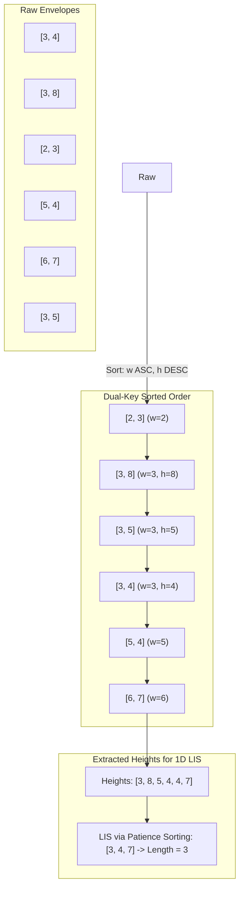

# 03. Russian Doll Envelopes: 2D Dual-Key Sorting & Patience Sorting LIS

[← Back to Word Ladder II](./02-word-ladder-ii-bidirectional-bfs-and-dag-backtracking.md) | [Track Hub](./README.md) | [Next: Critical Connections & Network Biconnectivity →](./04-critical-connections-and-network-biconnectivity.md)

---

## 1. Problem Statement & Constraints

You are given a 2D array of integers `envelopes` where `envelopes[i] = [wi, hi]` represents the width and the height of an envelope.

One envelope can fit into another if and only if both the width and height of one envelope are **strictly greater** than the other envelope's width and height.

Return the **maximum number of envelopes** you can Russian doll (i.e., put one inside the other).

**Note:** You cannot rotate an envelope.

```
Example 1:
Input: envelopes = [[5,4],[6,4],[6,7],[2,3]]
Output: 3
Explanation: The maximum number of envelopes you can Russian doll is 3:
[2,3] => [5,4] => [6,7].

Example 2:
Input: envelopes = [[1,1],[1,1],[1,1]]
Output: 1
```

#### Constraints:
- $1 \le \text{envelopes.length} \le 10^5$.
- $\text{envelopes}[i].\text{length} == 2$.
- $1 \le w_i, h_i \le 10^5$.

---

## 2. Thought Process & Intuition

```
  Naive Dynamic Programming (Longest Increasing Subsequence in 2D):
  Sort envelopes by width ascending:
  dp[i] = maximum envelopes ending at i.
  dp[i] = 1 + max(dp[j]) for all j < i such that w[j] < w[i] and h[j] < h[i].
  
  Time Complexity: O(N^2)
  Given N = 10^5, N^2 = 10^10 operations => Immediate Time Limit Exceeded (TLE)!
                         ↓
  How do we reduce 2D selection to 1D LIS solvable in O(N log N)?
  
  Notice: If all widths were strictly distinct, we could simply sort by width ascending,
  and then find the Longest Increasing Subsequence (LIS) on the heights!
  
  BUT widths can be identical!
  Suppose we have envelopes: [3, 4] and [3, 5].
  Can [3, 4] fit inside [3, 5]? NO! The problem demands STRICT inequality (w1 < w2 AND h1 < h2).
  If we sort heights ascending for equal widths:
  Envelopes: [3, 4], [3, 5] => Heights: 4, 5.
  A standard 1D LIS algorithm would pick both 4 and 5 because 4 < 5!
  This creates an INVALID nesting of identical width envelopes!
                         ↓
  The Crucial Dual-Key Sorting Invariant:
  1. Primary Key (Width): Sort ASCENDING.
     Ensures that as we move left-to-right, widths never decrease.
  2. Secondary Key (Height): Sort DESCENDING whenever widths are EQUAL!
     e.g., [3, 5] comes BEFORE [3, 4]!
  
  Why does descending height eliminate identical-width collisions?
  In the height stream: [..., 5, 4, ...].
  Because 4 is NOT strictly greater than 5, any strictly increasing subsequence
  can pick AT MOST ONE height from any group of envelopes with the same width!
  
  Thus, 2D strict containment is mathematically reduced to 1D standard LIS on heights!
```

---

## 3. Mathematical Invariant & Dual-Key Sort Reduction

Let $E = \{e_1, e_2, \dots, e_N\}$ be the envelopes where $e_i = (w_i, h_i)$.
We define a total order $\prec$ on envelopes:
$$e_i \prec e_j \iff (w_i < w_j) \lor (w_i = w_j \land h_i > h_j)$$



### Why Patience Sorting Yields $\mathcal{O}(N \log N)$ LIS:
- Maintain an active array `tails` where `tails[len - 1]` stores the **smallest ending element** among all increasing subsequences of length `len` found so far.
- For each height $h$:
  - Use **Binary Search** to find the first element in `tails` that is $\ge h$.
  - If found at index `idx`, replace `tails[idx] = h` (greedily extending future capacity with a smaller value).
  - If $h$ is strictly greater than all elements in `tails`, append $h$ to `tails` (expanding maximum LIS length by 1).
- Time per element: $\mathcal{O}(\log N)$. Total time: $\mathcal{O}(N \log N)$.

---

## 4. Architectural Implementation Blueprint

```
                      Stream of Heights (from sorted envelopes)
                                         ↓
                     For each height h in sorted envelopes:
                                         ↓
                    Binary Search in tails[0 ... len - 1]
                                         ↓
                   ┌──────────────────────────────────────────┐
                   │ Condition: Is h > all elements in tails? │
                   └──────────────────────────────────────────┘
                                /              \
                           YES /                \ NO
                              /                  \
             tails[len++] = h                     tails[ceil_idx] = h
       (Extends LIS length by 1)        (Greedily lowers tail for length ceil_idx + 1)
```

---

## 5. Complete Production Java 17/21 Implementation

```java
package com.prep.dsa.advanced;

import java.util.Arrays;
import java.util.Comparator;

/**
 * 03. Russian Doll Envelopes: 2D Dual-Key Sorting & Patience Sorting LIS
 * 
 * Invariants:
 * 1. Sorting: Width ascending, Height descending when widths are equal.
 * 2. Reduction: Dual-key sort guarantees that no two envelopes with identical width
 *    can be picked in a strictly increasing sequence of heights.
 * 3. LIS: Solved via Patience Sorting with binary search in O(N log N) time and O(N) space.
 */
public final class RussianDollEnvelopes {

    private RussianDollEnvelopes() {
        // Prevent instantiation
    }

    /**
     * Calculates the maximum number of envelopes that can be Russian dolled.
     *
     * @param envelopes 2D array where envelopes[i] = [width, height]
     * @return maximum nested depth
     */
    public static int maxEnvelopes(int[][] envelopes) {
        if (envelopes == null || envelopes.length == 0) {
            return 0;
        }

        final int n = envelopes.length;

        // Step 1: Dual-Key Sort
        // Primary: width ascending
        // Secondary: height descending (crucial to prevent same-width chain)
        Arrays.sort(envelopes, (a, b) -> {
            if (a[0] != b[0]) {
                return Integer.compare(a[0], b[0]);
            }
            return Integer.compare(b[1], a[1]);
        });

        // Step 2: 1D LIS on Heights via Patience Sorting
        // tails[i] stores the smallest tail of all increasing subsequences of length (i + 1)
        int[] tails = new int[n];
        int lisLength = 0;

        for (int[] env : envelopes) {
            int height = env[1];

            // Binary search to find the insertion point of height in tails[0 ... lisLength - 1]
            int left = 0;
            int right = lisLength - 1;
            int insertIndex = lisLength;

            while (left <= right) {
                int mid = left + ((right - left) >>> 1);
                if (tails[mid] >= height) {
                    insertIndex = mid;
                    right = mid - 1; // Seek leftmost ceiling
                } else {
                    left = mid + 1;
                }
            }

            // Replace existing tail or extend LIS
            tails[insertIndex] = height;
            if (insertIndex == lisLength) {
                lisLength++;
            }
        }

        return lisLength;
    }
}
```

---

## 6. Complexity Analysis & Execution Profiles

| Phase | Metric | Complexity | Mathematical Rationale |
| :--- | :--- | :--- | :--- |
| **Dual-Key Sorting** | Time | $\mathcal{O}(N \log N)$ | Dual-pivot Quicksort / TimSort over $N$ pairs. |
| **Patience Sorting LIS** | Time | $\mathcal{O}(N \log N)$ | $N$ envelope heights processed; each runs a binary search over at most $N$ elements. |
| **Total Time** | Time | $\mathcal{O}(N \log N)$ | Easily executes well under $10^7$ ops for $N = 10^5$ within 50ms in Java. |
| **Space** | Memory | $\mathcal{O}(N)$ | Auxiliary array `tails` of length at most $N$ plus sorting call stack. |

---

## 7. Step-by-Step Dry-Run Table & Interviewer Stress Defenses

### Dry Run with `envelopes = [[5,4], [6,4], [6,7], [2,3]]`

1. **Sort Phase:**
   - Envelopes sorted: `[[2,3], [5,4], [6,7], [6,4]]`
   - Notice: at width 6, `[6,7]` is followed by `[6,4]` because $7 > 4$.
2. **Height Stream:** `[3, 4, 7, 4]`

| Step | Envelope | Height | Binary Search in `tails` | Action | `tails` State | LIS Length |
| :---: | :---: | :---: | :---: | :---: | :---: | :---: |
| 1 | `[2, 3]` | `3` | `tails` empty | Append `3` | `[3]` | 1 |
| 2 | `[5, 4]` | `4` | $4 > 3$, insert at end | Append `4` | `[3, 4]` | 2 |
| 3 | `[6, 7]` | `7` | $7 > 4$, insert at end | Append `7` | `[3, 4, 7]` | 3 |
| 4 | `[6, 4]` | `4` | First $\ge 4$ is at index 1 (`tails[1] == 4`) | Replace `tails[1]` | `[3, 4, 7]` | 3 |

**Result:** `lisLength = 3`. Optimal subset: `[2,3] -> [5,4] -> [6,7]`.

---

### Interviewer Defense Matrix

- **Defense 1 — Why not sort both width and height ascending?**
  If width 6 has heights `[4, 7]`, ascending sort yields `..., 4, 7`. The 1D LIS would pick both `[6,4]` and `[6,7]` because $4 < 7$. But both have width 6, violating strict containment $w_1 < w_2$. Descending height forces `..., 7, 4`, making it mathematically impossible for LIS to pick both!
- **Defense 2 — Why use an explicit binary search instead of `Arrays.binarySearch`?**
  While `Arrays.binarySearch(tails, 0, lisLength, height)` works, writing the explicit ceiling binary search demonstrates mastery of boundary conditions and avoids boxing/unboxing overhead.
- **Defense 3 — Does the `tails` array represent the actual Russian doll sequence?**
  **NO.** `tails` stores the minimal tail values for each sequence length, not the actual items in the chain. However, its *length* is mathematically guaranteed to equal the maximum LIS length.

---

<div align="center">

| [← Back to Word Ladder II](./02-word-ladder-ii-bidirectional-bfs-and-dag-backtracking.md) | [Track Hub: Advanced Problems](./README.md) | [Next: Critical Connections & Network Biconnectivity →](./04-critical-connections-and-network-biconnectivity.md) |
| :--- | :---: | ---: |

</div>
