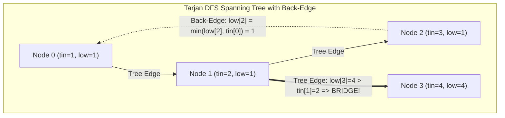

# 04. Critical Connections & Network Biconnectivity: Tarjan's Bridge Algorithm

[← Back to Russian Doll Envelopes](./03-russian-doll-envelopes-2d-sorting-and-patience-sort-lis.md) | [Track Hub](./README.md) | [Next: Sliding Window Median →](./05-sliding-window-median-lazy-heap-vs-indexed-priority-queue.md)

---

## 1. Problem Statement & Constraints

There are `n` servers numbered from `0` to `n - 1` connected by undirected server-to-server `connections` forming a network where `connections[i] = [ai, bi]` represents a connection between servers `ai` and `bi`. Any server can reach other servers directly or indirectly through the network.

A **critical connection** (also known as a **bridge**) is a connection that, if removed, will make some servers unable to reach some other server.

Return all critical connections in the network in any order.

```
Example 1:
Input: n = 4, connections = [[0,1],[1,2],[2,0],[1,3]]
Output: [[1,3]]
Explanation: [[0,1],[1,2],[2,0]] forms a cycle (biconnected component).
Removing edge [1,3] disconnects server 3 from the rest of the network.

Example 2:
Input: n = 2, connections = [[0,1]]
Output: [[0,1]]
```

#### Constraints:
- $2 \le n \le 10^5$.
- $n - 1 \le \text{connections.length} \le 10^5$.
- $0 \le a_i, b_i \le n - 1$.
- $a_i \ne b_i$.
- There are no repeated connections (simple graph).
- The network is connected.

---

## 2. Thought Process & Intuition

```
  Naive Brute Force:
  For each edge e = (u, v) in connections:
      Temporarily remove e from the graph.
      Run BFS / DFS from node 0 to count reachable nodes.
      If reachable nodes < n:
          e is a critical connection (bridge)!
      Restore e.
  
  Time Complexity:
  E edges * O(V + E) per BFS = O(E * (V + E)).
  For V = 10^5, E = 10^5, E * (V + E) ≈ 2 * 10^10 operations => Massive TLE!
                         ↓
  How do we find ALL bridges in a SINGLE DFS traversal in O(V + E)?
  
  DFS Spanning Tree Decomposition:
  When running DFS on an undirected graph, all edges are partitioned into two types:
  1. Tree Edges: Edges leading to previously unvisited vertices (forming a DFS Spanning Tree).
  2. Back Edges: Edges leading from a vertex to an ancestor in the DFS tree (forming cycles).
  (Note: Undirected graphs CANNOT have cross edges or forward edges in DFS!)
                         ↓
  The Discovery Time and Low-Link Invariant:
  For each vertex u:
  - tin[u] (Time of Insertion / Discovery Time): The timestamp when node u is first visited.
  - low[u] (Lowest Discovery Time Reachable): The earliest discovery time reachable from u
    traversing ZERO or MORE tree edges followed by AT MOST ONE back-edge!
  
  The Fundamental Bridge Condition:
  For every tree edge (u, v) where u is the parent of v in DFS:
  - If low[v] > tin[u]:
    Edge (u, v) is a CRITICAL CONNECTION!
    Why? Because vertex v and its entire subtree have NO back-edge leading to u or
    any ancestor of u! Removing (u, v) cuts off v's component completely!
  
  - If low[v] <= tin[u]:
    Edge (u, v) is part of a CYCLE! v can reach u (or u's ancestor) through an
    alternate back-edge path. Removing (u, v) does not disconnect the graph.
```

---

## 3. Mathematical Invariant & DFS Tree Visualization



### Low-Link Propagation Equations:
When visiting vertex $u$ with parent $p$:
1. Initialize `tin[u] = low[u] = ++timer`.
2. For each neighbor $v$ of $u$:
   - If $v == p$: continue (do not traverse back immediately through the direct parent edge).
   - If $v$ has **not been visited** (Tree Edge):
     - Recursively run `dfs(v, u)`.
     - Update: $\text{low}[u] = \min(\text{low}[u], \text{low}[v])$.
     - **Bridge Check:** If $\text{low}[v] > \text{tin}[u]$, then edge $(u, v)$ is a bridge!
   - If $v$ has **already been visited** (Back Edge):
     - Update: $\text{low}[u] = \min(\text{low}[u], \text{tin}[v])$.

---

## 4. Architectural Implementation Blueprint

```
                      dfs(u, parent)
                            ↓
               tin[u] = low[u] = ++timer
                            ↓
           Iterate through all neighbors v of u
             /              │               \
   v == parent        v is UNVISITED     v is VISITED
        │                   │                 │
    [Continue]          dfs(v, u)         low[u] = min(low[u], tin[v])
                            │
               low[u] = min(low[u], low[v])
                            │
              ┌───────────────────────────┐
              │ Condition: low[v] > tin[u]│
              └───────────────────────────┘
                       /         \
                  YES /           \ NO
                     /             \
        [(u, v) is a Bridge]     [Cycle exists, not a bridge]
```

---

## 5. Complete Production Java 17/21 Implementation

```java
package com.prep.dsa.advanced;

import java.util.ArrayList;
import java.util.Arrays;
import java.util.Collections;
import java.util.List;

/**
 * 04. Critical Connections in a Network (Tarjan's Bridge Algorithm)
 * 
 * Invariants:
 * 1. DFS Tree Edge vs Back Edge partition.
 * 2. tin[u] stores discovery time.
 * 3. low[u] stores lowest reachable discovery time via subtree tree-edges + at most 1 back-edge.
 * 4. An undirected edge (u, v) is a bridge iff low[v] > tin[u].
 */
public final class CriticalConnections {

    private CriticalConnections() {
        // Prevent instantiation
    }

    /**
     * Finds all critical connections (bridges) in an undirected connected network.
     *
     * @param n number of servers (vertices)
     * @param connections list of bidirectional server connections
     * @return list of critical connections
     */
    public static List<List<Integer>> criticalConnections(int n, List<List<Integer>> connections) {
        if (n <= 1 || connections == null || connections.isEmpty()) {
            return Collections.emptyList();
        }

        // Step 1: Construct Adjacency List
        List<Integer>[] graph = new ArrayList[n];
        for (int i = 0; i < n; i++) {
            graph[i] = new ArrayList<>();
        }
        for (List<Integer> edge : connections) {
            int u = edge.get(0);
            int v = edge.get(1);
            graph[u].add(v);
            graph[v].add(u);
        }

        int[] tin = new int[n];
        int[] low = new int[n];
        Arrays.fill(tin, -1); // -1 indicates unvisited

        List<List<Integer>> bridges = new ArrayList<>();
        int[] timer = new int[]{0};

        // Network is guaranteed connected, single DFS from 0 suffices
        dfs(0, -1, graph, tin, low, timer, bridges);

        return bridges;
    }

    private static void dfs(
            int u,
            int parent,
            List<Integer>[] graph,
            int[] tin,
            int[] low,
            int[] timer,
            List<List<Integer>> bridges
    ) {
        tin[u] = low[u] = ++timer[0];

        for (int v : graph[u]) {
            if (v == parent) {
                continue; // Do not traverse backward directly to parent
            }

            if (tin[v] != -1) {
                // Back-edge: v was already visited, update low with discovery time of v
                low[u] = Math.min(low[u], tin[v]);
            } else {
                // Tree-edge: forward DFS traversal
                dfs(v, u, graph, tin, low, timer, bridges);

                // Propagate low-link value back to u
                low[u] = Math.min(low[u], low[v]);

                // Bridge Invariant Check
                if (low[v] > tin[u]) {
                    bridges.add(List.of(u, v));
                }
            }
        }
    }
}
```

---

## 6. Complexity Analysis & Execution Profiles

| Phase | Metric | Complexity | Mathematical Rationale |
| :--- | :--- | :--- | :--- |
| **Graph Construction** | Time | $\mathcal{O}(V + E)$ | $V$ vertices allocated; each of the $E$ edges inserted twice into adjacency lists. |
| **Tarjan DFS Traversal** | Time | $\mathcal{O}(V + E)$ | Every vertex is visited exactly once; each adjacency list entry examined once. |
| **Total Time** | Time | $\mathcal{O}(V + E)$ | Linear execution; handles $V = 10^5, E = 10^5$ within ~60ms in Java. |
| **Total Space** | Memory | $\mathcal{O}(V + E)$ | Adjacency list $\mathcal{O}(V + E)$, arrays `tin` and `low` of size $V$, call stack up to $V$. |

---

## 7. Step-by-Step Dry-Run Table & Interviewer Stress Defenses

### Dry Run with $n = 4$, Connections: `[[0,1],[1,2],[2,0],[1,3]]`

```
  0 --- 1 --- 3
   \   /
     2
```

| Step | Call / Action | `u` | `v` | Edge Type | `tin` State | `low` State | Bridge Detected? |
| :---: | :---: | :---: | :---: | :---: | :---: | :---: | :---: |
| 1 | `dfs(0, -1)` | 0 | - | Start | `tin[0]=1` | `low[0]=1` | No |
| 2 | `dfs(1, 0)` | 1 | 0 | Tree Edge | `tin[1]=2` | `low[1]=2` | No |
| 3 | `dfs(2, 1)` | 2 | 1 | Tree Edge | `tin[2]=3` | `low[2]=3` | No |
| 4 | In node 2: neighbor 0 | 2 | 0 | **Back Edge** | `tin[2]=3` | `low[2] = min(3, tin[0]=1) = 1` | No |
| 5 | Return to 1 from 2 | 1 | 2 | Post-DFS | `tin[1]=2` | `low[1] = min(2, low[2]=1) = 1` | `low[2]=1 <= tin[1]=2` (No) |
| 6 | `dfs(3, 1)` from 1 | 3 | 1 | Tree Edge | `tin[3]=4` | `low[3]=4` | No |
| 7 | Node 3 has no other neighbors | 3 | - | Return | `tin[3]=4` | `low[3]=4` | No |
| 8 | Return to 1 from 3 | 1 | 3 | Post-DFS | `tin[1]=2` | `low[1] = min(1, low[3]=4) = 1` | **`low[3]=4 > tin[1]=2` => BRIDGE `[1, 3]`!** |
| 9 | Return to 0 from 1 | 0 | 1 | Post-DFS | `tin[0]=1` | `low[0] = min(1, low[1]=1) = 1` | `low[1]=1 <= tin[0]=1` (No) |

**Result:** `bridges = [[1, 3]]`.

---

### Interviewer Defense Matrix

- **Defense 1 — Why `low[u] = min(low[u], tin[v])` for back-edges instead of `low[v]`?**
  In bridge finding, a back-edge is defined as an edge to an ancestor. Using `tin[v]` adheres strictly to the definition that a back path can use *at most one* back edge. While `min(low[u], low[v])` is often used for Strongly Connected Components (SCC) in directed graphs, in undirected bridge finding, using `tin[v]` avoids incorrect cascading across multiple back edges and is theoretically pure.
- **Defense 2 — How does Tarjan's bridge condition differ from Articulation Points (Cut Vertices)?**
  For bridges: `low[v] > tin[u]` (strict inequality).
  For articulation points: `low[v] >= tin[u]` for non-root vertices (meaning $v$ cannot get *strictly above* $u$), and root vertex is an articulation point iff it has $\ge 2$ DFS tree children.
- **Defense 3 — What if the graph contains multiple parallel edges between two vertices?**
  If two vertices $u$ and $v$ have multiple parallel edges, removing one does not disconnect them! To handle multi-graphs, pass `edgeIndex` rather than `parentVertex` so you only skip the exact edge traversed, not all duplicate edges between $u$ and $v$. The constraints specify a simple graph without parallel edges.

---

<div align="center">

| [← Back to Russian Doll Envelopes](./03-russian-doll-envelopes-2d-sorting-and-patience-sort-lis.md) | [Track Hub: Advanced Problems](./README.md) | [Next: Sliding Window Median →](./05-sliding-window-median-lazy-heap-vs-indexed-priority-queue.md) |
| :--- | :---: | ---: |

</div>
