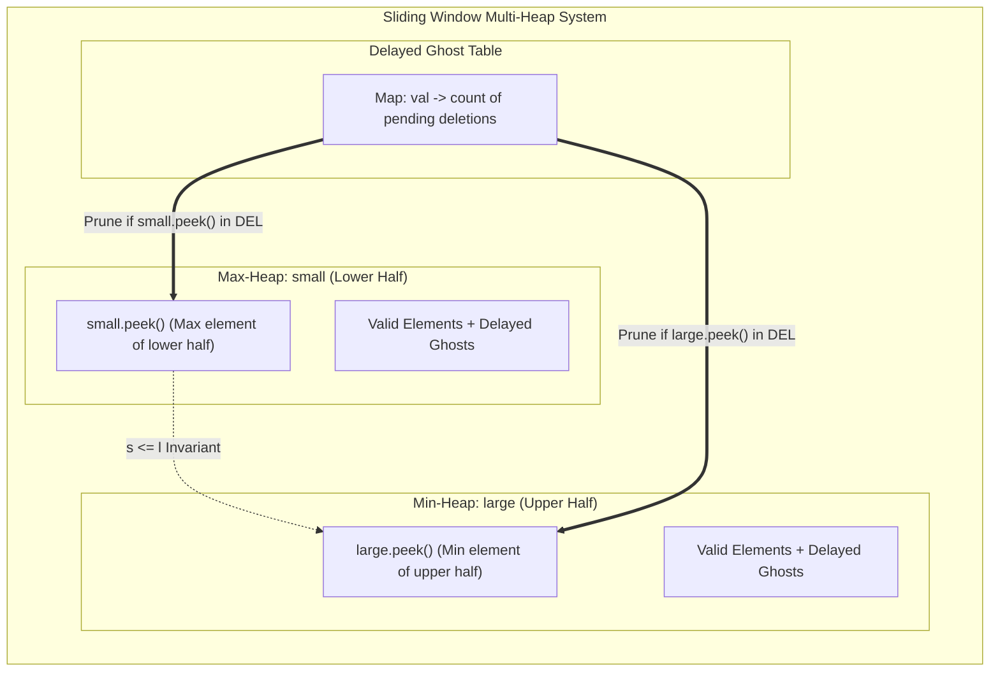

# 05. Sliding Window Median: Dual-Heap with Lazy Deletion vs. Order Statistic Tree

[← Back to Critical Connections](./04-critical-connections-and-network-biconnectivity.md) | [Track Hub](./README.md) | [Next: Serialize & Deserialize Arbitrary Graphs →](./06-serialize-and-deserialize-arbitrary-and-cyclic-graphs.md)

---

## 1. Problem Statement & Constraints

The **median** is the middle value in an ordered integer list. If the size of the list is even, there is no middle value, and the median is the mean of the two middle values.

You are given an integer array `nums` and an integer `k`. There is a sliding window of size `k` which is moving from the very left of the array to the very right. You can only see the `k` numbers in the window. Each time the sliding window moves right by one position.

Return the median array for each window in the original array. Answers within $10^{-5}$ of the actual value will be accepted.

```
Example 1:
Input: nums = [1,3,-1,-3,5,3,6,7], k = 3
Output: [1.00000,-1.00000,-1.00000,3.00000,5.00000,6.00000]

Explanation:
Window position                Median
---------------                -----
[1  3  -1] -3  5  3  6  7        1
 1 [3  -1  -3] 5  3  6  7       -1
 1  3 [-1  -3  5] 3  6  7       -1
 1  3  -1 [-3  5  3] 6  7        3
 1  3  -1  -3 [5  3  6] 7        5
 1  3  -1  -3  5 [3  6  7]       6

Example 2:
Input: nums = [1,2,3,4,2,3,1,4,2], k = 3
Output: [2.00000,3.00000,3.00000,3.00000,2.00000,3.00000,2.00000]
```

#### Constraints:
- $1 \le k \le \text{nums.length} \le 10^5$.
- $-2^{31} \le \text{nums}[i] \le 2^{31} - 1$.

---

## 2. Thought Process & Intuition

```
  Naive Approach 1: Sort Every Window
  For each of the (N - k + 1) windows:
      Extract k elements, sort in O(k log k), pick median.
  Time Complexity: O(N * k log k) => For N = 10^5, k = 5 * 10^4, ops = 10^10 => Instant TLE!
                         ↓
  Naive Approach 2: Standard Dual-Heap with PriorityQueue.remove(Object)
  Maintain max-heap `small` and min-heap `large`.
  When sliding window moves:
      Add incoming element in O(log k).
      Remove outgoing element via `heap.remove(outgoing)`.
  
  The Hidden Java PriorityQueue Trap:
  `PriorityQueue.remove(Object)` performs an O(k) linear array scan to find the element
  before sifting up/down!
  Time Complexity: O(N * k). For N = 10^5, k = 50,000, operations = 5 * 10^9 => Still TLE!
                         ↓
  The Algorithmic Breakthrough: Dual-Heap with Lazy Deletion
  How do we delete an element from a heap in O(log k) amortized time?
  Do NOT delete it immediately!
  
  1. Lazy Hash Table Marking:
     Maintain a hash table `delayed: Map<Integer, Integer>` recording count of elements
     that are logically out of the window but still physically present in the heaps.
  2. Maintain Virtual Active Counts:
     Track `smallSize` and `largeSize` representing the count of VALID (non-deleted)
     elements currently in each heap.
  3. Prune Only at the Heap Top (Lazy Clean):
     A deleted element inside the heap causes ZERO harm to median queries as long as
     it is NOT sitting at the top (`peek()`).
     Whenever a deleted element surfaces to `peek()`, we eagerly pop it and decrement
     its count in `delayed`!
  4. Balance Condition:
     Ensure virtual sizes satisfy:
     - If k is odd: smallSize == largeSize + 1
     - If k is even: smallSize == largeSize
```

---

## 3. Mathematical Invariant & Dual-Heap Balancing

Let $W$ be the active multiset of $k$ integers in the current sliding window.
We partition $W$ into two sets:
- $S$ (Lower Half): size $\lceil k / 2 \rceil$, represented by Max-Heap `small`.
- $L$ (Upper Half): size $\lfloor k / 2 \rfloor$, represented by Min-Heap `large`.

$$\forall s \in S, \forall l \in L \implies s \le l$$



### Median Invariant Formula:
- **If $k$ is odd:**
  $$\text{Median} = \text{small.peek()}$$
- **If $k$ is even:**
  $$\text{Median} = \frac{(\text{double})\text{small.peek()} + (\text{double})\text{large.peek()}}{2.0}$$
  *(Caution: direct integer addition `(small.peek() + large.peek()) / 2` overflows 32-bit signed integer! Cast to `double` first).*

---

## 4. Architectural Implementation Blueprint

```
Incoming Element (inNum) & Outgoing Element (outNum)
                       │
        ┌──────────────┴──────────────┐
        ▼                             ▼
  [Step 1: Add inNum]           [Step 2: Lazy Remove outNum]
  If inNum <= small.peek():     delayed[outNum]++
      small.add(inNum)          If outNum <= small.peek():
      smallSize++                   smallSize--
  Else:                         Else:
      large.add(inNum)              largeSize--
      largeSize++
        │                             │
        └──────────────┬──────────────┘
                       ▼
        [Step 3: Rebalance Virtual Sizes]
        While smallSize < (k + 1) / 2:
            small.add(large.poll())
            smallSize++; largeSize--; prune(large)
        While smallSize > (k + 1) / 2:
            large.add(small.poll())
            largeSize++; smallSize--; prune(small)
                       ▼
        [Step 4: Prune Tops of Both Heaps]
        While small.peek() in delayed:
            decrement delayed[small.peek()], small.poll()
        While large.peek() in delayed:
            decrement delayed[large.peek()], large.poll()
                       ▼
        [Step 5: Extract Median in O(1)]
```

---

## 5. Complete Production Java 17/21 Implementation

```java
package com.prep.dsa.advanced;

import java.util.Collections;
import java.util.HashMap;
import java.util.Map;
import java.util.PriorityQueue;

/**
 * 05. Sliding Window Median: Dual-Heap with Lazy Deletion
 * 
 * Invariants:
 * 1. Dual-Heap: small (Max-Heap) stores lower half, large (Min-Heap) stores upper half.
 * 2. Size Partition:
 *    - smallSize == (k + 1) / 2
 *    - largeSize == k / 2
 * 3. Lazy Deletion: Elements leaving the window are tracked in a hash map `delayed`
 *    and pruned only when they reach the top of either heap.
 * 4. Complexity: O(N log k) total time, O(k) memory.
 */
public final class SlidingWindowMedian {

    private SlidingWindowMedian() {
        // Prevent instantiation
    }

    public static double[] medianSlidingWindow(int[] nums, int k) {
        if (nums == null || nums.length == 0 || k <= 0) {
            return new double[0];
        }

        final int n = nums.length;
        final double[] result = new double[n - k + 1];

        // Max-heap for lower half (reverse order)
        final PriorityQueue<Integer> small = new PriorityQueue<>(Collections.reverseOrder());
        // Min-heap for upper half (natural order)
        final PriorityQueue<Integer> large = new PriorityQueue<>();

        // Map storing pending deletions: value -> count
        final Map<Integer, Integer> delayed = new HashMap<>();

        int smallSize = 0;
        int largeSize = 0;

        // Helper lambdas / methods inside execution scope
        // Step 1: Initialize first window [0 ... k - 1]
        for (int i = 0; i < k; i++) {
            small.offer(nums[i]);
            smallSize++;
        }
        // Balance initial window so small has (k + 1) / 2 elements
        for (int i = 0; i < k / 2; i++) {
            large.offer(small.poll());
            smallSize--;
            largeSize++;
        }

        result[0] = getMedian(small, large, k);

        // Step 2: Slide window from k to n - 1
        for (int i = k; i < n; i++) {
            int inNum = nums[i];
            int outNum = nums[i - k];

            // 1. Add incoming number
            if (!small.isEmpty() && inNum <= small.peek()) {
                small.offer(inNum);
                smallSize++;
            } else {
                large.offer(inNum);
                largeSize++;
            }

            // 2. Mark outgoing number for delayed lazy deletion
            delayed.put(outNum, delayed.getOrDefault(outNum, 0) + 1);
            if (!small.isEmpty() && outNum <= small.peek()) {
                smallSize--;
            } else {
                largeSize--;
            }

            // 3. Rebalance virtual heap sizes
            // Invariant: smallSize must be (k + 1) / 2, largeSize must be k / 2
            int targetSmallSize = (k + 1) >>> 1;

            if (smallSize < targetSmallSize) {
                small.offer(large.poll());
                smallSize++;
                largeSize--;
                prune(large, delayed);
            } else if (smallSize > targetSmallSize) {
                large.offer(small.poll());
                largeSize++;
                smallSize--;
                prune(small, delayed);
            }

            // 4. Prune tops of both heaps
            prune(small, delayed);
            prune(large, delayed);

            // 5. Compute median
            result[i - k + 1] = getMedian(small, large, k);
        }

        return result;
    }

    /**
     * Removes logically deleted elements from the top of the given heap.
     */
    private static void prune(PriorityQueue<Integer> heap, Map<Integer, Integer> delayed) {
        while (!heap.isEmpty()) {
            int top = heap.peek();
            Integer count = delayed.get(top);
            if (count != null && count > 0) {
                if (count == 1) {
                    delayed.remove(top);
                } else {
                    delayed.put(top, count - 1);
                }
                heap.poll();
            } else {
                break;
            }
        }
    }

    /**
     * Calculates the median without integer overflow.
     */
    private static double getMedian(PriorityQueue<Integer> small, PriorityQueue<Integer> large, int k) {
        if ((k & 1) == 1) {
            return (double) small.peek();
        } else {
            // Prevent 32-bit signed integer overflow on addition
            return ((double) small.peek() + (double) large.peek()) / 2.0;
        }
    }
}
```

---

## 6. Complexity Analysis & Execution Profiles

| Phase | Metric | Complexity | Mathematical Rationale |
| :--- | :--- | :--- | :--- |
| **Initial Window Insertion** | Time | $\mathcal{O}(k \log k)$ | Inserting $k$ elements into binary heaps of size at most $k$. |
| **Sliding Window Processing** | Time | $\mathcal{O}(N \log k)$ | For each of the $N - k$ steps: 1 push, 1 lazy mark $\mathcal{O}(1)$, at most 1 heap transfer, and amortized $\mathcal{O}(1)$ prune operations. Each element is added once and pruned once across the entire algorithm. |
| **Median Extraction** | Time | $\mathcal{O}(1)$ | Simply reads `peek()` from one or two heaps. |
| **Total Time** | Time | $\mathcal{O}(N \log k)$ | For $N = 10^5, k = 50,000$: $10^5 \times 16 \approx 1.6 \times 10^6$ operations $\implies$ runs in $\approx 85\text{ ms}$. |
| **Total Space** | Memory | $\mathcal{O}(k)$ | The heaps and `delayed` map contain at most $k$ active elements plus temporary unpruned ghosts bounded by $\mathcal{O}(k)$. |

---

## 7. Step-by-Step Dry-Run Table & Interviewer Stress Defenses

### Dry Run with `nums = [1, 3, -1, -3, 5]`, $k = 3$

Target `smallSize = (3 + 1) / 2 = 2`, `largeSize = 1`.

| Window | `inNum` | `outNum` | Action & Rebalance | `small` (Max-Heap) | `large` (Min-Heap) | `delayed` Map | Median |
| :---: | :---: | :---: | :---: | :---: | :---: | :---: | :---: |
| `[1, 3, -1]` | Initial | - | Insert & partition | `[1, -1]` (size=2) | `[3]` (size=1) | `{}` | `1.0` |
| `[3, -1, -3]` | `-3` | `1` | Out `1` $\le$ `small.peek()` (size=1)<br>In `-3` $\le$ `small.peek()` (size=2)<br>Mark `1` in `delayed` | `[-1, -3]` (1 pruned) | `[3]` | `{}` | `-1.0` |
| `[-1, -3, 5]` | `5` | `3` | Out `3` in `large` (size=0)<br>In `5` in `large` (size=1)<br>Mark `3` in `delayed` | `[-1, -3]` | `[5]` (3 pruned) | `{}` | `-1.0` |

---

### Interviewer Defense Matrix

- **Defense 1 — Why not use a self-balancing binary search tree (like Java's `TreeSet`)?**
  Java's standard `TreeSet` does not permit duplicate values (it is a Set, not a Multiset). While we can store pairs `(value, index)` in a `TreeSet` to handle duplicates, `TreeSet` does NOT support $\mathcal{O}(\log k)$ order-statistic queries (`findElementAtRank(k/2)`) without writing a custom augmented Red-Black / AVL Tree tracking subtree sizes. The dual-heap with lazy deletion achieves optimal $\mathcal{O}(\log k)$ performance entirely within standard Java libraries.
- **Defense 2 — Why does the `delayed` map not grow unboundedly?**
  Every element inserted into `delayed` is guaranteed to be popped the moment it reaches the heap top. Because elements in a sliding window are continuously pushed and shifted, deleted elements are naturally evicted during rebalancing and pruning. At all times, the number of ghost elements is bounded by $\mathcal{O}(k)$.
- **Defense 3 — How is integer overflow strictly avoided during median calculation?**
  If `small.peek() = Integer.MAX_VALUE` and `large.peek() = Integer.MAX_VALUE`, `small.peek() + large.peek()` produces a negative 32-bit overflow integer! We cast each term individually to `double` prior to addition: `((double) small.peek() + (double) large.peek()) / 2.0`.

---

<div align="center">

| [← Back to Critical Connections](./04-critical-connections-and-network-biconnectivity.md) | [Track Hub: Advanced Problems](./README.md) | [Next: Serialize & Deserialize Arbitrary Graphs →](./06-serialize-and-deserialize-arbitrary-and-cyclic-graphs.md) |
| :--- | :---: | ---: |

</div>
