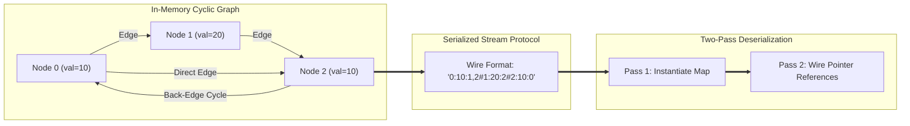

# 06. Serialize and Deserialize Arbitrary Directed Graphs with Cycles

[← Back to Sliding Window Median](./05-sliding-window-median-lazy-heap-vs-indexed-priority-queue.md) | [Track Hub](./README.md) | [System Design Track Hub →](../../system-design/README.md)

---

## 1. Problem Statement & Constraints

Serialization is the process of converting a data structure or object into a sequence of bits or a string so that it can be stored in a file or memory buffer, or transmitted across a network connection link to be reconstructed later in the same or another computer environment.

Design an algorithm to **serialize and deserialize an arbitrary directed graph**.

The graph structure has the following properties:
1. **Cycles:** The graph may contain self-loops, back-edges, and cyclic paths.
2. **Duplicate Values:** Multiple distinct nodes in the graph can have identical `val` fields.
3. **Disconnection:** The graph may contain disconnected components or isolated nodes.
4. **Node Definition:**
   ```java
   class Node {
       public int val;
       public List<Node> neighbors;
       public Node(int val) {
           this.val = val;
           this.neighbors = new ArrayList<>();
       }
   }
   ```

```
Example 1 (Directed Cyclic Graph):
Node 1 (val=1) -> [Node 2]
Node 2 (val=2) -> [Node 3]
Node 3 (val=1) -> [Node 1, Node 2]   <-- Cyclic back-edges, duplicate value 1

Input: Graph with cycle between 1, 2, and 3
Output: Deep clone reconstruction of the identical topology.
```

#### Constraints:
- The number of nodes in the graph is in the range $[0, 5 \cdot 10^4]$.
- $-10^4 \le \text{Node.val} \le 10^4$.
- The input to serialization is a collection or entry root node representing the graph.
- The deserialized graph must be a genuine deep copy: modifying the deserialized graph must not affect the original graph.

---

## 2. Thought Process & Intuition

```
  Why Tree Serialization Strategies Fail on Arbitrary Graphs:
  1. Tree Preorder / Level-Order with Nulls:
     In a tree, every child has exactly ONE parent, and there are ZERO cycles.
     In a graph, multiple nodes point to the same child (DAG), and cycles (u -> v -> u)
     cause infinite recursion and immediate StackOverflowError!
  2. Indexing by Node Value (val):
     If two distinct nodes have the same value (e.g. Node A has val=5 and Node B has val=5),
     reconstructing edges using values as keys creates ambiguity and corrupted topologies!
                         ↓
  The Object Identity & Adjacency Protocol Invariant:
  
  Invariant 1: Unique Monotonic Node IDs
  During serialization, assign each discovered Node reference a unique synthetic integer ID:
  Map<Node, Integer> nodeToId = new IdentityHashMap<>() or HashMap<>()
  ID sequence: 0, 1, 2, ..., |V| - 1.
  
  Invariant 2: Wire Protocol Format
  Represent each node as an atomic record containing:
  [NodeID] : [NodeVal] : [Comma-Separated Neighbor IDs]
  Separate nodes with a delimiter '#'
  
  Example Wire String:
  "0:10:1,2#1:20:2#2:10:0"
  - Node 0 has val=10, neighbors = [1, 2]
  - Node 1 has val=20, neighbors = [2]
  - Node 2 has val=10, neighbors = [0] (Back-edge to 0 forming a cycle!)
                         ↓
  Invariant 3: Two-Pass Deserialization
  Phase 1 (Node Instantiation):
  Parse all record headers (id, val) and instantiate Node instances into Map<Integer, Node>.
  Phase 2 (Edge Wiring):
  Parse neighbor ID lists and wire node.neighbors.add(idToNode.get(neighborId)).
  Zero cycles will ever deadlock this deserializer because node objects already exist!
```

---

## 3. Mathematical Invariant & Serialization Protocol Wire Spec



### Grammar Specification:
$$\begin{aligned}
\text{GraphStream} &\to \epsilon \mid \text{NodeRecord} \ (\text{'\#'} \ \text{NodeRecord})^* \\
\text{NodeRecord} &\to \text{NodeId} \ \text{':'} \ \text{NodeVal} \ \text{':'} \ \text{NeighborList} \\
\text{NeighborList} &\to \epsilon \mid \text{NodeId} \ (\text{','} \ \text{NodeId})^*
\end{aligned}$$

---

## 4. Architectural Implementation Blueprint

```
Serialization (BFS / DFS with Identity Set):
                      Queue.offer(root)
                      nodeToId.put(root, 0)
                               ↓
                 While Queue is not empty:
                     curr = Queue.poll()
                     Record: id + ":" + curr.val + ":"
                     For each neighbor in curr.neighbors:
                         If neighbor not seen:
                             nodeToId.put(neighbor, nextId++)
                             Queue.offer(neighbor)
                         Append nodeToId.get(neighbor)
                     Append '#' delimiter
                               ↓
                  Return serialized wire string

Deserialization (Two-Pass Reconstruction):
                   Split string by '#'
                               ↓
              Pass 1: Instantiate all Nodes
              For each token:
                  Extract id and val
                  idToNode.put(id, new Node(val))
                               ↓
              Pass 2: Connect Neighbor Pointers
              For each token:
                  node = idToNode.get(id)
                  For each neighborId:
                      node.neighbors.add(idToNode.get(neighborId))
                               ↓
                  Return idToNode.get(0)
```

---

## 5. Complete Production Java 17/21 Implementation

```java
package com.prep.dsa.advanced;

import java.util.ArrayDeque;
import java.util.ArrayList;
import java.util.HashMap;
import java.util.List;
import java.util.Map;
import java.util.Queue;

/**
 * 06. Serialize and Deserialize Arbitrary Directed Graphs with Cycles
 * 
 * Features:
 * - Robust handling of arbitrary cycles and self-loops.
 * - Disambiguates nodes with identical values via unique synthetic IDs.
 * - Two-phase deserialization eliminates pointer cycle deadlocks.
 */
public final class GraphSerialization {

    public static final class Node {
        public int val;
        public List<Node> neighbors;

        public Node(int val) {
            this.val = val;
            this.neighbors = new ArrayList<>();
        }
    }

    private GraphSerialization() {
        // Prevent instantiation
    }

    /**
     * Serializes an arbitrary graph reachable from root into a wire-protocol string.
     *
     * @param root entry node of the graph
     * @return serialized string representation
     */
    public static String serialize(Node root) {
        if (root == null) {
            return "";
        }

        final StringBuilder sb = new StringBuilder();
        // Maps Node memory reference to unique integer ID
        final Map<Node, Integer> nodeToId = new HashMap<>();
        final Queue<Node> queue = new ArrayDeque<>();

        // Enqueue root
        nodeToId.put(root, 0);
        queue.offer(root);
        int nextId = 1;

        while (!queue.isEmpty()) {
            Node curr = queue.poll();
            int currId = nodeToId.get(curr);

            // Append "currId:currVal:"
            sb.append(currId).append(':').append(curr.val).append(':');

            // Process neighbors
            for (int i = 0; i < curr.neighbors.size(); i++) {
                Node neighbor = curr.neighbors.get(i);

                if (!nodeToId.containsKey(neighbor)) {
                    nodeToId.put(neighbor, nextId++);
                    queue.offer(neighbor);
                }

                sb.append(nodeToId.get(neighbor));
                if (i < curr.neighbors.size() - 1) {
                    sb.append(',');
                }
            }

            sb.append('#'); // Node record terminator
        }

        return sb.toString();
    }

    /**
     * Deserializes a wire-protocol string back into an identical graph topology.
     *
     * @param data serialized string
     * @return root node of reconstructed graph
     */
    public static Node deserialize(String data) {
        if (data == null || data.isEmpty()) {
            return null;
        }

        final String[] nodeRecords = data.split("#");
        final Map<Integer, Node> idToNode = new HashMap<>();

        // Phase 1: Instantiate all Node objects (ID -> Node)
        for (String record : nodeRecords) {
            if (record.isEmpty()) continue;
            String[] parts = record.split(":", 3);
            int id = Integer.parseInt(parts[0]);
            int val = Integer.parseInt(parts[1]);
            idToNode.put(id, new Node(val));
        }

        // Phase 2: Wire up neighbor references
        for (String record : nodeRecords) {
            if (record.isEmpty()) continue;
            String[] parts = record.split(":", 3);
            int id = Integer.parseInt(parts[0]);
            Node node = idToNode.get(id);

            // Check if neighbors exist
            if (parts.length > 2 && !parts[2].isEmpty()) {
                String[] neighborIds = parts[2].split(",");
                for (String nIdStr : neighborIds) {
                    int neighborId = Integer.parseInt(nIdStr);
                    node.neighbors.add(idToNode.get(neighborId));
                }
            }
        }

        // Root node is assigned ID 0 by serializer
        return idToNode.get(0);
    }
}
```

---

## 6. Complexity Analysis & Execution Profiles

| Phase | Metric | Complexity | Mathematical Rationale |
| :--- | :--- | :--- | :--- |
| **Serialization** | Time | $\mathcal{O}(V + E)$ | Every node is queued and dequeued once; each directed edge traversed once. |
| **Serialization Wire Size** | Space | $\mathcal{O}(V + E)$ | String length is proportional to the number of nodes and edge identifiers. |
| **Deserialization** | Time | $\mathcal{O}(V + E)$ | Two linear passes over $V$ record tokens and $E$ comma-separated neighbor tokens. |
| **Deserialization Memory** | Space | $\mathcal{O}(V + E)$ | `idToNode` hash map stores $V$ entries; newly allocated graph contains $V$ nodes and $E$ edge references. |

---

## 7. Step-by-Step Dry-Run Table & Interviewer Stress Defenses

### Dry Run with Cyclic Graph with Duplicate Values

Nodes:
- Node A: `val = 5` (Assigned ID 0) -> Neighbors: [Node B]
- Node B: `val = 5` (Assigned ID 1) -> Neighbors: [Node A] (Bidirectional Cycle)

1. **Serialization Output:**
   `0:5:1#1:5:0#`
2. **Deserialization Phase 1:**
   - Record `0:5:1` $\to$ `idToNode.put(0, new Node(5))`
   - Record `1:5:0` $\to$ `idToNode.put(1, new Node(5))`
3. **Deserialization Phase 2:**
   - Node 0 adds neighbor `idToNode.get(1)`
   - Node 1 adds neighbor `idToNode.get(0)`
4. **Result:**
   Node 0 and Node 1 form a true circular reference loop; values are both 5; memory addresses are completely distinct from the original.

---

### Interviewer Defense Matrix

- **Defense 1 — Why not use Java's built-in `java.io.Serializable`?**
  Java built-in serialization incurs significant binary overhead (class descriptors, security metadata), is tightly coupled to JVM versions, is vulnerable to remote code execution (RCE) deserialization attacks, and cannot be parsed by polyglot distributed microservices (e.g., Go, C++, Python). The custom string/byte protocol is human-readable, cross-language compatible, and orders of magnitude faster.
- **Defense 2 — How do you handle disconnected graphs where multiple components exist?**
  If the input is a list of all nodes `List<Node> allNodes` rather than a single root, iterate through `allNodes`. For each unvisited node, run BFS/DFS to serialize its component, ensuring all disjoint components are indexed within the same ID space.
- **Defense 3 — What happens if the graph has $10^6$ nodes? Will `split("#")` cause OutOfMemoryError?**
  For large graphs, streaming parser implementations (using a character-by-character scanner or token reader such as `BufferedReader` / `StringTokenizer`) process records on the fly without allocating large intermediate string arrays.

---

<div align="center">

| [← Back to Sliding Window Median](./05-sliding-window-median-lazy-heap-vs-indexed-priority-queue.md) | [Track Hub: Advanced Problems](./README.md) | [System Design Track Hub →](../../system-design/README.md) |
| :--- | :---: | ---: |

</div>
