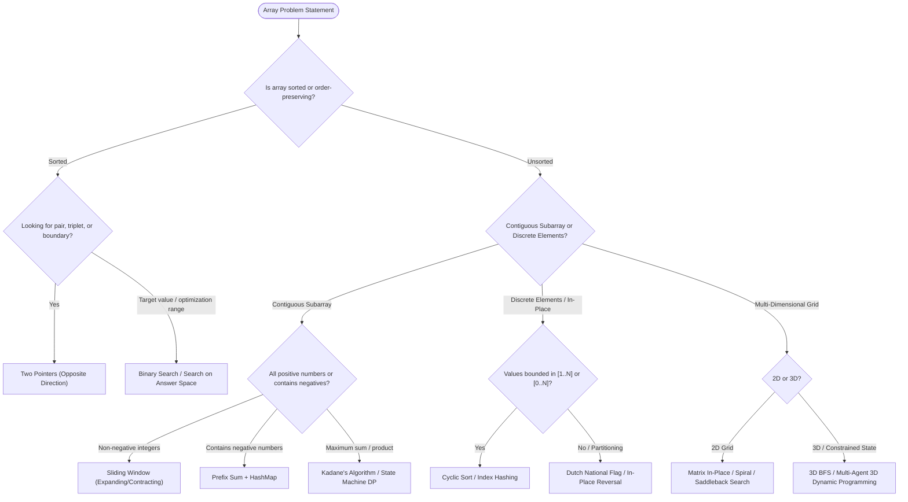

# Data Structures & Algorithms: Arrays Mastery (1D, 2D, 3D)

Welcome to the **Arrays Track**. Arrays are the most fundamental, contiguous data structure in computer science. They form the foundational substrate upon which strings, matrices, heaps, hash tables, and dynamic lists are constructed.

This curriculum is structured in two progressive phases:
1. **Foundational Architecture**: Comprehensive exploration of 1D, 2D, and 3D array mechanics, JVM memory models, cache locality, and coordinate mathematics.
2. **Algorithmic Mastery**: Systematic problem archetypes, algorithm selection taxonomies, canonical patterns, step-by-step dry run traces, and large-scale system constraints.

---

## 🗺️ Curriculum Roadmap

```text
╭────────────────────────────────────────────────────────────────────────────────────────╮
│                               ARRAYS CURRICULUM ROADMAP                                │
├────────────────────────────────────────────────────────────────────────────────────────┤
│  [Page 00] Problem Types & Algorithm Taxonomy (Question Archetypes & Algorithm Matrix)  │
│                                    │                                                   │
│                                    ▼                                                   │
│  [Page 01] 1D Arrays & Memory Architecture (JVM Heap, Cache Lines, SIMD Copy, ArrayList) │
│                                    │                                                   │
│                                    ▼                                                   │
│  [Page 02] 2D & 3D Multidimensional Arrays (Array-of-Arrays, Row/Col Major, Flat Math) │
│                                    │                                                   │
│                                    ▼                                                   │
│  [Page 03] Two Pointers & Sliding Window (Opposite/Same Direction, Fixed/Dynamic)      │
│                                    │                                                   │
│                                    ▼                                                   │
│  [Page 04] Prefix Sums & Kadane's Algorithm (Running Maps, 2D Inclusion-Exclusion, Max) │
│                                    │                                                   │
│                                    ▼                                                   │
│  [Page 05] In-Place Manipulations & Cyclic Sort (Dutch Flag, Next Permutation, Swaps)  │
│                                    │                                                   │
│                                    ▼                                                   │
│  [Page 06] Matrix Manipulations & 2D Algorithms (Spiral, 90° Rotate, Set Zeroes)      │
│                                    │                                                   │
│                                    ▼                                                   │
│  [Page 07] 3D Arrays & Multidimensional Problems (3D BFS, Dual-Agent DP, 3D Voxels)    │
│                                    │                                                   │
│                                    ▼                                                   │
│  [Page 08] Advanced Techniques & Large-Scale Systems (Monotonic Deque, Stream Sampling) │
╰────────────────────────────────────────────────────────────────────────────────────────╯
```

---

## 📚 Complete Course Modules

| Page | Topic | Core Focus & Techniques | Link |
| :---: | :--- | :--- | :--- |
| **Page 00** | **Problem Types & Algorithm Taxonomy** | 8 Question Archetypes, Constraint-Driven Algorithm Selection, Master Decision Matrix | [00-array-problem-types-and-algorithm-taxonomy.md](00-array-problem-types-and-algorithm-taxonomy.md) |
| **Page 01** | **1D Arrays & Memory Architecture** | JVM Object Headers, Contiguous Addressing Math, Cache Lines (64B), `ArrayList` Amortized $O(1)$, `System.arraycopy` | [01-array-fundamentals-and-memory-architecture.md](01-array-fundamentals-and-memory-architecture.md) |
| **Page 02** | **Multidimensional Arrays (2D & 3D)** | Array-of-Pointers Reality, Jagged Arrays, Cache Misses, Flat 1D Indexing Math, Coordinate Traversal Routines | [02-multidimensional-arrays-2d-and-3d.md](02-multidimensional-arrays-2d-and-3d.md) |
| **Page 03** | **Two Pointers & Sliding Window** | Opposite Ends (2Sum II, Most Water, Trapping Rain), Dynamic Window (Longest Unique, Min Window Substring) | [03-two-pointers-and-sliding-window.md](03-two-pointers-and-sliding-window.md) |
| **Page 04** | **Prefix Sum & Kadane's Algorithm** | Subarray Sum Equals $K$, Contiguous Array (0s/1s), Kadane In-Place, Max Product Subarray, 2D Prefix Sums | [04-prefix-sum-and-kadanes-algorithm.md](04-prefix-sum-and-kadanes-algorithm.md) |
| **Page 05** | **In-Place Manipulations & Cyclic Sort** | Dutch National Flag (3-way partition), Next Permutation, Rotate Array ($O(1)$ space), First Missing Positive, Product Except Self | [05-in-place-manipulations-and-cyclic-sort.md](05-in-place-manipulations-and-cyclic-sort.md) |
| **Page 06** | **Matrix Manipulations & 2D Algorithms** | Rotate Image $90^\circ$ in-place, Set Matrix Zeroes ($O(1)$ space), Spiral Traversal, Saddleback Search ($O(M+N)$) | [06-matrix-manipulations-and-2d-algorithms.md](06-matrix-manipulations-and-2d-algorithms.md) |
| **Page 07** | **3D Arrays & Multidimensional Problems** | 3D Coordinate BFS (Grid with $K$ Obstacles), 3D Dynamic Programming (Cherry Pickup II), 3D Voxel Flood Fill | [07-3d-arrays-and-advanced-multidimensional-problems.md](07-3d-arrays-and-advanced-multidimensional-problems.md) |
| **Page 08** | **Advanced Techniques & Scale Systems** | Monotonic Deque (Sliding Window Max), Answer-Space Search, External Merge Sort (Out-of-RAM), Reservoir Sampling | [08-advanced-array-techniques-and-large-scale-systems.md](08-advanced-array-techniques-and-large-scale-systems.md) |

---

## ⚡ Array Operations Complexity Reference

| Operation | 1D Static Array (`int[]`) | 1D Dynamic Array (`ArrayList`) | 2D Array (`int[][]`) | Flat 1D Simulated Matrix |
| :--- | :---: | :---: | :---: | :---: |
| **Random Access by Index** | $O(1)$ | $O(1)$ | $O(1)$ (2 pointer hops) | $O(1)$ (1 offset calc) |
| **Update Element** | $O(1)$ | $O(1)$ | $O(1)$ | $O(1)$ |
| **Append to End** | Not supported (fixed size) | Amortized $O(1)$, Worst $O(N)$ | Not supported | Not supported |
| **Insert / Delete at Index $0$** | $O(N)$ (requires manual shift) | $O(N)$ | $O(M \cdot N)$ | $O(M \cdot N)$ |
| **Linear Search (Unsorted)** | $O(N)$ | $O(N)$ | $O(M \cdot N)$ | $O(M \cdot N)$ |
| **Binary Search (Sorted)** | $O(\log N)$ | $O(\log N)$ | $O(\log(M \cdot N))$ (if strictly sorted) | $O(\log(M \cdot N))$ |
| **Memory Overhead per Element** | $0$ bytes (pure primitive) | $\ge 24$ bytes (Object wrapper + ref) | $8$ bytes (Row pointer overhead) | $0$ bytes (Flat primitive) |

---

## 🧭 Problem-Pattern Decision Matrix



---

## 🧭 Navigation

| 🏁 Track Home | Next Topic ▶️ |
| :--- | ---: |
| [**Java Track Hub**](../README.md)<br><sub>*Language & Backend Engineering*</sub> | [**Page 00: Problem Types & Algorithm Taxonomy**](00-array-problem-types-and-algorithm-taxonomy.md)<br><sub>*Complete Taxonomy & Algorithm Mapping*</sub> |
