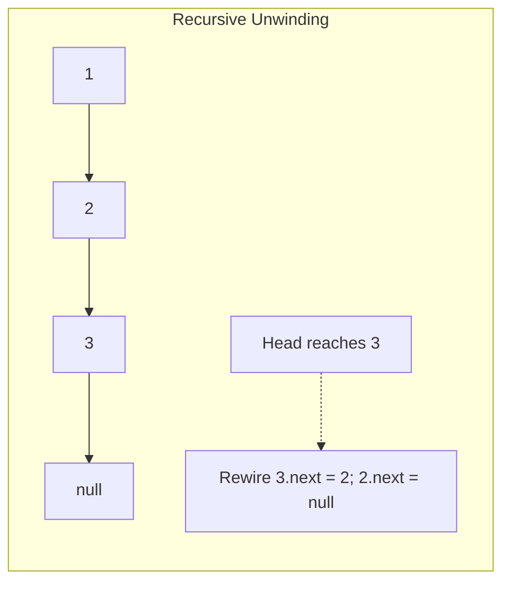

# 01. Recursion Mental Models & Call Stack Mechanics

[← Back to Backtracking Hub](./README.md) | [Track Hub](./README.md) | [Next: Subsets & Permutations →](./02-subsets-and-permutations-generating-combinatorial-spaces.md)

---

## 🏛️ 1. Architecture & Memory Mechanics: The JVM Call Stack

Recursion is governed by the physical memory properties of the **JVM Thread Stack**. Every thread has its own private stack memory allocated at thread initialization.

```
High Memory
┌─────────────────────────────────────────────────────────────┐
│ Stack Frame: pow(2.0, 1)                                   │
│  LVT: [double x=2.0, long n=1, double half=2.0]            │
│  Operand Stack: [2.0, 2.0, *] -> 4.0                        │
├─────────────────────────────────────────────────────────────┤
│ Stack Frame: pow(2.0, 2)                                   │
│  LVT: [double x=2.0, long n=2, double half=4.0]            │
│  Operand Stack: [...]                                       │
├─────────────────────────────────────────────────────────────┤
│ Stack Frame: pow(2.0, 4)                                   │
│  LVT: [double x=2.0, long n=4, double half=16.0]           │
├─────────────────────────────────────────────────────────────┤
│ Stack Frame: main()                                         │
└─────────────────────────────────────────────────────────────┘
Low Memory
```

### 1.1 The Recursion Equation: Base Case + Reduction Step
To guarantee that a recursive algorithm terminates and does not trigger a `StackOverflowError`, two invariants must hold:
1. **The Well-Founded Base Case**: There must exist at least one non-recursive branch that returns a value immediately.
2. **Strict Convergence**: Every recursive call must pass arguments strictly closer to the base case according to a well-defined metric (e.g., $n - 1$ or $\lfloor n / 2 \rfloor$).

---

## ⚡ 2. Divide-and-Conquer: Fast Power Algorithm (`Pow(x, n)`)

Computing $x^n$ naively by multiplying $x$ repeatedly takes $\mathcal{O}(N)$ time. By recognizing that:
$$x^n = \begin{cases} (x^2)^{n/2} & \text{if } n \text{ is even} \\ x \cdot (x^2)^{(n-1)/2} & \text{if } n \text{ is odd} \end{cases}$$
we reduce the problem size by half at each step, achieving $\mathcal{O}(\log N)$ time and $\mathcal{O}(\log N)$ stack space.

### 2.1 Critical Integer Boundary: `Integer.MIN_VALUE`
In Java, `Integer.MIN_VALUE` is $-2^{31} = -2147483648$. If we negate it directly (`-n`), integer overflow occurs because `Integer.MAX_VALUE` is $2^{31} - 1 = 2147483647$. Thus, `-Integer.MIN_VALUE == Integer.MIN_VALUE`. We must cast $n$ to a 64-bit `long` before negation.

```java
public final class FastPower {

    public static double myPow(double x, int n) {
        long exp = n;
        if (exp < 0) {
            x = 1.0 / x;
            exp = -exp;
        }
        return powerHelper(x, exp);
    }

    private static double powerHelper(double x, long exp) {
        // Base case: x^0 = 1.0
        if (exp == 0) {
            return 1.0;
        }

        // Divide step
        double half = powerHelper(x, exp / 2);

        // Conquer step
        if ((exp % 2) == 0) {
            return half * half;
        } else {
            return half * half * x;
        }
    }

    // Iterative O(1) Auxiliary Space Variant
    public static double myPowIterative(double x, int n) {
        long exp = n;
        if (exp < 0) {
            x = 1.0 / x;
            exp = -exp;
        }

        double result = 1.0;
        double currentProduct = x;

        while (exp > 0) {
            if ((exp & 1) == 1) {
                result *= currentProduct;
            }
            currentProduct *= currentProduct;
            exp >>= 1;
        }

        return result;
    }
}
```

---

## 🔄 3. Transforming Recursion to Iteration: Explicit Heap Stacks

When recursion depth exceeds $10^4$, JVM thread stacks overflow. To eliminate this limit, we simulate the call stack using a heap-allocated `ArrayDeque`.

### 3.1 Reversing a Singly Linked List: Recursive vs. Iterative Invariants



```java
public final class ListInversion {

    public static final class ListNode {
        public int val;
        public ListNode next;
        public ListNode(int val) { this.val = val; }
    }

    // Pure Recursive: O(N) Time, O(N) Call Stack Frames
    public static ListNode reverseListRecursive(ListNode head) {
        if (head == null || head.next == null) {
            return head;
        }
        ListNode newHead = reverseListRecursive(head.next);
        head.next.next = head;
        head.next = null;
        return newHead;
    }

    // Production Iterative: O(N) Time, O(1) Auxiliary Space
    public static ListNode reverseListIterative(ListNode head) {
        ListNode prev = null;
        ListNode curr = head;

        while (curr != null) {
            ListNode nextTemp = curr.next;
            curr.next = prev;
            prev = curr;
            curr = nextTemp;
        }

        return prev;
    }
}
```

---

## 🧮 4. Complexity & Space Analysis

| Approach | Time Complexity | Auxiliary Space | JVM Stack Overhead | Risk / Constraint |
| :--- | :--- | :--- | :--- | :--- |
| **`FastPower (Recursive)`** | $\mathcal{O}(\log N)$ | $\mathcal{O}(\log N)$ | $\approx 32$ frames max | Negligible; fits in L1 cache |
| **`FastPower (Iterative)`** | $\mathcal{O}(\log N)$ | $\mathcal{O}(1)$ | $0$ frames | Best choice for high-throughput math |
| **`ReverseList (Recursive)`** | $\mathcal{O}(N)$ | $\mathcal{O}(N)$ | $N$ frames | `StackOverflowError` if $N > 10^4$ |
| **`ReverseList (Iterative)`** | $\mathcal{O}(N)$ | $\mathcal{O}(1)$ | $0$ frames | Enterprise-grade standard |

---

## ⚠️ Common Interview Pitfalls

1. **Integer Underflow during Negation**: Failing to cast `int n` to `long` before computing `-n` when $n = -2147483648$.
2. **Missing Post-Processing in Recursive Rewiring**: Forgetting `head.next = null;` when unwinding `reverseListRecursive`, creating a cycle between the first two nodes.
3. **Double Recursive Calls in Divide & Conquer**: Writing `powerHelper(x, exp / 2) * powerHelper(x, exp / 2)` instead of storing `double half = powerHelper(x, exp / 2);`. This accidentally causes $\mathcal{O}(N)$ branches instead of $\mathcal{O}(\log N)$.

---

<div align="center">

| [← Back to Backtracking Hub](./README.md) | [Track Hub: Backtracking](./README.md) | [Next: Subsets & Permutations →](./02-subsets-and-permutations-generating-combinatorial-spaces.md) |
| :--- | :---: | ---: |

</div>
