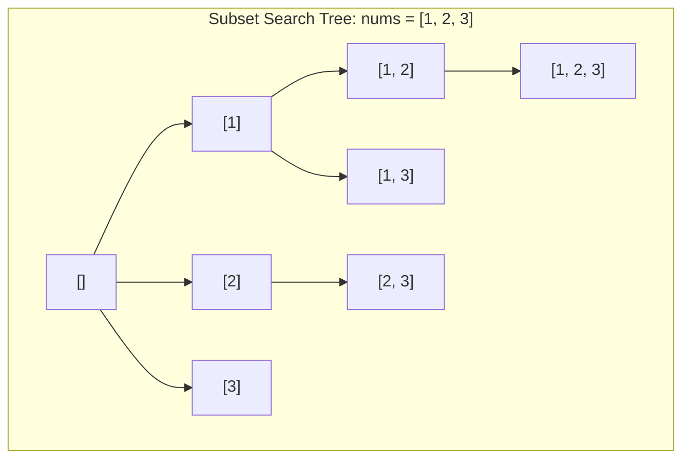

# 02. Subsets & Permutations: Generating Combinatorial Spaces

[← Back to Recursion Foundations](./01-recursion-mental-models-and-call-stack-mechanics.md) | [Track Hub](./README.md) | [Next: Combination Sum & Partitioning →](./03-combination-sum-and-target-partitioning.md)

---

## 🏛️ 1. Theoretical Foundations: Combinatorial Complexity Classes

Combinatorial generation problems fall into two primary complexity classes based on whether order matters:

```
╭───────────────────────────────────────────────────────────────────────────────────────────╮
│                             SUBSETS VS. PERMUTATIONS INVARIANTS                           │
├─────────────────────┬─────────────────────────────────┬───────────────────────────────────┤
│ Property            │ Subsets (Combinations)          │ Permutations                      │
├─────────────────────┼─────────────────────────────────┼───────────────────────────────────┤
│ Does Order Matter?  │ No: {1, 2} is identical to {2, 1}│ Yes: [1, 2] is distinct from [2, 1]│
│ Total Output Size   │ 2^N elements                    │ N! elements                       │
│ Tree Branching      │ Forward indices: i from start..N│ Full scan: i from 0..N with used[]│
│ Growth Rate         │ N=20 -> ~10^6 states            │ N=10 -> ~3.6*10^6 states          │
╰─────────────────────┴─────────────────────────────────┴───────────────────────────────────╯
```



---

## ⚡ 2. The Subsets Family (Power Set)

### 2.1 Subsets I (Unique Elements)
Every element has two binary choices: either included or excluded. Total states = $2^N$.

```java
import java.util.*;

public final class Subsets {

    public static List<List<Integer>> subsets(int[] nums) {
        List<List<Integer>> results = new ArrayList<>(1 << nums.length);
        List<Integer> current = new ArrayList<>();
        backtrackSubsets(0, nums, current, results);
        return results;
    }

    private static void backtrackSubsets(int start, int[] nums, List<Integer> current, List<List<Integer>> results) {
        // Every node in the state-space tree represents a valid subset
        results.add(new ArrayList<>(current));

        for (int i = start; i < nums.length; i++) {
            current.add(nums[i]);                  // CHOOSE
            backtrackSubsets(i + 1, nums, current, results); // EXPLORE
            current.remove(current.size() - 1);    // UNCHOOSE
        }
    }
}
```

### 2.2 Subsets II (Handling Duplicates)
When the input array contains duplicate elements (e.g., `[1, 2, 2]`), naive recursion generates duplicate subsets.
- **The Pruning Invariant**: Sort the array first so identical values are adjacent.
- If $i > \text{start}$ and $\text{nums}[i] == \text{nums}[i - 1]$, skip $\text{nums}[i]$ because the branch for this identical value at this tree depth has already been fully explored.

```java
public static List<List<Integer>> subsetsWithDup(int[] nums) {
    Arrays.sort(nums); // Sort to cluster duplicate values
    List<List<Integer>> results = new ArrayList<>();
    List<Integer> current = new ArrayList<>();
    backtrackSubsetsWithDup(0, nums, current, results);
    return results;
}

private static void backtrackSubsetsWithDup(int start, int[] nums, List<Integer> current, List<List<Integer>> results) {
    results.add(new ArrayList<>(current));

    for (int i = start; i < nums.length; i++) {
        // Skip duplicate candidates at the current recursion level
        if (i > start && nums[i] == nums[i - 1]) {
            continue;
        }

        current.add(nums[i]);
        backtrackSubsetsWithDup(i + 1, nums, current, results);
        current.remove(current.size() - 1);
    }
}
```

---

## 🔁 3. The Permutations Family ($N!$)

### 3.1 Permutations I (Unique Elements)
To generate all $N!$ orderings, every position in the permutation must choose from the unchosen elements.

```java
public final class Permutations {

    public static List<List<Integer>> permute(int[] nums) {
        List<List<Integer>> results = new ArrayList<>();
        boolean[] used = new boolean[nums.length];
        List<Integer> current = new ArrayList<>(nums.length);
        backtrackPermute(nums, used, current, results);
        return results;
    }

    private static void backtrackPermute(int[] nums, boolean[] used, List<Integer> current, List<List<Integer>> results) {
        if (current.size() == nums.length) {
            results.add(new ArrayList<>(current));
            return;
        }

        for (int i = 0; i < nums.length; i++) {
            if (used[i]) {
                continue;
            }

            used[i] = true;
            current.add(nums[i]);

            backtrackPermute(nums, used, current, results);

            current.remove(current.size() - 1);
            used[i] = false;
        }
    }
}
```

### 3.2 Permutations II (Duplicates Allowed)
When input contains duplicates (e.g., `[1, 1, 2]`), we sort the array and enforce a strict canonical order among identical values:
$$\text{nums}[i] == \text{nums}[i - 1] \land !\text{used}[i - 1] \implies \text{skip}$$
This guarantees that identical elements are picked only in their left-to-right sequence.

```java
public static List<List<Integer>> permuteUnique(int[] nums) {
    Arrays.sort(nums);
    List<List<Integer>> results = new ArrayList<>();
    boolean[] used = new boolean[nums.length];
    List<Integer> current = new ArrayList<>(nums.length);
    backtrackPermuteUnique(nums, used, current, results);
    return results;
}

private static void backtrackPermuteUnique(int[] nums, boolean[] used, List<Integer> current, List<List<Integer>> results) {
    if (current.size() == nums.length) {
        results.add(new ArrayList<>(current));
        return;
    }

    for (int i = 0; i < nums.length; i++) {
        if (used[i]) {
            continue;
        }

        // Enforce strict left-to-right relative ordering for duplicates
        if (i > 0 && nums[i] == nums[i - 1] && !used[i - 1]) {
            continue;
        }

        used[i] = true;
        current.add(nums[i]);

        backtrackPermuteUnique(nums, used, current, results);

        current.remove(current.size() - 1);
        used[i] = false;
    }
}
```

---

## 🧮 4. The $O(N)$ Next Permutation Invariant

Instead of generating all $N!$ permutations, finding the single next lexicographical permutation can be performed in strictly $\mathcal{O}(N)$ time and $\mathcal{O}(1)$ space.

```
Array: [1, 5, 8, 4, 7, 6, 5, 3, 1]
               ^  ^
               i  Pivot (first decrease from right: 4 < 7)
                  Successor (smallest element > 4 from right: 5)
Swap(4, 5) -> [1, 5, 8, 5, 7, 6, 4, 3, 1]
Reverse suffix -> [1, 5, 8, 5, 1, 3, 4, 6, 7]
```

```java
public static void nextPermutation(int[] nums) {
    int i = nums.length - 2;
    // Step 1: Find largest index i such that nums[i] < nums[i + 1]
    while (i >= 0 && nums[i] >= nums[i + 1]) {
        i--;
    }

    if (i >= 0) {
        // Step 2: Find largest index j such that nums[j] > nums[i]
        int j = nums.length - 1;
        while (nums[j] <= nums[i]) {
            j--;
        }
        swap(nums, i, j);
    }

    // Step 3: Reverse suffix nums[i + 1 .. end]
    reverse(nums, i + 1, nums.length - 1);
}

private static void swap(int[] nums, int i, int j) {
    int temp = nums[i];
    nums[i] = nums[j];
    nums[j] = temp;
}

private static void reverse(int[] nums, int start, int end) {
    while (start < end) {
        swap(nums, start++, end--);
    }
}
```

---

## 🧮 Complexity Analysis

| Algorithm | Time Complexity | Auxiliary Space | Call Stack Depth |
| :--- | :--- | :--- | :--- |
| **`Subsets I & II`** | $\mathcal{O}(N \cdot 2^N)$ | $\mathcal{O}(N)$ | $\mathcal{O}(N)$ |
| **`Permutations I & II`** | $\mathcal{O}(N \cdot N!)$ | $\mathcal{O}(N)$ | $\mathcal{O}(N)$ |
| **`Next Permutation`** | $\mathcal{O}(N)$ | $\mathcal{O}(1)$ | $0$ (Iterative) |

---

<div align="center">

| [← Back to Recursion Foundations](./01-recursion-mental-models-and-call-stack-mechanics.md) | [Track Hub: Backtracking](./README.md) | [Next: Combination Sum & Partitioning →](./03-combination-sum-and-target-partitioning.md) |
| :--- | :---: | ---: |

</div>
