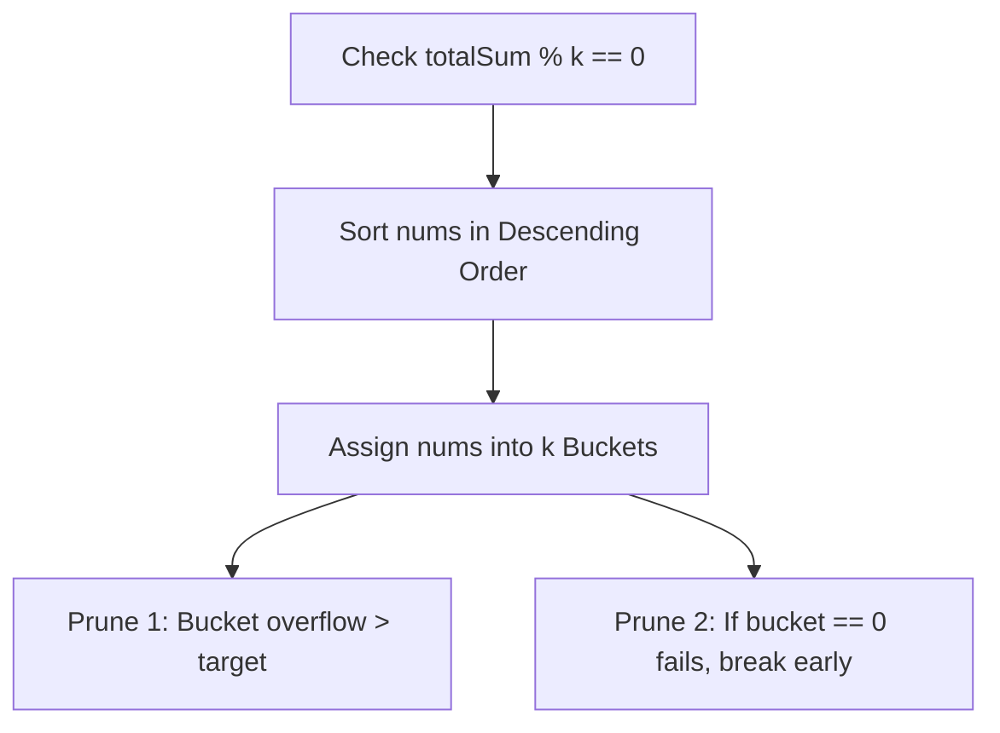

# 03. Combination Sum & Target Partitioning

[← Back to Subsets & Permutations](./02-subsets-and-permutations-generating-combinatorial-spaces.md) | [Track Hub](./README.md) | [Next: Grid Search & Maze Backtracking →](./04-grid-search-and-maze-backtracking.md)

---

## 🏛️ 1. Theoretical Foundations: Pruned Subsets vs. Knapsack

When generating subsets that sum to a target value $T$, problems diverge based on whether we seek the **number/extremum** of subsets (solved via Dynamic Programming in $\mathcal{O}(N \cdot T)$) or **all exact combinations** (solved via Backtracking).

```
╭───────────────────────────────────────────────────────────────────────────────────────────╮
│                           COMBINATION SUM TAXONOMY & PRUNING RULES                        │
├────────────────────┬──────────────────────┬──────────────────────┬────────────────────────┤
│ Variety            │ Element Reusability  │ Input Uniqueness     │ Branching Advancement  │
├────────────────────┼──────────────────────┼──────────────────────┼────────────────────────┤
│ Combination Sum I  │ Unlimited            │ Distinct elements    │ Recurse at index i     │
│ Combination Sum II │ Single Use           │ Contains duplicates  │ Recurse at index i + 1 │
│ Combination Sum III│ Single Use (1 to 9)  │ Digits {1..9}, size k│ Recurse at index i + 1 │
│ Partition K Subsets│ Exact partition      │ Arbitrary positives  │ Bucket assignment DFS  │
╰────────────────────┴──────────────────────┴──────────────────────┴────────────────────────╯
```

---

## ⚡ 2. Combination Sum I & II

### 2.1 Combination Sum I (Unlimited Reuse)
Candidates can be chosen an unlimited number of times. By sorting candidates upfront, we can immediately break out of the loop whenever $\text{candidates}[i] > \text{remain}$, pruning large subtrees.

```java
import java.util.*;

public final class CombinationSum {

    public static List<List<Integer>> combinationSum(int[] candidates, int target) {
        Arrays.sort(candidates); // Enables early loop termination
        List<List<Integer>> results = new ArrayList<>();
        List<Integer> current = new ArrayList<>();
        backtrackSum1(0, candidates, target, current, results);
        return results;
    }

    private static void backtrackSum1(int start, int[] candidates, int remain,
                                      List<Integer> current, List<List<Integer>> results) {
        if (remain == 0) {
            results.add(new ArrayList<>(current));
            return;
        }

        for (int i = start; i < candidates.length; i++) {
            // Early pruning invariant: since candidates are sorted, further elements exceed remain
            if (candidates[i] > remain) {
                break;
            }

            current.add(candidates[i]);
            // Notice: pass 'i', not 'i + 1', allowing unlimited reuse of candidates[i]
            backtrackSum1(i, candidates, remain - candidates[i], current, results);
            current.remove(current.size() - 1);
        }
    }
}
```

### 2.2 Combination Sum II (Single-Use with Duplicates)
Each candidate can only be used once, and candidates may contain duplicates.

```java
public static List<List<Integer>> combinationSum2(int[] candidates, int target) {
    Arrays.sort(candidates);
    List<List<Integer>> results = new ArrayList<>();
    List<Integer> current = new ArrayList<>();
    backtrackSum2(0, candidates, target, current, results);
    return results;
}

private static void backtrackSum2(int start, int[] candidates, int remain,
                                  List<Integer> current, List<List<Integer>> results) {
    if (remain == 0) {
        results.add(new ArrayList<>(current));
        return;
    }

    for (int i = start; i < candidates.length; i++) {
        if (candidates[i] > remain) {
            break; // Prune all larger candidates
        }

        // Skip identical candidates at the same depth
        if (i > start && candidates[i] == candidates[i - 1]) {
            continue;
        }

        current.add(candidates[i]);
        // Pass 'i + 1' to enforce single-use
        backtrackSum2(i + 1, candidates, remain - candidates[i], current, results);
        current.remove(current.size() - 1);
    }
}
```

---

## 🧮 3. Hard-Tier Partitioning: Partition to $K$ Equal Sum Subsets

Given an integer array `nums` and integer $k$, determine if it is possible to divide the array into $k$ non-empty subsets whose sums are all equal.



### 3.1 Three Essential Pruning Theorems
1. **Mathematical Feasibility**: Total sum must be divisible by $k$, and the maximum element must not exceed $\text{target} = \text{totalSum} / k$.
2. **Descending Order Placement**: Placing the largest items first fills buckets rapidly and creates immediate constraint violations early in the tree, pruning millions of dead branches.
3. **Symmetric Empty Bucket Pruning**: If an empty bucket (`buckets[j] == 0`) cannot accommodate the current item, no other empty bucket can either (all empty buckets are structurally identical). Breaking immediately prevents factorial duplicate permutations of buckets.

```java
public final class PartitionKSubsets {

    public static boolean canPartitionKSubsets(int[] nums, int k) {
        int sum = 0;
        for (int n : nums) sum += n;
        if (k <= 0 || sum % k != 0) return false;

        int target = sum / k;

        // Sort ascending, then reverse to descending
        Arrays.sort(nums);
        reverse(nums);

        if (nums[0] > target) return false;

        int[] buckets = new int[k];
        return backtrackPartition(0, nums, buckets, target);
    }

    private static boolean backtrackPartition(int index, int[] nums, int[] buckets, int target) {
        if (index == nums.length) {
            return true;
        }

        int val = nums[index];
        for (int j = 0; j < buckets.length; j++) {
            if (buckets[j] + val <= target) {
                buckets[j] += val;

                if (backtrackPartition(index + 1, nums, buckets, target)) {
                    return true;
                }

                buckets[j] -= val;
            }

            // CRITICAL SYMMETRY PRUNING:
            // If putting val in an empty bucket failed, trying subsequent empty buckets is redundant
            if (buckets[j] == 0) {
                break;
            }
        }

        return false;
    }

    private static void reverse(int[] nums) {
        int l = 0, r = nums.length - 1;
        while (l < r) {
            int t = nums[l];
            nums[l++] = nums[r];
            nums[r--] = t;
        }
    }
}
```

---

## 🧮 Complexity Analysis

| Problem | Time Complexity | Auxiliary Space | Key Pruning Lever |
| :--- | :--- | :--- | :--- |
| **`Combination Sum I`** | $\mathcal{O}(2^T)$ where $T = \text{target}/\min$ | $\mathcal{O}(T)$ | Early `break` on sorted array |
| **`Combination Sum II`** | $\mathcal{O}(2^N)$ | $\mathcal{O}(N)$ | Adjacent duplicate skip |
| **`Partition K Subsets`** | $\mathcal{O}(k^{N - k} \cdot k!)$ pruned to $\approx \mathcal{O}(k^N)$ | $\mathcal{O}(N + k)$ | Descending sort + `buckets[j] == 0` break |

---

<div align="center">

| [← Back to Subsets & Permutations](./02-subsets-and-permutations-generating-combinatorial-spaces.md) | [Track Hub: Backtracking](./README.md) | [Next: Grid Search & Maze Backtracking →](./04-grid-search-and-maze-backtracking.md) |
| :--- | :---: | ---: |

</div>
