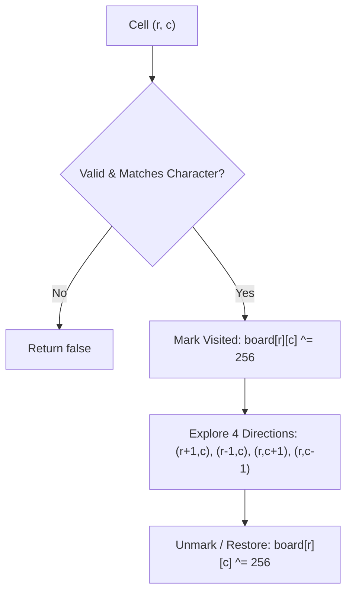

# 04. Grid Search & Maze Backtracking

[← Back to Combination Sum](./03-combination-sum-and-target-partitioning.md) | [Track Hub](./README.md) | [Next: Sudoku & N-Queens →](./05-constraint-satisfaction-sudoku-and-n-queens.md)

---

## 🏛️ 1. Spatial Backtracking Foundations

2D Grid search combines **Depth-First Search (DFS)** with **State Rollback**. Because cells can be traversed in four cardinal directions (Up, Down, Left, Right), paths can form cycles unless visited cells are marked.

```
╭───────────────────────────────────────────────────────────────────────────────────────────╮
│                             GRID VISITED STATE PARADIGMS                                  │
├────────────────────┬──────────────────────┬──────────────────────┬────────────────────────┤
│ Technique          │ Time Overhead        │ Memory Overhead      │ Thread Safety          │
├────────────────────┼──────────────────────┼──────────────────────┼────────────────────────┤
│ boolean[][] Array  │ Moderate (heap alloc)│ O(M * N) heap        │ Safe (per-thread copy) │
│ In-Place Bit Mask  │ Zero (registers only)│ O(1) auxiliary       │ Modifies input matrix  │
│ Character Sentinel │ Zero                 │ O(1) auxiliary       │ Must restore before ret│
╰────────────────────┴──────────────────────┴──────────────────────┴────────────────────────╯
```



---

## ⚡ 2. Word Search I: In-Place Bitwise Masking

To eliminate the memory overhead of a `boolean[M][N]` array, we mutate the character directly in-place:
```java
// Since ASCII characters reside in range [0, 127], XORing with 256 sets bit 8
board[r][c] ^= 256; // Mark as visited (non-ASCII)
// After recursive descent:
board[r][c] ^= 256; // Restore original character exactly
```

```java
public final class WordSearch {

    private static final int[] D_ROW = {-1, 1, 0, 0};
    private static final int[] D_COL = {0, 0, -1, 1};

    public static boolean exist(char[][] board, String word) {
        int m = board.length, n = board[0].length;
        char[] chars = word.toCharArray();

        for (int r = 0; r < m; r++) {
            for (int c = 0; c < n; c++) {
                if (board[r][c] == chars[0] && dfs(board, r, c, chars, 0)) {
                    return true;
                }
            }
        }
        return false;
    }

    private static boolean dfs(char[][] board, int r, int c, char[] word, int index) {
        if (index == word.length) {
            return true;
        }

        if (r < 0 || r >= board.length || c < 0 || c >= board[0].length || board[r][c] != word[index]) {
            return false;
        }

        // CHOOSE: Mask character in-place to mark visited
        board[r][c] ^= 256;

        for (int d = 0; d < 4; d++) {
            int nr = r + D_ROW[d];
            int nc = c + D_COL[d];
            if (dfs(board, nr, nc, word, index + 1)) {
                board[r][c] ^= 256; // Restore before returning true
                return true;
            }
        }

        // UNCHOOSE: Restore original character
        board[r][c] ^= 256;
        return false;
    }
}
```

---

## 🚀 3. Word Search II: Prefix Trie Integration

When searching for a list of $W$ dictionary words simultaneously, searching each word independently takes $\mathcal{O}(W \cdot M \cdot N \cdot 4^L)$ time, which TLEs.
By indexing all words into a **Trie (Prefix Tree)**, the search across all words is unified into a single DFS traversal. When a grid path does not match any prefix in the Trie, the entire branch is pruned immediately.

```java
import java.util.*;

public final class WordSearchII {

    private static final class TrieNode {
        final TrieNode[] children = new TrieNode[26];
        String word = null; // Holds the complete word at terminal nodes
    }

    private static void insert(TrieNode root, String word) {
        TrieNode curr = root;
        for (char ch : word.toCharArray()) {
            int idx = ch - 'a';
            if (curr.children[idx] == null) {
                curr.children[idx] = new TrieNode();
            }
            curr = curr.children[idx];
        }
        curr.word = word;
    }

    public static List<String> findWords(char[][] board, String[] words) {
        TrieNode root = new TrieNode();
        for (String w : words) {
            insert(root, w);
        }

        List<String> results = new ArrayList<>();
        int m = board.length, n = board[0].length;

        for (int r = 0; r < m; r++) {
            for (int c = 0; c < n; c++) {
                int idx = board[r][c] - 'a';
                if (root.children[idx] != null) {
                    dfsTrie(board, r, c, root.children[idx], results);
                }
            }
        }

        return results;
    }

    private static void dfsTrie(char[][] board, int r, int c, TrieNode node, List<String> results) {
        if (node.word != null) {
            results.add(node.word);
            node.word = null; // Deduplication: prevent adding the same word multiple times
        }

        char original = board[r][c];
        board[r][c] = '#'; // Mark visited

        int[] dr = {-1, 1, 0, 0};
        int[] dc = {0, 0, -1, 1};

        for (int i = 0; i < 4; i++) {
            int nr = r + dr[i];
            int nc = c + dc[i];

            if (nr >= 0 && nr < board.length && nc >= 0 && nc < board[0].length && board[nr][nc] != '#') {
                int nextIdx = board[nr][nc] - 'a';
                if (node.children[nextIdx] != null) {
                    dfsTrie(board, nr, nc, node.children[nextIdx], results);
                }
            }
        }

        board[r][c] = original; // Backtrack
    }
}
```

---

## 🧮 4. Hamiltonian Path on Grids: Unique Paths III

Find the number of 4-directional walks from the starting square to the ending square that walk over **every non-obstacle square exactly once**.

```java
public final class UniquePathsIII {

    public static int uniquePathsIII(int[][] grid) {
        int m = grid.length, n = grid[0].length;
        int emptyCount = 1; // Count start cell as 1 required visit
        int startR = -1, startC = -1;

        for (int r = 0; r < m; r++) {
            for (int c = 0; c < n; c++) {
                if (grid[r][c] == 0) {
                    emptyCount++;
                } else if (grid[r][c] == 1) {
                    startR = r;
                    startC = c;
                }
            }
        }

        return dfs(grid, startR, startC, emptyCount);
    }

    private static int dfs(int[][] grid, int r, int c, int remain) {
        if (r < 0 || r >= grid.length || c < 0 || c >= grid[0].length || grid[r][c] < 0) {
            return 0;
        }

        if (grid[r][c] == 2) {
            // Valid path if and only if all empty cells were visited
            return remain == 0 ? 1 : 0;
        }

        int original = grid[r][c];
        grid[r][c] = -2; // Mark as visited obstacle
        remain--;

        int paths = dfs(grid, r + 1, c, remain)
                  + dfs(grid, r - 1, c, remain)
                  + dfs(grid, r, c + 1, remain)
                  + dfs(grid, r, c - 1, remain);

        grid[r][c] = original; // Backtrack
        return paths;
    }
}
```

---

## 🧮 Complexity Analysis

| Problem | Time Complexity | Auxiliary Space | Call Stack Depth |
| :--- | :--- | :--- | :--- |
| **`Word Search I`** | $\mathcal{O}(M \cdot N \cdot 4^L)$ | $\mathcal{O}(L)$ | $L = \text{word length}$ |
| **`Word Search II`** | $\mathcal{O}(M \cdot N \cdot 4^{\max(L)} + \sum L)$ | $\mathcal{O}(\text{Trie size} + \max(L))$ | $\max(L)$ |
| **`Unique Paths III`** | $\mathcal{O}(4^{M \cdot N})$ | $\mathcal{O}(M \cdot N)$ | $M \cdot N$ |

---

<div align="center">

| [← Back to Combination Sum](./03-combination-sum-and-target-partitioning.md) | [Track Hub: Backtracking](./README.md) | [Next: Sudoku & N-Queens →](./05-constraint-satisfaction-sudoku-and-n-queens.md) |
| :--- | :---: | ---: |

</div>
