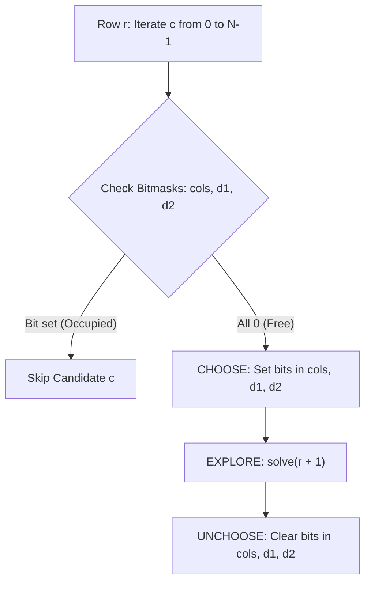

# 05. Constraint Satisfaction: Sudoku & N-Queens

[← Back to Grid Search](./04-grid-search-and-maze-backtracking.md) | [Track Hub](./README.md) | [Next: Game Theory & Minimax →](./06-game-theory-and-minimax-with-alpha-beta-pruning.md)

---

## 🏛️ 1. Theoretical Foundations: Constraint Satisfaction (CSP)

A **Constraint Satisfaction Problem (CSP)** consists of:
1. A set of variables $X = \{X_1, X_2, \dots, X_n\}$.
2. A domain $D_i$ of allowable values for each variable.
3. A set of constraints $C = \{C_1, C_2, \dots, C_m\}$ specifying allowable combinations of values.

In standard backtracking, checking validity takes $\mathcal{O}(N)$ or $\mathcal{O}(N^2)$ by scanning rows/columns. In high-performance systems, we achieve strictly **$\mathcal{O}(1)$ constraint validation** using bitwise register operations.

```
╭───────────────────────────────────────────────────────────────────────────────────────────╮
│                              DIAGONAL MAPPING THEOREMS                                    │
├─────────────────────┬─────────────────────────────────┬───────────────────────────────────┤
│ Diagonal Type       │ Coordinate Invariant            │ Array / Bitmask Index             │
├─────────────────────┼─────────────────────────────────┼───────────────────────────────────┤
│ Column              │ c is constant                   │ c (Range: 0 .. N-1)               │
│ Main Diagonal (/)   │ r + c is constant               │ r + c (Range: 0 .. 2N-2)          │
│ Anti-Diagonal (\)   │ r - c is constant               │ r - c + (N - 1) (Range: 0 .. 2N-2)│
╰─────────────────────┴─────────────────────────────────┴───────────────────────────────────╯
```



---

## ⚡ 2. N-Queens: Bitmask Acceleration ($O(1)$ Conflict Checks)

Placing $N$ non-attacking queens on an $N \times N$ chessboard. Since each row must contain exactly one queen, we recurse row-by-row ($r = 0 \to N - 1$), eliminating row conflicts automatically.

```java
import java.util.*;

public final class NQueens {

    public static List<List<String>> solveNQueens(int n) {
        List<List<String>> solutions = new ArrayList<>();
        int[] queens = new int[n]; // queens[r] = column index of queen in row r
        solve(0, n, 0, 0, 0, queens, solutions);
        return solutions;
    }

    private static void solve(int row, int n, int cols, int d1, int d2,
                              int[] queens, List<List<String>> solutions) {
        if (row == n) {
            solutions.add(buildBoard(queens, n));
            return;
        }

        for (int col = 0; col < n; col++) {
            int mainDiagMask = 1 << (row + col);
            int antiDiagMask = 1 << (row - col + n - 1);
            int colMask = 1 << col;

            // O(1) Constraint Check via bitwise AND
            if ((cols & colMask) != 0 || (d1 & mainDiagMask) != 0 || (d2 & antiDiagMask) != 0) {
                continue; // Conflict detected
            }

            // CHOOSE: Place queen and activate bitmasks
            queens[row] = col;
            solve(row + 1, n,
                  cols | colMask,
                  d1 | mainDiagMask,
                  d2 | antiDiagMask,
                  queens, solutions);
            // UNCHOOSE: Handled automatically as bitmasks are passed by value on call stack
        }
    }

    private static List<String> buildBoard(int[] queens, int n) {
        List<String> board = new ArrayList<>(n);
        char[] rowChars = new char[n];
        for (int r = 0; r < n; r++) {
            Arrays.fill(rowChars, '.');
            rowChars[queens[r]] = 'Q';
            board.add(new String(rowChars));
        }
        return board;
    }
}
```

---

## 🧩 3. Production Sudoku Solver with Bitwise State

A valid Sudoku board requires digits `1..9` to be unique across:
1. Each of the 9 rows.
2. Each of the 9 columns.
3. Each of the 9 $3 \times 3$ sub-boxes (indexed by `(r / 3) * 3 + (c / 3)`).

```java
public final class SudokuSolver {

    private final int[] rows = new int[9];
    private final int[] cols = new int[9];
    private final int[] boxes = new int[9];

    public void solveSudoku(char[][] board) {
        // Initialize existing constraints
        for (int r = 0; r < 9; r++) {
            for (int c = 0; c < 9; c++) {
                if (board[r][c] != '.') {
                    int val = board[r][c] - '1';
                    int mask = 1 << val;
                    rows[r] |= mask;
                    cols[c] |= mask;
                    boxes[getBox(r, c)] |= mask;
                }
            }
        }
        solve(board, 0, 0);
    }

    private boolean solve(char[][] board, int r, int c) {
        // Advance to next row upon reaching end of columns
        if (c == 9) {
            r++;
            c = 0;
        }
        // Terminal success: entire 9x9 board filled
        if (r == 9) {
            return true;
        }

        // If cell already filled, move to next
        if (board[r][c] != '.') {
            return solve(board, r, c + 1);
        }

        int b = getBox(r, c);
        for (int d = 0; d < 9; d++) {
            int mask = 1 << d;
            // O(1) Check if digit d is already present in row, col, or box
            if ((rows[r] & mask) == 0 && (cols[c] & mask) == 0 && (boxes[b] & mask) == 0) {
                // CHOOSE
                rows[r] |= mask;
                cols[c] |= mask;
                boxes[b] |= mask;
                board[r][c] = (char) ('1' + d);

                // EXPLORE
                if (solve(board, r, c + 1)) {
                    return true;
                }

                // UNCHOOSE
                board[r][c] = '.';
                rows[r] &= ~mask;
                cols[c] &= ~mask;
                boxes[b] &= ~mask;
            }
        }

        return false;
    }

    private static int getBox(int r, int c) {
        return (r / 3) * 3 + (c / 3);
    }
}
```

---

## 🧮 Complexity Analysis

| Problem | Time Complexity | Auxiliary Space | Key Optimization Lever |
| :--- | :--- | :--- | :--- |
| **`N-Queens`** | $\mathcal{O}(N!)$ | $\mathcal{O}(N)$ | Bitwise diagonal tracking ($O(1)$) |
| **`Sudoku Solver`** | $\mathcal{O}(9^{\text{empty cells}})$ worst-case; $< 1\text{ ms}$ avg | $\mathcal{O}(1)$ ($9 \times 9$ fixed) | Bitwise rows/cols/boxes masks |

---

<div align="center">

| [← Back to Grid Search](./04-grid-search-and-maze-backtracking.md) | [Track Hub: Backtracking](./README.md) | [Next: Game Theory & Minimax →](./06-game-theory-and-minimax-with-alpha-beta-pruning.md) |
| :--- | :---: | ---: |

</div>
