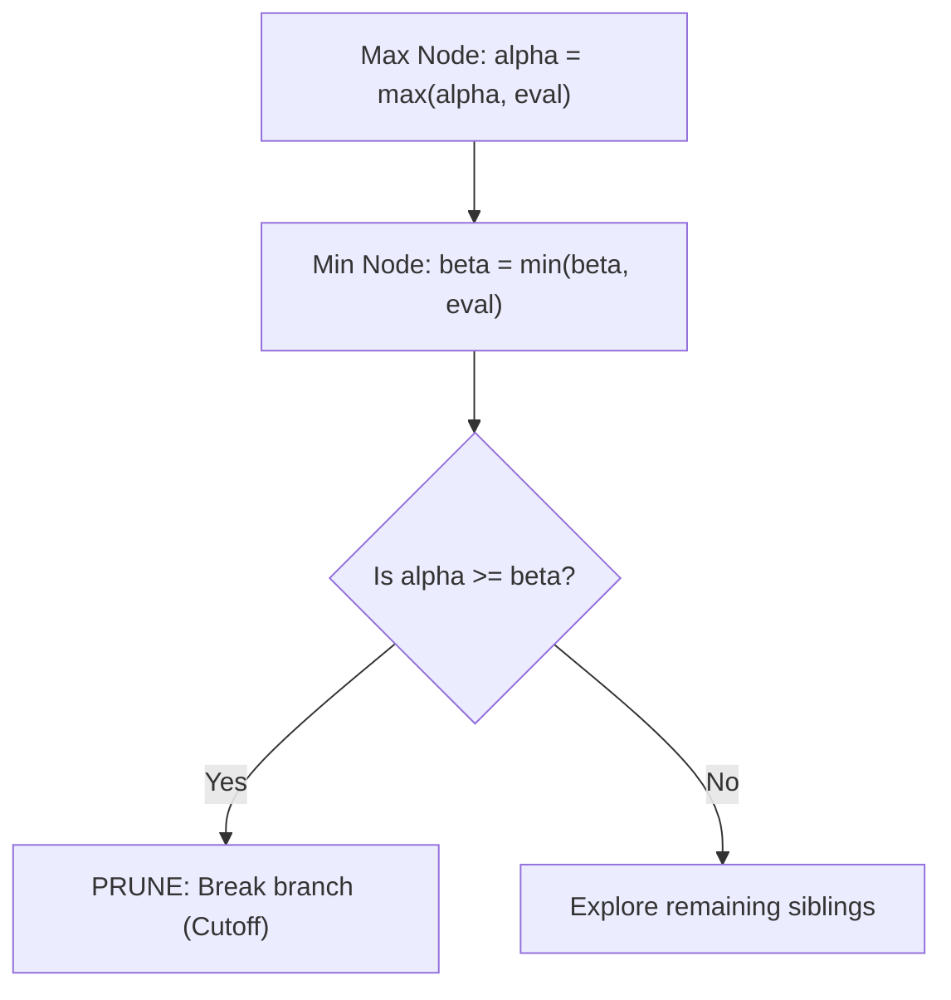

# 06. Game Theory & Minimax with Alpha-Beta Pruning

[← Back to Sudoku & N-Queens](./05-constraint-satisfaction-sudoku-and-n-queens.md) | [Track Hub](./README.md) | [Java Track Home](../README.md)

---

## 🏛️ 1. Theoretical Foundations: Zero-Sum Game Trees

In two-player, sequential, perfect-information zero-sum games (e.g., Chess, Checkers, Tic-Tac-Toe, Nim), one player's gain is the exact equivalent of the opponent's loss.
- **Maximizer**: Seeks to maximize the game state score.
- **Minimizer**: Seeks to minimize the game state score.

```
                    MAX Level (Root)
                        [+3]
                       /    \
                     /        \
         MIN Level  [+3]        [-2]
                   /    \      /    \
                 [+3]   [+5]  [-2]  [+1]  (Terminal Leaf Nodes)
```



---

## ⚡ 2. The Alpha-Beta Pruning Invariant

The **Alpha-Beta Pruning** optimization eliminates subtrees that cannot possibly influence the final decision at the root:
- $\alpha$: The maximum score that the Maximizer is already guaranteed to achieve along the current search path. (Initial value: $-\infty$)
- $\beta$: The minimum score that the Minimizer is already guaranteed to achieve along the current search path. (Initial value: $+\infty$)

### 2.1 The Pruning Cutoff Rule
At any node, if:
$$\alpha \ge \beta$$
the current branch can be immediately terminated.
- **Theoretical Bound**: With optimal move ordering, Alpha-Beta pruning evaluates only $\mathcal{O}(B^{D/2})$ nodes compared to naive Minimax's $\mathcal{O}(B^D)$ nodes, effectively **doubling the searchable depth**.

---

## 🎮 3. Canonical Problem: Predict the Winner / Stone Game

An integer array `nums` is given. Players 1 and 2 take turns picking either the first or last number from the array, adding it to their score. Determine if Player 1 can win assuming both play optimally.

```java
import java.util.*;

public final class PredictWinner {

    // Returns true if Player 1 score >= Player 2 score under optimal play
    public static boolean predictTheWinner(int[] nums) {
        // Net score difference: (Player 1 Score - Player 2 Score)
        return minimax(nums, 0, nums.length - 1, Integer.MIN_VALUE, Integer.MAX_VALUE) >= 0;
    }

    private static int minimax(int[] nums, int left, int right, int alpha, int beta) {
        // Base case: single element remaining
        if (left == right) {
            return nums[left];
        }

        // Option 1: Pick left element
        int pickLeft = nums[left] - minimax(nums, left + 1, right, -beta, -alpha);

        // Option 2: Pick right element
        int pickRight = nums[right] - minimax(nums, left, right - 1, -beta, -alpha);

        return Math.max(pickLeft, pickRight);
    }

    // Memoized Top-Down Minimax Variant O(N^2)
    public static boolean predictTheWinnerMemo(int[] nums) {
        int n = nums.length;
        Integer[][] memo = new Integer[n][n];
        return maxScoreDiff(nums, 0, n - 1, memo) >= 0;
    }

    private static int maxScoreDiff(int[] nums, int left, int right, Integer[][] memo) {
        if (left == right) {
            return nums[left];
        }
        if (memo[left][right] != null) {
            return memo[left][right];
        }

        int pickLeft = nums[left] - maxScoreDiff(nums, left + 1, right, memo);
        int pickRight = nums[right] - maxScoreDiff(nums, left, right - 1, memo);

        return memo[left][right] = Math.max(pickLeft, pickRight);
    }
}
```

---

## 🧮 4. Generalized Minimax Template with Alpha-Beta Pruning

```java
public abstract class GameEngine<State, Move> {

    public record EvalResult<Move>(int score, Move bestMove) {}

    public EvalResult<Move> alphaBeta(State state, int depth, int alpha, int beta, boolean isMaximizing) {
        if (depth == 0 || isTerminal(state)) {
            return new EvalResult<>(evaluate(state), null);
        }

        Move bestMove = null;

        if (isMaximizing) {
            int maxEval = Integer.MIN_VALUE;
            for (Move move : getValidMoves(state)) {
                applyMove(state, move);
                int eval = alphaBeta(state, depth - 1, alpha, beta, false).score();
                undoMove(state, move);

                if (eval > maxEval) {
                    maxEval = eval;
                    bestMove = move;
                }
                alpha = Math.max(alpha, eval);
                if (beta <= alpha) {
                    break; // Beta cutoff / Prune remaining siblings
                }
            }
            return new EvalResult<>(maxEval, bestMove);
        } else {
            int minEval = Integer.MAX_VALUE;
            for (Move move : getValidMoves(state)) {
                applyMove(state, move);
                int eval = alphaBeta(state, depth - 1, alpha, beta, true).score();
                undoMove(state, move);

                if (eval < minEval) {
                    minEval = eval;
                    bestMove = move;
                }
                beta = Math.min(beta, eval);
                if (beta <= alpha) {
                    break; // Alpha cutoff / Prune remaining siblings
                }
            }
            return new EvalResult<>(minEval, bestMove);
        }
    }

    protected abstract boolean isTerminal(State state);
    protected abstract int evaluate(State state);
    protected abstract List<Move> getValidMoves(State state);
    protected abstract void applyMove(State state, Move move);
    protected abstract void undoMove(State state, Move move);
}
```

---

## 🧮 Complexity Analysis

| Algorithm | Worst-Case Time | Best-Case Time (Optimal Ordering) | Space Complexity |
| :--- | :--- | :--- | :--- |
| **Standard Minimax** | $\mathcal{O}(B^D)$ | $\mathcal{O}(B^D)$ | $\mathcal{O}(D)$ stack |
| **Alpha-Beta Minimax** | $\mathcal{O}(B^D)$ | $\mathcal{O}(B^{D/2})$ | $\mathcal{O}(D)$ stack |
| **Memoized Stone Game** | $\mathcal{O}(N^2)$ | $\mathcal{O}(N^2)$ | $\mathcal{O}(N^2)$ table |

---

<div align="center">

| [← Back to Sudoku & N-Queens](./05-constraint-satisfaction-sudoku-and-n-queens.md) | [Track Hub: Backtracking](./README.md) | [Java Track Home](../README.md) |
| :--- | :---: | ---: |

</div>
