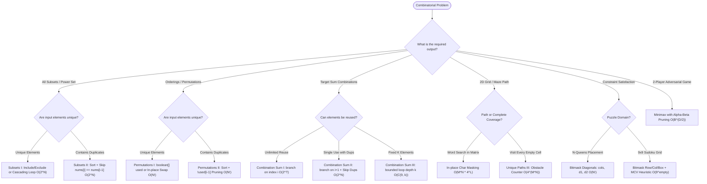

# 🔄 Backtracking & Recursion Mastery

[Java Track Home](../README.md) | [Strategies Hub](../../dsa-strategies/README.md) | [Next: Recursion & Call Stack →](./01-recursion-mental-models-and-call-stack-mechanics.md)

---

## 🧭 Executive Overview: The State-Space Search Universe

**Recursion** is the computational mechanism of solving a problem by reducing it to smaller instances of the exact same problem until a trivial base case is reached.
**Backtracking** is a systematic algorithmic technique for solving combinatorial search problems by incrementally building candidate solutions, abandoning a candidate ("backtracking") as soon as it is determined that the candidate cannot possibly lead to a valid full solution.

While Dynamic Programming requires **optimal substructure** and **overlapping subproblems** to memoize or tabulate states, Backtracking is deployed when:
1. We must generate **all** valid configurations (e.g., permutations, subsets, board layouts).
2. The search space is exponentially large, but can be aggressively pruned via **feasibility constraints** (branch-and-bound).

```
                      ╭────────────────────────────────────────╮
                      │        COMBINATORIAL SEARCH SPACE      │
                      ╰───────────────────┬────────────────────╯
                                          │
                         Are we optimizing or enumerating?
                                          │
                         ┌────────────────┴────────────────┐
                         ▼                                 ▼
                     OPTIMIZE                          ENUMERATE
                Overlapping subproblems?            Need all valid configs?
                         │                                 │
                 ┌───────┴───────┐                 ┌───────┴───────┐
                 ▼               ▼                 ▼               ▼
                DP            GREEDY          BACKTRACKING     BRANCH & BOUND
            State Matrix    Exchange Arg      State Space Tree   Pruned Bounds
```

---

## 💾 1. Physical Memory Layout: JVM Call Stack Architecture

Every recursive invocation allocates a new **Stack Frame** on the thread's execution stack in memory. Unlike heap-allocated objects that are managed by the Garbage Collector, stack frames are allocated and deallocated in strict LIFO order with negligible overhead.

```
+─────────────────────────────────────────────────────────────+
|                     JVM THREAD STACK                        |
|                                                             |
|  High Memory                                                |
|  ┌───────────────────────────────────────────────────────┐  |
|  │ Stack Frame: backtrack(depth = 3, state = [...])      │  |
|  │  - Local Variable Table (this, depth, state, i)       │  |
|  │  - Operand Stack (evaluates sub-expressions)          │  |
|  │  - Frame Data (Return PC, Exception Dispatch table)   │  |
|  ├───────────────────────────────────────────────────────┤  |
|  │ Stack Frame: backtrack(depth = 2, state = [...])      │  |
|  ├───────────────────────────────────────────────────────┤  |
|  │ Stack Frame: backtrack(depth = 1, state = [...])      │  |
|  ├───────────────────────────────────────────────────────┤  |
|  │ Stack Frame: main(args)                               │  |
|  └───────────────────────────────────────────────────────┘  |
|  Low Memory                                                 |
+─────────────────────────────────────────────────────────────+
```

### 1.1 The Anatomy of a Stack Frame
1. **Local Variable Table (LVT)**: Stores method parameters and local variables. Primitives (`int`, `boolean`) are stored directly by value; object references are stored as 32-bit or 64-bit pointers to heap memory.
2. **Operand Stack**: A scratchpad LIFO push/pop workspace used by bytecode instructions (e.g., `iload`, `iadd`, `invokevirtual`) to compute intermediate arithmetic and method call parameters.
3. **Frame Data**: Contains pointers to the Constant Pool, method return address (Program Counter), and exception dispatch table.

### 1.2 The `StackOverflowError` Boundary
The default JVM thread stack size (`-Xss`) is typically **1 MB** (supporting approximately $5,000$ to $10,000$ nested stack frames depending on local variable size).
- If recursion depth $D > 10^4$, a recursive algorithm will throw `java.lang.StackOverflowError`.
- **Engineering Rule**: When $N \ge 10^5$, recursion must either be rewritten using an explicit heap-allocated stack (`java.util.ArrayDeque`) or formulated iteratively.

---

## ⚡ 2. The Universal Backtracking Blueprint in Java

Every backtracking problem adheres to a fundamental 3-phase invariant: **Choose $\to$ Explore $\to$ Unchoose**.

```java
public void backtrack(State state, List<Result> results) {
    // 1. Base Case / Terminal Condition
    if (state.isComplete()) {
        results.add(state.toSnapshot());
        return;
    }

    // 2. Candidate Exploration
    for (Candidate candidate : state.getCandidates()) {
        // 3. Feasibility Pruning (Branch-and-Bound)
        if (!state.isValid(candidate)) {
            continue;
        }

        // 4. CHOOSE (Mutate State)
        state.apply(candidate);

        // 5. EXPLORE (Recursive Descent)
        backtrack(state, results);

        // 6. UNCHOOSE (Backtrack / Undo State Mutation)
        state.undo(candidate);
    }
}
```

---

## 🧭 3. The Global Backtracking Decision Engine



---

## 🗺️ 4. Master Curriculum Roadmap

| Module | Core Paradigm | Key Algorithms & Invariants | Canonical Problems |
| :--- | :--- | :--- | :--- |
| **[01. Recursion & Call Stack](./01-recursion-mental-models-and-call-stack-mechanics.md)** | Memory & State Mechanics | Frame anatomy, Base cases, Tail recursion, Recursion-to-iteration | Pow(x, n), Reverse List, Stack Unwinding |
| **[02. Subsets & Permutations](./02-subsets-and-permutations-generating-combinatorial-spaces.md)** | Combinatorial Spaces | Power Set $2^N$, Lexicographical order, Factorial spaces $N!$, Duplicate pruning | Subsets I/II, Permutations I/II, Next Permutation |
| **[03. Combination Sum & Target Partitioning](./03-combination-sum-and-target-partitioning.md)** | Numerical Subsets | State-space pruning, Bounded candidate selection, Partitioning sums | Combination Sum I/II/III, Partition K Equal Subsets |
| **[04. Grid Search & Maze Backtracking](./04-grid-search-and-maze-backtracking.md)** | Spatial Traversal | In-place character masking, Prefix Trie integration, Hamiltonian paths | Word Search I & II, Unique Paths III, Rat in Maze |
| **[05. Constraint Satisfaction: Sudoku & N-Queens](./05-constraint-satisfaction-sudoku-and-n-queens.md)** | Exact Placement Puzzles | Bitmask diagonals $O(1)$, 3x3 subgrid masking, Most Constrained Variable (MCV) | N-Queens I & II, Sudoku Solver |
| **[06. Game Theory & Minimax with Alpha-Beta](./06-game-theory-and-minimax-with-alpha-beta-pruning.md)** | Adversarial Decision Trees | Zero-sum games, Minimax theorem, $\alpha$-$\beta$ branch pruning | Predict the Winner, Stone Game, Flip Game II |

---

<div align="center">

| [← Back to Java Track Home](../README.md) | [Track Hub: Backtracking](./README.md) | [Next: Recursion & Call Stack →](./01-recursion-mental-models-and-call-stack-mechanics.md) |
| :--- | :---: | ---: |

</div>
