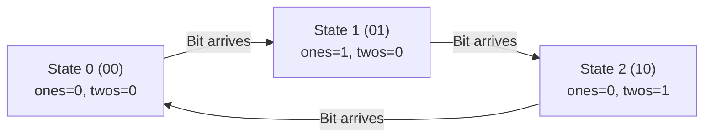

# 02. The XOR Family & Frequency Cancellation

[← Back to Bitwise Fundamentals](./01-bitwise-fundamentals-and-twos-complement-in-java.md) | [Track Hub](./README.md) | [Next: Bitmask Subsets & State Representations →](./03-bitmask-subsets-and-state-representations.md)

---

## 🏛️ 1. Theoretical Foundations: The XOR Invariant Engine

The Bitwise Exclusive OR ($\oplus$) operation satisfies four fundamental mathematical axioms:
1. **Self-Inverse**: $x \oplus x = 0$ (Any value cancels itself out to 0).
2. **Identity Element**: $x \oplus 0 = x$ (Zero has no effect).
3. **Commutativity**: $a \oplus b = b \oplus a$.
4. **Associativity**: $(a \oplus b) \oplus c = a \oplus (b \oplus c)$.

```
╭───────────────────────────────────────────────────────────────────────────────────────────╮
│                               THE SINGLE NUMBER PROBLEM FAMILY                            │
├────────────────────┬─────────────────────────┬───────────────────┬────────────────────────┤
│ Variety            │ Element Frequencies     │ Mathematical Model│ Auxiliary Space        │
├────────────────────┼─────────────────────────┼───────────────────┼────────────────────────┤
│ Single Number I    │ Pairs + 1 Unique        │ Modulo 2 Parity   │ O(1) Space             │
│ Single Number II   │ Triplets + 1 Unique     │ Modulo 3 FSM      │ O(1) Space             │
│ Single Number III  │ Pairs + 2 Uniques       │ LSB Partitioning  │ O(1) Space             │
│ Missing Number     │ Permutation of [0..N]   │ Index XOR Sum     │ O(1) Space             │
╰────────────────────┴─────────────────────────┴───────────────────┴────────────────────────╯
```

---

## ⚡ 2. Single Number I: Parity Cancellation

Given a non-empty array of integers `nums`, every element appears twice except for one. Find that single one in $\mathcal{O}(N)$ time and $\mathcal{O}(1)$ space.

```java
public final class SingleNumberI {

    public static int singleNumber(int[] nums) {
        int xorSum = 0;
        for (int num : nums) {
            xorSum ^= num; // Pairs cancel each other out: x ^ x = 0
        }
        return xorSum;
    }
}
```

---

## 🧩 3. Single Number II: 3-State Finite State Machine (Modulo 3 Counter)

Given an array where every element appears **three times** except for one, which appears once. Find the single element in $\mathcal{O}(N)$ time and $\mathcal{O}(1)$ space.

### 3.1 Designing the Bitwise State Machine
For each bit position across the integers, the count of `1`s must transition modulo 3:
$$\text{State 0 (00)} \xrightarrow{+1} \text{State 1 (01)} \xrightarrow{+1} \text{State 2 (10)} \xrightarrow{+1} \text{State 0 (00)}$$

We use two 32-bit registers, `ones` and `twos`:
- When bit appears 1st time: `ones` becomes 1, `twos` remains 0.
- When bit appears 2nd time: `ones` resets to 0, `twos` becomes 1.
- When bit appears 3rd time: `ones` remains 0, `twos` resets to 0.



```java
public final class SingleNumberII {

    public static int singleNumber(int[] nums) {
        int ones = 0, twos = 0;

        for (int num : nums) {
            // Add 'num' to 'ones' if it is not already in 'twos'
            ones = (ones ^ num) & ~twos;
            // Add 'num' to 'twos' if it is not already in the updated 'ones'
            twos = (twos ^ num) & ~ones;
        }

        // Elements appearing 3 times leave ones=0, twos=0.
        // The unique element appears once, so it resides in 'ones'.
        return ones;
    }
}
```

---

## 🔀 4. Single Number III: Lowest Differentiating Set Bit Partitioning

Given an array where every element appears twice except for **two** elements ($A$ and $B$) which appear only once. Find both elements.

### 4.1 The 3-Step Partitioning Invariant
1. **Compute Overall XOR**:
   $$X = \bigoplus_{i} \text{nums}[i] = A \oplus B$$
   Since $A \ne B$, $X \ne 0$. There must exist at least one bit where $A$ and $B$ differ.
2. **Isolate the Lowest Set Bit (LSB)**:
   $$\text{diff} = X \ \& \ (-X)$$
   This bit is guaranteed to be `1` in exactly one of $\{A, B\}$ and `0` in the other.
3. **Partition the Array into Two Buckets**:
   Divide all numbers into two groups based on whether `(num & diff) != 0`. Each group contains one of the unique numbers, and all paired numbers fall into the exact same group, canceling out!

```java
public final class SingleNumberIII {

    public static int[] singleNumber(int[] nums) {
        // Step 1: XOR all elements -> yields A ^ B
        int xorSum = 0;
        for (int num : nums) {
            xorSum ^= num;
        }

        // Step 2: Isolate the lowest differentiating set bit
        // Note: Using 64-bit cast to prevent overflow if xorSum == Integer.MIN_VALUE
        int diffBit = xorSum & (-xorSum);

        // Step 3: Partition into two groups and cancel pairs
        int a = 0, b = 0;
        for (int num : nums) {
            if ((num & diffBit) == 0) {
                a ^= num;
            } else {
                b ^= num;
            }
        }

        return new int[]{a, b};
    }
}
```

---

## 🎯 5. Missing Number in $[0, N]$

Given an array containing $N$ distinct numbers taken from $0, 1, 2, \dots, N$, find the one that is missing.
Because XOR is self-inverting, XORing all array elements with all indices $0 \dots N$ cancels out all present numbers, leaving only the missing number!

```java
public static int missingNumber(int[] nums) {
    int missing = nums.length;
    for (int i = 0; i < nums.length; i++) {
        missing ^= i ^ nums[i];
    }
    return missing;
}
```

---

## 🧮 Complexity Analysis

| Problem | Time Complexity | Auxiliary Space | Clock Cycles |
| :--- | :--- | :--- | :--- |
| **`Single Number I`** | $\mathcal{O}(N)$ single pass | $\mathcal{O}(1)$ | 1 XOR instruction per item |
| **`Single Number II`** | $\mathcal{O}(N)$ single pass | $\mathcal{O}(1)$ | 4 bitwise ops per item |
| **`Single Number III`** | $\mathcal{O}(N)$ two passes | $\mathcal{O}(1)$ | Branchless bitwise filter |
| **`Missing Number`** | $\mathcal{O}(N)$ single pass | $\mathcal{O}(1)$ | Zero risk of 32-bit overflow |

---

<div align="center">

| [← Back to Bitwise Fundamentals](./01-bitwise-fundamentals-and-twos-complement-in-java.md) | [Track Hub: Bit Manipulation & Math](./README.md) | [Next: Bitmask Subsets & State Representations →](./03-bitmask-subsets-and-state-representations.md) |
| :--- | :---: | ---: |

</div>
