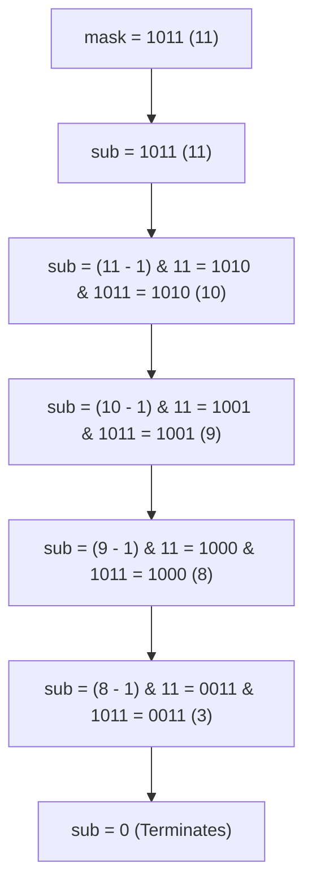

# 03. Bitmask Subsets & State Representations

[← Back to The XOR Family](./02-the-xor-family-and-frequency-cancellation.md) | [Track Hub](./README.md) | [Next: Number Theory: Primes, Factors & GCD →](./04-number-theory-primes-factors-and-gcd.md)

---

## 🏛️ 1. Theoretical Foundations: Bitmasks as Sets

In combinatorial algorithms, when a collection size $N \le 30$ (or $N \le 62$ for `long`), a subset can be represented as an integer **bitmask** where the $i$-th bit indicates the presence or absence of the $i$-th element.

```
╭───────────────────────────────────────────────────────────────────────────────────────────╮
│                              SET OPERATIONS VIA BITWISE ALGEBRA                           │
├─────────────────────┬──────────────────────┬──────────────────────┬───────────────────────┤
│ Set Operation       │ Mathematical Notation│ Bitwise Syntax       │ CPU Complexity        │
├─────────────────────┼──────────────────────┼──────────────────────┼───────────────────────┤
│ Empty Set           │ ∅                    │ 0                    │ O(1)                  │
│ Universal Set (N)   │ U = {0..N-1}         │ (1 << N) - 1         │ O(1)                  │
│ Element In Set?     │ x ∈ S                │ (S & (1 << x)) != 0  │ O(1)                  │
│ Add Element         │ S ∪ {x}              │ S | (1 << x)         │ O(1)                  │
│ Remove Element      │ S \ {x}              │ S & ~(1 << x)        │ O(1)                  │
│ Toggle Element      │ S Δ {x}              │ S ^ (1 << x)         │ O(1)                  │
│ Set Union           │ A ∪ B                │ A | B                │ O(1)                  │
│ Set Intersection    │ A ∩ B                │ A & B                │ O(1)                  │
│ Set Difference      │ A \ B                │ A & ~B               │ O(1)                  │
│ Set Cardinality     │ |S|                  │ Integer.bitCount(S)  │ O(1)                  │
╰─────────────────────┴──────────────────────┴──────────────────────┴───────────────────────╯
```

---

## ⚡ 2. The $O(3^N)$ Submask Enumeration Invariant

A common requirement in Bitmask Dynamic Programming and graph partitioning is to iterate through **all submasks** of a given mask.
The naive approach of checking every number from $0$ to `mask` takes $\mathcal{O}(2^N)$ for each mask, leading to $\mathcal{O}(4^N)$ total operations.

### 2.1 The Submask Trick: `(sub - 1) & mask`
```java
// Enumerates all non-empty submasks of 'mask' in strictly descending order
for (int sub = mask; sub > 0; sub = (sub - 1) & mask) {
    // Process submask
}
```



### 2.2 Proof of $3^N$ Complexity
When we iterate over all submasks for all masks of size $N$:
$$\sum_{k=0}^N \binom{N}{k} 2^k = (1 + 2)^N = 3^N$$
For $N = 15$, $4^{15} \approx 10^9$ (Time Limit Exceeded), whereas $3^{15} \approx 1.4 \times 10^7$ (Executes in $< 20\text{ ms}$).

---

## 🚀 3. Canonical Problem: Shortest Path Visiting All Nodes

An undirected, connected graph of $N$ nodes ($1 \le N \le 12$) is given. Find the length of the shortest path that visits every node. You may start and stop at any node, revisit nodes multiple times, and reuse edges.

### 3.1 State Formulation
Because nodes and edges can be revisited, standard graph BFS will loop infinitely.
- **State Tuple**: `(currentNode, visitedBitmask)`
- Total distinct states = $N \times 2^N$.
- For $N = 12$, $12 \times 2^{12} = 49,152$ states. This fits easily in memory!
- Since all edge weights are $1$, a **Breadth-First Search (BFS)** guarantees the first time a state achieves `visitedBitmask == (1 << N) - 1`, the path distance is optimal.

```java
import java.util.*;

public final class ShortestPathAllNodes {

    public static int shortestPathLength(int[][] graph) {
        int n = graph.length;
        if (n <= 1) return 0;

        int targetMask = (1 << n) - 1;
        // visited[node][mask] stores whether this state has been explored
        boolean[][] visited = new boolean[n][targetMask + 1];

        // Queue stores int[] {node, mask, distance}
        ArrayDeque<int[]> queue = new ArrayDeque<>();

        // Multi-source BFS: We can start at ANY node
        for (int i = 0; i < n; i++) {
            int initialMask = 1 << i;
            queue.offer(new int[]{i, initialMask, 0});
            visited[i][initialMask] = true;
        }

        while (!queue.isEmpty()) {
            int[] curr = queue.poll();
            int u = curr[0];
            int mask = curr[1];
            int dist = curr[2];

            // Reached target state: all nodes have been visited
            if (mask == targetMask) {
                return dist;
            }

            for (int v : graph[u]) {
                int nextMask = mask | (1 << v);

                if (!visited[v][nextMask]) {
                    visited[v][nextMask] = true;
                    queue.offer(new int[]{v, nextMask, dist + 1});
                }
            }
        }

        return -1;
    }
}
```

---

## 🧮 Complexity Analysis

| Algorithm | State Space Size | Time Complexity | Auxiliary Space |
| :--- | :--- | :--- | :--- |
| **`Submask Enumeration`** | $\sum \binom{N}{k} 2^k$ | $\mathcal{O}(3^N)$ | $\mathcal{O}(1)$ |
| **`Shortest Path All Nodes`**| $N \cdot 2^N$ states | $\mathcal{O}(N^2 \cdot 2^N)$ | $\mathcal{O}(N \cdot 2^N)$ |
| **`Power Set via Bitmask`** | $2^N$ states | $\mathcal{O}(N \cdot 2^N)$ | $\mathcal{O}(1)$ |

---

<div align="center">

| [← Back to The XOR Family](./02-the-xor-family-and-frequency-cancellation.md) | [Track Hub: Bit Manipulation & Math](./README.md) | [Next: Number Theory: Primes, Factors & GCD →](./04-number-theory-primes-factors-and-gcd.md) |
| :--- | :---: | ---: |

</div>
