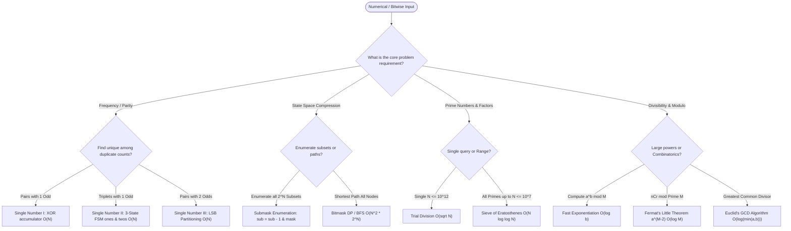

# ⚡ Bit Manipulation & Mathematical Systems

[Java Track Home](../README.md) | [Strategies Hub](../../dsa-strategies/README.md) | [Next: Bitwise Fundamentals & Two's Complement →](./01-bitwise-fundamentals-and-twos-complement-in-java.md)

---

## 🧭 Executive Overview: The Silicon-Level Operating System

In high-performance computing, distributed network protocol design, and algorithmic coding, **Bit Manipulation** and **Number Theory** represent the boundary where software touches the physical ALU (Arithmetic Logic Unit). 

While high-level algorithms structure operations on abstract objects, bitwise operations execute in a **single CPU clock cycle** ($< 1\text{ ns}$) and utilize zero heap memory. Harnessing two's complement bitwise arithmetic and mathematical theorems (Euler, Fermat, Euclid) allows engineers to:
1. Compress $N$-element combinatorial states into a single 32-bit or 64-bit primitive register ($O(1)$ space).
2. Eliminate branching penalties and memory fetches using bitwise branchless arithmetic.
3. Solve numerical constraints that exceed physical memory limits via modular arithmetic and logarithmic power algorithms.

```
                      ╭────────────────────────────────────────╮
                      │      BITWISE & MATHEMATICAL ENGINE     │
                      ╰───────────────────┬────────────────────╯
                                          │
                         What is the operational domain?
                                          │
                         ┌────────────────┴────────────────┐
                         ▼                                 ▼
                     BITWISE                           MATHEMATICAL
                Register Operations                   Number Theory
                         │                                 │
                 ┌───────┴───────┐                 ┌───────┴───────┐
                 ▼               ▼                 ▼               ▼
             STATE MASK     CANCELLATION        PRIMALITY       EXPONENTIATION
            Subsets / TSP   Single Number     Eratosthenes / GCD   Binary Power
```

---

## 💾 1. Physical Representation: Two's Complement in the JVM

Java strictly specifies that all signed integer types use **Two's Complement** binary representation across all platforms:
- `byte`: 8 bits ($-128$ to $127$)
- `short`: 16 bits ($-32,768$ to $32,767$)
- `int`: 32 bits ($-2^{31}$ to $2^{31} - 1$)
- `long`: 64 bits ($-2^{63}$ to $2^{63} - 1$)

### 1.1 The Two's Complement Invariant: `-x = ~x + 1`
To negate a number, invert all bits (bitwise NOT `~`) and add $1$:
```
Example: x = +6
  00000000 00000000 00000000 00000110   (+6)
~ 11111111 11111111 11111111 11111001   (Bitwise NOT: ~6)
+                                    1
──────────────────────────────────────
  11111111 11111111 11111111 11111010   (-6 in Two's Complement)
```

### 1.2 Sign Extension: `>>` vs. `>>>`
- **Arithmetic Right Shift (`>>`)**: Preserves the sign bit (copies the MSB into vacated high-order bits). For negative numbers, bits shifted in on the left are `1`.
- **Logical Right Shift (`>>>`)**: Zero-fills the vacated high-order bits, treating the bit pattern as an unsigned quantity.

---

## 🧭 2. The Global Bitwise & Math Decision Engine



---

## 🗺️ 3. Master Curriculum Roadmap

| Module | Core Paradigm | Key Algorithms & Invariants | Canonical Problems |
| :--- | :--- | :--- | :--- |
| **[01. Bitwise Fundamentals & Two's Complement](./01-bitwise-fundamentals-and-twos-complement-in-java.md)** | Hardware Register Math | Two's complement, `>>` vs `>>>`, Kernighan LSB isolation, Hamming Weight | Number of 1 Bits, Power of Two, Reverse Bits |
| **[02. The XOR Family & Frequency Cancellation](./02-the-xor-family-and-frequency-cancellation.md)** | Self-Inversion Invariants | Bitwise cancellation, 3-state Finite State Machines, LSB partitioning | Single Number I/II/III, Missing Number |
| **[03. Bitmask Subsets & State Representations](./03-bitmask-subsets-and-state-representations.md)** | Compact State Spaces | Submask enumeration `(sub - 1) & mask`, Set operations, Bitwise TSP | Subsets via Bits, Shortest Path Visiting All Nodes |
| **[04. Number Theory: Primes, Factors & GCD](./04-number-theory-primes-factors-and-gcd.md)** | Factorization & Divisibility | Sieve of Eratosthenes, Linear Euler Sieve, Euclidean GCD/LCM | Count Primes, GCD of Array, Ugly Numbers |
| **[05. Modular Arithmetic & Fast Exponentiation](./05-modular-arithmetic-and-fast-exponentiation.md)** | Algebraic Systems | Binary Exponentiation, Modular Inverses via Fermat, Precomputed Factorials $n\text{C}r$ | Pow(x, n) modulo M, Combinations $n\text{C}r \pmod P$ |
| **[06. Advanced Math & Randomized Algorithms](./06-advanced-math-and-randomized-algorithms.md)** | Uniform Distributions | Reservoir Sampling, Fisher-Yates Shuffle, Matrix Exponentiation for Recurrences | Random Pick Index, Shuffle Array, Fibonacci in $O(\log N)$ |

---

<div align="center">

| [← Back to Java Track Home](../README.md) | [Track Hub: Bit Manipulation & Math](./README.md) | [Next: Bitwise Fundamentals & Two's Complement →](./01-bitwise-fundamentals-and-twos-complement-in-java.md) |
| :--- | :---: | ---: |

</div>
