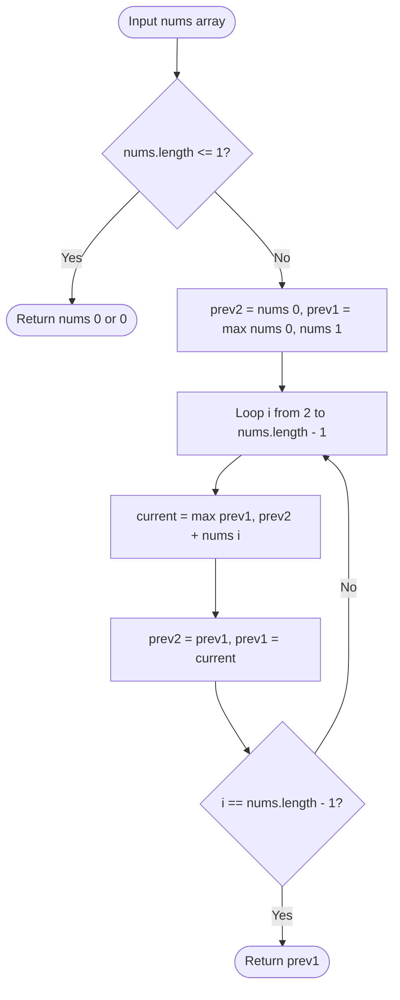

# 01. 1D State Formulations & Fundamentals

[← Back to DP Hub](./README.md) | [Track Hub](./README.md) | [Next: Grid & Multi-Dimensional DP →](./02-grid-and-multi-dimensional-dp.md)

---

## 🏛️ 1. Theoretical Foundations: 1D Recurrences & Space Elimination

In 1D Dynamic Programming, the optimal state $dp[i]$ depends exclusively on a fixed window of preceding states $\{dp[i - 1], dp[i - 2], \dots, dp[i - k]\}$.

When the lookback window $k$ is a constant (e.g., $k = 1$ or $k = 2$), maintaining an entire $O(N)$ memory array is unnecessary. We can discard historical entries, compressing auxiliary space down to **$\mathcal{O}(1)$ constant memory** using rolling variables:

```
Full Array (O(N) memory):
Indices:   0     1     2     3     ...     i-2       i-1        i
Array:   [ *     *     *     *     ...    prev2     prev1     current ]
                                            │         │          ▲
                                            └─────────┴──────────┘
                                        Only these 2 states needed!

Space-Optimized (O(1) memory):
int prev2 = base0, prev1 = base1;
int current = max(prev1, prev2 + nums[i]);
prev2 = prev1;
prev1 = current;
```

---

## 2. Problem 1: House Robber (Choice-Based 1D DP)

### 2.1 Problem Statement & Constraints

You are a professional robber planning to rob houses along a street. Each house has a certain amount of money stashed, the only constraint stopping you from robbing each of them is that adjacent houses have security systems connected and **it will automatically contact the police if two adjacent houses were broken into on the same night**.

Given an integer array `nums` representing the amount of money of each house, return the **maximum amount of money** you can rob tonight without alerting the police.

```
Example 1:
Input: nums = [1,2,3,1]
Output: 4
Explanation: Rob house 1 (money = 1) and then rob house 3 (money = 3). Total = 1 + 3 = 4.

Example 2:
Input: nums = [2,7,9,3,1]
Output: 12
Explanation: Rob house 1 (2), house 3 (9), and house 5 (1). Total = 2 + 9 + 1 = 12.
```

#### Constraints:
- $1 \le \text{nums.length} \le 100$.
- $0 \le \text{nums}[i] \le 400$.

---

### 2.2 Thought Process & Intuition

```
  Decision Tree at House i:
  You arrive at house i. You have exactly TWO mutually exclusive choices:
  • Choice 1: ROB house i.
    Because you cannot rob adjacent house i - 1, your maximum loot is:
    nums[i] + optimal loot up to house i - 2 (dp[i - 2]).
  • Choice 2: SKIP house i.
    You do not take house i, so your maximum loot is whatever you could rob up to house i - 1 (dp[i - 1]).
                         ↓
  Bellman Recurrence Equation:
  dp[i] = max(dp[i - 1], dp[i - 2] + nums[i])
                         ↓
  Space Compression:
  dp[i] only looks back 2 steps!
  Replace array dp[] with two primitive integers: prev2 and prev1.
  Time: O(N), Space: O(1)!
```

---

### 2.3 Procedural Blueprint (How to Proceed)



---

### 2.4 Visual State Transition: Rolling Loot Calculation

```
nums = [ 2,  7,  9,  3,  1 ]
Indices: 0   1   2   3   4

Base Cases:
prev2 = nums[0] = 2
prev1 = max(nums[0], nums[1]) = max(2, 7) = 7

Iteration i = 2 (val = 9):
current = max(prev1, prev2 + 9) = max(7, 2 + 9) = 11
Shift: prev2 = 7, prev1 = 11

Iteration i = 3 (val = 3):
current = max(prev1, prev2 + 3) = max(11, 7 + 3) = 11
Shift: prev2 = 11, prev1 = 11

Iteration i = 4 (val = 1):
current = max(prev1, prev2 + 1) = max(11, 11 + 1) = 12
Shift: prev2 = 11, prev1 = 12

Final Result: 12! Space consumed: Exactly 2 integer variables!
```

---

### 2.5 Production Java 17/21 Implementation

```java
public final class HouseRobber {

    /**
     * Finds the maximum loot without robbing adjacent houses using O(1) space.
     *
     * Time Complexity:  O(N) — single pass through the array.
     * Space Complexity: O(1) — exactly two integer state registers.
     */
    public int rob(int[] nums) {
        if (nums == null || nums.length == 0) {
            return 0;
        }
        if (nums.length == 1) {
            return nums[0];
        }

        int prev2 = nums[0];
        int prev1 = Math.max(nums[0], nums[1]);

        for (int i = 2; i < nums.length; i++) {
            int current = Math.max(prev1, prev2 + nums[i]);
            prev2 = prev1;
            prev1 = current;
        }

        return prev1;
    }
}
```

---

## 3. Problem 2: Coin Change (Unbounded 1D Min-Cost Formulation)

### 3.1 Problem Statement & Constraints

You are given an integer array `coins` representing coins of different denominations and an integer `amount` representing a total amount of money.

Return the **fewest number of coins** that you need to make up that amount. If that amount of money cannot be made up by any combination of the coins, return `-1`.

You may assume that you have an **infinite number** of each kind of coin.

```
Example 1:
Input: coins = [1,2,5], amount = 11
Output: 3
Explanation: 11 = 5 + 5 + 1 (3 coins).

Example 2:
Input: coins = [2], amount = 3
Output: -1
```

#### Constraints:
- $1 \le \text{coins.length} \le 12$.
- $1 \le \text{coins}[i] \le 2^{31} - 1$.
- $0 \le \text{amount} \le 10^4$.

---

### 3.2 Thought Process & Intuition

```
  State Meaning:
  dp[a] = The minimum number of coins needed to make amount a.
                         ↓
  Base Case:
  dp[0] = 0 (0 coins required to form amount 0).
  Initialize all dp[1 .. amount] to amount + 1 (representing positive infinity).
                         ↓
  Bellman Recurrence Equation:
  To make amount a, we can pick ANY coin c in coins (provided c <= a):
  dp[a] = min_{c in coins} (dp[a - c] + 1)
                         ↓
  Post-Processing:
  If dp[amount] > amount, no valid combination exists -> return -1.
  Otherwise, return dp[amount].
```

---

### 3.3 Production Java 17/21 Implementation

```java
import java.util.Arrays;

public final class CoinChange {

    /**
     * Determines minimum coins to form target amount using 1D bottom-up DP.
     *
     * Time Complexity:  O(amount * coins.length).
     * Space Complexity: O(amount) for the dp array.
     */
    public int coinChange(int[] coins, int amount) {
        if (amount < 0) return -1;
        if (amount == 0) return 0;

        int max = amount + 1; // Sentinel infinity
        int[] dp = new int[amount + 1];
        Arrays.fill(dp, max);
        dp[0] = 0;

        for (int a = 1; a <= amount; a++) {
            for (int coin : coins) {
                if (a - coin >= 0) {
                    dp[a] = Math.min(dp[a], dp[a - coin] + 1);
                }
            }
        }

        return dp[amount] > amount ? -1 : dp[amount];
    }
}
```

---

## 4. Problem 3: Longest Increasing Subsequence (LIS): $\mathcal{O}(N \log N)$ Patience Sort

### 4.1 Problem Statement & Constraints

Given an integer array `nums`, return the length of the longest strictly increasing subsequence.

```
Example 1:
Input: nums = [10,9,2,5,3,7,101,18]
Output: 4
Explanation: The longest increasing subsequence is [2,3,7,101], therefore the length is 4.

Example 2:
Input: nums = [0,1,0,3,2,3]
Output: 4
```

#### Constraints:
- $1 \le \text{nums.length} \le 2500$.
- $-10^4 \le \text{nums}[i] \le 10^4$.
- Follow-up: Can you solve it in $\mathcal{O}(N \log N)$ time complexity?

---

### 4.2 Thought Process & Intuition

```
  Approach 1: Classic O(N²) DP
  dp[i] = length of LIS ending at index i.
  dp[i] = 1 + max(dp[j]) for all j < i where nums[j] < nums[i].
  Time: O(N²), Space: O(N). Too slow for N = 10⁵!
                         ↓
  Approach 2: Patience Sorting & Binary Search (O(N log N))
  "Aha!" Insight:
  Maintain an array `tails` where tails[len] stores the SMALLEST tail element
  of all increasing subsequences of length len + 1 found so far!
  
  Why this works (The Greedy Invariant):
  A smaller tail is strictly superior to a larger tail because it provides
  more headroom for future incoming numbers to be larger!
  
  Crucial Property: `tails` is strictly monotonically sorted at all times!
  For each num in nums:
  • Use Binary Search to find the first element in tails >= num.
  • If found at index idx: tails[idx] = num (Greedily lower the tail of length idx + 1!).
  • If not found: num is greater than all tails! Append num to tails, increasing LIS length!
```

---

### 4.3 Visual State Transition: Patience Card Sorting

```
nums = [ 10,  9,  2,  5,  3,  7, 101, 18 ]

Step 1: num = 10  -> tails = [ 10 ]
Step 2: num = 9   -> 9 < 10, replaces 10! tails = [ 9 ]
Step 3: num = 2   -> 2 < 9, replaces 9!   tails = [ 2 ]
Step 4: num = 5   -> 5 > 2, appends!      tails = [ 2, 5 ]
Step 5: num = 3   -> 3 replaces 5!        tails = [ 2, 3 ]
Step 6: num = 7   -> 7 > 3, appends!      tails = [ 2, 3, 7 ]
Step 7: num = 101 -> 101 > 7, appends!    tails = [ 2, 3, 7, 101 ]
Step 8: num = 18  -> 18 replaces 101!     tails = [ 2, 3, 7, 18 ]

Final LIS Length = tails.length = 4!
```

---

### 4.4 Production Java 17/21 Implementation

```java
import java.util.Arrays;

public final class LongestIncreasingSubsequence {

    /**
     * Computes length of LIS using Patience Sorting with Binary Search in O(N log N).
     *
     * Time Complexity:  O(N log N) — N elements, each binary searched in O(log N).
     * Space Complexity: O(N) for the tails array.
     */
    public int lengthOfLIS(int[] nums) {
        if (nums == null || nums.length == 0) {
            return 0;
        }

        int[] tails = new int[nums.length];
        int size = 0;

        for (int x : nums) {
            // Binary search in the active portion of tails[0 .. size - 1]
            int i = 0, j = size;
            while (i < j) {
                int mid = (i + j) >>> 1;
                if (tails[mid] < x) {
                    i = mid + 1;
                } else {
                    j = mid;
                }
            }

            tails[i] = x;
            if (i == size) {
                size++; // Extended the longest subsequence
            }
        }

        return size;
    }
}
```

---

<div align="center">

| [← Back to DP Hub](./README.md) | [Track Hub: Dynamic Programming](./README.md) | [Next: Grid & Multi-Dimensional DP →](./02-grid-and-multi-dimensional-dp.md) |
| :--- | :---: | ---: |

</div>
