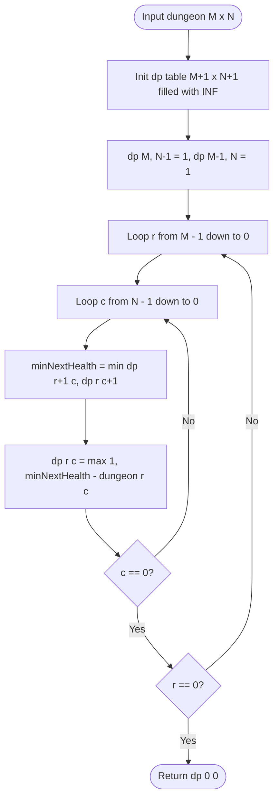

# 02. Grid & Multi-Dimensional Dynamic Programming

[← Back to 1D Formulations](./01-dp-fundamentals-and-1d-state-formulations.md) | [Track Hub](./README.md) | [Next: The Knapsack Family & Subset Sums →](./03-the-knapsack-family-and-subset-sums.md)

---

## 🏛️ 1. Theoretical Foundations: 2D Grid DP & Row Rolling

In 2D Grid Dynamic Programming, the state represents coordinates on a Cartesian plane: $dp[r][c]$ corresponds to cell $(r, c)$. 

When motion is restricted strictly to **Down** $(r+1, c)$ and **Right** $(r, c+1)$, subproblems form a clear Directed Acyclic Graph (DAG) flowing from top-left to bottom-right:

```
Cell (r - 1, c) [From Above]
       │
       ▼
Cell (r, c - 1) ──► Cell (r, c)
 [From Left]

Recurrence Invariant:
dp[r][c] = cost(r, c) + combine(dp[r - 1][c], dp[r][c - 1])
```

### The 1D Row-Rolling Memory Optimization
Notice that computing row $r$ requires only:
1. The cell directly above it: $dp[r - 1][c]$ (which resides in the **current** value of `dp[c]` before updating).
2. The cell directly to its left: $dp[r][c - 1]$ (which has **already been updated** into `dp[c - 1]`).

```
2D Matrix: O(M * N) space
1D Rolling Array: O(N) space!
dp[c] = cost + min(dp[c], dp[c - 1]);
//                 ▲        ▲
//                 │        └── From Left (already updated in current row)
//                 └─────────── From Above (previous row's value before overwrite)
```

---

## 2. Problem 1: Unique Paths with Obstacles (Grid Counting)

### 2.1 Problem Statement & Constraints

You are given an $m \times n$ integer array `grid`. There is a robot initially located at the **top-left corner** (`grid[0][0]`). The robot tries to move to the **bottom-right corner** (`grid[m - 1][n - 1]`). The robot can only move either down or right at any point in time.

An obstacle and space are marked as `1` or `0` respectively in `grid`. A path that the robot takes cannot include any square that is an obstacle.

Return the number of possible unique paths that the robot can take to reach the bottom-right corner.

```
Example 1:
Input: obstacleGrid = [[0,0,0],[0,1,0],[0,0,0]]
Output: 2
Explanation: There is one obstacle in the middle of the 3x3 grid.
Paths: (0,0) -> (0,1) -> (0,2) -> (1,2) -> (2,2)
       (0,0) -> (1,0) -> (2,0) -> (2,1) -> (2,2)
```

#### Constraints:
- $m == \text{obstacleGrid.length}, n == \text{obstacleGrid}[i]\text{.length}$.
- $1 \le m, n \le 100$.
- `obstacleGrid[i][j]` is `0` or `1`.

---

### 2.2 Thought Process & Intuition

```
  State Definition:
  dp[c] = Number of unique valid paths reaching column c in the current row.
                         ↓
  Obstacle Handling:
  If obstacleGrid[r][c] == 1:
  No path can enter this cell! Set dp[c] = 0 immediately!
                         ↓
  Transition:
  If obstacleGrid[r][c] == 0:
  dp[c] = dp[c] (paths from above) + dp[c - 1] (paths from left).
  Space: O(N) using a single 1D array!
```

---

### 2.3 Production Java 17/21 Implementation

```java
public final class UniquePathsWithObstacles {

    /**
     * Computes unique paths with obstacles using an O(N) 1D rolling array.
     *
     * Time Complexity:  O(M * N) — single pass over the grid.
     * Space Complexity: O(N) — only one row of width N stored.
     */
    public int uniquePathsWithObstacles(int[][] obstacleGrid) {
        int m = obstacleGrid.length;
        int n = obstacleGrid[0].length;

        if (obstacleGrid[0][0] == 1 || obstacleGrid[m - 1][n - 1] == 1) {
            return 0;
        }

        int[] dp = new int[n];
        dp[0] = 1;

        for (int r = 0; r < m; r++) {
            for (int c = 0; c < n; c++) {
                if (obstacleGrid[r][c] == 1) {
                    dp[c] = 0; // Obstacle blocks all paths
                } else if (c > 0) {
                    dp[c] += dp[c - 1]; // Paths from left + paths from above
                }
            }
        }

        return dp[n - 1];
    }
}
```

---

## 3. Problem 2: Minimum Path Sum

### 3.1 Problem Statement & Constraints

Given an $m \times n$ `grid` filled with non-negative numbers, find a path from top left to bottom right, which minimizes the sum of all numbers along its path.

You can only move either down or right at any point in time.

```
Example 1:
Input: grid = [[1,3,1],[1,5,1],[4,2,1]]
Output: 7
Explanation: Path 1 -> 3 -> 1 -> 1 -> 1 minimizes the sum to 7.
```

#### Constraints:
- $m == \text{grid.length}, n == \text{grid}[i]\text{.length}$.
- $1 \le m, n \le 200$.
- $0 \le \text{grid}[i][j] \le 200$.

---

### 3.2 Production Java 17/21 Implementation

```java
public final class MinimumPathSum {

    /**
     * Finds minimum path sum using O(N) auxiliary space.
     *
     * Time Complexity:  O(M * N)
     * Space Complexity: O(N)
     */
    public int minPathSum(int[][] grid) {
        int m = grid.length;
        int n = grid[0].length;

        int[] dp = new int[n];
        dp[0] = grid[0][0];

        // Initialize first row
        for (int c = 1; c < n; c++) {
            dp[c] = dp[c - 1] + grid[0][c];
        }

        // Traverse remaining rows
        for (int r = 1; r < m; r++) {
            dp[0] += grid[r][0]; // First column can only come from above
            for (int c = 1; c < n; c++) {
                dp[c] = grid[r][c] + Math.min(dp[c], dp[c - 1]);
            }
        }

        return dp[n - 1];
    }
}
```

---

## 4. Problem 3: Dungeon Game (Hard) — Reverse Bottom-Up DP

### 4.1 Problem Statement & Constraints

The demons had captured the princess and imprisoned her in the bottom-right corner of a `dungeon`. The dungeon consists of $m \times n$ rooms. Our valiant knight is initially situated at the top-left room and must fight his way through the dungeon to rescue the princess.

The knight has an initial health points represented by a positive integer. If at any point his health points drop to `0` or below, he dies immediately.

Some of the rooms are guarded by demons (represented by negative integers), so the knight loses health upon entering these rooms; other rooms are either empty (`0`) or contain magic orbs that increase the knight's health (positive integers).

To reach the princess as quickly as possible, the knight decides to move only **rightward** or **downward** in each step.

Return the knight's **minimum initial health** so that he is able to rescue the princess.

```
Example 1:
Input: dungeon = [
  [-2, -3,  3],
  [-5,-10,  1],
  [10, 30, -5]
]
Output: 7
Explanation: Optimal path: (-2) -> (-3) -> (3) -> (1) -> (-5).
Health changes: 7 -> 5 -> 2 -> 5 -> 6 -> 1. Knight remains alive (HP >= 1)!
```

#### Constraints:
- $m == \text{dungeon.length}, n == \text{dungeon}[i]\text{.length}$.
- $1 \le m, n \le 200$.
- $-1000 \le \text{dungeon}[i][j] \le 1000$.

---

### 4.2 Thought Process: Why Forward DP Fails

```
  The Fatal Trap of Forward DP:
  If we attempt forward DP: dp[r][c] = (min_health_needed, remaining_hp).
  This fails because a path requiring more initial health could exit with much higher remaining HP,
  enabling survival in subsequent deadly rooms!
  The optimal choice at (r, c) depends on FUTURE ROOMS, not past rooms!
                         ↓
  "Aha!" Insight: Reverse Bottom-Up DP from (m - 1, n - 1) to (0, 0)
  Define dp[r][c] = The MINIMUM health required UPON ENTERING cell (r, c)
                    to survive and reach the princess!
                         ↓
  The Health Invariant:
  1. At any point, the knight's health upon exiting (r, c) must satisfy:
     health_after >= min(dp[r + 1][c], dp[r][c + 1])
  2. Before taking the room's effect dungeon[r][c]:
     health_before + dungeon[r][c] = health_after
     health_before = health_after - dungeon[r][c]
  3. The knight MUST always be alive (health >= 1):
     dp[r][c] = max(1, min(dp[r + 1][c], dp[r][c + 1]) - dungeon[r][c])!
```

---

### 4.3 Procedural Blueprint (How to Proceed)



---

### 4.4 Visual State Transition: Reverse Survival Calculations

```
dungeon = [
  [-2, -3,  3],
  [-5,-10,  1],
  [10, 30, -5]
]

Princess Cell (2, 2): room = -5
To survive an exit with 1 HP:
needed = max(1, 1 - (-5)) = max(1, 6) = 6 HP upon entering (2, 2)!

Cell (2, 1): room = 30. Can only go right to (2, 2) where 6 HP is needed.
needed = max(1, 6 - 30) = max(1, -24) = 1 HP upon entering (2, 1)!

Cell (1, 2): room = 1. Can only go down to (2, 2) where 6 HP is needed.
needed = max(1, 6 - 1) = 5 HP upon entering (1, 2)!

Tracing back all the way to (0, 0) produces dp[0][0] = 7!
```

---

### 4.5 Production Java 17/21 Implementation

```java
import java.util.Arrays;

public final class DungeonGame {

    /**
     * Solves Dungeon Game using reverse bottom-up DP with boundary padding.
     *
     * Time Complexity:  O(M * N) — single backward sweep over grid.
     * Space Complexity: O(N) — compressed into a 1D row array.
     */
    public int calculateMinimumHP(int[][] dungeon) {
        int m = dungeon.length;
        int n = dungeon[0].length;

        // dp[c] stores min health needed upon entering room (r, c)
        int[] dp = new int[n + 1];
        Arrays.fill(dp, Integer.MAX_VALUE);

        // Sentinel base case: Exiting the princess room requires at least 1 HP
        dp[n - 1] = 1;

        for (int r = m - 1; r >= 0; r--) {
            for (int c = n - 1; c >= 0; c--) {
                // Knight moves either Down (dp[c]) or Right (dp[c + 1])
                int minHealthOnExit = Math.min(dp[c], dp[c + 1]);
                dp[c] = Math.max(1, minHealthOnExit - dungeon[r][c]);
            }
            dp[n] = Integer.MAX_VALUE; // Reset boundary sentinel for next row up
        }

        return dp[0];
    }
}
```

---

<div align="center">

| [← Back to 1D Formulations](./01-dp-fundamentals-and-1d-state-formulations.md) | [Track Hub: Dynamic Programming](./README.md) | [Next: The Knapsack Family & Subset Sums →](./03-the-knapsack-family-and-subset-sums.md) |
| :--- | :---: | ---: |

</div>
