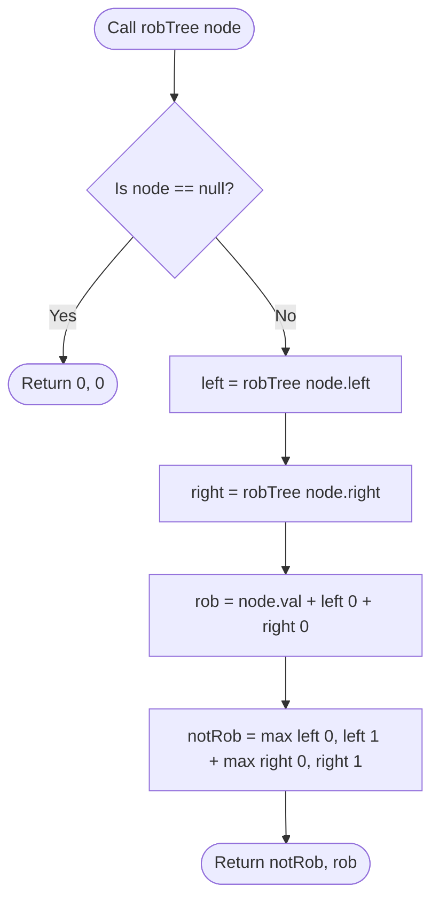

# 06. Tree DP & Subtree Rerooting Architectures

[← Back to Interval DP](./05-interval-dp-and-game-theory.md) | [Track Hub](./README.md) | [Next: Bitmask DP & State Compression →](./07-bitmask-dp-and-state-compression.md)

---

## 🏛️ 1. Theoretical Foundations: Dynamic Programming on Trees

In **Tree Dynamic Programming**, the topological ordering of subproblems is determined naturally by the tree's hierarchical structure:
- **Leaves** are base cases ($dp[\text{leaf}]$).
- Subproblem states propagate **Bottom-Up** via **Post-Order Traversal** (`left` $\to$ `right` $\to$ `root`).
- When visiting node $u$, the optimal answers for all its subtrees are already computed and available.

```
                     ( u )  <--- dp[u] computed from left and right
                    /     \
             dp[left]     dp[right]
               /   \         /   \
             (L1)  (L2)    (R1)  (R2)
```

---

## ⚡ 2. The Subtree Rerooting Paradigm ($\mathcal{O}(N)$ vs. $\mathcal{O}(N^2)$)

Frequently, an algorithm requires finding the optimal answer when **every node in the tree is considered as the root** (e.g., Sum of Distances in Tree, Tree Diameter).

```
╭───────────────────────────────────────────────────────────────────────────────────────────╮
│                              THE 2-PASS REROOTING ALGORITHM                               │
├─────────────────────┬─────────────────────────────────────────────────────────────────────┤
│ Pass 1 (Bottom-Up)  │ Pick arbitrary root (e.g., node 0). Run post-order DFS to calculate │
│                     │ subtree metrics (subtree sizes, down-tree distance sums).           │
├─────────────────────┼─────────────────────────────────────────────────────────────────────┤
│ Pass 2 (Top-Down)   │ Run pre-order DFS from root downward. When moving from parent u to  │
│                     │ child v, update v's answer in O(1) by rerooting:                    │
│                     │ ans[v] = ans[u] - gain(v) + loss(u).                                │
│                     │ Achieves O(N) linear time for all N possible roots!                 │
╰─────────────────────┴─────────────────────────────────────────────────────────────────────╯
```

---

## 3. Problem 1: House Robber III (Multi-State Tree DP)

### 3.1 Problem Statement & Constraints

The thief has found himself a new place for his thievery again. There is only one entrance to this area, called `root`.

Besides the `root`, each house has one and only one parent house. After a tour, the smart thief realized that **all houses in this place form a binary tree**. It will automatically contact the police if **two directly-linked houses were broken into on the same night**.

Given the `root` of the binary tree, return the **maximum amount of money** the thief can rob without alerting the police.

```
Example 1:
     3
    / \
   2   3
    \   \ 
     3   1
Output: 7
Explanation: Maximum money = 3 (root) + 3 (bottom-left) + 1 (bottom-right) = 7.

Example 2:
     3
    / \
   4   5
  / \   \ 
 1   3   1
Output: 9
Explanation: Maximum money = 4 + 5 = 9.
```

#### Constraints:
- The number of nodes in the tree is in the range $[1, 10^4]$.
- $0 \le \text{Node.val} \le 10^4$.

---

### 3.2 Thought Process & 2-State Vector Derivation

```
  State Representation per Node:
  Each node returns an array of size 2: int[] res = { notRobbed, robbed }
  • res[0]: Maximum money if current node is NOT ROBBED.
  • res[1]: Maximum money if current node IS ROBBED.
                         ↓
  Transitions from Children:
  1. If we ROB current node (res[1]):
     We CANNOT rob either child! We MUST take their notRobbed values:
     res[1] = node.val + left[0] + right[0]
  
  2. If we DO NOT ROB current node (res[0]):
     We are free to either rob or not rob each child independently!
     Pick the maximum of both states for each child:
     res[0] = max(left[0], left[1]) + max(right[0], right[1])
                         ↓
  Final Answer at root: max(res[0], res[1])
  Time: O(N) single post-order pass! Space: O(H) recursion stack!
```

---

### 3.3 Procedural Blueprint (How to Proceed)



---

### 3.4 Production Java 17/21 Implementation

```java
public final class HouseRobberIII {

    public static class TreeNode {
        public int val;
        public TreeNode left;
        public TreeNode right;

        public TreeNode(int val) {
            this.val = val;
        }
    }

    /**
     * Solves tree house robber using a 2-state post-order DFS vector.
     *
     * Time Complexity:  O(N) — visits each tree node exactly once.
     * Space Complexity: O(H) — recursion stack height (O(log N) balanced, O(N) worst).
     */
    public int rob(TreeNode root) {
        int[] result = postOrderRob(root);
        return Math.max(result[0], result[1]);
    }

    /**
     * @return int[2] where [0] is max money without robbing node,
     *                      [1] is max money robbing node.
     */
    private int[] postOrderRob(TreeNode node) {
        if (node == null) {
            return new int[]{0, 0};
        }

        int[] left = postOrderRob(node.left);
        int[] right = postOrderRob(node.right);

        int notRobbed = Math.max(left[0], left[1]) + Math.max(right[0], right[1]);
        int robbed = node.val + left[0] + right[0];

        return new int[]{notRobbed, robbed};
    }
}
```

---

## 4. Problem 2: Binary Tree Maximum Path Sum (Hard)

### 4.1 Problem Statement & Constraints

A **path** in a binary tree is a sequence of nodes where each pair of adjacent nodes in the sequence has an edge connecting them. A node can only appear in the sequence **at most once**. Note that the path does not need to pass through the root.

The **path sum** of a path is the sum of the node's values in the path.

Given the `root` of a binary tree, return the **maximum path sum** of any non-empty path.

```
Example 1:
    1
   / \
  2   3
Output: 6 (Path: 2 -> 1 -> 3)

Example 2:
   -10
   /  \
  9   20
     /  \
    15   7
Output: 42 (Path: 15 -> 20 -> 7)
```

#### Constraints:
- The number of nodes in the tree is in the range $[1, 3 \times 10^4]$.
- $-1000 \le \text{Node.val} \le 1000$.

---

### 4.2 Thought Process: Curvature Apex vs. Branch Contribution

```
  Critical Distinction:
  A path in a binary tree can have at most ONE "apex" (highest node with curvature):
  
         (Apex Node)
          /        \
   (Left Branch)   (Right Branch)
  
  • At the Apex: Both left and right branches can be combined!
    Sum at apex = node.val + max(0, leftGain) + max(0, rightGain)
    Update the global maximum with this potential complete path!
  
  • Returning to Parent: A parent CANNOT branch down both sides!
    It must pick EITHER the left path OR the right path:
    return node.val + max(0, max(leftGain, rightGain))
```

---

### 4.3 Production Java 17/21 Implementation

```java
public final class BinaryTreeMaximumPathSum {

    public static class TreeNode {
        public int val;
        public TreeNode left;
        public TreeNode right;

        public TreeNode(int val) {
            this.val = val;
        }
    }

    private int maxPathSum = Integer.MIN_VALUE;

    /**
     * Computes global maximum path sum in a binary tree in O(N).
     *
     * Time Complexity:  O(N)
     * Space Complexity: O(H) recursion stack height.
     */
    public int maxPathSum(TreeNode root) {
        maxGain(root);
        return maxPathSum;
    }

    private int maxGain(TreeNode node) {
        if (node == null) {
            return 0;
        }

        // Ignore negative path sums by bounding below with 0
        int leftGain = Math.max(0, maxGain(node.left));
        int rightGain = Math.max(0, maxGain(node.right));

        // Path where current node acts as the highest apex
        int currentApexPath = node.val + leftGain + rightGain;
        maxPathSum = Math.max(maxPathSum, currentApexPath);

        // Return non-branching extension to parent
        return node.val + Math.max(leftGain, rightGain);
    }
}
```

---

<div align="center">

| [← Back to Interval DP](./05-interval-dp-and-game-theory.md) | [Track Hub: Dynamic Programming](./README.md) | [Next: Bitmask DP & State Compression →](./07-bitmask-dp-and-state-compression.md) |
| :--- | :---: | ---: |

</div>
