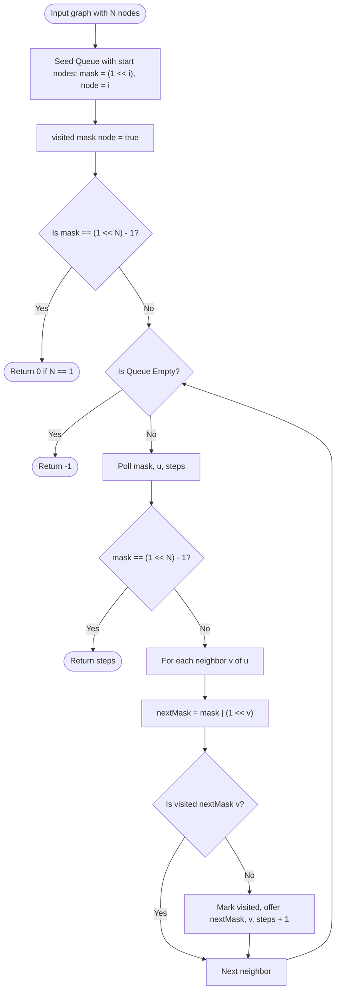

# 07. Bitmask Dynamic Programming & State Compression

[← Back to Tree DP](./06-tree-dp-and-subtree-rerooting.md) | [Track Hub](./README.md) | [Back to Java Track Home](../README.md)

---

## 🏛️ 1. Theoretical Foundations: Bitmask State Representation

When a problem requires tracking which subset of items from a universe of size $N$ has been selected, visited, or processed, representing the state as a `Set<Integer>` or boolean array causes unacceptable memory overhead and hash collision penalties.

If $N \le 20$, we can represent any arbitrary subset as a single primitive 32-bit integer **bitmask** ($0 \le mask < 2^N$).

```
Universe: { Node 0, Node 1, Node 2, Node 3 }
Subset:   { Node 0, Node 2 }

Binary:   0  1  0  1  (Bit 2 and Bit 0 are SET to 1)
Decimal:  2² + 2⁰ = 4 + 1 = 5
```

```
╭───────────────────────────────────────────────────────────────────────────────────────────╮
│                               BITWISE PRIMITIVE MANIPULATIONS                             │
├───────────────────────────────┬───────────────────────────────────────────────────────────┤
│ Operation                     │ Bitwise Java Expression                                   │
├───────────────────────────────┼───────────────────────────────────────────────────────────┤
│ Check if item i is in mask    │ ((mask >> i) & 1) == 1  OR  (mask & (1 << i)) != 0        │
│ Add item i to mask            │ mask | (1 << i)                                           │
│ Remove item i from mask       │ mask & ~(1 << i)                                          │
│ Toggle presence of item i     │ mask ^ (1 << i)                                           │
│ Count number of items in mask │ Integer.bitCount(mask)                                    │
│ Full universal set of N items │ (1 << N) - 1                                              │
╰───────────────────────────────┴───────────────────────────────────────────────────────────╯
```

---

## 2. Problem 1: Shortest Path Visiting All Nodes (TSP via State-Space BFS)

### 2.1 Problem Statement & Constraints

You have an undirected, connected graph of `n` nodes labeled from `0` to `n - 1`. You are given an array `graph` where `graph[i]` is a list of all the nodes connected with node `i` by an edge.

Return the **length of the shortest path** that visits every node. You may start and stop at any node, you may revisit nodes multiple times, and you may reuse edges.

```
Example 1:
Input: graph = [[1,2,3],[0],[0],[0]]
Output: 4
Explanation: One possible path is [1,0,2,0,3] (length 4).

Example 2:
Input: graph = [[1],[0,2,4],[1,3,4],[2],[1,2]]
Output: 4
Explanation: One possible path is [0,1,4,2,3] (length 4).
```

#### Constraints:
- $n == \text{graph.length}$.
- $1 \le n \le 12$.
- $0 \le \text{graph}[i]\text{.length} < n$.
- `graph[i]` does not contain `i`.

---

### 2.2 Thought Process & State-Space Expansion

```
  Constraint Signal: N <= 12!
  An exponential complexity in N is expected: 2¹² = 4096 states!
                         ↓
  Why Standard BFS Fails:
  In standard BFS, visited[u] prevents revisiting node u.
  Here, we ARE ALLOWED to revisit nodes and edges!
  Example: To reach node 2 from node 1 through star hub 0: 1 -> 0 -> 2.
                         ↓
  "Aha!" Insight: State-Space Graph BFS
  A state is NOT merely the current node u.
  A state is the PAIR: (mask, u)
  • mask: The set of nodes visited so far (integer from 0 to 2^N - 1).
  • u: The current node where the path ends.
                         ↓
  Total State Space: 2^N * N states!
  For N = 12: 4096 * 12 ≈ 49,152 states (extremely small!).
  Since all edge weights are 1, standard BFS across (mask, u) states guarantees
  finding the SHORTEST path to reach the target state (all bits set = (1 << N) - 1)!
```

---

### 2.3 Procedural Blueprint (How to Proceed)



---

### 2.4 Production Java 17/21 Implementation

```java
import java.util.ArrayDeque;
import java.util.Queue;

public final class ShortestPathAllNodes {

    private record State(int mask, int node, int dist) {}

    /**
     * Finds shortest path visiting all nodes using bitmask state-space BFS.
     *
     * Time Complexity:  O(2^N * N^2) — at most 2^N * N states, each scanning up to N edges.
     * Space Complexity: O(2^N * N) for the visited boolean table and BFS queue.
     */
    public int shortestPathLength(int[][] graph) {
        int n = graph.length;
        if (n <= 1) {
            return 0;
        }

        int targetMask = (1 << n) - 1;
        boolean[][] visited = new boolean[1 << n][n];
        Queue<State> queue = new ArrayDeque<>();

        // Multi-source BFS: We can begin the path at ANY node
        for (int i = 0; i < n; i++) {
            int mask = (1 << i);
            queue.offer(new State(mask, i, 0));
            visited[mask][i] = true;
        }

        while (!queue.isEmpty()) {
            State current = queue.poll();
            int mask = current.mask();
            int u = current.node();
            int dist = current.dist();

            if (mask == targetMask) {
                return dist;
            }

            for (int v : graph[u]) {
                int nextMask = mask | (1 << v);

                if (!visited[nextMask][v]) {
                    visited[nextMask][v] = true;
                    queue.offer(new State(nextMask, v, dist + 1));
                }
            }
        }

        return -1;
    }
}
```

---

## 3. Problem 2: Partition to K Equal Sum Subsets

### 3.1 Problem Statement & Constraints

Given an integer array `nums` and an integer `k`, return `true` if it is possible to divide this array into `k` non-empty subsets whose sums are all equal.

```
Example 1:
Input: nums = [4,3,2,3,5,2,1], k = 4
Output: true
Explanation: Possible partition into 4 subsets of sum 5: [5], [1, 4], [2, 3], [2, 3].

Example 2:
Input: nums = [1,2,3,4], k = 3
Output: false
```

#### Constraints:
- $1 \le k \le \text{nums.length} \le 16$.
- $1 \le \text{nums}[i] \le 10^4$.
- The frequency of each element is in the range $[1, 4]$.

---

### 3.2 Thought Process & Bitmask Memoization

```
  Total Sum Invariant:
  TotalSum = sum(nums).
  If TotalSum % k != 0: Return false immediately!
  TargetSum per bucket = TotalSum / k.
                         ↓
  Bitmask State Formulation:
  mask of length N: Bit i is 1 if nums[i] has already been placed into a bucket.
  
  State Definition:
  memo[mask] stores whether the remaining unpicked numbers (bits with 0)
  can be partitioned into valid subsets of TargetSum!
  
  Current Bucket Fill:
  Notice we DO NOT need to track which bucket we are filling!
  Current sum in active bucket is simply:
  currentBucketSum = (sum of all elements in mask) % TargetSum!
  
  Transitions:
  Try adding any unpicked element nums[i] ((mask >> i) & 1 == 0):
  If currentBucketSum + nums[i] <= TargetSum:
    Recurse with newMask = mask | (1 << i).
```

---

### 3.3 Production Java 17/21 Implementation

```java
import java.util.Arrays;

public final class PartitionKSubsets {

    /**
     * Verifies K-equal subset partitioning using Bitmask DP with memoization.
     *
     * Time Complexity:  O(2^N * N) where N = nums.length <= 16.
     * Space Complexity: O(2^N) for the memoization array.
     */
    public boolean canPartitionKSubsets(int[] nums, int k) {
        int totalSum = 0;
        for (int num : nums) {
            totalSum += num;
        }

        if (totalSum % k != 0) {
            return false;
        }

        int target = totalSum / k;
        Arrays.sort(nums); // Sort ascending so largest elements are at the end
        int n = nums.length;

        if (nums[n - 1] > target) {
            return false;
        }

        // memo[mask]: null = uncomputed, true = valid partition, false = invalid
        Boolean[] memo = new Boolean[1 << n];
        return canPartition(nums, target, (1 << n) - 1, 0, memo);
    }

    private boolean canPartition(int[] nums, int target, int mask, int currentSum, Boolean[] memo) {
        if (mask == 0) {
            return true; // All elements successfully placed
        }

        if (memo[mask] != null) {
            return memo[mask];
        }

        boolean possible = false;
        for (int i = 0; i < nums.length; i++) {
            // If element i is available in mask
            if ((mask & (1 << i)) != 0) {
                if (currentSum + nums[i] <= target) {
                    int nextSum = (currentSum + nums[i]) % target;
                    if (canPartition(nums, target, mask ^ (1 << i), nextSum, memo)) {
                        possible = true;
                        break;
                    }
                } else {
                    // Because nums is sorted, subsequent elements will also exceed target
                    break;
                }
            }
        }

        return memo[mask] = possible;
    }
}
```

---

<div align="center">

| [← Back to Tree DP](./06-tree-dp-and-subtree-rerooting.md) | [Track Hub: Dynamic Programming](./README.md) | [Back to Java Track Home](../README.md) |
| :--- | :---: | ---: |

</div>
