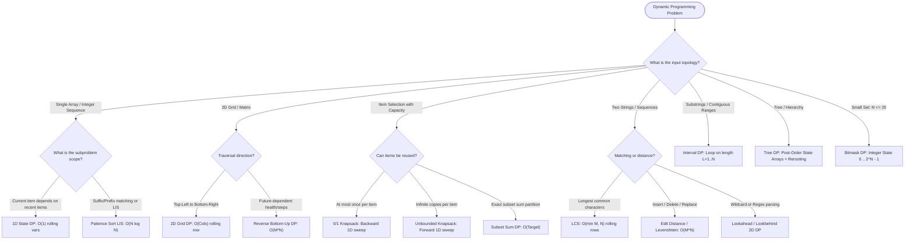

# 💎 The Dynamic Programming (DP) Universe

[Java Track Home](../README.md) | [Strategies Hub](../../dsa-strategies/README.md) | [Next: 1D Formulations & Fundamentals →](./01-dp-fundamentals-and-1d-state-formulations.md)

---

## 🧭 Executive Overview: The Science of Stored Optimal Choices

**Dynamic Programming (DP)** is not merely an algorithmic technique; it is a mathematical framework for solving complex optimization and counting problems by decomposing them into simpler subproblems, solving each subproblem exactly once, and storing their solutions.

Formulated by Richard Bellman in the 1950s, Dynamic Programming applies whenever a problem exhibits two indispensable mathematical invariants:

```
╭───────────────────────────────────────────────────────────────────────────────────────────╮
│                              THE TWO ESSENTIAL DP INVARIANTS                              │
├──────────────────────────┬────────────────────────────────────────────────────────────────┤
│ 1. Optimal Substructure  │ An optimal solution to the overall problem can be constructed  │
│                          │ directly from optimal solutions to its constituent subproblems.│
├──────────────────────────┼────────────────────────────────────────────────────────────────┤
│ 2. Overlapping           │ A naive recursive breakdown re-evaluates the EXACT same        │
│    Subproblems           │ subproblem instances exponentially many times (2^N).           │
╰──────────────────────────┴────────────────────────────────────────────────────────────────╯
```

```
                          ╭────────────────────────╮
                          │       Fibonacci(5)     │
                          ╰───────────┬────────────╯
                                      │
                         ┌────────────┴────────────┐
                         ▼                         ▼
                   Fibonacci(4)               Fibonacci(3)  <-- OVERLAP!
                         │                         │
                   ┌─────┴─────┐             ┌─────┴─────┐
                   ▼           ▼             ▼           ▼
             Fibonacci(3) Fibonacci(2) Fibonacci(2) Fibonacci(1)
                  ▲            ▲            ▲
                  │            │            │
                  └────────────┴────────────┴── Recomputed repeatedly in O(2^N)!
                                                DP memoizes in O(N)!
```

---

## 🪜 1. The 5-Step Systematic DP Framework

To solve any Dynamic Programming problem from scratch under interview pressure without guessing or memorizing, apply this rigorous 5-step engineering framework:

```
╭───────────────────────────────────────────────────────────────────────────────────────────╮
│                              THE 5-STEP DP FORMULATION ENGINE                             │
├─────────────────────────┬─────────────────────────────────────────────────────────────────┤
│ Step 1: State Meaning   │ Define dp[i] or dp[i][j] in precise English words.              │
│                         │ (e.g., "dp[i] is the maximum profit robbing houses up to i").   │
├─────────────────────────┼─────────────────────────────────────────────────────────────────┤
│ Step 2: Base Cases      │ Identify trivial, non-decomposable boundary conditions.         │
│                         │ (e.g., dp[0] = 0, dp[1] = nums[0], dp[empty] = 1).              │
├─────────────────────────┼─────────────────────────────────────────────────────────────────┤
│ Step 3: Bellman Equation│ Derive the state transition recurrence based on choices.        │
│                         │ dp[i] = max(dp[i - 1], dp[i - 2] + nums[i])                     │
├─────────────────────────┼─────────────────────────────────────────────────────────────────┤
│ Step 4: Evaluation Order│ Establish the topological dependency direction of subproblems.  │
│                         │ (Left-to-right, bottom-to-top, increasing interval lengths).    │
├─────────────────────────┼─────────────────────────────────────────────────────────────────┤
│ Step 5: Space Reduction │ Analyze the recurrence reach: If dp[i] only depends on i-1 and  │
│                         │ i-2, compress O(N) array into 2 rolling primitive variables!   │
╰─────────────────────────┴─────────────────────────────────────────────────────────────────╯
```

---

## 💾 2. Top-Down (Memoization) vs. Bottom-Up (Tabulation)

```
╭───────────────────────────────────────────────────────────────────────────────────────────╮
│                                MEMOIZATION VS. TABULATION                                 │
├─────────────────────┬─────────────────────────────────┬───────────────────────────────────┤
│ Feature             │ Top-Down (Memoization)          │ Bottom-Up (Tabulation)            │
├─────────────────────┼─────────────────────────────────┼───────────────────────────────────┤
│ Control Flow        │ Recursive with memo cache       │ Iterative loops filling array     │
│ Evaluation Strategy │ On-Demand (solves only needed)  │ Exhaustive (solves all states)    │
│ Subproblem Order    │ Natural DFS call-tree traversal │ Strict topological sorting        │
│ Call-Stack Overhead │ O(N) JVM call frames (Risk of   │ Zero stack overhead; 100% heap/   │
│                     │ StackOverflowError for N > 10⁴) │ stack-safe iteration              │
│ CPU Cache Locality  │ Poor (random pointer hops)      │ Optimal (sequential 64B prefetch) │
│ Space Optimization  │ Hard (cannot discard states)    │ Easy (roll rows/vars in O(1))     │
╰─────────────────────┴─────────────────────────────────┴───────────────────────────────────╯
```

---

## ⚡ 3. The Global DP Decision Engine



---

## 🗺️ 4. Master Curriculum Roadmap

| Module | Core Paradigm | Mathematical Transitions | Canonical Problems |
| :--- | :--- | :--- | :--- |
| **[01. 1D State Formulations](./01-dp-fundamentals-and-1d-state-formulations.md)** | Linear Recurrences & Patience Sort | $dp[i] = f(dp[i-1], dp[i-2])$, Patience sorting binary search | House Robber, Coin Change, LIS ($\mathcal{O}(N \log N)$) |
| **[02. Grid & Multi-Dimensional DP](./02-grid-and-multi-dimensional-dp.md)** | Coordinate Plane Optimizations | Directional state invariants, Reverse Bottom-Up requirements | Unique Paths, Min Path Sum, Dungeon Game |
| **[03. The Knapsack Family](./03-the-knapsack-family-and-subset-sums.md)** | Capacity Constraints & Subset Math | Backward vs Forward 1D capacity loops, algebraic transforms | Partition Equal Subset, Target Sum, Coin Change II |
| **[04. Strings & Sequences](./04-strings-sequences-and-edit-distance.md)** | 2D Prefix Matrix Matching | Diagonal transitions, Levenshtein distance, regex `*` branches | LCS, Edit Distance, Regular Expression Matching |
| **[05. Interval DP & Game Theory](./05-interval-dp-and-game-theory.md)** | Sub-range Contraction | Length-based iteration $L=1..N$, Inverted Last-Balloon Choice | Burst Balloons, Predict the Winner |
| **[06. Tree DP & Subtree Rerooting](./06-tree-dp-and-subtree-rerooting.md)** | Hierarchical State Machines | Post-order 2-state vectors, $O(N)$ two-pass rerooting | House Robber III, Binary Tree Max Path Sum |
| **[07. Bitmask DP & State Compression](./07-bitmask-dp-and-state-compression.md)** | Exponential Subsets ($N \le 20$) | Integer bitmask operations, Hamiltonian walks, TSP | Shortest Path Visiting All Nodes, Partition K Subsets |

---

<div align="center">

| [← Back to Java Track Home](../README.md) | [Track Hub: Dynamic Programming](./README.md) | [Next: 1D Formulations & Fundamentals →](./01-dp-fundamentals-and-1d-state-formulations.md) |
| :--- | :---: | ---: |

</div>
