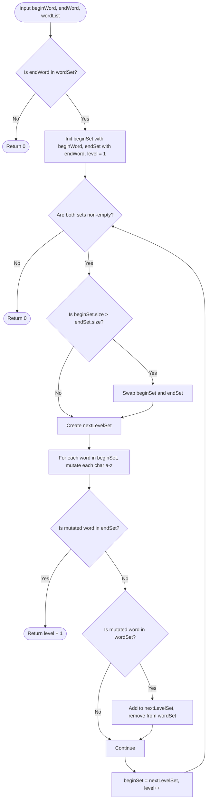

# 01. Graph Representations & Traversal Foundations

[← Back to Graphs Hub](./README.md) | [Track Hub](./README.md) | [Next: Topological Sorting & DAGs →](./02-topological-sorting-and-dag-architectures.md)

---

## 🏛️ 1. Architecture & Memory Layouts: Modern Java Implementations

High-performance graph traversal requires minimizing heap allocations and pointer chasing. Below are production implementations for both standard dynamic adjacency lists and cache-friendly Compressed Sparse Row (CSR) representations.

### 1.1 Compressed Sparse Row (CSR) Graph in Java
```java
public final class CsrGraph {
    private final int[] rowPtr; // Size: V + 1
    private final int[] colIdx; // Size: E (contiguous neighbor array)

    public CsrGraph(int vertices, int[][] edges, boolean directed) {
        int[] degree = new int[vertices];
        for (int[] edge : edges) {
            degree[edge[0]]++;
            if (!directed) degree[edge[1]]++;
        }

        this.rowPtr = new int[vertices + 1];
        for (int i = 0; i < vertices; i++) {
            rowPtr[i + 1] = rowPtr[i] + degree[i];
        }

        this.colIdx = new int[rowPtr[vertices]];
        int[] cur = rowPtr.clone();

        for (int[] edge : edges) {
            int u = edge[0], v = edge[1];
            colIdx[cur[u]++] = v;
            if (!directed) {
                colIdx[cur[v]++] = u;
            }
        }
    }

    public int getNeighborCount(int u) {
        return rowPtr[u + 1] - rowPtr[u];
    }

    public int getNeighbor(int u, int index) {
        return colIdx[rowPtr[u] + index];
    }
}
```

---

## 🧭 2. Traversal Invariants: BFS vs. DFS

```
╭───────────────────────────────────────────────────────────────────────────────────────────╮
│                               BFS VS. DFS FUNDAMENTAL INVARIANTS                          │
├─────────────────────┬─────────────────────────────────┬───────────────────────────────────┤
│ Property            │ Breadth-First Search (BFS)      │ Depth-First Search (DFS)          │
├─────────────────────┼─────────────────────────────────┼───────────────────────────────────┤
│ Auxiliary Structure │ FIFO Queue (ArrayDeque)         │ LIFO Call Stack or Explicit Stack │
│ Exploration Pattern │ Radial / Level-by-level         │ Deep branch plunge until dead end │
│ Path Guarantee      │ Shortest path (unweighted edge) │ Arbitrary path (not shortest)     │
│ Peak Memory Usage   │ O(Width) = O(V) maximum queue   │ O(Height) = O(V) max recursion    │
│ Cycle Detection     │ Visited boolean array / Set     │ 3-Color State (White, Gray, Black)│
╰─────────────────────┴─────────────────────────────────┴───────────────────────────────────╯
```

### 3-Color Cycle Detection Invariant in DFS:
```
State 0 (WHITE): Node unvisited.
State 1 (GRAY):  Node currently in active recursion call stack (being explored).
State 2 (BLACK): Node and all its descendants completely explored and verified safe.

Invariant: If during DFS exploration from node u, an edge points to a node in GRAY (1),
           a DIRECTED CYCLE is mathematically proven to exist!
```

---

## 3. Problem 1: Word Ladder (Shortest Transformation Sequence)

### 3.1 Problem Statement & Constraints

A transformation sequence from word `beginWord` to word `endWord` using a dictionary `wordList` is a sequence of words `beginWord -> s1 -> s2 -> ... -> sk` such that:
- Every adjacent pair of words differs by exactly one letter.
- Every `si` for $1 \le i \le k$ is in `wordList`. (Note that `beginWord` does not need to be in `wordList`).
- $sk == endWord$.

Given two words, `beginWord` and `endWord`, and a dictionary `wordList`, return the number of words in the shortest transformation sequence from `beginWord` to `endWord`, or `0` if no such sequence exists.

```
Example 1:
Input: beginWord = "hit", endWord = "cog", wordList = ["hot","dot","dog","lot","log","cog"]
Output: 5
Explanation: Shortest sequence: "hit" -> "hot" -> "dot" -> "dog" -> "cog" (5 words).

Example 2:
Input: beginWord = "hit", endWord = "cog", wordList = ["hot","dot","dog","lot","log"]
Output: 0
Explanation: The endWord "cog" is not in wordList, so no valid transformation.
```

#### Constraints:
- $1 \le \text{beginWord.length} \le 10$.
- $\text{endWord.length} == \text{beginWord.length}$.
- $1 \le \text{wordList.length} \le 5000$.
- All words consist of lowercase English letters with no duplicates.

---

### 3.2 Thought Process & Intuition

```
  Approach 1: Full Pairwise Graph Construction + BFS
  Build adjacency list by comparing every pair of words in wordList:
  Two words have an edge if they differ by 1 char.
  Time to build graph: O(N² * L) where N = wordList.size(), L = word.length.
  For N = 5000, N² = 2.5 * 10⁷ operations! Extremely slow.
                         ↓
  Approach 2: Standard Single-Direction BFS with Wildcard Transitions
  Instead of comparing pairs, for current word of length L, try mutating all L positions
  with all 26 lowercase English letters: 26 * L variations!
  Check if mutated word exists in HashSet in O(1).
  Time per word: O(26 * L²). For 5000 words: 5000 * 26 * 10² = 1.3 * 10⁷ ops (feasible).
                         ↓
  Approach 3: Bidirectional BFS (Optimal)
  "Aha!" Insight:
  Standard BFS search space grows exponentially: O(B^d) where B = branching factor, d = depth.
  If we simultaneously search forward from `beginWord` AND backward from `endWord`,
  the frontiers meet in the middle at depth d/2!
  Search Space: O(B^(d/2) + B^(d/2)) = 2 * B^(d/2) << B^d!
  Huge practical reduction: For B = 10, d = 6, 10⁶ drops to 2 * 10³ = 2,000 steps!
```

---

### 3.3 Mathematical Invariant & Proof of Bidirectional BFS

Let the search graph have uniform branching factor $b$ and shortest path distance $d$.
- Standard unidirectional BFS expands:
  $$N_{\text{uni}} = \sum_{i=0}^d b^i \approx \frac{b^{d+1} - 1}{b - 1} = \mathcal{O}(b^d)$$
- Bidirectional BFS searches forward and backward until frontiers intersect at depth $\lfloor d/2 \rfloor$:
  $$N_{\text{bi}} = 2 \sum_{i=0}^{d/2} b^i \approx 2 \cdot \frac{b^{d/2+1} - 1}{b - 1} = \mathcal{O}(b^{d/2})$$
- By always expanding the **smaller of the two frontiers**, we minimize $b^{d/2}$ dynamically at every step.

---

### 3.4 Procedural Blueprint (How to Proceed)



---

### 3.5 Visual State Transition: Bidirectional Frontier Collision

```
beginWord: "hit"                      endWord: "cog"
wordList: ["hot", "dot", "dog", "lot", "log", "cog"]

Step 1:
Forward Frontier:   { "hit" } (size 1)
Backward Frontier:  { "cog" } (size 1)

Step 2: Expand Forward {"hit"} -> Mutate to "hot"
Forward Frontier:   { "hot" }
Backward Frontier:  { "cog" }

Step 3: Expand Backward {"cog"} -> Mutates to {"dog", "log"}
Forward Frontier:   { "hot" } (size 1 - smaller! Expand this next)
Backward Frontier:  { "dog", "log" } (size 2)

Step 4: Expand Forward {"hot"} -> Mutates to {"dot", "lot"}
╭───────────────────────────────────┬───────────────────────────────────╮
│ Forward Frontier:                 │ Backward Frontier:                │
│ { "dot", "lot" }                  │ { "dog", "log" }                  │
╰───────────────────────────────────┴───────────────────────────────────╯

Step 5: Mutating "dot" produces "dog" -> DIRECT INTERSECTION with Backward Frontier!
Collision detected! Total path length = 5 ("hit" -> "hot" -> "dot" -> "dog" -> "cog").
```

---

### 3.6 Production Java 17/21 Implementation

```java
import java.util.*;

public final class WordLadder {

    /**
     * Finds the length of shortest transformation sequence using Bidirectional BFS.
     *
     * Time Complexity:  O(N * L^2) where N is number of words, L is word length.
     * Space Complexity: O(N * L) for the dictionary HashSet and frontier sets.
     */
    public int ladderLength(String beginWord, String endWord, List<String> wordList) {
        Set<String> wordSet = new HashSet<>(wordList);
        if (!wordSet.contains(endWord)) {
            return 0;
        }

        Set<String> beginSet = new HashSet<>();
        Set<String> endSet = new HashSet<>();

        beginSet.add(beginWord);
        endSet.add(endWord);

        int level = 1;

        while (!beginSet.isEmpty() && !endSet.isEmpty()) {
            // Always expand the smaller frontier to minimize branching factor
            if (beginSet.size() > endSet.size()) {
                Set<String> temp = beginSet;
                beginSet = endSet;
                endSet = temp;
            }

            Set<String> nextLevel = new HashSet<>();

            for (String word : beginSet) {
                char[] chars = word.toCharArray();

                for (int i = 0; i < chars.length; i++) {
                    char originalChar = chars[i];

                    for (char c = 'a'; c <= 'z'; c++) {
                        if (c == originalChar) continue;

                        chars[i] = c;
                        String nextWord = String.valueOf(chars);

                        // Direct collision with opposite search frontier
                        if (endSet.contains(nextWord)) {
                            return level + 1;
                        }

                        if (wordSet.contains(nextWord)) {
                            nextLevel.add(nextWord);
                            wordSet.remove(nextWord); // Prevent re-visitation
                        }
                    }
                    chars[i] = originalChar; // Backtrack character
                }
            }

            beginSet = nextLevel;
            level++;
        }

        return 0;
    }
}
```

---

### 3.7 Dry-Run Table & Interviewer Stress Defenses

```
Input: beginWord = "hit", endWord = "cog"
Dict: ["hot","dot","dog","lot","log","cog"]
```

| Iteration | Active Frontier (`beginSet`) | Passive Frontier (`endSet`) | Mutated Words Checked | Next Level Added | Collision? |
| :---: | :--- | :--- | :--- | :--- | :---: |
| **0** | `{"hit"}` (size 1) | `{"cog"}` (size 1) | `"hot"` | `{"hot"}` | No |
| **1** | `{"hot"}` (size 1) | `{"cog"}` (size 1) | `"dot"`, `"lot"` | `{"dot", "lot"}` | No |
| **2** | `{"cog"}` (size 1) | `{"dot", "lot"}` (size 2) | `"dog"`, `"log"` | `{"dog", "log"}` | No |
| **3** | `{"dog", "log"}` (size 2) | `{"dot", "lot"}` (size 2) | `"dot"` (from `"dog"`) | — | **YES! Collision with "dot"** |

- **Interviewer Defense — Why remove from `wordSet` upon queuing?**
  Removing a word immediately upon adding it to `nextLevel` guarantees that no other path will re-explore this word at the same or deeper level, preventing infinite loops and maintaining strictly linear vertex exploration.

---

## 4. Problem 2: Number of Islands (Grid-as-Graph Modeling)

### 4.1 Problem Statement & Constraints

Given an $m \times n$ 2D binary grid `grid` which represents a map of `'1'`s (land) and `'0'`s (water), return the number of islands.

An **island** is surrounded by water and is formed by connecting adjacent lands horizontally or vertically. You may assume all four edges of the grid are all surrounded by water.

```
Example 1:
Input: grid = [
  ["1","1","1","1","0"],
  ["1","1","0","1","0"],
  ["1","1","0","0","0"],
  ["0","0","0","0","0"]
]
Output: 1

Example 2:
Input: grid = [
  ["1","1","0","0","0"],
  ["1","1","0","0","0"],
  ["0","0","1","0","0"],
  ["0","0","0","1","1"]
]
Output: 3
```

#### Constraints:
- $m == \text{grid.length}, n == \text{grid}[i]\text{.length}$.
- $1 \le m, n \le 300$.
- `grid[i][j]` is `'0'` or `'1'`.

---

### 4.2 Thought Process & Intuition

```
  Graph Reduction:
  Every cell (r, c) with value '1' is a vertex.
  An undirected edge exists between (r, c) and its 4 orthogonal neighbors if both are '1'.
  An "island" is precisely a Connected Component in this graph!
                         ↓
  Approach: Component Counting via Sink DFS
  Iterate through every cell (r, c).
  When a '1' is encountered:
  1. Increment islandCount by 1.
  2. Launch a DFS (or BFS) from (r, c) to visit and "sink" the entire island (set '1' -> '0').
  3. Sinking the island in-place eliminates the need for an O(M * N) boolean visited array!
```

---

### 4.3 Production Java 17/21 Implementation

```java
public final class NumberOfIslands {

    private static final int[][] DIRS = {{-1, 0}, {1, 0}, {0, -1}, {0, 1}};

    /**
     * Counts connected land components using in-place sink DFS.
     *
     * Time Complexity:  O(M * N) — each cell is visited at most a constant number of times.
     * Space Complexity: O(M * N) worst-case call stack (e.g., snake-shaped island).
     */
    public int numIslands(char[][] grid) {
        if (grid == null || grid.length == 0 || grid[0].length == 0) {
            return 0;
        }

        int rows = grid.length;
        int cols = grid[0].length;
        int islandCount = 0;

        for (int r = 0; r < rows; r++) {
            for (int c = 0; c < cols; c++) {
                if (grid[r][c] == '1') {
                    islandCount++;
                    sinkDfs(grid, r, c, rows, cols);
                }
            }
        }

        return islandCount;
    }

    private void sinkDfs(char[][] grid, int r, int c, int rows, int cols) {
        if (r < 0 || r >= rows || c < 0 || c >= cols || grid[r][c] != '1') {
            return;
        }

        // Sink the land to water to mark as visited
        grid[r][c] = '0';

        for (int[] dir : DIRS) {
            sinkDfs(grid, r + dir[0], c + dir[1], rows, cols);
        }
    }
}
```

---

## 5. Problem 3: Clone Graph (Deep Copy of Cyclic Graphs)

### 5.1 Problem Statement & Constraints

Given a reference of a node in a connected undirected graph. Return a **deep copy** (clone) of the graph.

Each node in the graph contains a value (`int`) and a list (`List<Node>`) of its neighbors.

```java
class Node {
    public int val;
    public List<Node> neighbors;
}
```

#### Constraints:
- The number of nodes in the graph is in the range $[0, 100]$.
- $1 \le \text{Node.val} \le 100$.
- `Node.val` is unique for each node.
- The given node will always be the first node with `val = 1`.

---

### 5.2 Thought Process & Intuition

```
  Bottleneck: Cycles and Self-Loops
  In a cyclic graph (e.g., 1 <-> 2), a naive recursive clone will recurse infinitely:
  Clone 1 -> Clone 2 -> Clone 1 -> Clone 2 -> ... (StackOverflowError).
                         ↓
  "Aha!" Insight: Memoization Map (Original -> Clone)
  Maintain a Map<Node, Node> visited.
  Before cloning a neighbor:
  • If neighbor is already in visited map: return visited.get(neighbor) immediately!
  • If neighbor is NOT in map: instantiate Clone, record in map FIRST, then recurse neighbors!
```

---

### 5.3 Production Java 17/21 Implementation

```java
import java.util.*;

public final class CloneGraphSolution {

    public static class Node {
        public int val;
        public List<Node> neighbors;

        public Node() {
            this.val = 0;
            this.neighbors = new ArrayList<>();
        }

        public Node(int val) {
            this.val = val;
            this.neighbors = new ArrayList<>();
        }

        public Node(int val, ArrayList<Node> neighbors) {
            this.val = val;
            this.neighbors = neighbors;
        }
    }

    private final Map<Node, Node> visited = new HashMap<>();

    /**
     * Recursively deep-copies a graph with cycle protection.
     *
     * Time Complexity:  O(V + E) — visits every vertex and edge exactly once.
     * Space Complexity: O(V) for visited map and recursion stack.
     */
    public Node cloneGraph(Node node) {
        if (node == null) {
            return null;
        }

        if (visited.containsKey(node)) {
            return visited.get(node);
        }

        Node clone = new Node(node.val);
        visited.put(node, clone);

        for (Node neighbor : node.neighbors) {
            clone.neighbors.add(cloneGraph(neighbor));
        }

        return clone;
    }
}
```

---

<div align="center">

| [← Back to Graphs Hub](./README.md) | [Track Hub: Graphs](./README.md) | [Next: Topological Sorting & DAGs →](./02-topological-sorting-and-dag-architectures.md) |
| :--- | :---: | ---: |

</div>
