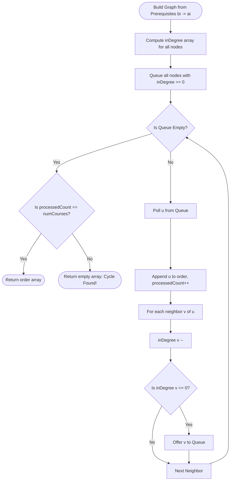
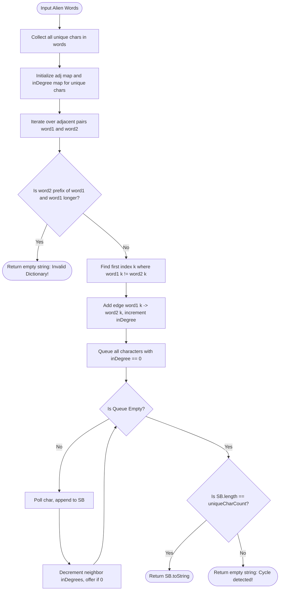

# 02. Topological Sorting & DAG Architectures

[← Back to Traversals](./01-graph-representations-and-traversal-foundations.md) | [Track Hub](./README.md) | [Next: Shortest Path Algorithms →](./03-shortest-paths-dijkstra-bellman-ford-and-floyd-warshall.md)

---

## 🏛️ 1. Theoretical Foundations: Directed Acyclic Graphs (DAGs)

A **Directed Acyclic Graph (DAG)** is a directed graph containing no directed cycles. DAGs represent non-negotiable dependency chains, build systems (Maven/Gradle task graphs), compilation schedules, and database transaction pipelines.

### The Topological Ordering Invariant
A **Topological Sort** of a directed graph $G = (V, E)$ is a linear ordering of all its vertices such that for every directed edge $u \to v$, vertex $u$ appears strictly before $v$ in the ordering:

$$\forall (u, v) \in E \implies \text{Index}(u) < \text{Index}(v)$$

```
Directed Edges: 5 -> 2, 5 -> 0, 4 -> 0, 4 -> 1, 2 -> 3, 3 -> 1

Valid Topological Sort: [ 5, 4, 2, 3, 1, 0 ]
All arrows point strictly from LEFT to RIGHT! Zero backward edges!
```

---

## 🧮 2. Mathematical Proofs of DAG Properties

### 2.1 Theorem: Source & Sink Existence in Finite DAGs
**Theorem**: Every non-empty, finite directed acyclic graph contains at least one **source** (vertex with in-degree $0$) and at least one **sink** (vertex with out-degree $0$).

**Proof by Contradiction**:
1. Suppose a finite DAG with $V$ vertices contains **no source**.
2. This implies every vertex $v \in V$ has in-degree $\deg^-(v) \ge 1$.
3. Pick an arbitrary vertex $v_1$. Because $\deg^-(v_1) \ge 1$, there exists an incoming edge from some vertex $v_2 \to v_1$.
4. Similarly, there exists $v_3 \to v_2$, $v_4 \to v_3$, creating a backward path $\dots \to v_k \to \dots \to v_2 \to v_1$.
5. Because the graph has a finite number of vertices $|V|$, by the **Pigeonhole Principle**, after traversing at most $|V| + 1$ steps backward, we must revisit a previously seen vertex $v_i$.
6. Revisiting $v_i$ establishes a directed cycle: $v_i \to \dots \to v_j \to \dots \to v_i$.
7. This contradicts the fundamental assumption that $G$ is acyclic.
8. Therefore, $G$ must contain at least one vertex with in-degree $0$ (a source). By identical logic following outgoing edges forward, $G$ must contain at least one sink $\blacksquare$.

### 2.2 Theorem: Topological Sort Existence $\iff$ Acyclic
A directed graph possesses a valid topological ordering if and only if it is a DAG. If a cycle exists, say $A \to B \to C \to A$, any linear ordering requires $\text{Index}(A) < \text{Index}(B) < \text{Index}(C) < \text{Index}(A)$, which implies $\text{Index}(A) < \text{Index}(A)$—a logical impossibility!

---

## ⚡ 3. The Two Classical Algorithms

```
╭───────────────────────────────────────────────────────────────────────────────────────────╮
│                                  KAHN'S BFS VS. DFS POST-ORDER                            │
├─────────────────────┬─────────────────────────────────┬───────────────────────────────────┤
│ Feature             │ Kahn's Algorithm (In-Degree)    │ DFS Post-Order Traversal          │
├─────────────────────┼─────────────────────────────────┼───────────────────────────────────┤
│ Core Mechanism      │ In-Degree array + Queue         │ Recursive call stack + 3 colors   │
│ Processing Direction│ Forward from Sources (in-deg 0) │ Backward from Sinks (out-deg 0)   │
│ Result Construction │ Append directly to output list  │ Reverse post-order stack/list     │
│ Cycle Detection     │ output.size() < V               │ Back-edge detected (GRAY node)    │
│ Space Overhead      │ inDegree[V] + Queue             │ visited[V] (3 states) + CallStack │
╰─────────────────────┴─────────────────────────────────┴───────────────────────────────────╯
```

---

## 4. Problem 1: Course Schedule I & II (Topological Order & Cycle Extraction)

### 4.1 Problem Statement & Constraints

There are a total of `numCourses` courses you have to take, labeled from `0` to `numCourses - 1`. You are given an array `prerequisites` where `prerequisites[i] = [ai, bi]` indicates that you must take course `bi` first if you want to take course `ai`.

- **Part I**: Return `true` if you can finish all courses, or `false` if there is a cycle.
- **Part II**: Return the ordering of courses you should take to finish all courses. If there are many valid answers, return any of them. If it is impossible, return an empty array `[]`.

```
Example 1:
Input: numCourses = 2, prerequisites = [[1,0]]
Output: [0,1]
Explanation: Take course 0 first, then course 1.

Example 2:
Input: numCourses = 4, prerequisites = [[1,0],[2,0],[3,1],[3,2]]
Output: [0,2,1,3] (or [0,1,2,3])

Example 3:
Input: numCourses = 2, prerequisites = [[1,0],[0,1]]
Output: []
Explanation: Mutual cycle detected! Cannot finish all courses.
```

#### Constraints:
- $1 \le \text{numCourses} \le 2000$.
- $0 \le \text{prerequisites.length} \le 5000$.
- $\text{prerequisites}[i]\text{.length} == 2$.
- All pairs $[a_i, b_i]$ are distinct.

---

### 4.2 Thought Process & Intuition

```
  Graph Modeling:
  prerequisites[i] = [ai, bi] means bi -> ai (bi must be taken before ai).
  Vertices = {0, 1, ..., numCourses - 1}.
  Edges = bi -> ai for each pair.
                         ↓
  Approach: Kahn's Algorithm (In-Degree BFS)
  1. Compute inDegree[u] for all courses.
  2. Enqueue all courses with inDegree[u] == 0 (courses with zero prerequisites).
  3. While queue is not empty:
     a. Dequeue course u, append to order list.
     b. For each dependent course v (where u -> v):
        - Decrement inDegree[v] by 1.
        - If inDegree[v] reaches 0, enqueue v!
  4. Invariant: If order.size() == numCourses, valid schedule found!
     If order.size() < numCourses, the remaining nodes form a directed cycle!
```

---

### 4.3 Procedural Blueprint (How to Proceed)



---

### 4.4 Visual State Transition: Kahn's In-Degree Reduction

```
numCourses = 4, prerequisites = [[1,0], [2,0], [3,1], [3,2]]
Graph: 0 -> 1, 0 -> 2, 1 -> 3, 2 -> 3

Initial inDegrees:
╭───────┬───────┬───────┬───────╮
│ Node  │   0   │   1   │   2   │   3   │
├───────┼───────┼───────┼───────┼───────┤
│ InDeg │   0   │   1   │   1   │   2   │
╰───────┴───────┴───────┴───────┴───────╯
Queue: [ 0 ] (only Node 0 has in-degree 0)
Order: []

Step 1: Poll 0. Order: [ 0 ]
Decrement neighbors 1 and 2:
inDegree[1]: 1 -> 0 (Enqueue 1)
inDegree[2]: 1 -> 0 (Enqueue 2)
Queue: [ 1, 2 ]

Step 2: Poll 1. Order: [ 0, 1 ]
Decrement neighbor 3: inDegree[3]: 2 -> 1
Queue: [ 2 ]

Step 3: Poll 2. Order: [ 0, 1, 2 ]
Decrement neighbor 3: inDegree[3]: 1 -> 0 (Enqueue 3!)
Queue: [ 3 ]

Step 4: Poll 3. Order: [ 0, 1, 2, 3 ]
Queue: []
Processed 4/4 courses -> Valid Topological Schedule!
```

---

### 4.5 Production Java 17/21 Implementation

```java
import java.util.*;

public final class CourseSchedule {

    /**
     * Resolves course prerequisites using Kahn's In-Degree BFS.
     *
     * Time Complexity:  O(V + E) where V = numCourses, E = prerequisites.length.
     * Space Complexity: O(V + E) for adjacency list and in-degree array.
     */
    public int[] findOrder(int numCourses, int[][] prerequisites) {
        List<List<Integer>> adj = new ArrayList<>(numCourses);
        for (int i = 0; i < numCourses; i++) {
            adj.add(new ArrayList<>());
        }

        int[] inDegree = new int[numCourses];
        for (int[] pre : prerequisites) {
            int course = pre[0];
            int prerequisite = pre[1];
            adj.get(prerequisite).add(course);
            inDegree[course]++;
        }

        Queue<Integer> queue = new ArrayDeque<>();
        for (int i = 0; i < numCourses; i++) {
            if (inDegree[i] == 0) {
                queue.offer(i);
            }
        }

        int[] order = new int[numCourses];
        int index = 0;

        while (!queue.isEmpty()) {
            int cur = queue.poll();
            order[index++] = cur;

            for (int neighbor : adj.get(cur)) {
                inDegree[neighbor]--;
                if (inDegree[neighbor] == 0) {
                    queue.offer(neighbor);
                }
            }
        }

        // If cycle exists, index will be strictly less than numCourses
        return (index == numCourses) ? order : new int[0];
    }
}
```

---

### 4.6 Dry-Run Table & Interviewer Stress Defenses

- **Interviewer Defense — Why use Kahn's instead of DFS?**
  Kahn's algorithm detects cycles naturally via counting (`index < numCourses`), avoiding call-stack depth limits (preventing `StackOverflowError` on deep line graphs with $V = 10^5$).
- **Interviewer Defense — How to extract the actual cycle path if one exists?**
  Any vertices remaining with `inDegree[u] > 0` are part of or reachable from cycles. To extract the exact cycle, pick any node with `inDegree > 0`, traverse backwards along incoming edges until a node is repeated.

---

## 5. Problem 2: Alien Dictionary (Hard)

### 5.1 Problem Statement & Constraints

There is a new alien language that uses the English alphabet. However, the order of the letters is unknown to you.

You are given a list of strings `words` from the alien language's dictionary, where the strings are claimed to be **sorted lexicographically** by the rules of this new language.

Return a string of the unique letters in the new alien language sorted in **lexicographically increasing order** by the new language's rules. If there is no solution, return `""`. If there are multiple solutions, return any of them.

```
Example 1:
Input: words = ["wrt","wrf","er","ett","rftt"]
Output: "wertf"

Example 2:
Input: words = ["z","x"]
Output: "zx"

Example 3:
Input: words = ["z","x","z"]
Output: ""
Explanation: 'z' -> 'x' and 'x' -> 'z' forms a cycle. Invalid!

Example 4 (Critical Prefix Edge Case):
Input: words = ["abc", "ab"]
Output: ""
Explanation: "abc" appears before "ab", which is illegal in lexicographical order!
```

#### Constraints:
- $1 \le \text{words.length} \le 100$.
- $1 \le \text{words}[i]\text{.length} \le 100$.
- `words[i]` consists of only lowercase English letters.

---

### 5.2 Thought Process & Intuition

```
  Step 1: Graph Representation
  Vertices = All unique characters appearing in any word.
  Directed Edge u -> v means character u MUST precede character v.
                         ↓
  Step 2: Edge Extraction via Pairwise Adjacent Words
  Compare adjacent words word1 and word2:
  Find the first index k where word1[k] != word2[k]:
  • Add directed edge: word1[k] -> word2[k]!
  • CRITICAL EDGE CASE: If word2 is a prefix of word1, but word1 is LONGER
    (e.g., word1 = "abc", word2 = "ab"):
    This violates the fundamental definition of lexicographical sorting! Return "" immediately!
                         ↓
  Step 3: Topological Sort via Kahn's Algorithm
  Compute in-degrees of unique characters.
  Run Kahn's algorithm. If output length == total unique characters, return string!
  Otherwise, cycle exists -> return ""!
```

---

### 5.3 Procedural Blueprint (How to Proceed)



---

### 5.4 Production Java 17/21 Implementation

```java
import java.util.*;

public final class AlienDictionary {

    /**
     * Deduces alien alphabet ordering using pairwise prefix comparison and Kahn's algorithm.
     *
     * Time Complexity:  O(C) where C is the total number of characters across all words.
     * Space Complexity: O(U + E) where U is unique characters (<= 26), E is unique dependencies (<= 26^2).
     */
    public String alienOrder(String[] words) {
        Map<Character, Set<Character>> adj = new HashMap<>();
        Map<Character, Integer> inDegree = new HashMap<>();

        // Step 1: Initialize all unique characters
        for (String word : words) {
            for (char c : word.toCharArray()) {
                inDegree.putIfAbsent(c, 0);
                adj.putIfAbsent(c, new HashSet<>());
            }
        }

        // Step 2: Build graph by comparing adjacent words
        for (int i = 0; i < words.length - 1; i++) {
            String w1 = words[i];
            String w2 = words[i + 1];

            // Critical edge case: "abc" before "ab" is fundamentally invalid
            if (w1.length() > w2.length() && w1.startsWith(w2)) {
                return "";
            }

            int minLen = Math.min(w1.length(), w2.length());
            for (int j = 0; j < minLen; j++) {
                char c1 = w1.charAt(j);
                char c2 = w2.charAt(j);

                if (c1 != c2) {
                    // Directed edge c1 -> c2
                    if (!adj.get(c1).contains(c2)) {
                        adj.get(c1).add(c2);
                        inDegree.put(c2, inDegree.get(c2) + 1);
                    }
                    break; // Only the first differing character establishes precedence
                }
            }
        }

        // Step 3: Kahn's Topo Sort
        Queue<Character> queue = new ArrayDeque<>();
        for (Map.Entry<Character, Integer> entry : inDegree.entrySet()) {
            if (entry.getValue() == 0) {
                queue.offer(entry.getKey());
            }
        }

        StringBuilder sb = new StringBuilder();
        while (!queue.isEmpty()) {
            char cur = queue.poll();
            sb.append(cur);

            for (char neighbor : adj.get(cur)) {
                int newDegree = inDegree.get(neighbor) - 1;
                inDegree.put(neighbor, newDegree);
                if (newDegree == 0) {
                    queue.offer(neighbor);
                }
            }
        }

        // If cycle exists, sb will not contain all unique alien characters
        return (sb.length() == inDegree.size()) ? sb.toString() : "";
    }
}
```

---

<div align="center">

| [← Back to Traversals](./01-graph-representations-and-traversal-foundations.md) | [Track Hub: Graphs](./README.md) | [Next: Shortest Path Algorithms →](./03-shortest-paths-dijkstra-bellman-ford-and-floyd-warshall.md) |
| :--- | :---: | ---: |

</div>
