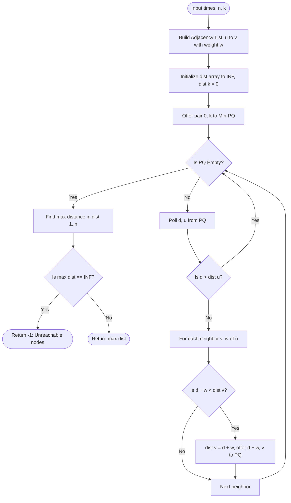

# 03. Shortest Paths: Dijkstra, 0-1 BFS, Bellman-Ford & Floyd-Warshall

[← Back to Topological Sorting](./02-topological-sorting-and-dag-architectures.md) | [Track Hub](./README.md) | [Next: Disjoint Set Union & MST →](./04-disjoint-set-union-and-minimum-spanning-trees.md)

---

## 🏛️ 1. Theoretical Foundations: Metric Spaces & The Relaxation Invariant

Shortest path algorithms operate over weighted graphs $G = (V, E, w)$ where $w: E \to \mathbb{R}$ assigns a cost or distance to every edge.

### The Relaxation Invariant
For every edge $(u, v) \in E$ with weight $w(u, v)$, the shortest distance estimates $dist[u]$ and $dist[v]$ from source $s$ must satisfy the **Triangle Inequality**:

$$dist[v] \le dist[u] + w(u, v)$$

If this inequality is violated, we perform an **Edge Relaxation**:

```java
if (dist[u] + weight < dist[v]) {
    dist[v] = dist[u] + weight;
    // v has found a shorter path through u!
}
```

---

## 🧭 2. Taxonomy of Shortest Path Algorithms

```
╭───────────────────────────────────────────────────────────────────────────────────────────╮
│                                SHORTEST PATH TAXONOMY MATRIX                              │
├───────────────────┬───────────────────┬──────────────┬──────────────┬─────────────────────┤
│ Algorithm         │ Edge Weight Class │ Time Bounds  │ Space Bounds │ Core Mechanism      │
├───────────────────┼───────────────────┼──────────────┼──────────────┼─────────────────────┤
│ Standard BFS      │ Unweighted (w=1)  │ O(V + E)     │ O(V)         │ FIFO Queue          │
│ 0-1 BFS           │ Binary w ∈ {0, 1} │ O(V + E)     │ O(V)         │ Double-ended Deque  │
│ Dijkstra          │ Non-negative (w≥0)│ O(E log V)   │ O(V)         │ Min-PriorityQueue   │
│ Bellman-Ford      │ Arbitrary Real    │ O(V * E)     │ O(V)         │ V - 1 Edge Passes   │
│ Floyd-Warshall    │ All-Pairs Real    │ O(V³)        │ O(V²)        │ 3-Loop Dynamic Prog │
╰───────────────────┴───────────────────┴──────────────┴──────────────┴─────────────────────╯
```

### Why Dijkstra Fails on Negative Edges: The Greedy Counterexample
Dijkstra relies on the greedy property that once a node $u$ is polled from the PriorityQueue, its distance $dist[u]$ is finalized and optimal.

```
       (A)
      /   \
   1 /     \ 3
    ▼       ▼
   (B)----->(C)
       -5
```
1. Source $A$: `dist[A] = 0, dist[B] = 1, dist[C] = 3`.
2. Dijkstra polls $B$ (smallest tentative distance $1$). Distance to $B$ is marked **final**.
3. Relax $B \to C$: `dist[C] = 1 + (-5) = -4`.
4. However, if there was an edge from $C \to B$ with negative weight, $B$'s "finalized" distance would be invalidated! Dijkstra cannot retrospectively fix finalized nodes without degrading to exponential time.

---

## 3. Problem 1: Network Delay Time (Dijkstra's Algorithm)

### 3.1 Problem Statement & Constraints

You are given a network of `n` nodes, labeled from `1` to `n`. You are also given `times`, a list of travel times as directed edges `times[i] = [ui, vi, wi]`, where `ui` is the source node, `vi` is the target node, and `wi` is the time it takes for a signal to travel from source to target.

We will send a signal from a given node `k`. Return the **minimum time** it takes for all the `n` nodes to receive the signal. If it is impossible for all the `n` nodes to receive the signal, return `-1`.

```
Example 1:
Input: times = [[2,1,1],[2,3,1],[3,4,1]], n = 4, k = 2
Output: 2
Explanation:
Signal starts at node 2.
At time 1: Reaches node 1 (2->1) and node 3 (2->3).
At time 2: Reaches node 4 (3->4).
All nodes receive signal in 2 units of time.
```

#### Constraints:
- $1 \le k \le n \le 100$.
- $1 \le \text{times.length} \le 6000$.
- $\text{times}[i]\text{.length} == 3$.
- $1 \le u_i, v_i \le n, u_i \ne v_i$.
- $0 \le w_i \le 100$. All pairs $(u_i, v_i)$ are unique.

---

### 3.2 Thought Process & Intuition

```
  Graph Model:
  Directed weighted graph with non-negative edge weights (wi >= 0).
  Source = k.
  Target = max(dist[1 .. n]) across all reachable nodes.
                         ↓
  Why Dijkstra:
  All edge weights are non-negative.
  Single-source shortest path guarantees finding the minimum transmission latency to every node.
                         ↓
  Implementation Details:
  Use a Min-PriorityQueue storing pairs (distance, node).
  Maintain dist[1 .. n] initialized to infinity, dist[k] = 0.
  When polling (d, u):
  • If d > dist[u]: stale queue entry! Discard immediately (lazy deletion)!
  • Otherwise, relax all outgoing edges (u, v, w). If dist[u] + w < dist[v], update and offer.
```

---

### 3.3 Procedural Blueprint (How to Proceed)



---

### 3.4 Production Java 17/21 Implementation

```java
import java.util.*;

public final class NetworkDelayTime {

    public record Edge(int to, int weight) {}
    private record NodeDist(int node, int dist) implements Comparable<NodeDist> {
        @Override
        public int compareTo(NodeDist other) {
            return Integer.compare(this.dist, other.dist);
        }
    }

    /**
     * Calculates signal propagation time using Dijkstra's algorithm.
     *
     * Time Complexity:  O(E log V) where E = times.length, V = n.
     * Space Complexity: O(V + E) for adjacency list, dist array, and PriorityQueue.
     */
    public int networkDelayTime(int[][] times, int n, int k) {
        List<List<Edge>> adj = new ArrayList<>(n + 1);
        for (int i = 0; i <= n; i++) {
            adj.add(new ArrayList<>());
        }

        for (int[] time : times) {
            adj.get(time[0]).add(new Edge(time[1], time[2]));
        }

        int[] dist = new int[n + 1];
        Arrays.fill(dist, Integer.MAX_VALUE);
        dist[k] = 0;

        PriorityQueue<NodeDist> pq = new PriorityQueue<>();
        pq.offer(new NodeDist(k, 0));

        while (!pq.isEmpty()) {
            NodeDist current = pq.poll();
            int u = current.node();
            int d = current.dist();

            // Lazy deletion of outdated, higher-cost queue entries
            if (d > dist[u]) {
                continue;
            }

            for (Edge edge : adj.get(u)) {
                int v = edge.to();
                int weight = edge.weight();

                if (dist[u] + weight < dist[v]) {
                    dist[v] = dist[u] + weight;
                    pq.offer(new NodeDist(v, dist[v]));
                }
            }
        }

        int maxTime = 0;
        for (int i = 1; i <= n; i++) {
            if (dist[i] == Integer.MAX_VALUE) {
                return -1; // Node i is unreachable
            }
            maxTime = Math.max(maxTime, dist[i]);
        }

        return maxTime;
    }
}
```

---

## 4. Problem 2: 0-1 BFS — Minimum Cost to Make at Least One Valid Path in a Grid (Hard)

### 4.1 Problem Statement & Constraints

Given an $m \times n$ grid. Each cell of the grid has a sign pointing to the next cell you should visit:
- `1` which means go to the cell to the right. (i.e. from `grid[i][j]` to `grid[i][j + 1]`)
- `2` which means go to the cell to the left. (i.e. from `grid[i][j]` to `grid[i][j - 1]`)
- `3` which means go to the lower cell. (i.e. from `grid[i][j]` to `grid[i + 1][j]`)
- `4` which means go to the upper cell. (i.e. from `grid[i][j]` to `grid[i - 1][j]`)

You can modify the sign on a cell with a cost of `1`. You can modify the sign on a cell **at most once**.

Return the **minimum cost** to make the grid have at least one valid path from the top-left cell `(0, 0)` to the bottom-right cell `(m - 1, n - 1)`.

```
Example 1:
Input: grid = [[1,1,1,1],[2,2,2,2],[1,1,1,1],[2,2,2,2]]
Output: 3

Example 2:
Input: grid = [[1,1,3],[3,2,2],[1,1,4]]
Output: 0
Explanation: You can follow the path without modifying any sign.
```

#### Constraints:
- $m == \text{grid.length}, n == \text{grid}[i]\text{.length}$.
- $1 \le m, n \le 100$.
- $1 \le \text{grid}[i][j] \le 4$.

---

### 4.2 Thought Process & Intuition

```
  Graph Reduction:
  Each cell (r, c) has 4 directed edges to its neighbors:
  • Moving in the direction indicated by grid[r][c] costs 0!
  • Moving in any of the other 3 directions costs 1!
                         ↓
  Why Standard Dijkstra is Suboptimal:
  Dijkstra with PriorityQueue takes O(E log V) = O((M * N) log(M * N)).
  Can we do strictly O(V + E) = O(M * N) LINEAR TIME?
                         ↓
  "Aha!" Insight: 0-1 BFS (Dial's Algorithm)
  Because edge weights are strictly binary (0 or 1):
  We use an ArrayDeque instead of a PriorityQueue:
  • If edge cost is 0: offerFirst(neighbor) -> Explore immediately at CURRENT distance level!
  • If edge cost is 1: offerLast(neighbor)  -> Explore at NEXT distance level!
  The Deque remains monotonically sorted at all times: [d, d, ..., d+1, d+1].
  Zero heap sorting overhead! Strictly O(M * N) linear time!
```

---

### 4.3 Visual State Transition: 0-1 Deque Invariant

```
Deque State: Monotonically Non-Decreasing at all times!

Front of Deque                                      Back of Deque
╭───────────────────────────────┬───────────────────────────────╮
│  Distance d Elements (Cost 0) │ Distance d + 1 Elements (Cost 1)│
│  [ (r1, c1), (r2, c2) ]       │ [ (r3, c3), (r4, c4) ]        │
╰───────────────────────────────┴───────────────────────────────╯
               ▲                                ▲
               │                                │
    Add here if weight == 0          Add here if weight == 1
         (offerFirst)                     (offerLast)
```

---

### 4.4 Production Java 17/21 Implementation

```java
import java.util.*;

public final class MinimumCostValidPath {

    // 1-indexed directions corresponding to grid values 1, 2, 3, 4
    private static final int[][] DIRS = {{0, 1}, {0, -1}, {1, 0}, {-1, 0}};

    /**
     * Finds minimum modifications using 0-1 BFS with ArrayDeque in linear time.
     *
     * Time Complexity:  O(M * N) — every cell is processed in constant time.
     * Space Complexity: O(M * N) for the dist array and Deque.
     */
    public int minCost(int[][] grid) {
        int m = grid.length;
        int n = grid[0].length;

        int[][] dist = new int[m][n];
        for (int[] row : dist) {
            Arrays.fill(row, Integer.MAX_VALUE);
        }
        dist[0][0] = 0;

        Deque<int[]> deque = new ArrayDeque<>();
        deque.offerFirst(new int[]{0, 0});

        while (!deque.isEmpty()) {
            int[] curr = deque.pollFirst();
            int r = curr[0];
            int c = curr[1];
            int d = dist[r][c];

            if (r == m - 1 && c == n - 1) {
                return d;
            }

            for (int i = 0; i < 4; i++) {
                int nr = r + DIRS[i][0];
                int nc = c + DIRS[i][1];

                if (nr >= 0 && nr < m && nc >= 0 && nc < n) {
                    // Cost is 0 if matching current cell's arrow (i + 1 == grid[r][c]), else 1
                    int cost = (grid[r][c] == i + 1) ? 0 : 1;

                    if (d + cost < dist[nr][nc]) {
                        dist[nr][nc] = d + cost;
                        if (cost == 0) {
                            deque.offerFirst(new int[]{nr, nc});
                        } else {
                            deque.offerLast(new int[]{nr, nc});
                        }
                    }
                }
            }
        }

        return dist[m - 1][n - 1];
    }
}
```

---

## 5. Problem 3: Cheapest Flights Within K Stops (Bellman-Ford DP)

### 5.1 Problem Statement & Constraints

There are `n` cities connected by some number of flights. You are given an array `flights` where `flights[i] = [fromi, toi, pricei]` indicates that there is a flight from city `fromi` to city `toi` with cost `pricei`.

You are also given three integers `src`, `dst`, and `k`. Return the **cheapest price** from `src` to `dst` with **at most `k` stops**. If there is no such route, return `-1`.

```
Example 1:
Input: n = 4, flights = [[0,1,100],[1,2,100],[2,0,100],[1,3,600],[2,3,200]], src = 0, dst = 3, k = 1
Output: 700
Explanation: 0 -> 1 -> 3 has 1 stop with cost 100 + 600 = 700.
(0 -> 1 -> 2 -> 3 costs 400, but has 2 stops > k = 1).
```

#### Constraints:
- $1 \le n \le 100$.
- $0 \le \text{flights.length} \le (n \times (n - 1) / 2)$.
- $0 \le \text{src}, \text{dst} < n, \text{src} \ne \text{dst}$.
- $0 \le k < n$.

---

### 5.2 Thought Process & Intuition

```
  Constraint Bottleneck: At most K stops!
  At most K stops means a path uses at most K + 1 edges!
  Standard Dijkstra or BFS without edge count tracking will find paths with <= K stops that are
  more expensive, or cheaper paths with > K stops!
                         ↓
  "Aha!" Insight: Bellman-Ford Pass Invariant
  In the Bellman-Ford algorithm, after iteration i, dist[v] contains the shortest path
  using AT MOST i edges!
  Therefore, running Bellman-Ford for exactly K + 1 iterations solves the problem!
                         ↓
  Critical Bug Defense: Snapshot Array (clone)
  In a single iteration, relaxing edges sequentially in-place could cascade:
  Edge A -> B relaxed, and immediately B -> C relaxed using the new dist[B]!
  This uses 2 edges in a SINGLE step!
  To prevent cascading: Always relax using values from a SNAPSHOT of the previous iteration!
```

---

### 5.3 Production Java 17/21 Implementation

```java
import java.util.Arrays;

public final class CheapestFlights {

    /**
     * Solves bounded shortest path using K + 1 passes of Bellman-Ford with snapshot arrays.
     *
     * Time Complexity:  O((K + 1) * E) where E = flights.length.
     * Space Complexity: O(V) for the dist and snapshot arrays.
     */
    public int findCheapestPrice(int n, int[][] flights, int src, int dst, int k) {
        int[] dist = new int[n];
        Arrays.fill(dist, Integer.MAX_VALUE);
        dist[src] = 0;

        // At most k stops means at most k + 1 edges
        for (int i = 0; i <= k; i++) {
            // Snapshot of previous iteration to prevent edge cascading in the same step
            int[] temp = Arrays.copyOf(dist, n);

            for (int[] flight : flights) {
                int u = flight[0];
                int v = flight[1];
                int price = flight[2];

                if (dist[u] != Integer.MAX_VALUE) {
                    if (dist[u] + price < temp[v]) {
                        temp[v] = dist[u] + price;
                    }
                }
            }
            dist = temp;
        }

        return (dist[dst] == Integer.MAX_VALUE) ? -1 : dist[dst];
    }
}
```

---

<div align="center">

| [← Back to Topological Sorting](./02-topological-sorting-and-dag-architectures.md) | [Track Hub: Graphs](./README.md) | [Next: Disjoint Set Union & MST →](./04-disjoint-set-union-and-minimum-spanning-trees.md) |
| :--- | :---: | ---: |

</div>
