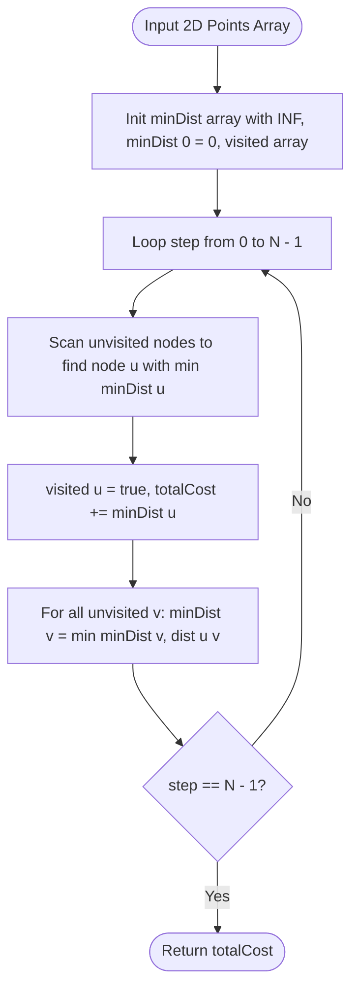

# 04. Disjoint Set Union (DSU) & Minimum Spanning Trees

[← Back to Shortest Paths](./03-shortest-paths-dijkstra-bellman-ford-and-floyd-warshall.md) | [Track Hub](./README.md) | [Next: Bipartite Matching & Coloring →](./05-bipartite-matching-and-graph-coloring.md)

---

## 🏛️ 1. Theoretical Foundations: Equivalence Partitions & DSU

A **Disjoint Set Union (DSU)** data structure, also known as **Union-Find**, manages a partition of a set into disjoint subsets. It supports two primary operations in nearly $\mathcal{O}(1)$ time:
1. `find(x)`: Identifies which canonical representative (root) subset $x$ belongs to.
2. `union(x, y)`: Merges the subset containing $x$ with the subset containing $y$.

```
╭───────────────────────────────────────────────────────────────────────────────────────────╮
│                              THE TWO OPTIMIZATIONS OF DSU                                 │
├─────────────────────┬─────────────────────────────────────────────────────────────────────┤
│ 1. Path Compression │ During find(x), update parent[x] = find(parent[x]), flattening      │
│                     │ the entire path directly to the root. Future lookups take O(1)!     │
├─────────────────────┼─────────────────────────────────────────────────────────────────────┤
│ 2. Union by Rank/   │ Always attach the tree of smaller height/size under the root of the │
│    Size             │ larger tree. Prevents tree height from degrading to O(N).           │
╰─────────────────────┴─────────────────────────────────────────────────────────────────────╯
```

---

## 🧮 2. Mathematical Complexity: The Inverse Ackermann Function $\alpha(N)$

When combining **Path Compression** and **Union by Rank**, Tarjan (1975) proved that any sequence of $M$ operations on $N$ elements takes:

$$\mathcal{O}(M \cdot \alpha(N))$$

where $\alpha(N)$ is the **Inverse Ackermann function**, defined as the value $k$ for which $A(k, 1) \ge N$.
The Ackermann function $A(m, n)$ grows with unimaginable speed:
- $A(1, 1) = 2$
- $A(2, 1) = 3$
- $A(3, 1) = 2047$
- $A(4, 1) = 2^{2048} \approx 10^{600}$ (far exceeding the estimated number of atoms in the observable universe $\approx 10^{80}$!)

For any realistic computing input $N < 10^{600}$:
$$\alpha(N) \le 4$$
Thus, for all practical purposes, each DSU operation runs in **strictly $\mathcal{O}(1)$ amortized time**.

---

## 🛠️ 3. Production Java 17/21 DSU Implementation

```java
public final class DisjointSetUnion {
    private final int[] parent;
    private final int[] size;
    private int components;

    public DisjointSetUnion(int n) {
        this.parent = new int[n];
        this.size = new int[n];
        this.components = n;
        for (int i = 0; i < n; i++) {
            parent[i] = i;
            size[i] = 1;
        }
    }

    public int find(int x) {
        if (parent[x] != x) {
            parent[x] = find(parent[x]); // Path Compression
        }
        return parent[x];
    }

    public boolean union(int x, int y) {
        int rootX = find(x);
        int rootY = find(y);

        if (rootX == rootY) {
            return false; // Already in the same component! Cycle detected!
        }

        // Union by size
        if (size[rootX] < size[rootY]) {
            parent[rootX] = rootY;
            size[rootY] += size[rootX];
        } else {
            parent[rootY] = rootX;
            size[rootX] += size[rootY];
        }

        components--;
        return true;
    }

    public int getComponents() {
        return components;
    }

    public int getSetSize(int x) {
        return size[find(x)];
    }
}
```

---

## 🌲 4. Minimum Spanning Trees (MST): Kruskal's vs. Prim's

A **Spanning Tree** of an undirected, connected graph $G = (V, E)$ is an acyclic subgraph connecting all $V$ vertices with exactly $V - 1$ edges. A **Minimum Spanning Tree (MST)** minimizes the total sum of edge weights.

### The Fundamental Cut Property
Let $(S, V \setminus S)$ be any cut (partition of vertices into two non-empty sets). If edge $e = (u, v)$ is the strictly minimum-weight edge crossing the cut, then $e$ **must belong to the MST**.

```
╭───────────────────────────────────────────────────────────────────────────────────────────╮
│                                KRUSKAL'S VS. PRIM'S ALGORITHM                             │
├─────────────────────┬─────────────────────────────────┬───────────────────────────────────┤
│ Feature             │ Kruskal's Algorithm             │ Prim's Algorithm                  │
├─────────────────────┼─────────────────────────────────┼───────────────────────────────────┤
│ Approach            │ Edge-centric, global greedy     │ Vertex-centric, growing cut tree  │
│ Primary Structure   │ Sorted Edge List + DSU          │ Min-PriorityQueue of frontier     │
│ Time Complexity     │ O(E log E) = O(E log V)         │ O(E log V) sparse / O(V²) dense   │
│ Ideal Graph Class   │ Sparse graphs (E ≈ V)           │ Dense graphs (E ≈ V²)             │
╰─────────────────────┴─────────────────────────────────┴───────────────────────────────────╯
```

---

## 5. Problem 1: Redundant Connection (Cycle Detection in Undirected Graph)

### 5.1 Problem Statement & Constraints

In this problem, a tree is an undirected graph that is connected and has no cycles.

You are given a graph that started as a tree with `n` nodes labeled from `1` to `n`, with one additional edge added. The added edge has two different vertices chosen from `1` to `n`, and was not an edge that already existed. The graph is represented as an array `edges` of length `n` where `edges[i] = [ai, bi]` indicates that there is an edge between nodes `ai` and `bi` in the graph.

Return an edge that can be removed so that the resulting graph is a tree of `n` nodes. If there are multiple answers, return the answer that occurs last in the input.

```
Example 1:
Input: edges = [[1,2],[1,3],[2,3]]
Output: [2,3]

Example 2:
Input: edges = [[1,2],[2,3],[3,4],[1,4],[1,5]]
Output: [1,4]
```

#### Constraints:
- $n == \text{edges.length}$.
- $3 \le n \le 1000$.
- `edges[i].length == 2`, $1 \le a_i < b_i \le n$.
- There are no repeated edges.

---

### 5.2 Thought Process & Intuition

```
  Graph Invariant:
  A tree on n nodes has exactly n - 1 edges.
  We are given n edges on n nodes -> Exactly ONE redundant edge forms a cycle!
                         ↓
  Approach: DSU Cycle Interception
  Iterate through edges sequentially.
  For each edge [u, v]:
  • If find(u) == find(v):
    Both nodes are ALREADY connected by a previous path!
    Adding edge [u, v] forms a cycle!
    Because we process edges in order, the first edge that connects two already-connected
    nodes (or the last one encountered) is our redundant connection!
  • If find(u) != find(v):
    union(u, v) and continue.
```

---

### 5.3 Production Java 17/21 Implementation

```java
public final class RedundantConnection {

    /**
     * Identifies the redundant edge creating a cycle using Disjoint Set Union.
     *
     * Time Complexity:  O(N * alpha(N)) approx O(N) linear time.
     * Space Complexity: O(N) for DSU parent array.
     */
    public int[] findRedundantConnection(int[][] edges) {
        int n = edges.length;
        int[] parent = new int[n + 1];
        for (int i = 1; i <= n; i++) {
            parent[i] = i;
        }

        for (int[] edge : edges) {
            int u = edge[0];
            int v = edge[1];

            int rootU = find(parent, u);
            int rootV = find(parent, v);

            if (rootU == rootV) {
                return edge; // Cycle detected!
            }

            parent[rootU] = rootV;
        }

        return new int[0];
    }

    private int find(int[] parent, int x) {
        if (parent[x] != x) {
            parent[x] = find(parent, parent[x]); // Path Compression
        }
        return parent[x];
    }
}
```

---

## 6. Problem 2: Min Cost to Connect All Points (Dense MST)

### 6.1 Problem Statement & Constraints

You are given an array `points` representing integer coordinates of some points on a 2D-plane, where `points[i] = [xi, yi]`.

The cost of connecting two points `[xi, yi]` and `[xj, yj]` is the **Manhattan distance** between them: $|x_i - x_j| + |y_i - y_j|$.

Return the **minimum cost** to make all points connected. All points are connected if there is exactly one simple path between any two points.

```
Example 1:
Input: points = [[0,0],[2,2],[3,10],[5,2],[7,0]]
Output: 20
```

#### Constraints:
- $1 \le \text{points.length} \le 1000$.
- $-10^6 \le x_i, y_i \le 10^6$.
- All pairs $(x_i, y_i)$ are distinct.

---

### 6.2 Thought Process & Intuition

```
  Graph Topology:
  Every point can connect to every other point.
  This is a COMPLETE GRAPH: |E| = N * (N - 1) / 2.
  For N = 1000, |E| ≈ 500,000 edges!
                         ↓
  Why Kruskal's is Suboptimal:
  Kruskal's must generate and sort all 500,000 edges:
  Sorting time: O(E log E) = 5 * 10⁵ * log(5 * 10⁵) ≈ 10⁷ ops + high memory for edge objects!
                         ↓
  "Aha!" Insight: Dense Prim's Algorithm (Without PriorityQueue)
  In a dense graph, array-based Prim's algorithm runs in strictly O(V²):
  Maintain minDist[V] storing the minimum distance to the growing MST tree.
  In each of the N iterations:
  1. Find the unvisited vertex u with minimum minDist[u] in O(V) array scan.
  2. Mark u as visited, add minDist[u] to totalCost.
  3. Update minDist[v] = min(minDist[v], manhattanDist(u, v)) for all unvisited v in O(V).
  Total Time: N * (V + V) = O(V²) = 1,000² = 10⁶ operations! Zero heap allocations!
```

---

### 6.3 Procedural Blueprint (How to Proceed)



---

### 6.4 Production Java 17/21 Implementation

```java
import java.util.Arrays;

public final class MinCostConnectPoints {

    /**
     * Solves dense complete graph MST using array-based Prim's algorithm in O(V^2).
     *
     * Time Complexity:  O(N^2) where N = points.length.
     * Space Complexity: O(N) for minDist and visited arrays.
     */
    public int minCostConnectPoints(int[][] points) {
        int n = points.length;
        int[] minDist = new int[n];
        Arrays.fill(minDist, Integer.MAX_VALUE);
        minDist[0] = 0;

        boolean[] inMst = new boolean[n];
        int totalCost = 0;

        for (int step = 0; step < n; step++) {
            int u = -1;
            int minVal = Integer.MAX_VALUE;

            // Find unvisited vertex with minimum tentative distance
            for (int i = 0; i < n; i++) {
                if (!inMst[i] && minDist[i] < minVal) {
                    minVal = minDist[i];
                    u = i;
                }
            }

            inMst[u] = true;
            totalCost += minVal;

            // Relax distances to all remaining vertices
            for (int v = 0; v < n; v++) {
                if (!inMst[v]) {
                    int dist = Math.abs(points[u][0] - points[v][0]) 
                             + Math.abs(points[u][1] - points[v][1]);
                    if (dist < minDist[v]) {
                        minDist[v] = dist;
                    }
                }
            }
        }

        return totalCost;
    }
}
```

---

## 7. Problem 3: Number of Operations to Make Network Connected

### 7.1 Problem Statement & Constraints

There are `n` computers numbered from `0` to `n - 1` and a network of train connections `connections` where `connections[i] = [ai, bi]` represents a connection between computers `ai` and `bi`. Any computer can reach any other computer directly or indirectly through the network.

You are given an initial computer network `connections`. You can extract certain cables between two directly connected computers, and place them between any pair of disconnected computers to make them directly connected.

Return the **minimum number of times** you need to do this in order to make all the computers connected. If it is not possible, return `-1`.

```
Example 1:
Input: n = 4, connections = [[0,1],[0,2],[1,2]]
Output: 1
Explanation: Remove cable between 1 and 2 and connect 1 and 3.

Example 2:
Input: n = 6, connections = [[0,1],[0,2],[0,3],[1,2],[1,3]]
Output: 2

Example 3:
Input: n = 6, connections = [[0,1],[0,2],[0,3],[1,2]]
Output: -1
Explanation: Total cables = 4, but connecting 6 computers requires at least 5 cables!
```

#### Constraints:
- $1 \le n \le 10^5$.
- $1 \le \text{connections.length} \le \min(n \times (n - 1) / 2, 10^5)$.
- `connections[i].length == 2`, $0 \le a_i, b_i < n, a_i \ne b_i$.

---

### 7.2 Thought Process & Mathematical Invariant

```
  Theorem (Euler / Spanning Tree Invariant):
  To connect C disconnected components into 1 single connected component,
  we require AT LEAST C - 1 cables!
                         ↓
  Sufficiency Condition:
  To connect N computers, we require at least N - 1 total edges.
  If connections.length < n - 1:
  It is mathematically IMPOSSIBLE to connect all computers! Return -1 immediately!
                         ↓
  Optimal Answer:
  If connections.length >= n - 1:
  We are guaranteed to have enough redundant cables!
  Count the number of disconnected components C using DSU.
  The minimum cables to rewire is precisely: C - 1!
```

---

### 7.3 Production Java 17/21 Implementation

```java
public final class MakeNetworkConnected {

    /**
     * Determines minimum rewiring operations using DSU component counting.
     *
     * Time Complexity:  O(E * alpha(N)) where E = connections.length.
     * Space Complexity: O(N) for DSU parent array.
     */
    public int makeConnected(int n, int[][] connections) {
        // Fundamental invariant: Connecting n nodes requires at least n - 1 edges
        if (connections.length < n - 1) {
            return -1;
        }

        int[] parent = new int[n];
        for (int i = 0; i < n; i++) {
            parent[i] = i;
        }

        int components = n;

        for (int[] conn : connections) {
            int rootU = find(parent, conn[0]);
            int rootV = find(parent, conn[1]);

            if (rootU != rootV) {
                parent[rootU] = rootV;
                components--; // Two components merged
            }
        }

        // To connect C components together, exactly C - 1 edges are needed
        return components - 1;
    }

    private int find(int[] parent, int x) {
        if (parent[x] != x) {
            parent[x] = find(parent, parent[x]); // Path Compression
        }
        return parent[x];
    }
}
```

---

<div align="center">

| [← Back to Shortest Paths](./03-shortest-paths-dijkstra-bellman-ford-and-floyd-warshall.md) | [Track Hub: Graphs](./README.md) | [Next: Bipartite Matching & Coloring →](./05-bipartite-matching-and-graph-coloring.md) |
| :--- | :---: | ---: |

</div>
