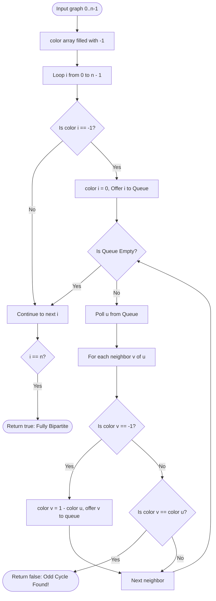

# 05. Bipartite Graphs, 2-Coloring & Matching Foundations

[← Back to DSU & MST](./04-disjoint-set-union-and-minimum-spanning-trees.md) | [Track Hub](./README.md) | [Next: Advanced Hard Graph Algorithms →](./06-advanced-hard-graph-algorithms.md)

---

## 🏛️ 1. Theoretical Foundations: Bipartite Graphs

A graph $G = (V, E)$ is **Bipartite** if its vertex set $V$ can be partitioned into two disjoint subsets $U$ and $W$ ($U \cap W = \emptyset, U \cup W = V$) such that every edge in $E$ connects a vertex in $U$ to a vertex in $W$. No edge connects two vertices within the same partition.

```
Partition U:    ( U1 )        ( U2 )        ( U3 )
                  │  ╲        ╱    ╲        ╱
                  │   ╲      ╱      ╲      ╱
                  ▼    ▼    ▼        ▼    ▼
Partition W:    ( W1 )        ( W2 )        ( W3 )

Invariant: Zero edges exist between U_i and U_j, or between W_i and W_j!
```

---

## 🧮 2. Mathematical Proof: The Odd Cycle Theorem

**Theorem (König, 1936)**: An undirected graph $G$ is bipartite if and only if it contains **no odd-length cycles**.

### Proof ($\implies$):
1. Assume $G$ is bipartite with partitions $U$ and $W$.
2. Suppose there exists a cycle $C = v_1 \to v_2 \to \dots \to v_k \to v_1$.
3. Without loss of generality, let $v_1 \in U$.
4. Because edges only cross between partitions:
   - $v_1 \in U \implies v_2 \in W$
   - $v_2 \in W \implies v_3 \in U$
   - In general, $v_i \in U$ for odd $i$, and $v_i \in W$ for even $i$.
5. For the cycle to close, the edge $(v_k, v_1)$ connects $v_k$ to $v_1 \in U$.
6. Therefore, $v_k$ must belong to $W$.
7. Because all vertices in $W$ have even indices, $k$ must be **even**.
8. Hence, every cycle in a bipartite graph must have an even length. A bipartite graph cannot contain an odd-length cycle $\blacksquare$.

---

## ⚡ 3. The 2-Coloring Invariant

Testing whether a graph is bipartite is mathematically equivalent to solving the **2-Coloring Problem**:
- Assign each vertex one of two colors (e.g., $0$ and $1$).
- For every edge $(u, v) \in E$, we enforce the invariant:

$$\text{color}(v) = 1 - \text{color}(u)$$

If we ever attempt to assign a color to a neighbor that conflicts with its existing color ($\text{color}(v) == \text{color}(u)$), an **odd cycle** is detected, proving the graph is not bipartite.

---

## 4. Problem 1: Is Graph Bipartite?

### 4.1 Problem Statement & Constraints

There is an undirected graph with `n` nodes, where each node is numbered between `0` and `n - 1`. You are given a 2D array `graph`, where `graph[u]` is an array of nodes that node `u` is adjacent to. More formally, for each `v` in `graph[u]`, there is an undirected edge between node `u` and node `v`.

The graph has the following properties:
- There are no self-edges (`graph[u]` does not contain `u`).
- There are no parallel edges (`graph[u]` does not contain duplicate values).
- If `v` is in `graph[u]`, then `u` is in `graph[v]` (the graph is undirected).
- The graph may not be connected, meaning there may be two nodes `u` and `v` such that there is no path between them.

A graph is **bipartite** if the nodes can be partitioned into two independent sets $A$ and $B$ such that every edge in the graph connects a node in set $A$ and a node in set $B$.

Return `true` if and only if it is bipartite.

```
Example 1:
Input: graph = [[1,2,3],[0,2],[0,1,3],[0,2]]
Output: false
Explanation: Cycle 0 -> 1 -> 2 -> 0 has length 3 (ODD CYCLE)! Cannot 2-color!

Example 2:
Input: graph = [[1,3],[0,2],[1,3],[0,2]]
Output: true
Explanation: Graph is an even cycle 0 -> 1 -> 2 -> 3 -> 0 of length 4.
Partition A = {0, 2}, Partition B = {1, 3}.
```

#### Constraints:
- `graph.length == n`.
- $1 \le n \le 100$.
- $0 \le \text{graph}[u]\text{.length} < n$.
- $0 \le \text{graph}[u][i] \le n - 1$.
- `graph[u]` does not contain `u`.

---

### 4.2 Thought Process & Intuition

```
  Edge Case Alert: Disconnected Components!
  The graph might contain isolated vertices or multiple disconnected subgraphs!
  A single BFS/DFS from node 0 is INSUFFICIENT because it will not visit other components.
                         ↓
  Approach: Multi-Component BFS 2-Coloring
  Maintain int[] color array of size n initialized to -1 (uncolored).
  Iterate from i = 0 to n - 1:
  If color[i] == -1:
  1. Assign color[i] = 0.
  2. Launch BFS queue starting at i.
  3. While queue is not empty:
     Poll u. For each neighbor v of u:
     • If color[v] == -1:
       Assign color[v] = 1 - color[u], offer v to queue.
     • If color[v] == color[u]:
       CONFLICT DETECTED! Two adjacent nodes share the same color! Return false!
  If all components are colored without conflict, return true!
```

---

### 4.3 Procedural Blueprint (How to Proceed)



---

### 4.4 Production Java 17/21 Implementation

```java
import java.util.*;

public final class BipartiteGraph {

    /**
     * Determines if graph is bipartite using multi-component BFS 2-coloring.
     *
     * Time Complexity:  O(V + E) — visits every vertex and edge once.
     * Space Complexity: O(V) for color array and BFS queue.
     */
    public boolean isBipartite(int[][] graph) {
        int n = graph.length;
        int[] color = new int[n];
        Arrays.fill(color, -1); // -1 indicates unvisited/uncolored

        for (int i = 0; i < n; i++) {
            if (color[i] == -1) {
                if (!bfsCheck(graph, i, color)) {
                    return false;
                }
            }
        }

        return true;
    }

    private boolean bfsCheck(int[][] graph, int start, int[] color) {
        Queue<Integer> queue = new ArrayDeque<>();
        color[start] = 0;
        queue.offer(start);

        while (!queue.isEmpty()) {
            int u = queue.poll();

            for (int v : graph[u]) {
                if (color[v] == -1) {
                    color[v] = 1 - color[u]; // Color with opposite parity
                    queue.offer(v);
                } else if (color[v] == color[u]) {
                    return false; // Conflict! Monochromatic adjacent edge detected!
                }
            }
        }

        return true;
    }
}
```

---

## 5. Problem 2: Possible Bipartition (Conflict Graph Partitioning)

### 5.1 Problem Statement & Constraints

We want to split a group of `n` people (labeled from `1` to `n`) into two groups of any size. Each person may dislike some other people, and they should not go into the same group.

Given the integer `n` and the array `dislikes` where `dislikes[i] = [ai, bi]` indicates that the person labeled `ai` and the person labeled `bi` do not like each other, return `true` if it is possible to split everyone into two groups in this way.

```
Example 1:
Input: n = 4, dislikes = [[1,2],[1,3],[2,4]]
Output: true
Explanation: group1 = [1,4] and group2 = [2,3].

Example 2:
Input: n = 3, dislikes = [[1,2],[1,3],[2,3]]
Output: false
Explanation: Triangle conflict 1 <-> 2 <-> 3 <-> 1! Odd cycle! Cannot split into 2 groups.
```

#### Constraints:
- $1 \le n \le 2000$.
- $0 \le \text{dislikes.length} \le 10^4$.
- $\text{dislikes}[i]\text{.length} == 2$.
- $1 \le a_i < b_i \le n$. All pairs are distinct.

---

### 5.2 Thought Process & Intuition

```
  Problem Transformation:
  People = Vertices {1, 2, ..., n}.
  Dislike pair [ai, bi] = Undirected edge between ai and bi.
  Splitting into 2 groups such that no edge connects people within the same group
  is the EXACT definition of a BIPARTITE GRAPH!
                         ↓
  Approach:
  1. Build adjacency list of size n + 1 from dislikes pairs.
  2. Run BFS / DFS 2-coloring over all 1 .. n vertices.
  3. If an odd cycle exists, return false. Otherwise, return true!
```

---

### 5.3 Production Java 17/21 Implementation

```java
import java.util.*;

public final class PossibleBipartition {

    /**
     * Verifies mutual conflict separation using BFS 2-coloring.
     *
     * Time Complexity:  O(V + E) where V = n, E = dislikes.length.
     * Space Complexity: O(V + E) for adjacency list and color array.
     */
    public boolean possibleBipartition(int n, int[][] dislikes) {
        List<List<Integer>> adj = new ArrayList<>(n + 1);
        for (int i = 0; i <= n; i++) {
            adj.add(new ArrayList<>());
        }

        for (int[] edge : dislikes) {
            adj.get(edge[0]).add(edge[1]);
            adj.get(edge[1]).add(edge[0]);
        }

        int[] color = new int[n + 1];
        Arrays.fill(color, -1);

        for (int i = 1; i <= n; i++) {
            if (color[i] == -1) {
                Queue<Integer> queue = new ArrayDeque<>();
                color[i] = 0;
                queue.offer(i);

                while (!queue.isEmpty()) {
                    int u = queue.poll();

                    for (int neighbor : adj.get(u)) {
                        if (color[neighbor] == -1) {
                            color[neighbor] = 1 - color[u];
                            queue.offer(neighbor);
                        } else if (color[neighbor] == color[u]) {
                            return false;
                        }
                    }
                }
            }
        }

        return true;
    }
}
```

---

<div align="center">

| [← Back to DSU & MST](./04-disjoint-set-union-and-minimum-spanning-trees.md) | [Track Hub: Graphs](./README.md) | [Next: Advanced Hard Graph Algorithms →](./06-advanced-hard-graph-algorithms.md) |
| :--- | :---: | ---: |

</div>
