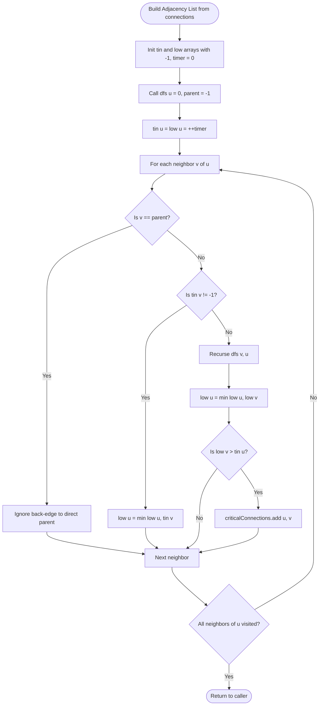

# 06. Advanced Hard Graph Algorithms: Bridges, Articulation Points & Eulerian Paths

[← Back to Bipartite Graphs](./05-bipartite-matching-and-graph-coloring.md) | [Track Hub](./README.md) | [Back to Java Track Home](../README.md)

---

## 🏛️ 1. Theoretical Foundations: Network Vulnerabilities & Tarjan's Invariant

In distributed networks and telecommunications, identifying single points of failure is paramount:
- **Bridge (Critical Connection)**: An edge whose removal strictly increases the number of connected components in the graph.
- **Articulation Point (Cut Vertex)**: A vertex whose removal (along with its incident edges) disconnects the graph.

```
                  ( 1 )
                 /     \
               ( 0 )---( 2 )
                         │
                         │  <--- BRIDGE EDGE (2, 3)
                         ▼
                       ( 3 )
                      /     \
                    ( 4 )---( 5 )

Nodes 2 and 3 are ARTICULATION POINTS!
Edge (2, 3) is a BRIDGE!
```

---

## 🧮 2. Mathematical Proof of Tarjan's Bridge & Cut Vertex Conditions

Tarjan (1974) discovered that bridges and articulation points can be extracted in a **single DFS pass** ($\mathcal{O}(V + E)$) by tracking two integer timestamps for every vertex $u$:
1. `tin[u]` (Time In): The exact step timestamp when vertex $u$ is first discovered in the DFS traversal.
2. `low[u]` (Lowest Reachable): The lowest `tin` reachable from $u$ through its DFS subtree and at most **one back-edge**.

```
DFS Tree Transition Rules:
1. When discovering unvisited neighbor v from u:
   tin[v] = low[v] = ++timer;
   Recurse DFS(v, u);
   low[u] = min(low[u], low[v]); // Propagate upward

2. When encountering an already-visited neighbor v (back-edge, v != parent):
   low[u] = min(low[u], tin[v]); // Update reachable ancestor
```

### 2.1 The Bridge Invariant
An edge $(u, v)$ (where $u$ is parent of $v$ in DFS tree) is a **Bridge** if and only if:

$$low[v] > tin[u]$$

**Proof**:
- $tin[u]$ is the discovery time of $u$.
- If $low[v] > tin[u]$, it is mathematically impossible for any node in $v$'s subtree to reach $u$ or any ancestor of $u$ via a back-edge.
- Therefore, the edge $(u, v)$ is the **sole connecting lifeline** between $v$'s component and the rest of the graph. Removing $(u, v)$ isolates $v$'s subtree $\blacksquare$.

### 2.2 The Articulation Point Invariant
A vertex $u$ is an **Articulation Point** if and only if:
1. **Non-Root Case**: $u$ has a DFS child $v$ such that $low[v] \ge tin[u]$ (no path from $v$ bypasses $u$).
2. **Root Case**: $u$ is the root of the DFS tree and has **strictly more than 1** child in the DFS tree.

---

## 3. Problem 1: Critical Connections in a Network (Bridges)

### 3.1 Problem Statement & Constraints

There are `n` servers numbered from `0` to `n - 1` connected by undirected server-to-server `connections` forming a network where `connections[i] = [ai, bi]` represents a connection between servers `ai` and `bi`. Any server can reach any other server directly or indirectly through the network.

A **critical connection** is a connection that, if removed, will make some servers unable to reach some other server.

Return all critical connections in the network in any order.

```
Example 1:
Input: n = 4, connections = [[0,1],[1,2],[2,0],[1,3]]
Output: [[1,3]]
Explanation: Removing [1,3] disconnects server 3 from the rest of the network.
Edges [0,1], [1,2], [2,0] form a cycle; removing any one of them leaves the network connected.
```

#### Constraints:
- $2 \le n \le 10^5$.
- $n - 1 \le \text{connections.length} \le 10^5$.
- $0 \le a_i, b_i < n, a_i \ne b_i$.
- There are no repeated connections.
- The network is connected.

---

### 3.2 Thought Process & Intuition

```
  Brute-Force Bottleneck:
  For each edge e in connections:
  • Temporarily remove e.
  • Run BFS/DFS to check if all n nodes remain reachable.
  • If unreachable, e is a critical connection!
  Time Complexity: E * (V + E) = 10⁵ * (10⁵ + 10⁵) = 2 * 10¹⁰ operations -> TLE!
                         ↓
  "Aha!" Insight: Tarjan's Bridge-Finding Algorithm
  Compute tin[u] and low[u] during a single DFS traversal!
  Whenever low[v] > tin[u] for an edge u -> v (where v is a child in the DFS tree),
  record [u, v] as a critical bridge!
  Total Time: strictly O(V + E) in a single linear pass!
```

---

### 3.3 Procedural Blueprint (How to Proceed)



---

### 3.4 Production Java 17/21 Implementation

```java
import java.util.*;

public final class CriticalConnections {

    private int timer = 0;

    /**
     * Extracts all critical network bridges in O(V + E) using Tarjan's algorithm.
     *
     * Time Complexity:  O(V + E) — single DFS visit per edge and node.
     * Space Complexity: O(V + E) for adjacency list, tin/low arrays, and call stack.
     */
    public List<List<Integer>> criticalConnections(int n, List<List<Integer>> connections) {
        List<List<Integer>> adj = new ArrayList<>(n);
        for (int i = 0; i < n; i++) {
            adj.add(new ArrayList<>());
        }

        for (List<Integer> edge : connections) {
            int u = edge.get(0);
            int v = edge.get(1);
            adj.get(u).add(v);
            adj.get(v).add(u);
        }

        int[] tin = new int[n];
        int[] low = new int[n];
        Arrays.fill(tin, -1);

        List<List<Integer>> bridges = new ArrayList<>();
        dfs(0, -1, adj, tin, low, bridges);

        return bridges;
    }

    private void dfs(int u, int parent, List<List<Integer>> adj, 
                     int[] tin, int[] low, List<List<Integer>> bridges) {
        tin[u] = low[u] = ++timer;

        for (int v : adj.get(u)) {
            if (v == parent) {
                continue; // Do not traverse backward along the direct parent edge
            }

            if (tin[v] != -1) {
                // Back-edge to an already discovered ancestor
                low[u] = Math.min(low[u], tin[v]);
            } else {
                // Tree-edge to an unvisited child
                dfs(v, u, adj, tin, low, bridges);
                low[u] = Math.min(low[u], low[v]);

                // The Bridge Invariant
                if (low[v] > tin[u]) {
                    bridges.add(List.of(u, v));
                }
            }
        }
    }
}
```

---

## 4. Problem 2: Reconstruct Itinerary (Hierholzer's Eulerian Path)

### 4.1 Problem Statement & Constraints

You are given a list of airline `tickets` where `tickets[i] = [fromi, toi]` represent the departure and the arrival airports of one flight. Reconstruct the itinerary in order and return it.

All of the tickets belong to a man who departs from `"JFK"`, thus, the itinerary must begin with `"JFK"`. If there are multiple valid itineraries, you should return the itinerary that has the smallest lexical order when read as a single string.

- For example, the itinerary `["JFK", "LGA"]` has a smaller lexical order than `["JFK", "LGB"]`.

You may assume all tickets form at least one valid itinerary. You must use all the tickets once and only once.

```
Example 1:
Input: tickets = [["MUC","LHR"],["JFK","MUC"],["SFO","SJC"],["LHR","SFO"]]
Output: ["JFK","MUC","LHR","SFO","SJC"]

Example 2:
Input: tickets = [["JFK","SFO"],["JFK","ATL"],["SFO","ATL"],["ATL","JFK"],["ATL","SFO"]]
Output: ["JFK","ATL","JFK","SFO","ATL","SFO"]
Explanation: Another valid choice is ["JFK","SFO","ATL","JFK","ATL","SFO"], but it is larger lexically!
```

#### Constraints:
- $1 \le \text{tickets.length} \le 300$.
- `tickets[i].length == 2`, `fromi.length == 3`, `toi.length == 3`.
- `fromi` and `toi` consist of uppercase English letters.

---

### 4.2 Thought Process & Intuition

```
  Graph Reduction:
  Airports = Vertices.
  Tickets = Directed Edges!
  Visiting every ticket once and only once = Finding an EULERIAN PATH in a directed graph!
                         ↓
  The Greedy Trap: Dead Ends
  If we greedily follow the lexicographically smallest outgoing edge at every airport,
  we might hit a "dead end" airport before using all other flights!
  Example: From JFK we have flights to ATL and SFO. If SFO is a dead end, going to SFO
  first strands us!
                         ↓
  "Aha!" Insight: Hierholzer's Algorithm (Post-Order Reversal)
  1. For each airport, store outgoing destinations in a Min-PriorityQueue (lexical order).
  2. Perform DFS. When arriving at airport u:
     While u has remaining outgoing flights:
       Poll the smallest destination v from u's PriorityQueue (consuming the edge!).
       Recurse DFS(v).
  3. When an airport u has NO MORE outgoing flights (it has hit a dead end):
     Add u to the FRONT of our itinerary (or append and reverse at the end)!
  Invariant: Dead-end airports get pushed onto the path last, ensuring all side-loops
  are completely consumed before finalizing the main path!
```

---

### 4.3 Visual State Transition: Hierholzer's Edge Consumption

```
Tickets: JFK -> ATL, JFK -> SFO, ATL -> JFK (SFO is a dead end!)

DFS(JFK):
- Available edges from JFK: ATL, SFO.
- Poll ATL (smallest lexical).
- Recurse DFS(ATL):
  - Available edge from ATL: JFK.
  - Poll JFK.
  - Recurse DFS(JFK):
    - Available edge from JFK: SFO.
    - Poll SFO.
    - Recurse DFS(SFO):
      - SFO has NO outgoing edges! DEAD END!
      - Add SFO to front of itinerary: [ "SFO" ]
  - Return to DFS(JFK): No more edges!
    - Add JFK to front: [ "JFK", "SFO" ]
- Return to DFS(ATL): No more edges!
  - Add ATL to front: [ "ATL", "JFK", "SFO" ]
- Return to initial DFS(JFK): No more edges!
  - Add JFK to front: [ "JFK", "ATL", "JFK", "SFO" ]

Final Valid Lexical Itinerary: ["JFK", "ATL", "JFK", "SFO"]! All edges used!
```

---

### 4.4 Production Java 17/21 Implementation

```java
import java.util.*;

public final class ReconstructItinerary {

    /**
     * Finds the lexicographical Eulerian path using Hierholzer's algorithm.
     *
     * Time Complexity:  O(E log E) where E = tickets.size() due to PriorityQueue sorting.
     * Space Complexity: O(V + E) for adjacency map, queue elements, and recursion stack.
     */
    public List<String> findItinerary(List<List<String>> tickets) {
        Map<String, PriorityQueue<String>> adj = new HashMap<>();

        for (List<String> ticket : tickets) {
            adj.putIfAbsent(ticket.get(0), new PriorityQueue<>());
            adj.get(ticket.get(0)).offer(ticket.get(1));
        }

        LinkedList<String> itinerary = new LinkedList<>();
        dfs("JFK", adj, itinerary);

        return itinerary;
    }

    private void dfs(String airport, Map<String, PriorityQueue<String>> adj, LinkedList<String> itinerary) {
        PriorityQueue<String> destinations = adj.get(airport);

        while (destinations != null && !destinations.isEmpty()) {
            // Consume the smallest lexical directed edge
            String nextAirport = destinations.poll();
            dfs(nextAirport, adj, itinerary);
        }

        // Add to front in post-order: dead-end nodes are recorded first at the tail
        itinerary.addFirst(airport);
    }
}
```

---

<div align="center">

| [← Back to Bipartite Graphs](./05-bipartite-matching-and-graph-coloring.md) | [Track Hub: Graphs](./README.md) | [Back to Java Track Home](../README.md) |
| :--- | :---: | ---: |

</div>
