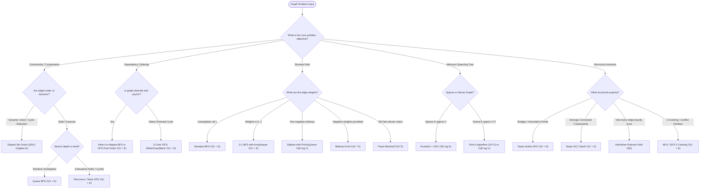

# 🕸️ Graphs, DSU & Network Topologies Mastery

[Java Track Home](../README.md) | [Strategies Hub](../../dsa-strategies/README.md) | [Next: Graph Representations & Traversals →](./01-graph-representations-and-traversal-foundations.md)

---

## 🧭 Executive Overview: The Network Universe

In non-linear data structures, **Trees** impose a strict hierarchical constraint: $N$ vertices are connected by exactly $N - 1$ edges with a single root and zero cycles. When we relax this constraint—permitting arbitrary cycles, disconnected components, multi-edges, self-loops, and bidirectional dependencies—we enter the realm of **Graphs**.

A graph $G = (V, E)$ models pairwise relationships between an entity set $V$ (vertices or nodes) and a relationship set $E$ (edges or links). Graphs form the foundational substrate for network routing protocols, social connectivity graphs, distributed state consensus, dependency compilation engines, and geographic navigation systems.

```
                      ╭────────────────────────────────────────╮
                      │          GRAPH TOPOLOGY TAXONOMY       │
                      ╰───────────────────┬────────────────────╯
                                          │
                        Are edges directional or reciprocal?
                                          │
                         ┌────────────────┴────────────────┐
                         ▼                                 ▼
                     DIRECTED                          UNDIRECTED
               Dependency ordering                 Symmetric relation
               (e.g., Task DAGs)                  (e.g., Road Networks)
                         │                                 │
                 Cycles permitted?                Cycles permitted?
                         │                                 │
                 ┌───────┴───────┐                 ┌───────┴───────┐
                 ▼               ▼                 ▼               ▼
                DAG           CYCLIC             TREE           CYCLIC
           Kahn's / DFS     Tarjan SCC        N - 1 edges    DSU / Bridges
```

---

## 💾 1. Physical Memory Layouts & Cache Locality Mechanics

The performance of graph algorithms in production is governed by **CPU cache-line utilization (64 bytes)** and memory access patterns. Because graphs represent non-contiguous relationships, representation choice determines whether an algorithm experiences cache hits or severe pipeline-stalling RAM fetches.

```
╭───────────────────────────────────────────────────────────────────────────────────────────╮
│                                GRAPH REPRESENTATION PARADIGMS                             │
├───────────────────┬──────────────────────┬──────────────────────┬─────────────────────────┤
│ Representation    │ Memory Space         │ Edge Query (u, v)    │ Neighbor Scan (u)       │
├───────────────────┼──────────────────────┼──────────────────────┼─────────────────────────┤
│ Adjacency Matrix  │ O(V²)                │ O(1) direct lookup   │ O(V) full row scan      │
│ Adjacency List    │ O(V + E)             │ O(deg(u)) list walk  │ O(deg(u)) optimal       │
│ Edge List         │ O(E)                 │ O(E) linear search   │ O(E) linear search      │
│ Compressed Sparse │ O(V + E)             │ O(log(deg(u)))       │ O(deg(u)) contiguous    │
│ Row (CSR)         │ flat contiguous      │ binary search        │ cache-line prefetch     │
╰───────────────────┴──────────────────────┴──────────────────────┴─────────────────────────╯
```

### 1.1 Adjacency Matrix ($V \times V$)
Stored as a contiguous 2D array `int[][] matrix = new int[V][V]`.
- **Advantage**: Instantaneous $\mathcal{O}(1)$ edge existence checks and weight lookups. Excellent for dense graphs where $|E| \approx |V|^2$.
- **Disadvantage**: Massive memory overhead for sparse graphs ($|E| \ll |V|^2$). A graph with $10^5$ vertices requires $10^{10} \times 4\text{ bytes} \approx 40\text{ GB}$ of RAM, causing an `OutOfMemoryError`. Scanning neighbors requires iterating over all $V$ entries, regardless of vertex degree.

### 1.2 Adjacency List (`List<List<Integer>>` or `int[][]`)
Each vertex $u$ maintains a dynamic collection of its outgoing neighbors.
- **Advantage**: Compact $\mathcal{O}(V + E)$ space. Scanning neighbors takes strictly $\mathcal{O}(\deg(u))$ time.
- **Disadvantage in Standard Java**: A `List<List<Integer>>` incurs heavy pointer-chasing penalties. Each `Integer` is a 16-byte object reference, and each `ArrayList` node requires separate heap allocations, thrashing the L1/L2 CPU cache.
- **High-Performance Primitive Alternative**: Using `int[] head, next, to` arrays (forward-star representation) or jagged primitive arrays `int[][] adj` flattens object overhead.

### 1.3 Compressed Sparse Row (CSR)
The gold standard in high-performance graph computing (graph databases, network engines). Consists of two flat contiguous primitive arrays:
- `row_ptr` (size $V + 1$): Stores the starting index in `col_idx` for vertex $u$'s neighbors. The neighbors of $u$ reside in slice `col_idx[row_ptr[u] .. row_ptr[u+1] - 1]`.
- `col_idx` (size $E$): Contiguous array storing neighbor vertex indices.

```
Graph: 0 -> {1, 2}, 1 -> {2}, 2 -> {0}

row_ptr: [ 0,     2,     3,     4 ]
           │      │      │      │
           └──────┴──────┴──────┴── Indices into col_idx:
col_idx: [ 1, 2,  2,     0 ]
          ╰──┬──╯ ╰─┬─╯  ╰─┬─╯
           Node 0 Node 1 Node 2
```
Because `col_idx` is completely contiguous in physical memory, the CPU hardware prefetcher loads neighbor vertices into L1 cache lines with zero cache misses.

---

## 🧮 2. Mathematical Invariants & Theoretical Foundations

### 2.1 The Handshaking Lemma
In any undirected graph $G = (V, E)$, every edge contributes exactly $2$ to the sum of vertex degrees:

$$\sum_{v \in V} \deg(v) = 2|E|$$

**Immediate Corollary**: In any undirected graph, the number of vertices with **odd degree** must be **even**.

For directed graphs, the sum of in-degrees equals the sum of out-degrees, which equals the total number of edges:

$$\sum_{v \in V} \deg^-(v) = \sum_{v \in V} \deg^+(v) = |E|$$

### 2.2 Planar Graph Bounds (Euler's Formula)
For any connected planar graph drawn without crossing edges:
$$V - E + F = 2$$
where $F$ is the number of faces. For simple planar graphs with $V \ge 3$, this guarantees:
$$E \le 3V - 6$$
Hence, planar graphs are strictly **sparse**: $|E| = \mathcal{O}(V)$.

---

## ⚡ 3. The Global Graph Decision Engine



---

## 🗺️ 4. Master Curriculum Roadmap

| Module | Core Paradigm | Key Algorithms & Invariants | Canonical Problems |
| :--- | :--- | :--- | :--- |
| **[01. Representations & Traversals](./01-graph-representations-and-traversal-foundations.md)** | Foundational Graph Mechanics | Adjacency List/Matrix/CSR, BFS level frontier, DFS 3-color cycles | Word Ladder, Number of Islands, Clone Graph |
| **[02. Topological Sorting & DAGs](./02-topological-sorting-and-dag-architectures.md)** | Dependency Resolution | Kahn’s In-Degree BFS, DFS Post-Order, Cycle Certificates | Course Schedule I & II, Alien Dictionary |
| **[03. Shortest Path Algorithms](./03-shortest-paths-dijkstra-bellman-ford-and-floyd-warshall.md)** | Metric Space Optimization | Relaxation Invariant, Dijkstra, 0-1 BFS, Bellman-Ford, Floyd-Warshall | Network Delay Time, Min Cost Valid Path, Cheapest Flights |
| **[04. DSU & Minimum Spanning Trees](./04-disjoint-set-union-and-minimum-spanning-trees.md)** | Partitioning & Subgraphs | Path Compression, Union by Rank, Cut & Cycle Properties, Kruskal, Prim | Redundant Connection, Min Cost Connect Points, Operations to Connect |
| **[05. Bipartite Graphs & Coloring](./05-bipartite-matching-and-graph-coloring.md)** | Conflict Partitioning | Odd-cycle characterization, 2-coloring, Augmenting path foundations | Is Graph Bipartite?, Possible Bipartition |
| **[06. Advanced Hard Graph Algorithms](./06-advanced-hard-graph-algorithms.md)** | Network Vulnerabilities & Trails | Tarjan `tin`/`low` bridges, Articulation points, SCCs, Hierholzer | Critical Connections, Reconstruct Itinerary |

---

## 🛠️ Java Production Standards for Graph Engineering

```java
// Idiomatic, allocation-minimized Adjacency List Representation
import java.util.*;

public final class Graph {
    private final int vertices;
    private final List<List<Edge>> adj;

    public record Edge(int to, int weight) {}

    public Graph(int vertices) {
        this.vertices = vertices;
        this.adj = new ArrayList<>(vertices);
        for (int i = 0; i < vertices; i++) {
            this.adj.add(new ArrayList<>());
        }
    }

    public void addDirectedEdge(int from, int to, int weight) {
        adj.get(from).add(new Edge(to, weight));
    }

    public void addUndirectedEdge(int u, int v, int weight) {
        adj.get(u).add(new Edge(v, weight));
        adj.get(v).add(new Edge(u, weight));
    }

    public List<Edge> getNeighbors(int u) {
        return Collections.unmodifiableList(adj.get(u));
    }

    public int getVertexCount() {
        return vertices;
    }
}
```

---

<div align="center">

| [← Back to Java Track Home](../README.md) | [Track Hub: Graphs](./README.md) | [Next: Graph Representations & Traversals →](./01-graph-representations-and-traversal-foundations.md) |
| :--- | :---: | ---: |

</div>
