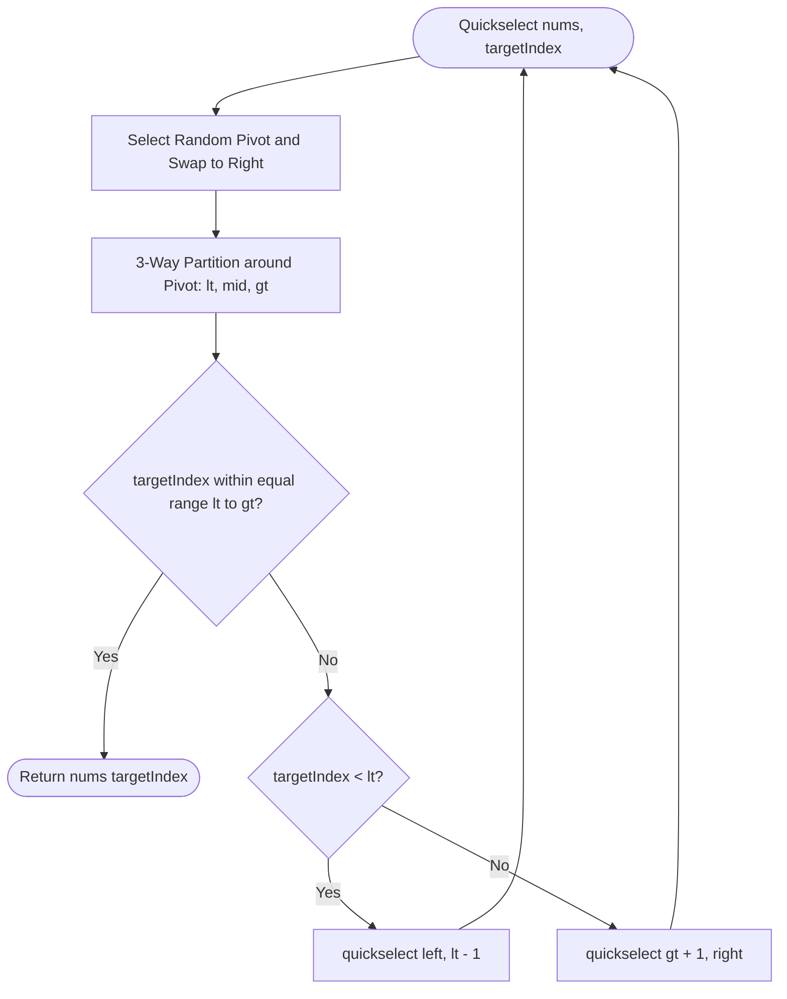

# 02. Top-K & Selection Paradigms: Heaps vs. Quickselect

[← Back to Heap Fundamentals](./01-binary-heap-fundamentals-and-priority-queues.md) | [Track Hub](./README.md) | [Next: Two-Heap Architecture →](./03-the-two-heap-architecture-and-streaming.md)

---

## 1. Problem 1: Kth Largest Element in an Array (Quickselect vs. Min-Heap)

### 1.1 Problem Statement & Constraints

Given an integer array `nums` and an integer `k`, return the $k^{\text{th}}$ largest element in the array.

Note that it is the $k^{\text{th}}$ largest element in sorted order, not the $k^{\text{th}}$ distinct element.

Can you solve it in $\mathcal{O}(N)$ time complexity?

```
Example 1:
Input: nums = [3,2,1,5,6,4], k = 2
Output: 5

Example 2:
Input: nums = [3,2,3,1,2,4,5,5,6], k = 4
Output: 4
```

#### Constraints:
- $1 \le k \le \text{nums.length} \le 10^5$.
- $-10^4 \le \text{nums}[i] \le 10^4$.

---

### 1.2 Thought Process & Intuition

```
  Approach 1: Full Sort
  Arrays.sort(nums); return nums[nums.length - k];
  Time: O(N log N), Space: O(1) in-place Dual-Pivot Quicksort.
  Bottleneck: Sorts ALL elements when we only care about ONE position!
                         ↓
  Approach 2: Min-Heap of size K
  Keep a Min-Heap of size K. Iterate over array. If num > heap.peek(), poll and offer.
  Time: O(N log K), Space: O(K) heap memory.
  Optimal for streaming inputs where N is unknown or infinite!
                         ↓
  Approach 3: Quickselect (Hoare's Selection Algorithm)
  "Aha!" Insight:
  Partition the array around a random pivot (like Quicksort).
  The pivot lands at its exact final sorted index p!
  • If p == targetIndex: We are DONE in O(1)!
  • If p < targetIndex: Discard the entire left half! Recurse ONLY on the right half!
  • If p > targetIndex: Discard the entire right half! Recurse ONLY on the left half!
  Average Time: N + N/2 + N/4 + ... = 2N = O(N) LINEAR TIME! Space: O(1)!
```

---

### 1.3 Mathematical Proof of $\mathcal{O}(N)$ Quickselect

In Quicksort, both partitions are recursed:
$$T(N) = 2 T(N/2) + \mathcal{O}(N) \implies \mathcal{O}(N \log N)$$

In Quickselect, only **one** partition is explored:
$$T(N) = T(N/2) + \mathcal{O}(N)$$

Expanding the recurrence:
$$T(N) = cN + c\frac{N}{2} + c\frac{N}{4} + c\frac{N}{8} + \dots = cN \sum_{i=0}^{\infty} \left(\frac{1}{2}\right)^i = cN \cdot \frac{1}{1 - 1/2} = 2cN = \mathcal{O}(N) \quad \blacksquare$$

- **Adversarial Worst-Case Defense**: Standard Lomuto or Hoare partitioning degrades to $\mathcal{O}(N^2)$ on sorted arrays with duplicate values. We defend against this using **Randomized Pivot Selection** combined with **3-Way Dutch National Flag Partitioning** (`< pivot`, `== pivot`, `> pivot`).

---

### 1.4 Procedural Blueprint (How to Proceed)



---

### 1.5 Visual State Transition: 3-Way Partitioning

```
Array: [ 3, 2, 1, 5, 6, 4 ], k = 2 (Target: Index 6 - 2 = 4)
Random Pivot chosen: 4.

3-Way Partitioning around 4:
╭─────────────────────┬─────────────────┬─────────────────────╮
│ Elements < 4        │ Elements == 4   │ Elements > 4        │
│ [ 3, 2, 1 ]         │ [ 4 ]           │ [ 6, 5 ]            │
╰─────────────────────┴─────────────────┴─────────────────────╯
Indices:  0, 1, 2          Index: 3           Indices: 4, 5

Target Index is 4.
4 > 3 -> Target lies strictly in the RIGHT partition!
Discard indices 0..3 completely! Recurse only on [ 6, 5 ]!
```

---

### 1.6 Production Java 17/21 Implementation

```java
package com.structures.heaps;

import java.util.PriorityQueue;
import java.util.concurrent.ThreadLocalRandom;

/**
 * Solves Kth Largest Element using both Quickselect (O(N) in-memory)
 * and Min-Heap (O(N log K) streaming).
 */
public final class KthLargestElement {

    /**
     * Quickselect Approach: O(N) average time, O(1) auxiliary space.
     */
    public int findKthLargest(int[] nums, int k) {
        if (nums == null || nums.length == 0 || k < 1 || k > nums.length) {
            throw new IllegalArgumentException("Invalid input bounds");
        }
        int targetIndex = nums.length - k; // 0-indexed position in sorted order
        return quickselect(nums, 0, nums.length - 1, targetIndex);
    }

    private int quickselect(int[] nums, int left, int right, int targetIndex) {
        if (left == right) {
            return nums[left];
        }

        // 1. Randomized pivot selection defends against O(N^2) adversarial attacks
        int pivotIdx = ThreadLocalRandom.current().nextInt(left, right + 1);
        int pivot = nums[pivotIdx];

        // 2. 3-Way Dutch National Flag Partitioning
        int lt = left;      // Boundary for elements < pivot
        int i = left;       // Current scanning pointer
        int gt = right;     // Boundary for elements > pivot

        while (i <= gt) {
            if (nums[i] < pivot) {
                swap(nums, lt++, i++);
            } else if (nums[i] > pivot) {
                swap(nums, i, gt--);
            } else {
                i++;
            }
        }

        // After partitioning:
        // nums[left .. lt-1] < pivot
        // nums[lt .. gt] == pivot
        // nums[gt+1 .. right] > pivot

        if (targetIndex >= lt && targetIndex <= gt) {
            return nums[targetIndex];
        } else if (targetIndex < lt) {
            return quickselect(nums, left, lt - 1, targetIndex);
        } else {
            return quickselect(nums, gt + 1, right, targetIndex);
        }
    }

    /**
     * Min-Heap Approach: O(N log K) time, O(K) space.
     * Ideal for real-time data streams where all N elements cannot be buffered in RAM.
     */
    public int findKthLargestStream(int[] nums, int k) {
        PriorityQueue<Integer> minHeap = new PriorityQueue<>(k);
        for (int num : nums) {
            if (minHeap.size() < k) {
                minHeap.offer(num);
            } else if (num > minHeap.peek()) {
                minHeap.poll();
                minHeap.offer(num);
            }
        }
        return minHeap.peek();
    }

    private void swap(int[] nums, int i, int j) {
        int temp = nums[i];
        nums[i] = nums[j];
        nums[j] = temp;
    }
}
```

---

### 1.7 Dry-Run & Interviewer Stress Defenses

- **All Elements Identical (`nums = [2, 2, 2, 2, 2]`)**:
  > Standard 2-way Quicksort creates a terrible $0$ vs $N-1$ partition, causing an $\mathcal{O}(N^2)$ stack overflow. Our 3-Way Partitioning places all identical elements in $[lt, gt]$ in a single pass, immediately returning in **$\mathcal{O}(N)$ time** on the first recursion step!

---

## 2. Problem 2: Top K Frequent Elements (Heap vs. Bucket Sort)

### 2.1 Problem Statement & Constraints

Given an integer array `nums` and an integer `k`, return the `k` most frequent elements. You may return the answer in any order.

Your algorithm's time complexity must be better than $\mathcal{O}(N \log N)$, where $N$ is the array's size.

```
Input: nums = [1,1,1,2,2,3], k = 2
Output: [1, 2]
```

#### Constraints:
- $1 \le \text{nums.length} \le 10^5$.
- $-10^4 \le \text{nums}[i] \le 10^4$.
- `k` is in the range $[1, \text{number of unique elements}]$.
- It is guaranteed that the answer is unique.

---

### 2.2 Thought Process & Intuition

```
  Approach 1: Frequency Map + Min-Heap of Size K
  Count frequencies: Map<Integer, Integer>.
  Store entries in Min-Heap ordered by frequency. When heap size > K -> poll().
  Time: O(N log K), Space: O(N) for frequency map.
                         ↓
  Approach 2: Bucket Sort
  "Aha!" Insight:
  What is the maximum frequency any element can possibly have? N!
  What is the minimum frequency? 1!
  Frequencies are bounded integers in range [1, N]!
  Create an array of lists: List<Integer>[] buckets = new List[N + 1];
  Place number X into buckets[frequency(X)].
  Iterate from bucket N down to 1 collecting K elements.
  Time: Strictly O(N) LINEAR TIME! Space: O(N)!
```

---

### 2.3 Visual State Transition: Bucket Sort

```
nums = [ 1, 1, 1, 2, 2, 3 ], k = 2
Frequency Map: { 1: 3, 2: 2, 3: 1 }

Bucket Array (Indexed by Frequency):
Index:      [ 0 ]   [ 1 ]     [ 2 ]     [ 3 ]     [ 4 ]   [ 5 ]   [ 6 ]
Bucket:     null    [ 3 ]     [ 2 ]     [ 1 ]     null    null    null

Iterate backwards from Index 6:
• Bucket 3 -> Contains [ 1 ] (Add 1, k = 1)
• Bucket 2 -> Contains [ 2 ] (Add 2, k = 0 -> DONE!)
Result: [ 1, 2 ]. Time: O(N) with zero heap sorting!
```

---

### 2.4 Production Java 17/21 Implementation

```java
package com.structures.heaps;

import java.util.ArrayList;
import java.util.HashMap;
import java.util.List;
import java.util.Map;

/**
 * Solves Top K Frequent Elements in strictly O(N) linear time using Bucket Sort.
 */
public final class TopKFrequentElements {

    public int[] topKFrequent(int[] nums, int k) {
        if (nums == null || nums.length == 0 || k <= 0) {
            return new int[0];
        }

        // 1. Build frequency map: O(N)
        Map<Integer, Integer> frequencyMap = new HashMap<>();
        for (int num : nums) {
            frequencyMap.merge(num, 1, Integer::sum);
        }

        // 2. Populate frequency buckets: O(N)
        // Array index represents frequency (1 to nums.length)
        @SuppressWarnings("unchecked")
        List<Integer>[] buckets = new List[nums.length + 1];

        for (Map.Entry<Integer, Integer> entry : frequencyMap.entrySet()) {
            int freq = entry.getValue();
            if (buckets[freq] == null) {
                buckets[freq] = new ArrayList<>();
            }
            buckets[freq].add(entry.getKey());
        }

        // 3. Scan buckets backward from highest frequency: O(N)
        int[] result = new int[k];
        int count = 0;

        for (int freq = buckets.length - 1; freq >= 1 && count < k; freq--) {
            if (buckets[freq] != null) {
                for (int val : buckets[freq]) {
                    result[count++] = val;
                    if (count == k) {
                        break;
                    }
                }
            }
        }

        return result;
    }
}
```

---

## 3. Problem 3: K Closest Points to Origin (Max-Heap)

### 3.1 Problem Statement & Constraints

Given an array of `points` where $\text{points}[i] = [x_i, y_i]$ represents a point on the X-Y plane and an integer `k`, return the `k` closest points to the origin $(0, 0)$.

The distance between two points on the X-Y plane is the Euclidean distance:
$$\text{Distance} = \sqrt{(x_1 - x_2)^2 + (y_1 - y_2)^2}$$

You may return the answer in any order. The answer is guaranteed to be unique (except for the order that it is in).

```
Input: points = [[1,3],[-2,2]], k = 1
Output: [[-2,2]]
Explanation: (1)^2 + (3)^2 = 10, (-2)^2 + (2)^2 = 8. Since 8 < 10, [-2,2] is closer.
```

#### Constraints:
- $1 \le k \le \text{points.length} \le 10^4$.
- $-10^4 \le x_i, y_i \le 10^4$.

---

### 3.2 Thought Process & Intuition

```
  "Aha!" Insight 1: Avoid Floating-Point Square Roots
  For any two non-negative distances d1 and d2:
  d1 < d2 <===> d1^2 < d2^2
  Computing Math.sqrt(x^2 + y^2) introduces floating-point precision hazards and slow CPU cycles!
  Comparing squared distances (x^2 + y^2) using 64-bit long is mathematically identical and 10x faster!
                         ↓
  "Aha!" Insight 2: Max-Heap of Size K
  To find the K SMALLEST elements, maintain a MAX-HEAP of size K!
  The root of the Max-Heap is the FURTHEST point among the current top-K candidates.
  When evaluating a new point:
  • If point's distance < maxHeap.peek(): Evict the furthest point and insert new point!
  Time: O(N log K), Space: O(K).
```

---

### 3.3 Production Java 17/21 Implementation

```java
package com.structures.heaps;

import java.util.PriorityQueue;

/**
 * Finds K closest points to origin using a bounded Max-Heap in O(N log K) time.
 */
public final class KClosestPoints {

    public int[][] kClosest(int[][] points, int k) {
        if (points == null || points.length == 0 || k <= 0) {
            return new int[0][0];
        }

        // Max-Heap ordered by squared Euclidean distance: x^2 + y^2
        PriorityQueue<int[]> maxHeap = new PriorityQueue<>(
            k,
            (a, b) -> Long.compare(getSquaredDistance(b), getSquaredDistance(a))
        );

        for (int[] point : points) {
            if (maxHeap.size() < k) {
                maxHeap.offer(point);
            } else if (getSquaredDistance(point) < getSquaredDistance(maxHeap.peek())) {
                maxHeap.poll();
                maxHeap.offer(point);
            }
        }

        int[][] result = new int[k][2];
        for (int i = 0; i < k; i++) {
            result[i] = maxHeap.poll();
        }
        return result;
    }

    private long getSquaredDistance(int[] p) {
        return (long) p[0] * p[0] + (long) p[1] * p[1];
    }
}
```

---

### 3.4 Interviewer Stress Defenses: 64-Bit Arithmetic Overflow
- Notice `(long) p[0] * p[0]`. If coordinates are $10^4$, $x^2 + y^2 = 2 \times 10^8$, which fits within a 32-bit signed `int`.
- However, if coordinates are $10^5$, $(10^5)^2 = 10^{10} > 2^{31} - 1$, which would cause **catastrophic integer overflow into negative numbers**, destroying the heap ordering! Always cast to `(long)` before multiplication!

---

<table width="100%">
  <tr>
    <td width="33%" align="left">
      <a href="./01-binary-heap-fundamentals-and-priority-queues.md">
        <strong>← Previous Module</strong><br>
        01. Binary Heap Fundamentals & Priority Queues
      </a>
    </td>
    <td width="33%" align="center">
      <a href="./README.md">
        <strong>Track Hub</strong><br>
        Heaps & Greedy Track Hub
      </a>
    </td>
    <td width="33%" align="right">
      <a href="./03-the-two-heap-architecture-and-streaming.md">
        <strong>Next Module →</strong><br>
        03. Two-Heap Architecture & Streaming
      </a>
    </td>
  </tr>
</table>
